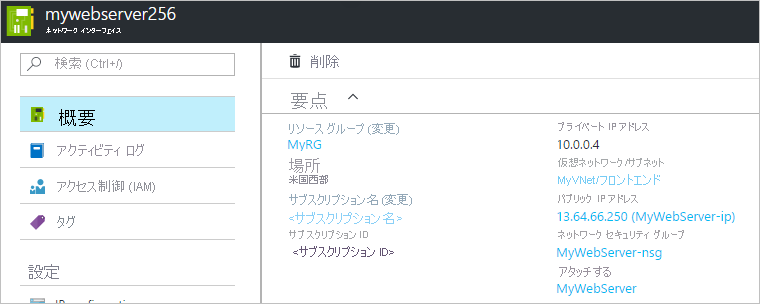

# ネットワーク インターフェイスの作成、変更、削除

ネットワーク インターフェイスの作成、設定変更、削除の方法について説明します。 ネットワーク インターフェイスは、Azure Virtual Machine がインターネット、Azure、およびオンプレミスのリソースと通信できるようにします。 Azure Portal を使用して仮想マシンを作成すると、既定の設定でネットワーク インターフェイスが 1 つ自動的に作成されます。 その代わりに、カスタム設定でネットワーク インターフェイスを作成し、仮想マシンを作成するときに 1 つ以上のネットワーク インターフェイスを追加することができます。 既存のネットワーク インターフェイスについて、既定のネットワーク インターフェイス設定を変更することもできます。 この記事では、カスタム設定を使用してネットワーク インターフェイスを作成する方法、ネットワーク フィルター (ネットワーク セキュリティ グループ) の割り当て、サブネットの割り当て、DNS サーバーの設定、IP 転送などの既存の設定を変更する方法、およびネットワーク インターフェイスを削除する方法について説明します。

ネットワーク インターフェイスに対して IP アドレスの追加、変更、または削除が必要な場合は、[IP アドレスの管理](virtual-network-network-interface-addresses.md)に関するページをご覧ください。 仮想マシンのネットワーク インターフェイスを追加または削除する必要がある場合は、[ネットワーク インターフェイスの追加または削除](virtual-network-network-interface-vm.md)に関するページをご覧ください。

## 開始する前に

この記事のセクションに記載された手順を始める前に、次のタスクを完了してください。

- まだ Azure アカウントを持っていない場合は、[無料試用版アカウント](https://azure.microsoft.com/free)にサインアップしてください。
- ポータルを使用する場合は、https://portal.azure.com を開き、Azure アカウントでログインします。
- PowerShell コマンドを使用してこの記事のタスクを実行する場合は、[Azure Cloud Shell](https://shell.azure.com/powershell) でコマンドを実行するか、お使いのコンピューターから PowerShell を実行してください。 Azure Cloud Shell は無料のインタラクティブ シェルです。この記事の手順は、Azure Cloud Shell を使って実行することができます。 一般的な Azure ツールが事前にインストールされており、アカウントで使用できるように構成されています。 このチュートリアルには、Azure PowerShell モジュール バージョン 5.4.1 以降が必要です。 インストールされているバージョンを確認するには、`Get-Module -ListAvailable AzureRM` を実行します。 アップグレードする必要がある場合は、[Azure PowerShell モジュールのインストール](/powershell/azure/install-azurerm-ps)に関するページを参照してください。 PowerShell をローカルで実行している場合、`Connect-AzureRmAccount` を実行して Azure との接続を作成することも必要です。
- Azure コマンド ライン インターフェイス (CLI) コマンドを使用してこの記事のタスクを実行する場合は、[Azure Cloud Shell](https://shell.azure.com/bash) でコマンドを実行するか、お使いのコンピューターから CLI を実行してください。 このチュートリアルには、Azure CLI バージョン 2.0.28 以降が必要です。 インストールされているバージョンを確認するには、`az --version` を実行します。 インストールまたはアップグレードする必要がある場合は、「[Azure CLI 2.0 のインストール](/cli/azure/install-azure-cli)」を参照してください。 Azure CLI をローカルで実行している場合、`az login` を実行して Azure との接続を作成することも必要です。

Azure へのログインまたは接続に使用するアカウントは、[ネットワークの共同作業者](../role-based-access-control/built-in-roles.md?toc=%2fazure%2fvirtual-network%2ftoc.json#network-contributor)ロール、または「[アクセス許可](#permissions)」の一覧に記載されている適切なアクションが割り当てられている[カスタム ロール](../role-based-access-control/custom-roles.md?toc=%2fazure%2fvirtual-network%2ftoc.json)に割り当てられている必要があります。

## ネットワーク インターフェイスの作成

Azure Portal を使用して仮想マシンを作成すると、既定の設定で自動的にネットワーク インターフェイスが作成されます。 その代わりにすべてのネットワーク インターフェイス設定を指定する場合は、カスタム設定を使用してネットワーク インターフェイスを作成し、仮想マシンを作成するときにそのネットワーク インターフェイスを仮想マシンにアタッチすることができます (PowerShell または Azure CLI を使用)。 ネットワーク インターフェイスを作成して、それを既存の仮想マシンに追加することもできます (PowerShell または Azure CLI を使用)。 既存のネットワーク インターフェイスを使用して仮想マシンを作成する方法や、既存の仮想マシンに対してネットワーク インターフェイスを追加または削除する方法については、[ネットワーク インターフェイスの追加または削除](virtual-network-network-interface-vm.md)に関するページをご覧ください。 ネットワーク インターフェイスを作成する前に、ネットワーク インターフェイスを作成するのと同じ場所およびサブスクリプションに[仮想ネットワーク](manage-virtual-network.md#create-a-virtual-network)が作成されている必要があります。

1. Azure Portal 上部に "*リソースの検索*" というテキストが表示されたボックスがあります。そこに "*ネットワーク インターフェイス*" と入力します。 検索結果に **[ネットワーク インターフェイス]** が表示されたら、それを選択します。
2. **[ネットワーク インターフェイス]** で **[+ 追加]** を選択します。
3. 次の設定の値を入力または選択し、**[作成]** を選択します。

    |Setting|必須|詳細|
    |---|---|---|
    |Name|[はい]|選択したリソース グループ内で一意となる名前を使用してください。 長い期間の間には、Azure サブスクリプションに複数のネットワーク インターフェイスを作成する可能性があります。 複数のネットワーク インターフェイスを管理しやすいように、名前付け規則を作成する際は、[名前付け規則](/azure/architecture/best-practices/naming-conventions?toc=%2fazure%2fvirtual-network%2ftoc.json#naming-rules-and-restrictions)に関する記事に記載された推奨事項をご覧ください。 名前は、ネットワーク インターフェイスの作成後に変更することはできません。|
    |Virtual network|[はい]|ネットワーク インターフェイスの仮想ネットワークを選択します。 ネットワーク インターフェイスの割り当てが可能なのは、そのネットワーク インターフェイスと同じサブスクリプションおよび場所に存在する仮想ネットワークのみです。 いったんネットワーク インターフェイスが作成されると、それが割り当てられた仮想ネットワークを変更することはできません。 ネットワーク インターフェイスを追加する仮想マシンも、そのネットワーク インターフェイスと同じ場所およびサブスクリプション内に存在する必要があります。|
    |サブネット|[はい]|選択した仮想ネットワーク内のサブネットを選択します。 ネットワーク インターフェイスの割り当て先のサブネットは、作成後に変更できます。|
    |プライベート IP アドレスの割り当て|[はい]| この設定では、IPv4 アドレスの割り当て方法を選択します。 次の割り当て方法から選択します。**動的:** このオプションを選択すると、選択したサブネットのアドレス空間から使用可能な次のアドレスが自動的に割り当てられます。 **静的:** このオプションを選択した場合は、選択したサブネットのアドレス空間内から使用可能な IP アドレスを手動で割り当てる必要があります。 静的および動的アドレスは、ユーザーが変更するか、ネットワーク インターフェイスが削除されるまで変化しません。 ネットワーク インターフェイスの作成後に、割り当て方法を変更することができます。 このアドレスは Azure DHCP サーバーによって、仮想マシンのオペレーティング システム内のネットワーク インターフェイスに割り当てられます。|
    |ネットワーク セキュリティ グループ|いいえ | **[なし]** に設定されたままにするか、既存の[ネットワーク セキュリティ グループ](security-overview.md)を選択するか、[ネットワーク セキュリティ グループを作成する](tutorial-filter-network-traffic.md)ことができます。 ネットワーク セキュリティ グループによって、ネットワーク インターフェイスから送受信されるネットワーク トラフィックをフィルター処理できます。 ネットワーク インターフェイスには、0 個または 1 個のネットワーク セキュリティ グループを適用できます。 0 個または 1 つのネットワーク セキュリティ グループは、ネットワーク インターフェイスの割り当て先サブネットにも適用できます。 ネットワーク セキュリティ グループを、ネットワーク インターフェイスと、その割り当て先のサブネットに適用すると、予期しない結果が発生する場合があります。 ネットワーク インターフェイスとサブネットに適用したネットワーク セキュリティ グループのトラブルシューティングを行うには、[ネットワーク セキュリティ グループのトラブルシューティング](diagnose-network-traffic-filter-problem.md)に関する記事をご覧ください。|
    |サブスクリプション|[はい]|ご利用の Azure [サブスクリプション](../azure-glossary-cloud-terminology.md?toc=%2fazure%2fvirtual-network%2ftoc.json#subscription)を 1 つ選択します。 ネットワーク インターフェイスのアタッチ先の仮想マシンと、接続先の仮想ネットワークは、同じサブスクリプション内に存在する必要があります。|
    |[プライベート IP アドレス (IPv6)]|いいえ | このチェック ボックスをオンにすると、ネットワーク インターフェイスに割り当てられた IPv4 アドレスに加えて、IPv6 アドレスがネットワーク インターフェイスに割り当てられます。 ネットワーク インターフェイスでの IPv6 の使用に関する重要な情報については、この記事の [IPv6](#IPv6) についてのセクションを参照してください。 IPv6 アドレスの割り当て方法を選択することはできません。 IPv6 アドレスを割り当てることを選択した場合、動的な方法で割り当てが行われます。
    |[IPv6 名] \(**[プライベート IP アドレス (IPv6)]** チェック ボックスがオンの場合にのみ表示されます) |はい (**[プライベート IP アドレス (IPv6)]** チェック ボックスがオンの場合)。| この名前は、ネットワーク インターフェイスのセカンダリ IP 構成に割り当てられます。 IP 構成の詳細については、「[ネットワーク インターフェイス設定の表示](#view-network-interface-settings)」を参照してください。|
    |リソース グループ|[はい]|既存の[リソース グループ](../azure-glossary-cloud-terminology.md?toc=%2fazure%2fvirtual-network%2ftoc.json#resource-group)を選択するか、新しく作成することができます。 ネットワーク インターフェイスは、アタッチ先の仮想マシンや接続先の仮想ネットワークと同じリソース グループに存在することも、違うリソース グループに存在することも可能です。|
    |Location|[はい]|ネットワーク インターフェイスのアタッチ先の仮想マシンと接続先の仮想ネットワークは、リージョンとも呼ばれる同じ[場所](https://azure.microsoft.com/regions)の中に存在する必要があります。|

ポータルには、ネットワーク インターフェイスを作成するときに、そこにパブリック IP アドレスを割り当てるオプションは用意されていません。しかし、ポータルを使用して仮想マシンを作成するときには、確かにポータルによってパブリック IP アドレスが作成され、それがネットワーク インターフェイスに割り当てられます。 ネットワーク インターフェイスの作成後にパブリック IP アドレスを追加する方法については、[IP アドレスの管理](virtual-network-network-interface-addresses.md)に関するページをご覧ください。 パブリック IP アドレスを指定してネットワーク インターフェイスを作成する場合は、CLI または PowerShell を使用してネットワーク インターフェイスを作成する必要があります。

ネットワーク インターフェイスの作成時に、アプリケーション セキュリティ グループにネットワーク インターフェイスを割り当てるオプションはポータルにはありませんが、Azure CLI と PowerShell にはあります。 ただし、ネットワーク インターフェイスが仮想マシンに接続されている限り、ポータルを使用して、アプリケーション セキュリティ グループに既存のネットワーク インターフェイスを割り当てることはできます。 アプリケーション セキュリティ グループにネットワーク インターフェイスを割り当てる方法については、「[アプリケーション セキュリティ グループに対して追加または削除を実行する](#add-to-or-remove-from-application-security-groups)」を参照してください。

>[!Note]
> Azure では、ネットワーク インターフェイスの仮想マシンへのアタッチと、仮想マシンの初回起動の後にのみ、ネットワーク インターフェイスに MAC アドレスが割り当てられます。 Azure によってネットワーク インターフェイスに割り当てられる MAC アドレスは指定できません。 MAC アドレスがネットワーク インターフェイスに割り当てられると、そのネットワーク インターフェイスが削除されるか、プライマリ ネットワーク インターフェイスのプライマリ IP 構成に割り当てられたプライベート IP アドレスが変更されるまで、その状態は変わりません。 IP アドレスと IP 構成の詳細については、[IP アドレスの管理](virtual-network-network-interface-addresses.md)に関するページをご覧ください

**コマンド**

|ツール|コマンド|
|---|---|
|CLI|[az network nic create](/cli/azure/network/nic#az_network_nic_create)|
|PowerShell|[New-AzureRmNetworkInterface](/powershell/module/azurerm.network/new-azurermnetworkinterface#create)|

## ネットワーク インターフェイス設定の表示

ネットワーク インターフェイスが作成された後、そのほとんどの設定を表示して変更することができます。 ネットワーク インターフェイスの DNS サフィックスまたはアプリケーション セキュリティ グループのメンバーシップは、ポータルには表示されません。 DNS サフィックスまたはアプリケーション セキュリティ グループのメンバーシップを表示するには、PowerShell または Azure CLI の[コマンド](#view-settings-commands)を使用します。

1. Azure Portal 上部に "*リソースの検索*" というテキストが表示されたボックスがあります。そこに "*ネットワーク インターフェイス*" と入力します。 検索結果に **[ネットワーク インターフェイス]** が表示されたら、それを選択します。
2. 設定を表示または変更するネットワーク インターフェイスを一覧から選択します。
3. 選択したネットワーク インターフェイスに対して、次の項目が表示されます。
    - **概要:** ネットワーク インターフェイスに割り当てられている IP アドレス、ネットワーク インターフェイスの割り当て先仮想ネットワーク/サブネット、ネットワーク インターフェイスのアタッチ先仮想マシン (1 つの仮想マシンにアタッチされている場合) など、ネットワーク インターフェイスに関する情報を提供します。 次の図は、**mywebserver256** という名前のネットワーク インターフェイスの概要設定を示しています。ネットワーク インターフェイスを別のリソース グループまたはサブスクリプションに移動するには、**[リソース グループ]** または **[サブスクリプション名]** の横にある **[(変更)]** を選択します。 ネットワーク インターフェイスを移動する場合は、そのネットワーク インターフェイスに関連するすべてのリソースを、インターフェイスと共に移動する必要があります。 たとえば、ネットワーク インターフェイスが仮想マシンにアタッチされている場合は、仮想マシンと、その他の仮想マシン関連リソースも移動する必要があります。 ネットワーク インターフェイスを移動するには、[新しいリソース グループまたはサブスクリプションへのリソースの移動](../azure-resource-manager/resource-group-move-resources.md?toc=%2fazure%2fvirtual-network%2ftoc.json#use-portal)に関する記事をご覧ください。 この記事には、リソースを移動するための前提条件や、Azure Portal、PowerShell、および Azure CLI を使用して移動する方法が記載されています。
    - **IP 構成:** IP 構成に割り当てられている、パブリックおよびプライベートの IPv4 および IPv6 アドレスは、ここに一覧で示されています。 IP 構成に IPv6 アドレスが割り当てられている場合、アドレスは表示されません。 IP 構成と、IP アドレスの追加と削除の方法については、[Azure ネットワーク インターフェイスの IP アドレスの構成](virtual-network-network-interface-addresses.md)に関するページをご覧ください。 IP 転送とサブネットの割り当ても、このセクションで構成します。 これらの設定の詳細については、「[IP 転送の有効化と無効化](#enable-or-disable-ip-forwarding)」と「[サブネットの割り当ての変更](#change-subnet-assignment)」を参照してください。
    - **DNS サーバー:** Azure DHCP サーバーがネットワーク インターフェイスに割り当てる DNS サーバーを指定できます。 ネットワーク インターフェイスは、ネットワーク インターフェイスの割り当て先の仮想ネットワークから設定を継承できます。または、割り当て先の仮想ネットワークの設定をオーバーライドするカスタム設定を持つことができます。 表示される内容の変更については、「[DNS サーバーの変更](#change-dns-servers)」を参照してください。
    - **ネットワーク セキュリティ グループ (NSG):** ネットワーク インターフェイスに関連付けられている NSG (ある場合) が表示されます。 NSG には、ネットワーク インターフェイスのネットワーク トラフィックをフィルター処理するための送受信の規則が含まれています。 NSG がネットワーク インターフェイスに関連付けられている場合は、関連付けられている NSG の名前が表示されます。 表示内容を変更するには、「[ネットワーク セキュリティ グループを関連付けるか関連付けを解除する](#associate-or-dissociate-a-network-security-group)」を参照してください。
    - **プロパティ:** ネットワーク インターフェイスの MAC アドレスやネットワーク インターフェイスが存在するサブスクリプションなど、ネットワーク インターフェイスに関する重要な設定が表示されます (ネットワーク インターフェイスが仮想マシン接続されていない場合は空白です)。
    - **有効なセキュリティ規則:** セキュリティ規則が一覧表示されるのは、ネットワーク インターフェイスが実行中の仮想マシンにアタッチされ、NSG がネットワーク インターフェイスまたはその接続先サブネット (あるいは両方) に関連付けられている場合です。 表示内容の詳細については、「[有効なセキュリティ規則を表示する](#view-effective-security-rules)」を参照してください。 NSG の詳細については、[ネットワーク セキュリティ グループ](security-overview.md)に関するページをご覧ください。
    - **有効なルート:** 実行中の仮想マシンにネットワーク インターフェイスがアタッチされている場合には、ルートが一覧表示されます。 ルートは、Azure の既定のルート、ユーザー定義ルート、およびネットワーク インターフェイスの割り当て先サブネットのために存在する場合がある BGP ルートの組み合わせです。 表示される内容の詳細については、「[有効なルートを表示する](#view-effective-routes)」を参照してください。 Azure の既定のルートとユーザー定義ルートの詳細については、[ルーティングの概要](virtual-networks-udr-overview.md)に関する記事をご覧ください。
    - **Azure Resource Manager の一般的な設定:** Azure Resource Manager の一般的な設定については、[アクティビティ ログ](../azure-resource-manager/resource-group-overview.md?toc=%2fazure%2fvirtual-network%2ftoc.json#activity-logs)、[Access Control (IAM)](../azure-resource-manager/resource-group-overview.md?toc=%2fazure%2fvirtual-network%2ftoc.json#access-control)、[タグ](../azure-resource-manager/resource-group-using-tags.md?toc=%2fazure%2fvirtual-network%2ftoc.json)、[ロック](../azure-resource-manager/resource-group-lock-resources.md?toc=%2fazure%2fvirtual-network%2ftoc.json)、および [Automation スクリプト](../azure-resource-manager/resource-manager-export-template.md?toc=%2fazure%2fvirtual-network%2ftoc.json#export-the-template-from-resource-group) に関する各記事をご覧ください。

**コマンド**

IPv6 アドレスがネットワーク インターフェイスに割り当てられている場合、PowerShell の出力では、アドレスが割り当てられているという事実が返されますが、割り当てられたアドレスは返されません。 同様に、CLI では、アドレスが割り当てられているという事実が返されますが、そのアドレスの出力では *null* が返されます。

|ツール|コマンド|
|---|---|
|CLI|[az network nic list](/cli/azure/network/nic#az_network_nic_list) ではサブスクリプションのネットワーク インターフェイスを表示します。[az network nic show](/cli/azure/network/nic#az_network_nic_show) ではネットワーク インターフェイスの設定を表示します。|
|PowerShell|[Get-AzureRmNetworkInterface](/powershell/module/azurerm.network/get-azurermnetworkinterface) では、サブスクリプションのネットワーク インターフェイスまたはネットワーク インターフェイスの設定を表示します。|

## DNS サーバーの変更

DNS サーバーは Azure DHCP サーバーによって、仮想マシンのオペレーティング システム内のネットワーク インターフェイスに割り当てられます。 割り当てられる DNS サーバーは、ネットワーク インターフェイスの DNS サーバー設定に基づきます。 ネットワーク インターフェイスの名前解決の設定の詳細については、[仮想マシンの名前解決](virtual-networks-name-resolution-for-vms-and-role-instances.md)に関する記事を参照してください。 ネットワーク インターフェイスは、仮想ネットワークから設定を継承することも、仮想ネットワークの設定をオーバーライドする独自の固有設定を使用することもできます。

1. Azure Portal 上部に "*リソースの検索*" というテキストが表示されたボックスがあります。そこに "*ネットワーク インターフェイス*" と入力します。 検索結果に **[ネットワーク インターフェイス]** が表示されたら、それを選択します。
2. DNS サーバーを変更するネットワーク インターフェイスを一覧から選択します。
3. **[設定]** で、**[DNS サーバー]** を選択します。
4. 次のいずれかを選択します。
    - **[仮想ネットワークから継承する]**: このオプションを選択すると、ネットワーク インターフェイスの割り当て先の仮想ネットワークで定義されている DNS サーバー設定を継承します。 仮想ネットワーク レベルでは、カスタム DNS サーバーまたは Azure 提供の DNS サーバーのいずれかが定義されます。 Azure 提供の DNS サーバーは、同じ仮想ネットワークに割り当てられているリソースのホスト名を解決できます。 異なる仮想ネットワークに割り当てられているリソースの名前解決には、FQDN を使用する必要があります。
    - **[カスタム]**: 複数の仮想ネットワークにわたって名前を解決する独自の DNS サーバーを構成できます。 DNS サーバーとして使用するサーバーの IP アドレスを入力します。 指定した DNS サーバー アドレスは、このネットワーク インターフェイスにのみ割り当てられて、ネットワーク インターフェイス割り当て先の仮想ネットワークの DNS 設定をすべてオーバーライドします。
5. **[保存]** を選択します。

**コマンド**

|ツール|コマンド|
|---|---|
|CLI|[az network nic update](/cli/azure/network/nic#az_network_nic_update)|
|PowerShell|[Set-AzureRmNetworkInterface](/powershell/module/azurerm.network/set-azurermnetworkinterface)|

## IP 転送の有効化と無効化

IP 転送によって、ネットワーク インターフェイスのアタッチ先の仮想マシンを有効にします。
- これにより宛先が、ネットワーク インターフェイスに割り当てられたいずれかの IP 構成に割り当てられている IP アドレスの 1 つではないネットワーク トラフィックを受信します。
- ネットワーク トラフィックの送信は、ネットワーク インターフェイスの IP 構成のいずれかに割り当てられているものとは異なる送信元 IP アドレスを使用して行います。

転送する必要があるトラフィックを受信する仮想マシンにアタッチされているネットワーク インターフェイスすべてについて、設定を有効にする必要があります。 仮想マシンは、複数のネットワーク インターフェイスがあるか、それにアタッチされているのが 1 つのネットワーク インターフェイスであるかを問わず、トラフィックを転送できます。 IP 転送は Azure の設定ですが、ファイアウォール、WAN 最適化、負荷分散アプリケーションなど、仮想マシンでも、トラフィックを転送できるアプリケーションを実行する必要があります。 ネットワーク アプリケーションを実行する仮想マシンは、ネットワーク仮想アプライアンスと呼ばれることがよくあります。 すぐにデプロイできるネットワーク仮想アプライアンスの一覧については、[Azure Marketplace](https://azuremarketplace.microsoft.com/marketplace/apps/category/networking?page=1&subcategories=appliances) で参照できます。 通常、IP 転送はユーザー定義ルートで使用されます。 ユーザー定義ルートの詳細については、[ユーザー定義ルート](virtual-networks-udr-overview.md)に関するページをご覧ください。

1. Azure Portal 上部に "*リソースの検索*" というテキストが表示されたボックスがあります。そこに "*ネットワーク インターフェイス*" と入力します。 検索結果に **[ネットワーク インターフェイス]** が表示されたら、それを選択します。
2. IP 転送を有効または無効にするネットワーク インターフェイスを選択します。
3. **[設定]** セクションで **[IP 構成]** を選択します。
4. **[有効]** または **[無効]** (既定の設定) を選択して、設定を変更します。
5. **[保存]** を選択します。

**コマンド**

|ツール|コマンド|
|---|---|
|CLI|[az network nic update](/cli/azure/network/nic#az_network_nic_update)|
|PowerShell|[Set-AzureRmNetworkInterface](/powershell/module/azurerm.network/set-azurermnetworkinterface)|

## サブネットの割り当ての変更

ネットワーク インターフェイスの割り当て先は、仮想ネットワークの場合は変更できませんが、サブネットであれば変更できます。

1. Azure Portal 上部に "*リソースの検索*" というテキストが表示されたボックスがあります。そこに "*ネットワーク インターフェイス*" と入力します。 検索結果に **[ネットワーク インターフェイス]** が表示されたら、それを選択します。
2. サブネットの割り当てを変更するネットワーク インターフェイスを選択します。
3. **[設定]** で **[IP 構成]** を選択します。 一覧表示された IP 構成のプライベート IP アドレスの中に、横に **[(静的)]** と表示されているものがある場合は、次の手順を実行して、IP アドレスの割り当て方法を "動的" に変更する必要があります。 ネットワーク インターフェイスのサブネット割り当てを変更するには、すべてのプライベート IP アドレスを動的な方法で割り当てる必要があります。 アドレスが動的な方法で割り当てられている場合は、手順 5. に進みます。 静的な割り当て方法で割り当てられている IPv4 アドレスがある場合は、次の手順を実行して、割り当て方法を "動的" な方法に変更します。
    - IP 構成の一覧で、IPv4 アドレスの割り当て方法を変更する IP 構成を選択します。
    - プライベート IP アドレスの **[割り当て]** 方法として **[動的]** を選択します。 静的な割り当て方法を使用して IPv6 アドレスを割り当てることはできません。
    - **[保存]** を選択します。
4. ネットワーク インターフェイスの移動先にするサブネットを、**[サブネット]** ドロップダウン リストから選択します。
5. **[保存]** を選択します。 新しい動的アドレスが、新しいサブネットのサブネット アドレス範囲から割り当てられます。 ネットワーク インターフェイスを新しいサブネットに割り当てたら、必要に応じて、新しいサブネット アドレス範囲から静的 IPv4 アドレスを割り当てることができます。 ネットワーク インターフェイスの IP アドレスの追加、変更、削除の詳細については、[IP アドレスの管理](virtual-network-network-interface-addresses.md)に関するページをご覧ください。

**コマンド**

|ツール|コマンド|
|---|---|
|CLI|[az network nic ip-config update](/cli/azure/network/nic/ip-config#az_network_nic_ip_config_update)|
|PowerShell|[Set-AzureRmNetworkInterfaceIpConfig](/powershell/module/azurerm.network/set-azurermnetworkinterfaceipconfig)|

## アプリケーション セキュリティ グループに対して追加または削除を実行する

ポータルを使用して、アプリケーション セキュリティ グループに対してネットワーク インターフェイスを追加または削除できるのは、ネットワーク インターフェイスが仮想マシンに接続されている場合のみです。 PowerShell や Azure CLI を使用すれば、ネットワーク インターフェイスが仮想マシンに接続されているかどうかに関係なく、アプリケーション セキュリティ グループに対してネットワーク インターフェイスを追加または削除することができます。 [アプリケーション セキュリティ グループ](security-overview.md#application-security-groups)と[アプリケーション セキュリティ グループの作成](manage-network-security-group.md#create-an-application-security-group)方法の詳細を参照してください。

1. ポータルの上部にある *[リソース、サービス、ドキュメントの検索]* ボックスに、まず、アプリケーション セキュリティ グループに対して追加または削除するネットワーク インターフェイスを持つ仮想マシンの名前を入力します。 検索結果にご利用の VM の名前が表示されたら、それを選択します。
2. **[設定]** で、**[ネットワーク]** を選択します。  **[Configure the application security groups]\(アプリケーション セキュリティ グループの構成\)** を選択し、ネットワーク インターフェイスを追加するアプリケーション ネットワーク グループを選びます。または、ネットワーク インターフェイスを削除するアプリケーション セキュリティ グループの選択を解除します。次に、**[保存]** を選択します。 同じアプリケーション セキュリティ グループに追加できるのは、同じ仮想ネットワークに存在するネットワーク インターフェイスのみです。 アプリケーション セキュリティ グループは、ネットワーク インターフェイスと同じ場所に存在している必要があります。

**コマンド**

|ツール|コマンド|
|---|---|
|CLI|[az network nic update](/cli/azure/network/nic#az_network_nic_update)|
|PowerShell|[Set-AzureRmNetworkInterface](/powershell/module/azurerm.network/set-azurermnetworkinterface)|

## ネットワーク セキュリティ グループを関連付けるか関連付けを解除する

1. ポータルの上部にある検索ボックスに、「*ネットワーク インターフェイス」*」と入力します。 検索結果に **[ネットワーク インターフェイス]** が表示されたら、それを選択します。
2. ネットワーク セキュリティ グループを関連付けるか関連付けを解除するネットワーク インターフェイスを一覧から選択します。
3. **[設定]** の下の **[ネットワーク セキュリティ グループ]** を選択します。
4. **[編集]** を選択します。
5. **[ネットワーク セキュリティ グループ]** を選択した後、ネットワーク インターフェイスに関連付ける場合はネットワーク セキュリティ グループを選択します。ネットワーク セキュリティ グループの関連付けを解除する場合は **[なし]** を選択します。
6. **[保存]** を選択します。

**コマンド**

- Azure CLI: [az network nic update](/cli/azure/network/nic#az-network-nic-update)
- PowerShell: [Set-AzureRmNetworkInterface](/powershell/module/azurerm.network/set-azurermnetworkinterface)

## ネットワーク インターフェイスの削除

ネットワーク インターフェイスは、仮想マシンにアタッチされていなければ削除できます。 ネットワーク インターフェイスが仮想マシンにアタッチされている場合は、まず仮想マシンを停止 (割り当て解除) 状態にした後、仮想マシンからネットワーク インターフェイスをデタッチします。 仮想マシンからネットワーク インターフェイスをデタッチするには、[仮想マシンからのネットワーク インターフェイスのデタッチ](virtual-network-network-interface-vm.md#remove-a-network-interface-from-a-vm)に関する記事の手順を完了します。 ただし、ネットワーク インターフェイスが仮想マシンにアタッチされている唯一のネットワーク インターフェイスである場合は、仮想マシンからデタッチすることはできません。 仮想マシンには常に少なくとも 1 つのネットワーク インターフェイスがアタッチされている必要があります。 仮想マシンを削除すると、それにアタッチされているすべてのネットワーク インターフェイスがデタッチされますが、ネットワーク インターフェイスは削除されません。

1. Azure Portal 上部に "*リソースの検索*" というテキストが表示されたボックスがあります。そこに "*ネットワーク インターフェイス*" と入力します。 検索結果に **[ネットワーク インターフェイス]** が表示されたら、それを選択します。
2. ネットワーク インターフェイスの一覧から、削除するネットワーク インターフェイスの右側にある **[...]** を選択します。
3. **[削除]** を選択します。
4. **[はい]** を選択して、ネットワーク インターフェイスの削除を確認します。

ネットワーク インターフェイスを削除すると、それに割り当てられていたすべての MAC アドレスや IP アドレスが解放されます。

**コマンド**

|ツール|コマンド|
|---|---|
|CLI|[az network nic delete](/cli/azure/network/nic#az_network_nic_delete)|
|PowerShell|[Remove-AzureRmNetworkInterface](/powershell/module/azurerm.network/remove-azurermnetworkinterface)|

## 接続に関する問題を解決する

仮想マシンと通信できない場合、ネットワーク セキュリティ グループのセキュリティ規則またはネットワーク インターフェイスの有効なルートが原因でその問題が発生している可能性があります。 この問題を解決するために、次のオプションがあります。

### 有効なセキュリティ規則を表示する

仮想マシンにアタッチされている各ネットワーク インターフェイスで有効なセキュリティ規則は、ネットワーク セキュリティ グループ内に自分で作成した規則と[既定のセキュリティ規則](security-overview.md#default-security-rules)の組み合わせです。 ネットワーク インターフェイスの有効なセキュリティ規則がわかると、仮想マシンと通信できない理由を判断する際に役立ちます。 実行中の仮想マシンにアタッチされているすべてのネットワーク インターフェイスの有効なルートを表示できます。

1. ポータルの上部にある検索ボックスに、有効なセキュリティ ルールを表示する仮想マシンの名前を入力します。 仮想マシンの名前がわからない場合は、検索ボックスに「*仮想マシン*」と入力します。 検索結果に **[仮想マシン]** が表示されたら、それを選択し、一覧から仮想マシンを選択します。
2. **[設定]** で、**[ネットワーク]** を選択します。
3. ネットワーク インターフェイスの名前を選択します。
4. **[サポート + トラブルシューティング]** で、**[有効なセキュリティ規則]** を選択します。
5. 効果的なセキュリティ規則の一覧を見直して、必要な受信方向と送信方向の通信に適した規則が存在するかどうかを判断します。 一覧に表示される内容の詳細については、[ネットワーク セキュリティ グループの概要](security-overview.md)に関する記事を参照してください。

Azure Network Watcher の IP フロー検証機能も、セキュリティ規則が仮想マシンとエンドポイント間の通信を妨げているかどうかを判断するために役立ちます。 詳細については、[IP フローの検証](../network-watcher/diagnose-vm-network-traffic-filtering-problem.md?toc=%2fazure%2fvirtual-network%2ftoc.json)に関する記事を参照してください。

**コマンド**

- Azure CLI: [az network nic list-effective-nsg](/cli/azure/network/nic#az-network-nic-list-effective-nsg)
- PowerShell: [Get-AzureRmEffectiveNetworkSecurityGroup](/powershell/module/azurerm.network/get-azurermeffectivenetworksecuritygroup) 

### 有効なルートの表示

仮想マシンに接続されているネットワーク インターフェイスで有効なルートは、既定のルート、自分で作成したルート、および Azure 仮想ネットワーク ゲートウェイを介して BGP 経由でオンプレミスのネットワークから伝達されたルートの組み合わせです。 ネットワーク インターフェイスの有効なルートがわかると、仮想マシンと通信できない理由を判断する際に役立ちます。 実行中の仮想マシンに接続されているネットワーク インターフェイスの有効なルートを表示できます。

1. ポータルの上部にある検索ボックスに、有効なセキュリティ ルールを表示する仮想マシンの名前を入力します。 仮想マシンの名前がわからない場合は、検索ボックスに「*仮想マシン*」と入力します。 検索結果に **[仮想マシン]** が表示されたら、それを選択し、一覧から仮想マシンを選択します。
2. **[設定]** で、**[ネットワーク]** を選択します。
3. ネットワーク インターフェイスの名前を選択します。
4. **[サポート + トラブルシューティング]** で、**[有効なルート]** を選択します。
5. 有効なルートの一覧を見直して、必要な受信方向と送信方向の通信に適したルートが存在するかどうかを判断します。 一覧に表示される内容の詳細については、[ルーティングの概要](virtual-networks-udr-overview.md)に関するページをご覧ください。

Azure Network Watcher の次ホップ機能も、ルートが仮想マシンとエンドポイント間の通信を妨げているかどうかを判断するために役立ちます。 詳細については、[次ホップ](../network-watcher/diagnose-vm-network-routing-problem.md?toc=%2fazure%2fvirtual-network%2ftoc.json)に関する記事を参照してください。

**コマンド**

- Azure CLI: [az network nic show-effective-route-table](/cli/azure/network/nic#az-network-nic-show-effective-route-table)
- PowerShell: [Get-AzureRmEffectiveRouteTable](/powershell/module/azurerm.network/get-azurermeffectiveroutetable)

## アクセス許可

ネットワーク インターフェイスに関するタスクを実行するには、使用するアカウントが[ネットワークの共同作業者](../role-based-access-control/built-in-roles.md?toc=%2fazure%2fvirtual-network%2ftoc.json#network-contributor)ロール、または次の表の適切なアクセス許可が割り当てられた[カスタム](../role-based-access-control/custom-roles.md?toc=%2fazure%2fvirtual-network%2ftoc.json) ロールに、割り当てられている必要があります。

| アクションを表示します。                                                                     | Name                                                      |
| ---------                                                                  | -------------                                             |
| Microsoft.Network/networkInterfaces/read                                   | ネットワーク インターフェイスを取得する                                     |
| Microsoft.Network/networkInterfaces/write                                  | ネットワーク インターフェイスを作成または更新する                        |
| Microsoft.Network/networkInterfaces/join/action                            | ネットワーク インターフェイスを仮想マシンに関連付ける           |
| Microsoft.Network/networkInterfaces/delete                                 | ネットワーク インターフェイスを削除する                                  |
| Microsoft.Network/networkInterfaces/joinViaPrivateIp/action                | サービスを介してリソースをネットワーク インターフェイスに結合する     |
| Microsoft.Network/networkInterfaces/effectiveRouteTable/action             | ネットワーク インターフェイスの有効なルート テーブルを取得する               |
| Microsoft.Network/networkInterfaces/effectiveNetworkSecurityGroups/action  | ネットワーク インターフェイスの有効なセキュリティ グループを取得する           |
| Microsoft.Network/networkInterfaces/loadBalancers/read                     | ネットワーク インターフェイスのロード バランサーを取得する                      |
| Microsoft.Network/networkInterfaces/serviceAssociations/read               | サービスの関連付けを取得する                                   |
| Microsoft.Network/networkInterfaces/serviceAssociations/write              | サービスの関連付けを作成または更新する                    |
| Microsoft.Network/networkInterfaces/serviceAssociations/delete             | サービスの関連付けを削除する                                |
| Microsoft.Network/networkInterfaces/serviceAssociations/validate/action    | サービスの関連付けを検証する                              |
| Microsoft.Network/networkInterfaces/ipconfigurations/read                  | ネットワーク インターフェイスの IP 構成を取得する                    |

## 次の手順

- [Azure CLI](../virtual-machines/linux/multiple-nics.md?toc=%2fazure%2fvirtual-network%2ftoc.json) または [PowerShell](../virtual-machines/windows/multiple-nics.md?toc=%2fazure%2fvirtual-network%2ftoc.json) を使って、複数の NIC を備えた VM を作成します
- [Azure CLI](virtual-network-multiple-ip-addresses-cli.md) または [PowerShell](virtual-network-multiple-ip-addresses-powershell.md) を使って、複数の IPv4 アドレスが割り当てられた 1 つの NIC VM を作成します
- [Azure CLI](../load-balancer/load-balancer-ipv6-internet-cli.md?toc=%2fazure%2fvirtual-network%2ftoc.json)、[PowerShell](../load-balancer/load-balancer-ipv6-internet-ps.md?toc=%2fazure%2fvirtual-network%2ftoc.json)、または [Azure Resource Manager テンプレート](../load-balancer/load-balancer-ipv6-internet-template.md?toc=%2fazure%2fvirtual-network%2ftoc.json) を使って、プライベート IPv6 アドレスが割り当てられた 1 つの NIC VM を (Azure Load Balancer の背後に) 作成します
- [PowerShell](powershell-samples.md) または [Azure CLI](cli-samples.md) のサンプル スクリプト、あるいは Azure [Resource Manager テンプレート](template-samples.md)を使って、ネットワーク インターフェイスを作成します
- [Azure ポリシー](policy-samples.md)を作成して仮想ネットワークに適用します