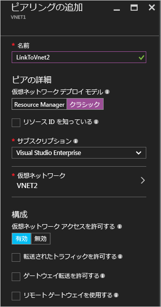
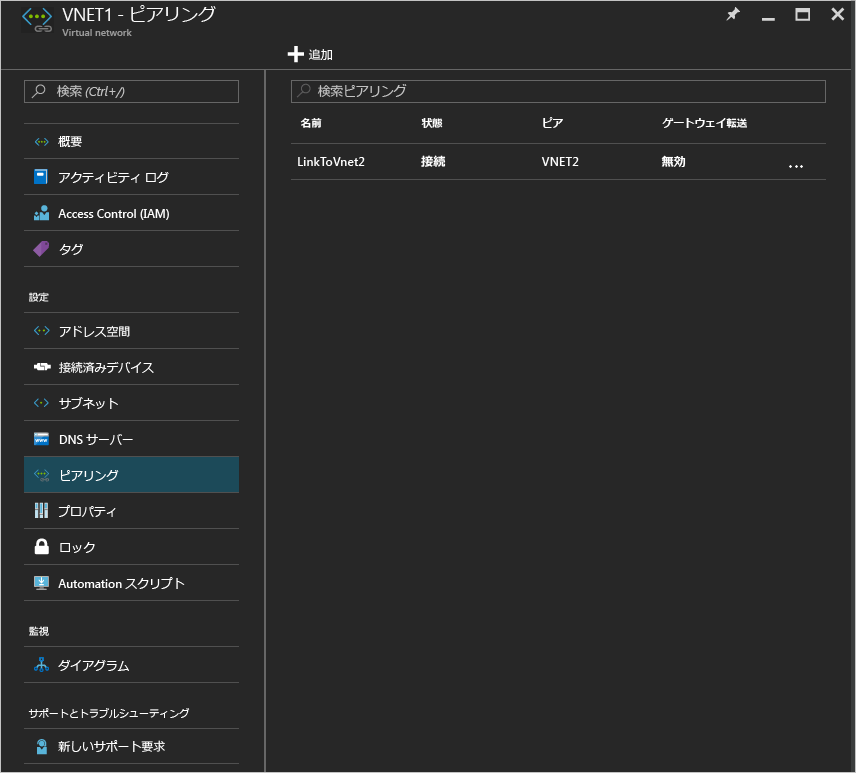

# Azure ポータルを使用した仮想ネットワーク ピアリングの作成
[!INCLUDE [virtual-networks-create-vnet-selectors-arm-include](../../includes/virtual-networks-create-vnetpeering-selectors-arm-include.md)]

[!INCLUDE [virtual-networks-create-vnet-intro](../../includes/virtual-networks-create-vnetpeering-intro-include.md)]

[!INCLUDE [virtual-networks-create-vnet-scenario-basic-include](../../includes/virtual-networks-create-vnetpeering-scenario-basic-include.md)]

シナリオに基づいた VNet ピアリングを Azure Portal を使用して作成するには、次の手順を実行します。

1. ブラウザーから http://portal.azure.com に移動し、必要に応じて Azure アカウントでサインインします。
2. VNet ピアリングを確立するには、2 つの VNet 間で&2; つのリンク (各方向につき&1; つ) を作成する必要があります。 まず、VNet1 から VNet2 への VNet ピアリング リンクを作成します。 Azure Portal で **[参照]** > **[Virtual networks (仮想ネットワーク)]** を選択します。

    
3. 次の図に示すように、**[Virtual networks (仮想ネットワーク)]** ブレードで *[VNET1]* を選択し、**[Peerings (ピアリング)]**、**[追加]** の順にクリックします。

    
4. **[Add Peering (ピアリングの追加)]** ブレードで、**[名前]** に「*LinkToVnet2*」と入力します。サブスクリプションを選択し、ピア**仮想ネットワーク**として *VNET2* を選択したら、**[OK]** をクリックします。

    
5. この VNet ピアリング リンクが作成されると、次の図に示すように、リンクの状態が表示されます。

    
6. VNET2 から VNET1 への VNet ピアリング リンクを作成します。 次の図に示すように、**[Virtual Networks (仮想ネットワーク)]** ブレードで *[VNET2]* を選択し、**[Peerings (ピアリング)]**、**[追加]** の順にクリックします。

    
7. **[Add Peering (ピアリングの追加)]** ブレードで、**[名前]** に「*LinkToVnet1*」と入力します。サブスクリプションを選択し、**仮想ネットワーク**として *VNET1* を選択したら、**[OK]** をクリックします。

    
8. この VNet ピアリング リンクが作成されると、次の図に示すように、リンクの状態が表示されます。

    
9. **LinkToVnet2** の状態を確認すると、こちらも "*接続済み*" に変わっています。  
    
    

    > [!NOTE]
    > VNET ピアリングは両方のリンクが接続されている場合にのみ確立されます。
    > 
    > 

それぞれのリンクには、構成可能なプロパティがいくつかあります。

| オプション | Description | 既定値 |
|:--- |:--- |:--- |
| AllowVirtualNetworkAccess |ピア VNet のアドレス空間を Virtual_network タグの一部として含めるかどうかを選択します。 |はい |
| AllowForwardedTraffic |ピアリングされた VNET 以外の送信元のトラフィックを許可するか破棄するかを選択します。 |いいえ |
| AllowGatewayTransit |VNet ゲートウェイの使用をピア VNet に許可するかどうかを選択します。 |いいえ |
| UseRemoteGateways |ピアの VNet ゲートウェイを使用します。 ピア VNet でゲートウェイが構成され、かつ AllowGatewayTransit が選択されている必要があります。 ゲートウェイをローカルで構成した場合、このオプションは使用できません。 |いいえ |

VNet ピアリングの各リンクには、上記のプロパティ セットがあります。 ポータルから **[VNet Peering (VNet ピアリング)]** リンクをクリックし、利用可能なオプションに変更を加えた後、**[保存]** をクリックして変更内容を反映します。

[!INCLUDE [virtual-networks-create-vnet-scenario-crosssub-include](../../includes/virtual-networks-create-vnetpeering-scenario-crosssub-include.md)]

1. ブラウザーから http://portal.azure.com に移動し、必要に応じて Azure アカウントでサインインします。
2. この例では、UserA には SubscriptionA に対する管理アクセス許可が与えられ、UserB には SubscriptionB に対する管理アクセス許可が与えられています。 両方のサブスクリプションが同じ Azure Active Directory テナントに関連付けられています。 別の Azure Active Directory テナントに関連付けられているサブスクリプション間でピアリングを作成することはできません。
3. ポータルで **[参照]** をクリックし、**[Virtual networks (仮想ネットワーク)]** を選択します。 ピアリングを設定する VNet をクリックします。
4. 次の図に示すように、選択した VNet のブレードで、**[アクセス制御]** をクリックし、**[追加]** をクリックします。

    
4. **[アクセスを追加]** ブレードで、ロールを選択し、**[Network Contributor (ネットワーク共同作成者)]** を選択して、**[ユーザーの追加]** をクリックします。次に、UserB のサインイン名を入力して [OK] をクリックします。

    

5. SubscriptionB の特権ユーザーである UserB として Azure Portal にログインします。 次の図に示すように、前の手順に従って UserA を [ネットワーク共同作成者] ロールに追加します。

    

    > [!NOTE]
    > 承認が問題なく有効になっていることを確認するために、ブラウザーで両方のユーザー セッションから一度ログオフし、その後ログオンしてください。
    >
    >

    > [!IMPORTANT]
    > Azure Resource Manager デプロイメント モデルを使用して作成された&2; つの VNet の間にピアリングを作成している場合は、このセクションの残りの手順に進んでください。 2 つの VNet が異なるデプロイメント モデルを使用して作成されている場合は、このセクションの残りの手順を省略し、この記事の「[Peering virtual networks created through different deployment models (異なるデプロイメント モデルを使用して作成された仮想ネットワークのピアリング)](#x-model)」の手順を実行してください。

6. UserA としてポータルにログインし、VNET3 ブレードに移動して **[Peering (ピアリング)]** をクリックします。**[I Know my resource ID (リソース ID を知っている)]** チェック ボックスをオンにして、VNET5 のリソース ID を以下の例に示す形式で入力します。
   
    /subscriptions/{サブスクリプション ID}/resourceGroups/{リソース グループ名}/providers/Microsoft.Network/virtualNetworks/{VNET 名}
   
    
7. UserB としてポータルにログインし、上記の手順に従って VNET5 から VNet3 へのピアリング リンクを作成します。
   
    
8. ピアリングが確立されます。 VNet3 に接続されているすべての VM が、VNet5 に接続されているすべての VM と通信できるようになります。

[!INCLUDE [virtual-networks-create-vnet-scenario-transit-include](../../includes/virtual-networks-create-vnetpeering-scenario-transit-include.md)]

1. まず、HubVnet から VNET1 への VNet ピアリング リンクを作成します。 このリンクでは [転送されたトラフィックを許可する] チェック ボックスがオフになっていることに注目してください。
   
    
2. 次に、VNET1 から HubVnet へのピアリング リンクを作成します。 [転送されたトラフィックを許可する] チェック ボックスがオンになっていることに注目してください。
   
    
3. ピアリングが確立されたら、こちらの[記事](virtual-network-create-udr-arm-ps.md)を参照してください。VNet1 トラフィックを仮想アプライアンス経由でリダイレクトするようにユーザー定義ルート (UDR) を設定することで、その機能を利用することができます。 ルートの次ホップ アドレスを指定するときは、ピア VNet (HubVNet) に存在する仮想アプライアンスの IP アドレスを設定します。

[!INCLUDE [virtual-networks-create-vnet-scenario-asmtoarm-include](../../includes/virtual-networks-create-vnetpeering-scenario-asmtoarm-include.md)]

1. ブラウザーから http://portal.azure.com に移動し、必要に応じて Azure アカウントでサインインします。
2. "*同じ*" サブスクリプション内の異なるデプロイメント モデルを使用してデプロイされた VNet 間にピアリングを作成している場合は、手順 3. に進んでください。 "*異なる*" サブスクリプション内の異なるデプロイメント モデルを使用してデプロイされた VNet 間に VNet ピアリングを作成する機能は、**プレビュー** リリースに用意されています。 プレビュー リリースの機能は、一般向けリリースの機能と同等レベルの信頼性とサービス レベル アグリーメントを備えていません。 異なるサブスクリプション内の異なるデプロイメント モデルを使用してデプロイされた VNet 間にピアリングを作成している場合は、最初に次のタスクを完了する必要があります。
    - PowerShell から次のコマンドを入力して、Azure サブスクリプションにプレビュー機能を登録します: `Register-AzureRmProviderFeature -FeatureName AllowClassicCrossSubscriptionPeering -ProviderNamespace Microsoft.Network` および `Register-AzureRmResourceProvider -ProviderNamespace Microsoft.Network`。ポータルでは、この手順を実行できません。
    - この記事の「[Peering across subscriptions (サブスクリプション間のピアリング)](#x-sub)」の手順 1. ～ 6. を実行します。
3. このシナリオで VNET ピアリングを確立するには、Azure Resource Manager 仮想ネットワークからクラシック仮想ネットワークにリンクを&1; つだけ作成する必要があります。 この例では、**VNET1** から **VNET2** に作成します。 ポータルで **[参照]** をクリックし、**[仮想ネットワーク]** を選択します。
4. [仮想ネットワーク] ブレードで **[VNET1]**を選択します。 **[ピアリング]**、**[追加]** の順にクリックします。
5. **[Add Peering (ピアリングの追加)]** ブレードで、リンクの名前を入力します。 ここでは、 **LinkToVNet2**と名付けます。 [ピアの詳細] で、 **[クラシック]**を選択します。
6. サブスクリプションとピア仮想ネットワーク **VNET2** を選択します。 次に、[OK] をクリックします。

    
7. この VNet ピアリングのリンクが作成されると、2 つの仮想ネットワークがピアリングされて、次のように表示されます。

    

## VNet ピアリングの削除
1. ブラウザーから http://portal.azure.com に移動し、必要に応じて Azure アカウントでサインインします。
2. 仮想ネットワーク ブレードにアクセスして [Peerings (ピアリング)] をクリックし、削除するリンクをクリックして **[削除]** をクリックします。

    
3. VNet ピアリングのいずれかのリンクを削除すると、ピアのリンク状態が "切断" に変わります。

    
4. この状態になると、ピア リンク状態が "開始済み" に変化するまではリンクを再作成できません。 両方のリンクを削除してから、VNet ピアリングを作成し直すことをお勧めします。

