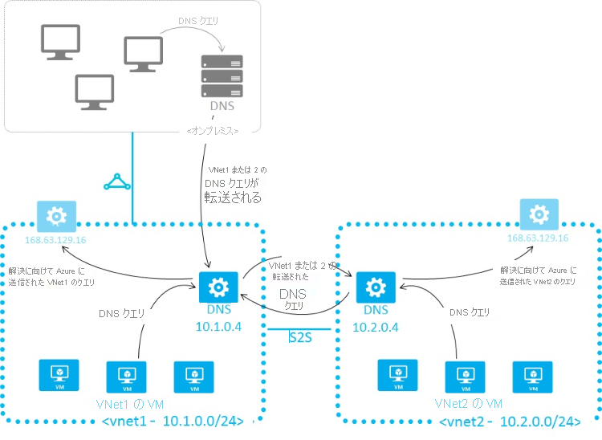

# <a name="name-resolution-for-resources-in-azure-virtual-networks"></a>Azure 仮想ネットワーク内のリソースの名前解決

Azure を使用して IaaS、PaaS、ハイブリッド ソリューションをホストする方法によっては、仮想マシン (VM) と仮想ネットワーク内に配置されたその他のリソースが相互に通信できるようにする必要があります。 IP アドレスを使用して通信を行うこともできますが、簡単に記憶できて変更されない名前を使用する方が、はるかに簡単です。 

仮想ネットワーク内に配置されたリソースがドメイン名を内部 IP アドレスに解決する必要がある場合、次の 2 つの方法のいずれかを使用できます。

* [Azure で提供される名前解決](#azure-provided-name-resolution)
* [独自の DNS サーバーを使用する名前解決](#name-resolution-that-uses-your-own-dns-server) (Azure で提供される DNS サーバーにクエリを転送する可能性がある) 

どちらの名前解決方法を使用するかは、リソースが互いに通信するために必要な方法によって決まります。 次の表では、シナリオと対応する名前解決の方法を示します。

> [!NOTE]
> シナリオに応じて、現在パブリック プレビュー段階の Azure DNS Private Zones 機能を使用することをお勧めします。 詳しくは、「[プライベート ドメインに Azure DNS を使用する](../dns/private-dns-overview.md)」をご覧ください。
>

| **シナリオ** | **ソリューション** | **サフィックス** |
| --- | --- | --- |
| 同じ仮想ネットワーク内に配置された VM 間、または同じクラウド サービス内の Azure クラウド サービスのロール インスタンス間での名前解決。 | [Azure DNS Private Zones](../dns/private-dns-overview.md) または [Azure で提供される名前解決](#azure-provided-name-resolution) |ホスト名または FQDN |
| 異なる仮想ネットワーク内の VM 間または異なるクラウドサービスのロール インスタンス間での名前解決。 |[Azure DNS Private Zones](../dns/private-dns-overview.md)、または Azure で解決するために仮想ネットワーク間でクエリを転送する、ユーザーが管理する DNS サーバー (DNS プロキシ)。 「[独自の DNS サーバーを使用する名前解決](#name-resolution-that-uses-your-own-dns-server)」を参照してください。 |FQDN のみ |
| 仮想ネットワーク統合を使用した Azure App Service (Web App、Function、Bot など) から同じ仮想ネットワーク上のロール インスタンスまたは VM への名前解決。 |Azure で解決するために仮想ネットワーク間でクエリを転送する、ユーザーが管理する DNS サーバー (DNS プロキシ)。 「[独自の DNS サーバーを使用する名前解決](#name-resolution-that-uses-your-own-dns-server)」を参照してください。 |FQDN のみ |
| App Service Web Apps から同じ仮想ネットワーク内の VM への名前解決。 |Azure で解決するために仮想ネットワーク間でクエリを転送する、ユーザーが管理する DNS サーバー (DNS プロキシ)。 「[独自の DNS サーバーを使用する名前解決](#name-resolution-that-uses-your-own-dns-server)」を参照してください。 |FQDN のみ |
| ある仮想ネットワーク内の App Service Web Apps から異なる仮想ネットワーク内の VM への名前解決。 |Azure で解決するために仮想ネットワーク間でクエリを転送する、ユーザーが管理する DNS サーバー (DNS プロキシ)。 「[独自の DNS サーバーを使用する名前解決](#name-resolution-that-uses-your-own-dns-server-for-web-apps)」を参照してください。 |FQDN のみ |
| Azure 内の VM またはロール インスタンスからのオンプレミスのコンピューターとサービスの名前解決。 |ユーザーが管理する DNS サーバー (オンプレミスのドメイン コントローラー、ローカルの読み取り専用ドメイン コントローラー、ゾーン転送を使用して同期する DNS セカンダリなど)。 「[独自の DNS サーバーを使用する名前解決](#name-resolution-that-uses-your-own-dns-server)」を参照してください。 |FQDN のみ |
| オンプレミスのコンピューターからの Azure のホスト名の解決。 |対応する仮想ネットワーク内のユーザーが管理する DNS プロキシ サーバーにクエリを転送し、プロキシ サーバーが解決するために Azure にクエリを転送します。 「[独自の DNS サーバーを使用する名前解決](#name-resolution-that-uses-your-own-dns-server)」を参照してください。 |FQDN のみ |
| 内部 IP 用の逆引き DNS。 |[独自の DNS サーバーを使用する名前解決](#name-resolution-that-uses-your-own-dns-server)。 |適用不可 |
| 仮想ネットワークではなく、異なるクラウド サービスに配置された VM またはロール インスタンス間での名前解決。 |適用不可。 異なるクラウド サービス内にある VM とロール インスタンス間の接続は、仮想ネットワークの外側ではサポートされません。 |適用不可|

## <a name="azure-provided-name-resolution"></a>Azure で提供される名前解決

Azure では、パブリック DNS 名の解決と共に、同じ仮想ネットワークまたはクラウド サービス内に存在する VM とロール インスタンス用に内部の名前解決が提供されます。 クラウド サービス内の VM とインスタンスは、同じ DNS サフィックスを共有するため、ホスト名のみで十分です。 ただし、クラシック デプロイ モデルを使用して展開された仮想ネットワークでは、クラウド サービスが異なると DNS サフィックスも異なります。 このような状況では、異なるクラウド サービス間で名前を解決するために FQDN が必要になります。 Azure Resource Manager デプロイ モデルを使用して展開された仮想ネットワークでは、DNS サフィックスは仮想ネットワーク間で一貫性があるため、FQDN は必要ありません。 DNS 名は、VM とネットワーク インターフェイスの両方に割り当てることができます。 Azure 提供の名前解決ではどのような構成も必要ありませんが、前の表で詳しく説明したように、すべてのデプロイ シナリオに適しているわけではありません。

> [!NOTE]
> クラウド サービスの Web ロールと Worker ロールを使用した場合、Azure Service Management REST API を使用して、ロール インスタンスの内部 IP アドレスにアクセスすることもできます。 詳細については、「[サービス管理 REST API リファレンス](https://msdn.microsoft.com/library/azure/ee460799.aspx)」を参照してください。 アドレスは、ロール名とインスタンス数に基づきます。 
> 
> 

### <a name="features"></a>機能

Azure で提供される名前解決の機能を次に示します。
* 使いやすさ。 構成は必要ありません。
* 高可用性: 独自の DNS サーバーのクラスターを作成および管理する必要はありません。
* このサービスは、オンプレミスと Azure の両方のホスト名を解決するために、独自の DNS サーバーと組み合わせて使用できます。
* 同じクラウド サービス内の VM とロール インスタンスの間で、FQDN を必要とすることなく名前解決を使用できます。
* Azure Resource Manager デプロイ モデルを使用する仮想ネットワーク内の VM 間では、FQDN を必要とすることなく名前解決を使用できます。 クラシック デプロイ モデルの仮想ネットワークの場合は、異なるクラウド サービスの名前を解決するときに FQDN が必要になります。 
* 自動生成される名前を使用するのではなく、デプロイの内容がよくわかるホスト名を使用できます。

### <a name="considerations"></a>考慮事項

Azure で提供される名前解決を使用する場合の考慮事項を次に示します。
* Azure によって作成される DNS サフィックスは変更できません。
* 独自のレコードを手動で登録することはできません。
* WINS と NetBIOS はサポートされません  Windows エクスプローラーに VM を表示することはできません。
* ホスト名は DNS 互換である必要があります。 名前に使用できる文字は 0-9、a-z、および "-" のみであり、最初または最後の文字として "-" は使用できません。
* DNS クエリ トラフィックは VM ごとに調整されます。 調整は、ほとんどのアプリケーションに影響がありません。 要求の調整が発生した場合は、クライアント側のキャッシュが有効になっていることを確認します。 詳細については、「[DNS クライアントの構成](#dns-client-configuration)」を参照してください。
* 最初の 180 のクラウド サービス内の VM だけが、クラシック デプロイ モデルの各仮想ネットワークに対して登録されます。 この制限は、Azure Resource Manager の仮想ネットワークには適用されません。

## <a name="dns-client-configuration"></a>DNS クライアントの構成

このセクションでは、クライアント側のキャッシュとクライアント側の再試行について説明します。

### <a name="client-side-caching"></a>クライアント側のキャッシュ

DNS クエリには、ネットワーク経由で送信する必要がないものもあります。 クライアント側のキャッシュは、ローカル キャッシュから繰り返される DNS クエリを解決することで、待ち時間を短縮し、ネットワークの停止に対する復元性を高めるのに役立ちます。 DNS レコードには、有効期限 (TTL) メカニズムが含まれています。有効期限により、キャッシュは、レコードの鮮度に影響を与えずに、可能な限り長い時間レコードを格納できます。 このため、クライアント側のキャッシュはほとんどの状況に適しています。

既定の Windows DNS クライアントには、組み込みの DNS キャッシュがあります。 Linux ディストリビューションの一部では、既定でキャッシュは含まれていません。 ローカル キャッシュがまだ存在していない場合は、各 Linux VM に DNS キャッシュを追加します。

多数のさまざまな DNS キャッシュ パッケージ (dnsmasq など) を使用できます。 最も一般的なディストリビューションに dnsmasq をインストールする方法を次に示します。

* **Ubuntu (resolvconf を使用)**:
  * `sudo apt-get install dnsmasq` を使用して dnsmasq パッケージをインストールします。
* **SUSE (netconf を使用)**:
  * `sudo zypper install dnsmasq` を使用して dnsmasq パッケージをインストールします。
  * `systemctl enable dnsmasq.service` を使用して、dnsmasq サービスを有効にします。 
  * `systemctl start dnsmasq.service` を使用して、dnsmasq サービスを開始します。 
  * **/etc/sysconfig/network/config** を編集して、*NETCONFIG_DNS_FORWARDER=""* を *dnsmasq* に変更します。
  * `netconfig update` を使用して resolv.conf を更新し、キャッシュをローカル DNS リゾルバーとして設定します。
* **OpenLogic (NetworkManager を使用)**:
  * `sudo yum install dnsmasq` を使用して dnsmasq パッケージをインストールします。
  * `systemctl enable dnsmasq.service` を使用して、dnsmasq サービスを有効にします。
  * `systemctl start dnsmasq.service` を使用して、dnsmasq サービスを開始します。
  * *prepend domain-name-servers 127.0.0.1;* を **/etc/dhclient-eth0.conf** に追加します。
  * `service network restart` を使用してネットワーク サービスを再起動し、キャッシュをローカル DNS リゾルバーとして設定します。

> [!NOTE]
> dnsmasq パッケージは、Linux で使用可能な多くの DNS キャッシュの 1 つにすぎません。 使用する前に、目的とするニーズに適合するかどうかと、その他のキャッシュがインストールされていないことを確認してください。
> 
> 
    
### <a name="client-side-retries"></a>クライアント側の再試行

DNS では、主に UDP プロトコルが使用されます。 UDP プロトコルでは、メッセージの配信が保証されないため、再試行ロジックは、DNS プロトコル自体で処理されます。 各 DNS クライアント (オペレーティング システム) では、作成者の選択に応じて、再試行ロジックが異なる場合があります。

* Windows オペレーティング システムでは、1 秒後に再試行されます。その後、2 秒後、4 秒後に再試行され、さらにもう一度その 4 秒後に再試行されます。 
* 既定の Linux の設定では、5 秒後に再試行されます。 再試行の仕様を 1 秒間隔の 5 回に変更することをお勧めします。

`cat /etc/resolv.conf` を使用して、Linux VM の現在の設定を確認します。 *options* 行を調べます。以下に例を示します。

```bash
options timeout:1 attempts:5
```

resolv.conf ファイルは通常は自動生成され、編集すべきではありません。 *options* 行を追加する具体的な手順は、ディストリビューションによって異なります。

* **Ubuntu** (resolvconf を使用):
  1. *options* 行を **/etc/resolveconf/resolv.conf.d/head** に追加します。
  2. `resolvconf -u` を実行して更新します。
* **SUSE** (netconf を使用):
  1. *timeout:1 attempts:5* を **/etc/sysconfig/network/config** の **NETCONFIG_DNS_RESOLVER_OPTIONS=""** パラメーターに追加します。 
  2. `netconfig update` を実行して更新します。
* **OpenLogic** (NetworkManager を使用):
  1. *echo "options timeout:1 attempts:5"* を **/etc/NetworkManager/dispatcher.d/11-dhclient** に追加します。 
  2. `service network restart` を使用して更新します。

## <a name="name-resolution-that-uses-your-own-dns-server"></a>独自の DNS サーバーを使用する名前解決

このセクションでは、VM、ロール インスタンス、および Web アプリについて説明します。

### <a name="vms-and-role-instances"></a>VM とロール インスタンス

名前解決のニーズが、Azure で提供される機能の範囲を超えている場合があります。 たとえば、Microsoft Windows Server Active Directory ドメインを使用して、仮想ネットワーク間で DNS 名を解決することが必要である場合があります。 これらのシナリオを可能にするために、Azure では独自の DNS サーバーを使用する機能を提供します。

仮想ネットワーク内の DNS サーバーは、Azure の再帰的リゾルバーに DNS クエリを転送できます。 これにより、その仮想ネットワーク内のホスト名を解決することができます。 たとえば、Azure で実行しているドメイン コントローラー (DC) は、そのドメインに対する DNS クエリに応答し、他のすべてのクエリを Azure に転送できます。 クエリを転送することで、VM はオンプレミスのリソース (DC 経由) と Azure で提供されるホスト名 (フォワーダー経由) の両方を参照できます。 Azure の再帰的リゾルバーへのアクセスは、仮想 IP 168.63.129.16 を通じて提供されます。

また、DNS の転送により、仮想ネットワーク間の DNS 解決も可能になり、オンプレミスのマシンが Azure で提供されるホスト名を解決できるようになります。 VM のホスト名を解決するために、DNS サーバー VM は、同じ仮想ネットワークに存在し、Azure にホスト名のクエリを転送するように構成されている必要があります。 DNS サフィックスは仮想ネットワークごとに異なるため、条件付きの転送ルールを使用し、解決のために正しい仮想ネットワークに DNS クエリを送信します。 次の図は、2 つの仮想ネットワークと、この方法を使用して仮想ネットワーク間の DNS 解決を行うオンプレミスのネットワークを示しています。 DNS フォワーダーの例は、[Azure クイック スタート テンプレートのギャラリー](https://azure.microsoft.com/documentation/templates/301-dns-forwarder/)と [GitHub](https://github.com/Azure/azure-quickstart-templates/tree/master/301-dns-forwarder) で確認できます。

> [!NOTE]
> ロール インスタンスは、同じ仮想ネットワーク内の VM の名前解決を実行できます。 これは、VM のホスト名と **internal.cloudapp.net** DNS サフィックスで構成される FQDN を使用することで可能になります。 ただし、この場合、名前解決は、ロール インスタンスが[ロール スキーマ (.cscfg ファイル)](https://msdn.microsoft.com/library/azure/jj156212.aspx) に定義されている VM 名を持っている場合にのみ成功します。 
>    <Role name="<role-name>" vmName="<vm-name>">
> 
> 別の仮想ネットワーク内の VM の名前解決 (**internal.cloudapp.net** サフィックスを使用する FQDN) を実行する必要があるロール インスタンスは、このセクションで説明する方法 (2 つの仮想ネットワーク間で転送を行うカスタム DNS サーバー) を使用してこの操作を行う必要があります。
>



Azure で提供される名前解決を使用している場合、Azure の動的ホスト構成プロトコル (DHCP) によって内部 DNS サフィックス (**.internal.cloudapp.net**) が各 VM に提供されます。 ホスト名のレコードは **internal.cloudapp.net** ゾーン内に存在するため、このサフィックスによってホスト名を解決できます。 独自の名前解決ソリューションを使用している場合、このサフィックスは他の DNS アーキテクチャ (ドメイン参加シナリオなど) に干渉するため、VM には提供されません。 代わりに、Azure によって、機能を持たないプレース ホルダー (*reddog.microsoft.com*) が提供されます。

必要に応じて、PowerShell または API を使用して、内部 DNS サフィックスを調べることができます。

* Azure Resource Manager デプロイ モデルの仮想ネットワークの場合、[ネットワーク インターフェイス REST API](/rest/api/virtualnetwork/networkinterfaces/get)、[Get-AzureRmNetworkInterface](/powershell/module/azurerm.network/get-azurermnetworkinterface) PowerShell コマンドレット、および [az network nic show](/cli/azure/network/nic#az-network-nic-show) Azure CLI コマンドを通じてサフィックスを取得することができます。
* クラシック デプロイ モデルの場合、[Get Deployment API](https://msdn.microsoft.com/library/azure/ee460804.aspx) 呼び出しまたは [Get-AzureVM -Debug](/powershell/module/servicemanagement/azure/get-azurevm) コマンドレットを通じてサフィックスを取得することができます。

Azure へのクエリの転送がニーズに合わない場合は、独自の DNS ソリューションを提供する必要があります。 DNS 解決では次を行う必要があります。

* たとえば、[DDNS](virtual-networks-name-resolution-ddns.md) 経由で、適切なホスト名解決を提供する。 DDNS を使用するときは DNS レコードの清掃を無効にすることが必要になる場合があります。 Azure の DHCP リースが長く、清掃によって、完了前に DNS レコードが削除されることがあります。 
* 適切な再帰的解決を提供し、外部ドメイン名の解決を可能にする。
* 対象のクライアントからのアクセスを可能にし (ポート 53 の TCP および UDP)、インターネットへのアクセスを可能にする。
* 外部エージェントによる脅威を軽減するために、インターネットからのアクセスをセキュリティ保護する。

> [!NOTE]
> 最高のパフォーマンスを得るには、Azure VM を DNS サーバーとして使用するときに IPv6 を無効にする必要があります。 [パブリック IP アドレス](virtual-network-public-ip-address.md)を各 DNS サーバーの VM に割り当てる必要があります。 Windows Server を DNS サーバーとして使用したときの追加のパフォーマンスの分析と最適化については、[再帰的な Windows DNS Server 2012 R2 の名前解決のパフォーマンス](http://blogs.technet.com/b/networking/archive/2015/08/19/name-resolution-performance-of-a-recursive-windows-dns-server-2012-r2.aspx)に関する記事を参照してください。
> 
> 

### <a name="web-apps"></a>Web Apps
仮想ネットワークにリンクされた App Service を使用して構築された Web アプリから同じ仮想ネットワーク内の VM への名前解決を実行する必要があるとします。 Azure (仮想 IP 168.63.129.16) にクエリを転送する DNS フォワーダーがあるカスタム DNS サーバーを設定することに加え、次の手順を実行します。
1. 既に実行していなければ、[仮想ネットワークへのアプリの統合](../app-service/web-sites-integrate-with-vnet.md?toc=%2fazure%2fvirtual-network%2ftoc.json)に関するページの説明に従って、Web アプリに対する仮想ネットワークの統合を有効にします。
2. Azure Portal で、Web アプリをホストしている App Service プランで、**[ネットワーキング]**、**[Virtual Network 統合]** の下の **[ネットワークの同期]** を選択します。

    

仮想ネットワークにリンクされている App Service を使用してビルドされた Web アプリから別の仮想ネットワーク内の VM への名前解決を行う必要がある場合は、次のように、両方の仮想ネットワークでカスタム DNS サーバーを使用する必要があります。 
* クエリを Azure の再帰的リゾルバー (仮想 IP 168.63.129.16) に転送することもできる VM 上のターゲット仮想ネットワーク内に DNS サーバーを設定します。 DNS フォワーダーの例は、[Azure クイック スタート テンプレートのギャラリー](https://azure.microsoft.com/documentation/templates/301-dns-forwarder)と [GitHub](https://github.com/Azure/azure-quickstart-templates/tree/master/301-dns-forwarder) で確認できます。 
* VM 上のソース仮想ネットワーク内に DNS フォワーダーを設定します。 この DNS フォワーダーを、ターゲット仮想ネットワーク内の DNS サーバーにクエリを転送するように構成します。
* ソース仮想ネットワークの設定内にソース DNS サーバーを構成します。
* [仮想ネットワークへのアプリの統合](../app-service/web-sites-integrate-with-vnet.md?toc=%2fazure%2fvirtual-network%2ftoc.json)に関するページの指示に従って、ソース仮想ネットワークにリンクする App Service Web App に対する仮想ネットワークの統合を有効にします。
* Azure Portal で、Web アプリをホストしている App Service プランで、**[ネットワーキング]**、**[Virtual Network 統合]** の下の **[ネットワークの同期]** を選択します。 

## <a name="specify-dns-servers"></a>DNS サーバーの指定
独自の DNS サーバーを使用する場合、Azure では、仮想ネットワークごとに複数の DNS サーバーを指定できます。 また、ネットワーク インターフェイス (Azure Resource Manager の場合) またはクラウド サービス (クラシック デプロイ モデルの場合) ごとに複数の DNS サーバーを指定することもできます。 ネットワーク インターフェイスまたはクラウド サービスに対して指定された DNS サーバーは、仮想ネットワークに対して指定された DNS サーバーよりも優先されます。

> [!NOTE]
> DNS サーバーの IP などのネットワーク接続プロパティは、Windows VM 内で直接編集しないでください。 これは、仮想ネットワーク アダプターを交換したときのサービス回復時にネットワーク接続プロパティが消去される可能性があるためです。 
> 
> 

Azure Resource Manager デプロイ モデルを使用している場合は、仮想ネットワークとネットワーク インターフェイス用の DNS サーバーを指定できます。 詳細については、[仮想ネットワークの管理](manage-virtual-network.md)に関するページと[ネットワーク インターフェイスの管理](virtual-network-network-interface.md)に関するページを参照してください。

クラシック デプロイ モデルを使用している場合は、Azure Portal または[ネットワーク構成ファイル](https://msdn.microsoft.com/library/azure/jj157100)を使用して仮想ネットワークの DNS サーバーを指定できます。 クラウド サービスでは、DNS サーバーは、[サービス構成ファイル](https://msdn.microsoft.com/library/azure/ee758710)または PowerShell ([New-AzureVM](/powershell/module/servicemanagement/azure/new-azurevm)) を使用して指定できます。

> [!NOTE]
> 既にデプロイされている仮想ネットワークまたは仮想マシンの DNS 設定を変更した場合、変更を有効にするには、関係する各 VM を再起動する必要があります。
> 
> 

## <a name="next-steps"></a>次の手順

Azure Resource Manager デプロイ モデル:

* [仮想ネットワークを管理する](manage-virtual-network.md)
* [ネットワーク インターフェイスを管理する](virtual-network-network-interface.md)

クラシック デプロイ モデル:

* [Azure サービス構成スキーマ](https://msdn.microsoft.com/library/azure/ee758710)
* [仮想ネットワークの構成スキーマ](https://msdn.microsoft.com/library/azure/jj157100)
* [ネットワーク構成ファイルを使用した仮想ネットワークの構成](virtual-networks-using-network-configuration-file.md)
