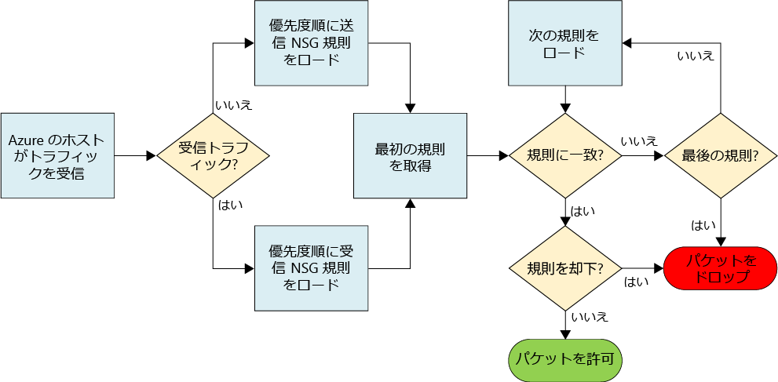
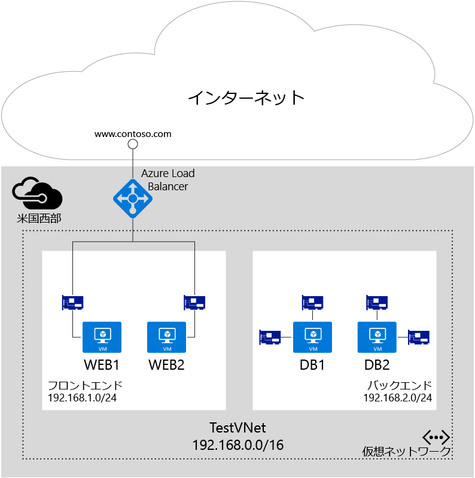

# ネットワーク セキュリティ グループを使用したネットワーク トラフィック フローの制御

ネットワーク セキュリティ グループ (NSG) には、仮想ネットワークの VM インスタンスに対するネットワーク トラフィックを許可または拒否する一連のアクセス制御リスト (ACL) 規則が含まれています。 NSG は、サブネットまたはそのサブネット内の個々の VM インスタンスと関連付けることができます。 NSG がサブネットに関連付けられている場合、ACL 規則はそのサブネット内のすべての VM インスタンスに適用されます。 また、NSG を直接 VM に関連付けることにより、その個々の VM に対するトラフィックをさらに制限できます。

> [!NOTE]
> Azure には、リソースの作成と操作に関して、[Resource Manager とクラシックの](../resource-manager-deployment-model.md)&2; 種類のデプロイメント モデルがあります。 この記事では、両方のモデルについて取り上げていますが、最新のデプロイではリソース マネージャー モデルの使用をお勧めします。

## NSG リソース
NSG には、次のプロパティが含まれています。

| プロパティ | Description | 制約 | 考慮事項 |
| --- | --- | --- | --- |
| Name |NSG の名前 |リージョン内で一意にする必要があります。 文字、数字、アンダースコア、ピリオド、ハイフンを使用できます。 先頭は文字か数字にします。 末尾は文字、数字、アンダースコアのいずれかにします。 使用できる文字数は最大 80 文字です。 |複数の NSG の作成が必要になることがあるため、NSG の機能が識別しやすくなる名前付け規則を用意してください。 |
| リージョン |NSG がホストされる Azure リージョン |NSG は NSG が作成されたリージョン内のリソースにのみ適用できます。 |1 つのリージョンで作成できる NSG の数については、下の「 [制限](#Limits) 」を参照してください。 |
| リソース グループ |NSG が属するリソース グループ |NSG はリソース グループに属しますが、リソースが NSG と同じ Azure リージョン内にあれば、任意のリソース グループ内のリソースに関連付けることができます。 |リソース グループは、複数のリソースをデプロイ ユニットとしてまとめて管理する目的で使用されます。 たとえば NSG は、それが関連付けられているリソースにまとめることができます。 |
| ルール |許可または拒否するトラフィックを定義するルール | |下の「 [NSG ルール](#Nsg-rules) 」を参照してください。 |

> [!NOTE]
> エンドポイント ベースの ACL とネットワーク セキュリティ グループは、同じ VM インスタンスではサポートされません。 エンドポイントの ACL が既に導入されている場合に NSG を使用するには、初めにエンドポイントの ACL を削除します。 これを行う方法については、 [PowerShell を使用したエンドポイントのアクセス制御リスト (ACL) の管理](virtual-networks-acl-powershell.md)を参照してください。
> 

### NSG ルール
NSG ルールには、次のプロパティが含まれています。

| プロパティ | Description | 制約 | 考慮事項 |
| --- | --- | --- | --- |
| **名前** |ルールの名前 |リージョン内で一意にする必要があります。 文字、数字、アンダースコア、ピリオド、ハイフンを使用できます。 先頭は文字か数字にします。 末尾は文字、数字、アンダースコアのいずれかにします。 使用できる文字数は最大 80 文字です。 |1 つの NSG 内に複数のルールを作成することがあるため、ルールの機能を識別できる名前付け規則に準拠してください。 |
| **プロトコル** |規則に関して一致するプロトコル |TCP、UDP、または \* |\* をプロトコルとして使用すると、UDP と TCP のほかに ICMP (East-West トラフィックのみ) も含まれ、必要なルール数を減らすことができます。 一方で、\* を使用するとアプローチの幅が広くなりすぎることがあるため、必要な場合にのみ使用してください。 |
| **発信元ポート範囲** |規則に関して一致するソース ポート範囲 |1 から 65535 までの 1 つのポート番号、ポート範囲 (1 ～ 65635 など)、または \* (すべてのポート) |発信元は、短期ポートである場合があります。 クライアント プログラムで決まったポートを使用している場合以外、通常は "*" を使用してください。 複数のルールを設定する必要がないように、できるだけポート範囲を使用してください。 複数のポートまたは複数のポート範囲をコンマでグループ化することはできません。 |
| **宛先ポート範囲** |規則に関して一致する宛先ポート範囲 |1 から 65535 までの 1 つのポート番号、ポート範囲 (1 ～ 65535 など)、または \* (すべてのポート) |複数のルールを設定する必要がないように、できるだけポート範囲を使用してください。 複数のポートまたは複数のポート範囲をコンマでグループ化することはできません。 |
| **発信元アドレスのプレフィックス** |規則に関して一致する発信元アドレスのプレフィックスまたはタグ |1 つの IP アドレス (例: 10.10.10.10)、IP サブネット (例: 192.168.1.0/24)、 [既定のタグ](#default-tags)、または * (すべてのアドレス) |ルールの数を減らすには、範囲、既定のタグ、* の使用を検討してください。 |
| **宛先アドレスのプレフィックス** |規則に関して一致する宛先アドレスのプレフィックスまたはタグ |1 つの IP アドレス (例: 10.10.10.10)、IP サブネット (例: 192.168.1.0/24)、 [既定のタグ](#default-tags)、または * (すべてのアドレス) |ルールの数を減らすには、範囲、既定のタグ、* の使用を検討してください。 |
| **方向** |規則に関して一致するトラフィックの方向 |受信または送信 |受信ルールと送信ルールは方向に基づいて個別に処理されます。 |
| **優先順位** |ルールは優先度の順序でチェックされます。ルールが適用されると、それ以上はルールの一致テストが行われなくなります。 |100 ～ 4096 の数値 |既存のルールの間に新しいルールを追加する余地を残すために、各ルールの優先度の数値を 100 ずつ飛ばして設定することを検討してください。 |
| **Access (アクセス)** |規則が一致した場合に適用されるアクセスの種類 |許可または拒否 |パケットに一致する許可ルールが見つからない場合はパケットが削除されることに留意してください。 |

NSG には受信と送信の&2; つのルール セットがあります。 ルールの優先順位は、各セット内で一意である必要があります。 

 

上図に、NSG ルールの処理方法を示します。

### 既定のタグ
既定のタグは、IP アドレスのカテゴリに対応するシステム指定の識別子です。 既定のタグは、任意のルールの**発信元アドレスのプレフィックス**および**宛先アドレスのプレフィックス** プロパティで使用できます。 使用できる既定のタグは&3; 種類あります。

* **VIRTUAL_NETWORK:** この既定のタグは、ネットワーク アドレス空間のすべてを表します。 これには、仮想ネットワーク アドレス空間 (Azure で定義されている CIDR 範囲) だけでなく、すべての接続されているオンプレミス アドレス空間および接続されている Azure VNet (ローカル ネットワーク) が含まれます。
* **AZURE_LOADBALANCER:** この既定のタグは、Azure のインフラストラクチャのロード バランサーを表します。 これは、Azure の正常性プローブが開始される Azure データ センター IP に変換されます。
* **INTERNET:** この既定のタグは、パブリック インターネットによってアクセスできる仮想ネットワークの外部の IP アドレス空間を表します。 この範囲には、 [Azure に所有されているパブリック IP アドレス空間](https://www.microsoft.com/download/details.aspx?id=41653) も含まれます。

### 既定のルール
すべての NSG に既定のルール一式が含まれています。 既定のルールは削除できませんが、これには最も低い優先順位が割り当てられているため、ルールを作成することで上書きできます。 

次の既定のルールが示すように、仮想ネットワーク内で発信および着信するトラフィックについては、受信方向と送信方向の両方で許可されます。 インターネットへの接続は送信方向で許可されていますが、既定で、受信方向はブロックされています。 既定のルールでは、Azure のロード バランサーによる VM とロール インスタンスの正常性プローブが許可されます。 負荷分散セットを使用していない場合は、このルールを上書きできます。

**受信の既定のルール**

| Name | 優先順位 | 発信元 IP | 発信元ポート | 宛先 IP | 宛先ポート | プロトコル | Access (アクセス) |
| --- | --- | --- | --- | --- | --- | --- | --- |
| ALLOW VNET INBOUND |65000 |VIRTUAL_NETWORK |* |VIRTUAL_NETWORK |* |* |ALLOW |
| ALLOW AZURE LOAD BALANCER INBOUND |65001 |AZURE_LOADBALANCER |* |* |* |* |ALLOW |
| DENY ALL INBOUND |65500 |* |* |* |* |* |DENY |

**送信の既定のルール**

| Name | 優先順位 | 発信元 IP | 発信元ポート | 宛先 IP | 宛先ポート | プロトコル | Access (アクセス) |
| --- | --- | --- | --- | --- | --- | --- | --- |
| ALLOW VNET OUTBOUND |65000 |VIRTUAL_NETWORK |* |VIRTUAL_NETWORK |* |* |ALLOW |
| ALLOW INTERNET OUTBOUND |65001 |* |* |INTERNET |* |* |ALLOW |
| DENY ALL OUTBOUND |65500 |* |* |* |* |* |DENY |

## NSG の関連付け
NSG は、使用しているデプロイ モデルに応じて、VM、NIC、およびサブネットに関連付けることができます。

* **VM に対する NSG の関連付け (クラシック デプロイメントのみ)。** VM に対して NSG を関連付ける場合、NSG のネットワーク アクセス ルールが、その VM を宛先とするすべてのトラフィックに適用されます。 
* **NIC に対する NSG の関連付け (リソース マネージャー デプロイメントのみ)。** NIC に対して NSG を関連付ける場合、NSG のネットワーク アクセス ルールが、その NIC にのみ適用されます。 これは、複数 NIC の VM で、NSG が&1; つの NIC に適用されている場合、その NIC を宛先とするトラフィックに影響がないことを意味します。 
* **サブネットに対する NSG の関連付け (すべてのデプロイメント)**。 NSG をサブネットに関連付けた場合、NSG のネットワーク アクセス ルールは、サブネット内のすべての IaaS リソースと PaaS リソースに適用されます。 

さまざまな NSG を VM (デプロイメント モデルによっては NIC) および NIC や VM の宛先のサブネットに関連付けることができます。 この場合、すべてのネットワーク アクセス ルールが、各 NSG 内の優先度に基づき、次の順番でトラフィックに適用されます。

- **受信トラフィック**

  1. **サブネットに適用される NSG:** サブネット NSG に、トラフィックを拒否する照合ルールがある場合、パケットは破棄されます。

  2. **NIC (リソース マネージャー) または VM (クラシック) に適用される NSG:** トラフィックを拒否する照合ルールが VM\NIC NSG にある場合、サブネット NSG にトラフィックを許可する照合ルールがあったとしても、パケットは VM\NIC で破棄されます。

- **送信トラフィック**

  1. **NIC (リソース マネージャー) または VM (クラシック) に適用される NSG:** トラフィックを拒否する照合ルールが VM\NIC NSG にある場合、パケットは破棄されます。

  2. **サブネットに適用される NSG:** トラフィックを拒否する照合ルールがサブネット NSG にある場合、VM\NIC NSG にトラフィックを許可する照合ルールがあったとしても、パケットはここで破棄されます。

> [!NOTE]
> 1 つの NSG は&1; つのサブネット、VM、または NIC に関連付けられますが、同じ NSG は必要なだけの数のリソースに関連付けることができます。
>

## 実装
従来のデプロイ モデルまたはリソース マネージャーによるデプロイ モデルで、以下に示す各種のツールを使用して、NSG を実装することができます。

| デプロイ ツール | クラシック | リソース マネージャー |
| --- | --- | --- |
| クラシック ポータル | いいえ  | いいえ |
| Azure ポータル   | はい | [はい](virtual-networks-create-nsg-arm-pportal.md) |
| PowerShell     | [はい](virtual-networks-create-nsg-classic-ps.md) | [はい](virtual-networks-create-nsg-arm-ps.md) |
| Azure CLI      | [はい](virtual-networks-create-nsg-classic-cli.md) | [はい](virtual-networks-create-nsg-arm-cli.md) |
| ARM テンプレート   | いいえ  | [はい](virtual-networks-create-nsg-arm-template.md) |

## 計画
NSG を実装する前に、次の質問への回答を用意する必要があります。

1. どのような種類のリソース間のトラフィックをフィルター処理する必要があるか (同じ VM 内の NIC 間、同じサブネットに接続されている VM 間またはクラウド サービスやアプリケーション サービス環境などのリソース間、異なるサブネットに接続されているリソース間のいずれか)。
2. トラフィックをフィルター処理するリソースは、既存の VNet 内のサブネットに接続されているか、新しい VNet またはサブネットに接続されているか。

Azure におけるネットワーク セキュリティの計画に関する詳細については、「 [Microsoft クラウド サービスとネットワーク セキュリティ](../best-practices-network-security.md)」を参照してください。 

## 設計上の考慮事項
「 [計画](#Planning) 」セクションの質問に対する回答を用意できたら、NSG を定義する前に、以下を確認します。

### 制限
NSG の設計時には、次の制限事項を考慮する必要があります。

| **説明** | **既定の制限** | **説明** |
| --- | --- | --- |
| サブネット、VM、または NIC に関連付けられる NSG の数 |1 |NSG を組み合わせることはできません。 特定のリソース セットに必要なすべてのルールが&1; つの NSG に含まれるようにしてください。 |
| サブスクリプションあたりのリージョンごとの NSG 数 |100 |既定では、Azure ポータルで作成する各 VM に新しい NSG が&1; つ作成されます。 この既定の動作を許可すると、NSG はすぐに上限に達します。 設計時はこの制限に留意し、必要に応じてリソースを複数のリージョンまたはサブスクリプションに分割してください。 |
| NSG あたりの NSG ルール数 |200 |この上限を超えないように IP とポートの広い範囲を使用してください。 |

> [!IMPORTANT]
> ソリューションを設計する前に、 [Azure のネットワーク サービスに関連するすべての制限事項](../azure-subscription-service-limits.md#networking-limits) を確認してください。 一部の制限は、サポート チケットを開いて引き上げることができます。
> 
> 

### VNet とサブネットの設計
NSG はサブネットに適用できるため、リソースをサブネットごとにグループ化し、NSG をサブネットに適用することで、NSG の数を最小限に抑えることができます。  NSG をサブネットに適用することにしたものの、既存の VNet とサブネットが NSG のことを考えて定義されていないことがあります。 用意した NSG 設計をサポートするために、VNet とサブネットを新たに定義する必要が生じる場合があります。 このようなときは、新しいサブネットを作成して、新しいリソースをデプロイします。 その後、新しいサブネットに既存のリソースを移動する移行戦略を定義できます。 

### 特殊なルール
次に示す特殊なルールを考慮する必要があります。 これらのルールで許可されるトラフィックをブロックしないでください。ブロックすると、インフラストラクチャが Azure の重要なサービスと通信できなくなります。

* **ホスト ノードの仮想 IP:** DHCP、DNS、および正常性の監視などの基本的なインフラストラクチャ サービスは、仮想化されたホストの IP アドレス 168.63.129.16 を通じて提供されます。 このパブリック IP アドレスは Microsoft に属し、この目的のためにすべてのリージョンで使用される唯一の仮想化 IP アドレスです。 この IP アドレスは、仮想マシンをホストしているサーバー マシン (ホスト ノード) の物理 IP アドレスにマッピングされます。 ホスト ノードは、DHCP リレー、DNS の再帰的リゾルバー、および Load Balancer の正常性プローブとマシンの正常性プローブのプローブ元として機能します。 この IP アドレスへの通信を攻撃と見なさないでください。
* **ライセンス (キー管理サービス):** 仮想マシンで実行されている Windows イメージのライセンスを取得する必要があります。 このためには、要求を処理するキー管理サービスのホスト サーバーにライセンス要求を送信します。 これは、常に送信ポート 1688 上にあります。

### ICMP トラフィック
現在の NSG のルールは、プロトコル *TCP* または *UDP* のみを許可します。 *ICMP*専用のタグはありません。 ただし、ICMP トラフィックは、VNet 内で任意のポートおよびプロトコル間のトラフィックを許可する受信 VNet ルール (既定のルール 65000 受信) を通じて、既定で Virtual Network 内で許可されます。

### サブネット
* ワークロードに必要な階層の数を考慮してください。 サブネットを使用して各層を分離し、NSG をそのサブネットに適用できます。 
* VPN ゲートウェイまたは ExpressRoute 回線用のサブネットを実装する必要がある場合は、そのサブネットに NSG を **適用しない** ようにします。 適用すると、VNet 間接続またはクロス プレミス接続が機能しません。
* 仮想アプライアンスを実装する必要がある場合は、ユーザー定義のルート (UDR) が正しく機能するように、必ず専用のサブネットに仮想アプライアンスをデプロイしてください。 サブネット レベルの NSG を実装して、このサブネットに出入りするトラフィックをフィルター処理できます。 詳細については、 [トラフィック フローを制御し、仮想アプライアンスを使用する方法](virtual-networks-udr-overview.md)に関するページを参照してください。

### ロード バランサー
* 各ワークロードで使用されているロード バランサーごとに負荷分散と NAT に関するルールを検討してください。これらのルールは、NIC (リソース マネージャー デプロイ) または VM/ロール インスタンス (クラシック デプロイ) が属しているバックエンド プールにバインドされています。 ロード バランサーに実装されたルールでマップされたトラフィックのみを許可する NSG をバックエンド プールごとに作成することを検討してください。 これにより、ロード バランサーを経由せずにバックエンド プールに直接送信されるトラフィックも確実にフィルター処理されます。
* クラシック デプロイでは、ロード バランサーのポートを VM またはロール インスタンスのポートにマップするエンドポイントを作成します。 リソース マネージャー デプロイでは、パブリックに公開されたロード バランサーを自分で個別に作成することもできます。 ロード バランサー内のバックエンド プールに属する VM とロール インスタンスへのトラフィックを NSG で制限している場合は、受信トラフィックの宛先ポートが、ロード バランサーによって公開されているポートではなく、VM またはロール インスタンスの実際のポートであることに注意してください また、VM への接続用の発信元ポートとアドレスは、ロード バランサーによって公開されているポートとアドレスではなく、インターネット上にあるリモート コンピューターの発信元ポートとアドレスであることに注意してください。
* パブリックに公開されたロード バランサーと同様に、内部ロード バランサー (ILB) を経由するトラフィックをフィルター処理する NSG を作成する場合は、適用される発信元ポートとアドレス範囲が、ロード バランサーではなく、呼び出しを開始するコンピューターのものであることを理解しておく必要があります。 宛先ポートとアドレス範囲は、ロード バランサーではなく、トラフィックを受信するコンピューターに関連付けられています。

### その他
* エンドポイント ベースの ACL と NSG は、同じ VM インスタンスではサポートされません。 エンドポイントの ACL が既に導入されている場合に NSG を使用するには、初めにエンドポイントの ACL を削除します。 これを行う方法については、 [エンドポイント ACL の管理に関するページ](virtual-networks-acl-powershell.md)を参照してください。
* リソース マネージャー デプロイ モデルの場合、複数の NIC を持つ VM で&1; つの NIC に&1; つの NSG を関連付けて、NIC ごとの管理 (リモート アクセス) を有効にし、トラフィックを分離できます。
* ロード バランサーを使用する場合と同様に、他の VNet からのトラフィックをフィルター処理する際は、VNet に接続しているゲートウェイではなく、リモート コンピューターの発信元アドレス範囲を使用する必要があります。
* 多くの Azure サービスは、Azure Virtual Network に接続することはできないため、NSG を使用してそれらの間のトラフィックをフィルター処理することはできません。  VNet に接続できるかどうかを判断するには、使用しているサービスのドキュメントを参照してください。

## サンプル デプロイメント
この記事の内容の応用例を示すために、次の要件を持つ&2; 層構成のワークロード ソリューションについてネットワーク トラフィックをフィルター処理する NSG を定義します。

1. フロントエンド (Windows Web サーバー) とバックエンド (SQL Database サーバー) の間のトラフィックを分離
2. トラフィックをロード バランサーを経由してすべての Web サーバーのポート 80 に転送する負荷分散ルール
3. ロード バランサーのポート 50001 に送信されるトラフィックをフロント エンド内の 1 つの VM のポート 3389 に転送する NAT ルール
4. 要件番号 1 を除き、インターネットからフロントエンドまたはバックエンドの VM へのアクセスを拒否
5. フロントエンドまたはバックエンドからインターネットへのアクセスを拒否
6. フロントエンドのサブネットから送信されたトラフィックに対して、フロントエンドにある任意の Web サーバーのポート 3389 へのアクセスを許可
7. フロントエンドのサブネットのみからバックエンドのすべての SQL Server VM のポート 3389 へのアクセスを許可
8. フロントエンドのサブネットのみからバックエンドのすべての SQL Server VM のポート 1433 へのアクセスを許可
9. バックエンド VM の複数の NIC で管理トラフィック (ポート 3389) とデータベース トラフィック (ポート 1433) を分離

上の図に示すように、*Web1* VM と *Web2* VM が*フロントエンド* サブネットに接続され、*DB1* VM と *DB2* VM が*バックエンド* サブネットに接続されています。  どちらのサブネットも *TestVNet* VNet の一部です。 すべてのリソースが *米国西部* Azure リージョンに割り当てられています。

上記の要件 1 ～ 6 (3 を除く) は、すべてサブネット空間に限定されます。 次のサブネット レベル NSG を実装すると、各 NSG で必要となるルールの数を最小限に抑えることができ、既存の VM と同じ種類のワークロードを実行している VM をサブネットに容易に追加できます。

### フロントエンド サブネット向けの NSG
**受信ルール**

| ルール | Access (アクセス) | 優先順位 | 発信元アドレス範囲 | 発信元ポート | 宛先アドレス範囲 | 宛先ポート | プロトコル |
| --- | --- | --- | --- | --- | --- | --- | --- |
| HTTP を許可する |ALLOW |100 |INTERNET |\* |\* |80 |TCP |
| フロントエンドからの RDP を許可する |ALLOW |200 |192.168.1.0/24 |\* |\* |3389 |TCP |
| インターネットからのすべてのアクセスを拒否する |DENY |300 |INTERNET |\* |\* |\* |TCP |

**送信ルール**

| ルール | Access (アクセス) | 優先順位 | 発信元アドレス範囲 | 発信元ポート | 宛先アドレス範囲 | 宛先ポート | プロトコル |
| --- | --- | --- | --- | --- | --- | --- | --- |
| インターネットを拒否する |DENY |100 |\* |\* |INTERNET |\* |\* |

### バックエンド サブネット向けの NSG
**受信ルール**

| ルール | Access (アクセス) | 優先順位 | 発信元アドレス範囲 | 発信元ポート | 宛先アドレス範囲 | 宛先ポート | プロトコル |
| --- | --- | --- | --- | --- | --- | --- | --- |
| インターネットを拒否する |DENY |100 |INTERNET |\* |\* |\* |\* |

**送信ルール**

| ルール | Access (アクセス) | 優先順位 | 発信元アドレス範囲 | 発信元ポート | 宛先アドレス範囲 | 宛先ポート | プロトコル |
| --- | --- | --- | --- | --- | --- | --- | --- |
| インターネットを拒否する |DENY |100 |\* |\* |INTERNET |\* |\* |

### インターネットからの RDP に対するフロントエンド内の単一 VM (NIC) 向けの NSG
**受信ルール**

| ルール | Access (アクセス) | 優先順位 | 発信元アドレス範囲 | 発信元ポート | 宛先アドレス範囲 | 宛先ポート | プロトコル |
| --- | --- | --- | --- | --- | --- | --- | --- |
| インターネットからの RDP を許可する |ALLOW |100 |INTERNET |* |\* |3389 |TCP |

> [!NOTE]
> このルールの発信元アドレス範囲はロード バランサーの VIP ではなく**インターネット**で、発信元ポートは 500001 ではなく **\*** である点に注意してください。 NAT ルール/負荷分散ルールと NSG ルールを混同しないようにしてください。 NSG ルールは、常にトラフィックの最初の発信元と最終的な宛先に関連付けられ、両者の間にあるロード バランサーは **関係しません** 。 
> 
> 

### バックエンドの管理 NIC 向けの NSG
**受信ルール**

| ルール | Access (アクセス) | 優先順位 | 発信元アドレス範囲 | 発信元ポート | 宛先アドレス範囲 | 宛先ポート | プロトコル |
| --- | --- | --- | --- | --- | --- | --- | --- |
| フロント エンドからの RDP を許可する |ALLOW |100 |192.168.1.0/24 |* |\* |3389 |TCP |

### バック エンドのデータベース アクセス NIC 向けの NSG
**受信ルール**

| ルール | Access (アクセス) | 優先順位 | 発信元アドレス範囲 | 発信元ポート | 宛先アドレス範囲 | 宛先ポート | プロトコル |
| --- | --- | --- | --- | --- | --- | --- | --- |
| フロント エンドからの SQL を許可する |ALLOW |100 |192.168.1.0/24 |* |\* |1433 |TCP |

上記の NSG のいくつかは個々の NIC に関連付ける必要があるため、このシナリオはリソース マネージャー デプロイとしてデプロイする必要があります。 サブネット レベルのルールと NIC レベルのルールが、それぞれに必要な適用方法に応じて、どのように組み合わされているかに注目してください。 

## 次のステップ
* [クラシック デプロイメント モデルで NSG をデプロイします](virtual-networks-create-nsg-classic-ps.md)。
* [リソース マネージャーで NSG をデプロイします](virtual-networks-create-nsg-arm-pportal.md)。
* [NSG のログを管理します](virtual-network-nsg-manage-log.md)。

<!--HONumber=Jan17_HO5-->

