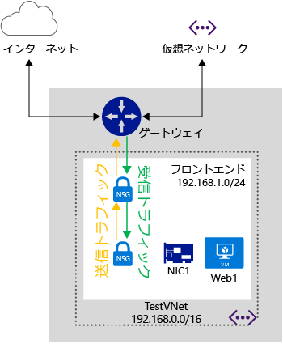

<properties 
   pageTitle="ネットワーク セキュリティ グループ (NSG)"
   description="ネットワーク セキュリティ グループ (NSG) の詳細"
   services="virtual-network"
   documentationCenter="na"
   authors="telmosampaio"
   manager="carolz"
   editor="tysonn" />
<tags 
   ms.service="virtual-network"
   ms.devlang="na"
   ms.topic="article"
   ms.tgt_pltfrm="na"
   ms.workload="infrastructure-services"
   ms.date="09/22/2015"
   ms.author="telmos" />

# ネットワーク セキュリティ グループ (NSG) について

NSG を使用して、仮想ネットワーク内で 1 つまたは複数の仮想マシン (VM) のインスタンスに対するトラフィックを制御できます。NSG には、トラフィックの方向、プロトコル、ソース アドレスとポート、および送信先アドレスとポートに基づいて、トラフィックを許可または拒否するアクセス制御ルールが含まれています。NSG のルールは、いつでも変更でき、変更は関連付けられているすべてのインスタンスに適用されます。

>[AZURE.WARNING]NSG は、地域 Vnet でのみ使用できます。VNet なしでデプロイメントのエンドポイントをセキュリティで保護する場合、またはアフィニティ グループに関連付けられている VNet を使用する場合は、「[What is an endpoint Access Control (エンドポイント アクセス制御リスト (ACL) とは)](./virtual-networks-acl.md)」を参照してください。[VNet を地域 VNet に移行する](./virtual-networks-migrate-to-regional-vnet.md)こともできます。

上記の図は、2 つのサブネットと、トラフィック制御用の各サブネットに関連付けられた 1 つの NSGを含む仮想ネットワークを示しています。

>[AZURE.NOTE]エンドポイント ベースの ACL とネットワーク セキュリティ グループは、同じ VM インスタンスではサポートされません。エンドポイントの ACL が既に導入されている場合に NSG を使用するには、初めにエンドポイントの ACL を削除します。これを行う方法については、[PowerShell を使用したエンドポイントのアクセス制御リスト (ACL) の管理](virtual-networks-acl-powershell.md)を参照してください。

## ネットワーク セキュリティ グループのしくみ

ネットワーク セキュリティ グループは、エンドポイント ベースの ACL とは異なります。エンドポイントの ACL は、入力エンドポイントによって公開されるパブリック ポートでのみ動作します。NSG は 1 つまたは複数の VM インスタンスで動作し、VM 上の受信と送信のすべてのトラフィックを制御します。

ネットワーク セキュリティ グループには*名前*が割り当てられ、*領域*に関連付けられ、わかりやすいラベルが付きます。これには、**受信**と**送信**の 2 種類のルールが含まれています。受信のルールは VM への受信パケットに適用され、送信のルールは、VM からの送信パケットに適用されます。ルールは、VM が配置されているホストで適用されます。受信パケットまたは送信パケットは、許可されるために**許可**ルールと一致する必要があります。一致しない場合は、削除されます。

ルールは、優先順位に従って処理されます。たとえば、優先順位の値が小さい (100 など) ルールは、優先順位の値が大きい (200 など) ルールより前に処理されます。一致が見つかると、それ以上のルールは処理されません。

ルールでは、次のことを指定します。

- **名前:** ルールの一意の識別子

- **種類:** 受信/送信

- **優先順位:** <You can specify an integer between 100 and 4096>

- **発信元 IP アドレス:** 発信元 IP 範囲の CIDR

- **発信元ポート範囲:** <integer or range between 0 and 65536>

- **宛先 IP の範囲:** 宛先 IP 範囲の CIDR

- **宛先ポート範囲:** <integer or range between 0 and 65536>

- **プロトコル:** < TCP、UDP または ' *' が許可されます>

- **アクセス:** 許可または拒否

### 既定のルール

NSG には、既定のルールが含まれています。既定のルールは削除できませんが、これには最も低い優先順位が割り当てられているため、ルールを作成することで上書きできます。既定のルールでは、プラットフォームによって推奨される既定の設定が指定されています。次の既定のルールが示すように、受信方向と送信方向の両方につき、 VNet 内で発信および着信するトラフィックは許可されます。

インターネットへの接続は送信方向で許可されていますが、既定で、受信方向はブロックされています。既定のルールでは、Azure Load Balancer (LB) による VM の正常性プローブが許可されます。NSG の下の VM または一連の VM が負荷分散セットに参加しない場合は、このルールを上書きできます。

既定のルールは、次のとおりです。

**受信**

| 名前 | 優先順位 | 発信元 IP | 発信元ポート | 宛先 IP | 宛先ポート | プロトコル | アクセス |
|-----------------------------------|----------|--------------------|-------------|-----------------|------------------|----------|--------|
| ALLOW VNET INBOUND | 65000 | VIRTUAL\_NETWORK | * | VIRTUAL\_NETWORK | * | * | ALLOW |
| ALLOW AZURE LOAD BALANCER INBOUND | 65001 | AZURE\_LOADBALANCER | * | * | * | * | ALLOW |
| DENY ALL INBOUND | 65500 | * | * | * | * | * | DENY |

**送信**

| 名前 | 優先順位 | 発信元 IP | 発信元ポート | 宛先 IP | 宛先ポート | プロトコル | アクセス |
|-------------------------|----------|-----------------|-------------|-----------------|------------------|----------|--------|
| ALLOW VNET OUTBOUND | 65000 | VIRTUAL\_NETWORK | * | VIRTUAL\_NETWORK | * | * | ALLOW |
| ALLOW INTERNET OUTBOUND | 65001 | * | * | INTERNET | * | * | ALLOW |
| DENY ALL OUTBOUND | 65500 | * | * | * | * | * | DENY |

### 既定のタグ

既定のタグは、IP アドレスのカテゴリに対応するシステム指定の識別子です。ユーザー定義のルールで、既定のタグを指定できます。既定のタグは、次のとおりです。

- **VIRTUAL\_NETWORK -** この既定のタグは、ネットワーク アドレス空間のすべてを表します。これには、仮想ネットワーク アドレス空間 (Azure での IP CIDR) だけでなく、すべての接続されているオンプレミス アドレス空間 (ローカル ネットワーク) が含まれます。また、VNet 間のアドレス空間も含まれます。

- **AZURE\_LOADBALANCER -** この既定のタグは、Azure の インフラストラクチャの Load Balancer を表します。これは、Azure の正常性プローブが開始される Azure データ センター IP に変換されます。これは、NSG に関連付けられている VM または一連の VM が、負荷分散セットに参加している場合にのみ必要です。

- **INTERNET -** この既定のタグは、パブリック インターネットによってアクセスできる仮想ネットワークの外部の IP アドレス空間を表します。この範囲には、Azure に所有されているパブリック IP 領域も含まれます。

### ICMP トラフィック

現在の NSG のルールは、プロトコル *TCP* または *UDP* のみを許可します。*ICMP* 専用のタグはありません。ただし、ICMP トラフィックは、VNet 内で任意のポートおよびプロトコル間のトラフィックを許可する受信 VNet ルールを通じて、既定で Virtual Network 内で許可されます。

## NSG の関連付け

NSG は、VM、NIC、およびサブネットに関連付けることができます。

- **VM に対する NSG の関連付け**。 VM に対して NSG を関連付ける場合、NSG のネットワーク アクセス ルールが、その VM を宛先とするすべてのトラフィックに適用されます。 

- **NIC に対する NSG の関連付け**。 NIC に対して NSG を関連付ける場合、NSG のネットワーク アクセス ルールが、その NIC にのみ適用されます。これは、複数 NIC の VM で、NSG が 1 つの NIC に適用されている場合、その NIC を宛先とするトラフィックに影響がないことを意味します。

- **サブネットに対する NSG の関連付け**。NSG をサブネットに関連付けた場合、NSG のネットワーク アクセス ルールは、サブネット内のすべての VM に適用されます。

さまざまな NSG を VM、VM が使用する NIC、また NIC の宛先のサブネットに関連付けることができます。この場合、すべてのネットワーク アクセス ルールが、次の順番でトラフィックに適用されます。

- **受信トラフィック**
	1. サブネット NSG。
	2. NIC NSG。
	3. VM NSG。
- **送信トラフィック**
	1. VM NSG。
	2. NIC NSG。
	3. サブネット NSG。

>[AZURE.NOTE]1 つの NSG は 1 つのサブネット、VM、または NIC に関連付けられますが、同じ NSG は必要なだけの数のリソースに関連付けることができます。

## 設計上の考慮事項

NSG を設計するときは、VM がインフラストラクチャ サービスや、Azure でホストされる PaaS サービスと通信する方法を理解しておく必要があります。SQL Database や Storage などのほとんどの Azure PaaS サービスは、パブリックに公開されたインターネット アドレスからのみアクセスできます。負荷分散プローブについても同様です。

VM や PaaS ロールなどのオブジェクトを、インターネット アクセスの必要性の有無に基づいてサブネットに分離するのは、Azure においてよくあるシナリオです。このようなシナリオでは、SQL Database や Storage などの Azure PaaS サービスへのアクセスは必要であり、パブリック インターネットとの間での送受信通信は必要ではない、VM またはロール インスタンスのサブネットを使用することがあります。

このようなシナリオに対する次のような NSG ルールを考えます。

| 名前 | 優先順位 | 発信元 IP | 発信元ポート | 宛先 IP | 宛先ポート | プロトコル | アクセス |
|------|----------|-----------|-------------|----------------|------------------|----------|--------|
|NO INTERNET|100| VIRTUAL\_NETWORK|&#42;|INTERNET|&#42;|TCP|DENY| 

このルールは仮想ネットワークからインターネットへのすべてのアクセスを拒否するので、VM は、SQL Database などのパブリック インターネット エンドポイントを必要とするすべての Azure PaaS サービスにアクセスできません。

拒否ルールを使用する代わりに、次に示すような、仮想ネットワークからインターネットへのアクセスは許可し、インターネットから仮想ネットワークへのアクセスは拒否するルールの使用を考えます。

| 名前 | 優先順位 | 発信元 IP | 発信元ポート | 宛先 IP | 宛先ポート | プロトコル | アクセス |
|------|----------|-----------|-------------|----------------|------------------|----------|--------|
|TO INTERNET|100| VIRTUAL\_NETWORK|&#42;|INTERNET|&#42;|TCP|ALLOW|
|FROM INTERNET|110| INTERNET|&#42;|VIRTUAL\_NETWORK|&#42;|TCP|DENY| 

>[AZURE.WARNING]Azure では、**ゲートウェイ** サブネットと呼ばれる特殊なサブネットを使用して、他の VNet とオンプレミスのネットワークへの VPN ゲートウェイを処理します。このサブネットに NSG を関連付けると、VPN ゲートウェイにより適切な機能が停止されます。NSG をゲートウェイ サブネットに関連付けないでください。

また、次に示す特殊なルールを考慮する必要もあります。これらのルールで許可されるトラフィックをブロックしないでください。ブロックすると、インフラストラクチャが Azure の重要なサービスと通信できなくなります。

- **ホスト ノードの仮想 IP:** DHCP、DNS、および正常性の監視などの基本的なインフラストラクチャ サービスは、仮想化されたホストの IP アドレス 168.63.129.16 を通じて提供されます。このパブリック IP アドレスは Microsoft に属し、この目的のためにすべてのリージョンで使用される唯一の仮想化 IP アドレスです。この IP アドレスは、仮想マシンをホストしているサーバー マシン (ホスト ノード) の物理 IP アドレスにマッピングされます。ホスト ノードは、DHCP リレー、DNS の再帰的リゾルバー、および Load Balancer の正常性プローブとマシンの正常性プローブのプローブ元として機能します。この IP アドレスへの通信を攻撃と見なさないでください。

- **ライセンス (キー管理サービス):** 仮想マシンで実行されている Windows イメージのライセンスを取得する必要があります。このためには、要求を処理するキー管理サービスのホスト サーバーにライセンス要求を送信します。これは、常に送信ポート 1688 上にあります。

## 制限

NSG の設計時には、次の制限事項を考慮する必要があります。

|**説明**|**制限**|
|---|---|
|サブネット、VM、または NIC に関連付けられる NSG の数|1|
|サブスクリプションあたりのリージョンごとの NSG 数|100|
|NSG あたりの NSG ルール数|200|

ソリューションを設計する前に、[Azure のネットワーク サービスに関連するすべての制限事項](../azure-subscription-service-limits/#networking-limits)を確認してください。

## 次のステップ

- [クラシック デプロイメント モデルで NSG をデプロイします](virtual-networks-create-nsg-classic-ps.md)。
- [リソース マネージャーで NSG をデプロイします](virtual-networks-create-nsg-arm-pportal.md)。

<!---HONumber=Oct15_HO1-->