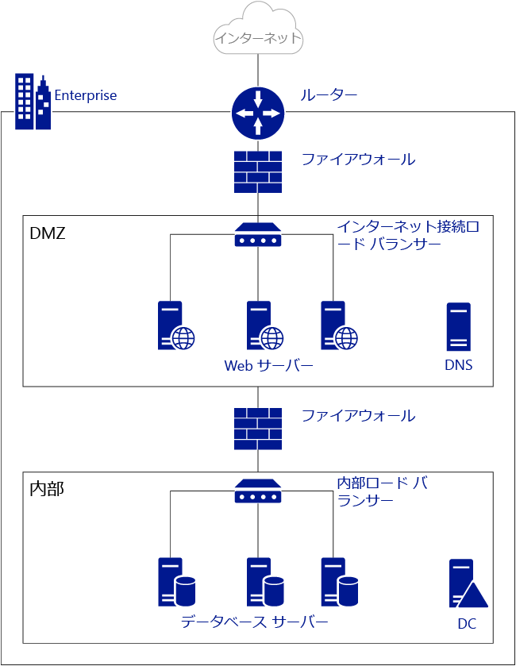
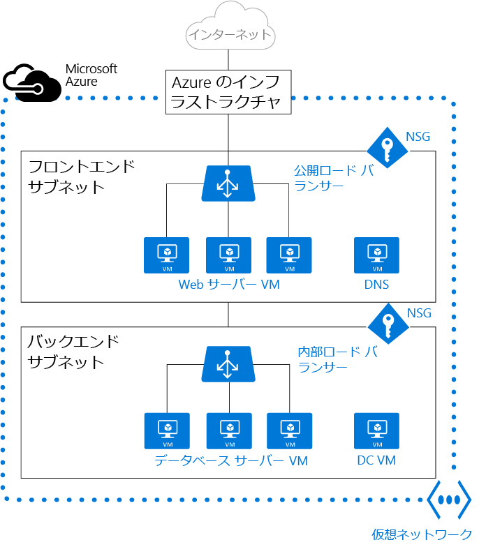

<properties
   pageTitle="Azure Virtual Network (VNet) の概要"
   description="Azure 仮想ネットワーク (VNet) について"
   services="virtual-network"
   documentationCenter="na"
   authors="jimdial"
   manager="carmonm"
   editor="tysonn" />
<tags
   ms.service="virtual-network"
   ms.devlang="na"
   ms.topic="get-started-article"
   ms.tgt_pltfrm="na"
   ms.workload="infrastructure-services"
   ms.date="03/15/2016"
   ms.author="jdial" />

# Virtual Network の概要

Azure 仮想ネットワーク (VNet) は、クラウド内のユーザー独自のネットワークを表すものです。サブスクリプション専用に Azure クラウドが論理的に分離されています。このネットワークでは、IP アドレス ブロック、DNS 設定、セキュリティ ポリシー、およびルート テーブルを完全に制御できます。VNet をさらにサブネットに分割し、Azure IaaS 仮想マシン (VM) や[クラウド サービス (PaaS ロール インスタンス)](../cloud-services/cloud-services-choose-me.md) を起動できます。また、Azure のいずれかの[接続オプション](../vpn-gateway/vpn-gateway-cross-premises-options.md)を使用し、仮想ネットワークをオンプレミスのネットワークに接続することができます。つまり、Azure が提供するエンタープライズ規模のメリットを享受しながら、IP アドレス ブロックを完全に制御して、ネットワークを Azure に拡張できます。

VNet をより詳しく説明するために、次の図に簡略化されたオンプレミスのネットワークを示します。

上の図は、ルーターを経由してパブリック インターネットに接続されたオンプレミスのネットワークを示します。また、ルーターと、DNS サーバーおよび Web サーバー ファームをホストしている DMZ との間にファイアウォールがあります。Web サーバー ファームは、インターネットに公開されるハードウェア ロード バランサーを使用して負荷分散され、内部サブネットからリソースを消費します。内部サブネットは、別のファイアウォールによって DMZ から分離され、Active Directory ドメイン コント ローラー サーバー、データベース サーバー、アプリケーション サーバーをホストします。

次の図のように、同じネットワークを Azure でホストできます。

Azure インフラストラクチャが VNet からパブリック インターネットへのアクセスを有効にするルーターのロールを担っていることがわかります。構成を行う必要はありません。ファイアウォールは、個々のサブネットに適用されたネットワーク セキュリティ グループ (NSG) に置き換えることができます。すべての物理ロード バランサーは Azure でインターネットに接続する内部ロード バランサーに置き換えられます。

>[AZURE.NOTE] Azure には、クラシック (サービス管理とも呼ばれます) と Azure リソース マネージャー (ARM) の 2 つのデプロイ モードがあります。クラシック VNet はアフィニティ グループに追加するか、リージョン VNet として作成できます。アフィニティ グループに VNet がある場合は、[リージョン VNet に移行する方法](virtual-networks-migrate-to-regional-vnet.md)がお勧めです。

## Virtual Network のメリット

- **分離**: VNet は、相互に完全に分離されているため、同じ CIDR アドレス ブロックを使用する、開発、テスト、実稼働環境用に切り離されたネットワークを作成できます。

- **パブリック インターネットへのアクセス**: VNet 内のすべての IaaS VM と PaaS ロール インスタンスは、既定でパブリック インターネットにアクセスできます。ネットワーク セキュリティ グループ (NSG) を使用してアクセスを制御することもできます。

- **VNet 内の VM へのアクセス**: PaaS ロール インスタンスと IaaS VM は、異なるサブネットに配置されている場合でも、ゲートウェイを構成したり Public IP Addresses を使用したりせずに、同じ仮想ネットワークに配置し、プライベート IP アドレスを使用して相互に接続できます。

- **名前解決**: Azure には、VNet にデプロイされた IaaS VM と PaaS ロール インスタンス用に内部の名前解決が用意されています。独自の DNS サーバーをデプロイし、それを使用するよう VNet を構成することもできます。

- **セキュリティ**。ネットワーク セキュリティ グループを使用して、仮想マシンと VNet の PaaS ロール インスタンスが送受信するトラフィックを制御できます。

- **接続**: VNet は相互に接続することも、サイト間 VPN 接続や ExpressRoute 接続を使用して、オンプレミスのデータセンターに接続することもできます。VPN ゲートウェイについては、「[VPN Gateway について](../vpn-gateway/vpn-gateway-about-vpngateways.md)」をご覧ください。ExpressRoute の詳細については、「[ExpressRoute の技術概要](../expressroute/expressroute-introduction.md)」をご覧ください。

    >[AZURE.NOTE] Azure 環境に IaaS VM や PaaS ロール インスタンスをデプロイする前に、VNet を作成するようにしてください。ARM ベースの VM には VNet が必要です。既存の VNet を指定しない場合、Azure が既定の VNet を作成します。この VNet には、独自のオンプレミス ネットワークと競合する CIDR アドレス ブロックが含まれる場合があります。この場合、VNet からオンプレミスのネットワークに接続できなくなります。

## サブネット

サブネットは、VNet 内の IP アドレスの範囲で、VNet は組織とセキュリティ用に複数のサブネットに分割することができます。VNet 内の (同じまたは異なる) サブネットにデプロイした VM と PaaS ロール インスタンスは、追加の構成をしなくても互いに通信できます。また、サブネットへのルート テーブルおよび NSG も構成できます。

## IP アドレス

Azure のリソースには、*パブリック*と*プライベート*の 2 種類の IP アドレスが割り当てられています。Azure は、パブリック IP アドレスで、インターネットや [Azure Redis Cache](https://azure.microsoft.com/services/cache/)、[Azure Event Hubs](https://azure.microsoft.com/documentation/services/event-hubs/) など、Azure の公開されている他のサービスと通信できます。プライベート IP アドレスを使用すると、インターネット経由でルーティング可能な IP アドレスを使用する必要なく、仮想ネットワーク内のリソースまたは VPN 経由で接続されているリソースが通信できるようになります。

Azure 内の IP アドレスの詳細については、「[仮想ネットワークの IP アドレス](virtual-network-ip-addresses-overview-arm.md)」を参照してください。

## Azure ロード バランサー

仮想ネットワーク内の仮想マシンとクラウド サービスは、Azure ロード バランサーを使用してインターネットに公開することができます。公開されていない基幹業務アプリケーションは、内部ロード バランサーを使用してのみ負荷分散できます。

- **外部ロード バランサー**: 外部ロード バランサーを使用すると、パブリック インターネットからアクセスする IaaS VM と PaaS ロール インスタンスに高可用性を提供できます。

- **内部ロード バランサー**: 内部ロード バランサーを使用すると、VNet の他のサービスからアクセスする IaaS VM と PaaS ロール インスタンスに高可用性を提供できます。

Azure の負荷分散の詳細については、「[ロード バランサーの概要](../load-balancer/load-balancer-overview.md)」をご覧ください。

## ネットワーク セキュリティ グループ (NSG)

NSG を作成すると、ネットワーク インターフェイス (NIC)、VM、サブネットへの着信と発信アクセスを制御できます。各 NSG には、発信元 IP アドレス、送信元ポート、接続先 IP アドレス、宛先ポートに基づいてトラフィックを承認するか、拒否するかを指定する 1 つ以上のルールが含まれます。NSG の詳細については、「[ネットワーク セキュリティ グループ (NSG) について](virtual-networks-nsg.md)」をご覧ください。

## 仮想アプライアンス:

仮想アプライアンスは、ファイアウォール、WAN の最適化、不正侵入検出などのソフトウェア ベースのアプライアンス機能を実行する VNet 内の別の VM です。仮想アプライアンス経由で VNet トラフィックをルーティングしてこの機能を使用するためのルートを Azure で作成できます。

たとえば、NSG を使用して VNet にセキュリティを確保できます。ただし、NSG では、受信と送信パケットにレイヤー 4 の Access Control リスト (ACL) を提供します。レイヤー 7 のセキュリティ モデルが必要な場合は、ファイアウォール アプライアンスを使用する必要があります。

仮想アプライアンスは、[ユーザー定義のルートと IP 転送](virtual-networks-udr-overview.md)によって異なります。

## 制限
サブスクリプションで許可される Virtual Network 数には制限があります。詳細については、「[Azure ネットワークの制限](../azure-subscription-service-limits.md#networking-limits)」を参照してください。

## 価格
Azure では追加のコストの必要なく Virtual Network を使用できます。Vnet 内で開始されたコンピューティング インスタンスは、「[Azure VM の価格](https://azure.microsoft.com/pricing/details/virtual-machines/)」で説明されている標準の価格が課せられます。VNet で使用されている [VPN Gateway](https://azure.microsoft.com/pricing/details/vpn-gateway/) と [Public IP Addresses](https://azure.microsoft.com/pricing/details/ip-addresses/) も標準の価格が課せられます。

## 次のステップ

- サブネットと [VNet を作成する](virtual-networks-create-vnet-arm-pportal.md)。
- [Windows を実行する仮想マシンを Azure プレビュー ポータルで作成する](../virtual-machines/virtual-machines-windows-hero-tutorial.md)。
- [NSG](virtual-networks-nsg.md) について。
- [ユーザー定義のルートと IP 転送](virtual-networks-udr-overview.md)の概要。

<!-------HONumber=AcomDC_0810_2016-->