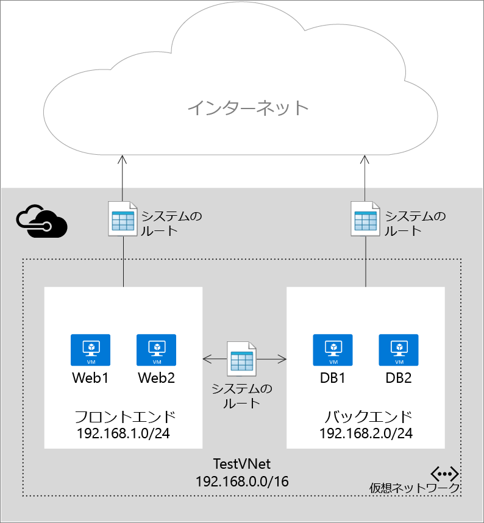
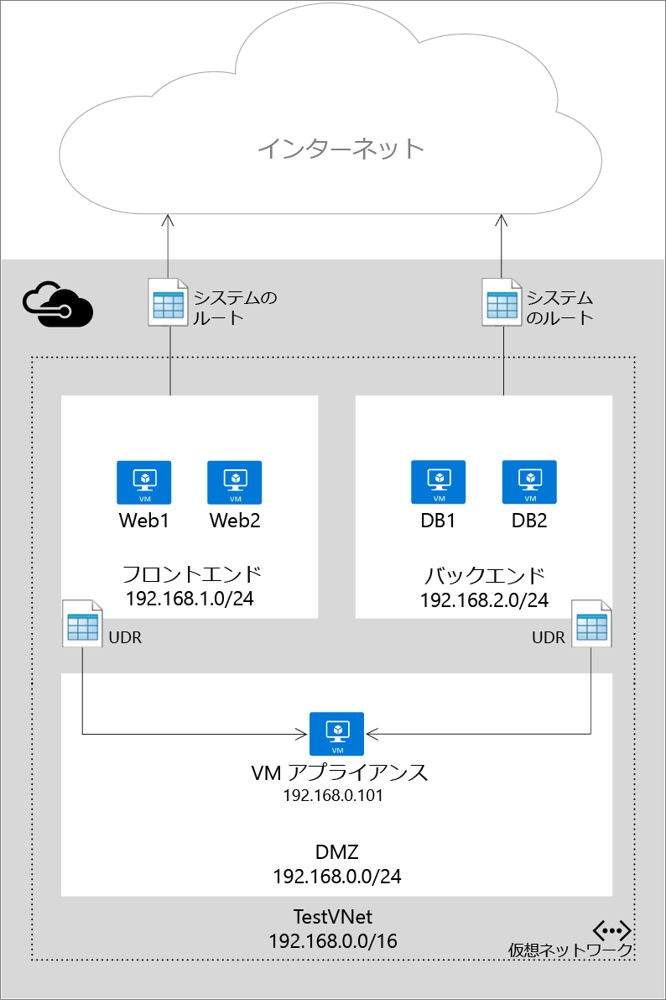

<properties 
   pageTitle="ユーザー定義のルートおよび IP 転送とは"
   description="ユーザー定義のルート (UDR) と IP 転送を使用して、Azure のネットワーク仮想アプライアンスにトラフィックを転送する方法について説明します。"
   services="virtual-network"
   documentationCenter="na"
   authors="jimdial"
   manager="carmonm"
   editor="tysonn" />
<tags 
   ms.service="virtual-network"
   ms.devlang="na"
   ms.topic="get-started-article"
   ms.tgt_pltfrm="na"
   ms.workload="infrastructure-services"
   ms.date="03/15/2016"
   ms.author="jdial" />

# ユーザー定義のルートおよび IP 転送とは
Azure で仮想マシン (VM) を仮想ネットワーク (VNet) に追加すると、VM どうしがネットワークを介して自動的に通信できることがわかります。VM が異なるサブネットにあったとしても、ゲートウェイを指定する必要はありません。VM からパブリック インターネットへの通信も同様であり、Azure からユーザー独自のデータセンターにハイブリッド接続が存在する場合は、オンプレミスのネットワークへの通信でも同様です。

このような通信フローが可能であるのは、Azure が一連のシステム ルートを使用して IP トラフィックのフロー方法を定義するためです。システム ルートは、以下のシナリオでの通信フローを制御します。

- 同じサブネット内から。
- VNet 内でサブネットから別のサブネットに。
- VM からインターネットに。
- VNet から VPN Gateway を通して別の VNet に。
- VNet から VPN Gateway を通してオンプレミスのネットワークに。

次の図は、VNet、2 つのサブネット、いくつかの VM、および IP トラフィックのフローを許可するシステム ルートによる、簡単な設定を示したものです。

システム ルートを使用するとデプロイのトラフィックが自動的に促進されますが、仮想アプライアンスを通過するパケットのルーティングを自分で制御したい場合もあります。特定のサブネット宛のパケットが代わりに仮想アプライアンスを通るように次ホップを指定するユーザー定義のルートを作成し、仮想アプライアンスとして実行する VM に対して IP 転送を有効にすることにより、これを実現できます。

次の図は、ユーザー定義のルートと IP 転送の例を示しています。この例では、あるサブネットから別のサブネットに送信されたパケットが 3 つ目のサブネットにある仮想アプライアンスを通過します。

>[AZURE.IMPORTANT] ユーザー定義のルートは、サブネットから発信されるトラフィックにのみ適用されます。たとえば、インターネットからサブネットにトラフィックがどのように到着するかを指定するためのルートは作成できません。また、トラフィックの転送先であるアプライアンスは、トラフィックが発信されるサブネットに配置できません。常に、アプライアンス用に別のサブネットを作成してください。

## ルート リソース
パケットは、物理ネットワーク上の各ノードに定義されているルート テーブルに基づき、TCP/IP ネットワークを介してルーティングされます。ルート テーブルは、宛先 IP アドレスに基づいてパケットの転送先を決定する目的で使用される個々のルートの集まりです。ルートの構成要素を次に示します。

|プロパティ|Description|制約|考慮事項|
|---|---|---|---|
| アドレス プレフィックス | ルートの適用対象となる宛先の CIDR 表記 (例: 10.1.0.0/16)。|パブリック インターネット、Azure Virtual Network、オンプレミス データセンターのいずれかのアドレスを表す有効な CIDR 範囲である必要があります。|**アドレス プレフィックス**に、**次ホップ アドレス**のアドレスが含まれていないことを確認してください。このアドレスが含まれていると、パケットが発信元と次ホップとの間でループ状態となり宛先に到達しません。 |
| 次ホップの種類 | パケットの送信先となる Azure ホップの種類。 | 次のいずれかの値を指定する必要があります。  **Virtual Network**。ローカルの仮想ネットワークを表します。たとえば、同じ仮想ネットワークに 10.1.0.0/16 と 10.2.0.0/16 の 2 つのサブネットがある場合、ルート テーブル内の各サブネットのルートは、次ホップの値が *Virtual Network* になります。  **Virtual Network Gateway**。Azure S2S VPN Gateway を表します。  **インターネット**。Azure インフラストラクチャによって提供される既定のインターネット ゲートウェイを表します。  **仮想アプライアンス**。Azure Virtual Network に追加した仮想アプライアンスを表します。  **None**。ブラック ホールを表します。ブラック ホールに転送されたパケットはまったく転送されません。| 特定の宛先にパケットを流さないようにするには、**None** タイプの使用を検討してください。 | 
| 次ホップ アドレス | 次ホップ アドレスには、パケットの転送先となる IP アドレスが格納されます。次ホップの値が使用できるのは、次ホップの種類が *Virtual Appliance* であるルートに限られます。| 到達可能な IP アドレスにする必要があります。 | IP アドレスが VM を表している場合、その VM の [IP 転送](#IP-forwarding)が Azure で有効になっていることを確認してください。 |

Azure PowerShell では、次のように、一部の "NextHopType" 値が異なる名前を持っています。
- Virtual Network は VnetLocal
- Virtual Network Gateway は VirtualNetworkGateway
- Virtual Appliance は VirtualAppliance
- Internet は Internet
- None は None

### システム ルート
仮想ネットワークで作成されるすべてのサブネットは、次のシステム ルート ルールを含むルート テーブルに自動的に関連付けられます。

- **ローカル Vnet ルール**: このルールは、仮想ネットワーク内のすべてのサブネットに対して自動的に作成されます。これは、VNet 内の VM 間に直接リンクがあり、中間次ホップがないことを指定します。
- **オンプレミス ルール**: このルールは、オンプレミス アドレス範囲宛てのすべてのトラフィックに適用され、次ホップの宛先として VPN Gateway を使用します。
- **インターネット ルール**: このルールは、パブリック インターネット宛てのすべてのトラフィックを処理し、インターネット宛のすべてのトラフィックの次ホップとしてインフラストラクチャ インターネット ゲートウェイを使用します。

### ユーザー定義のルート
ほとんどの環境では、Azure によって既に定義されているシステム ルートだけが必要です。ただし、ある特定のケースにおいては、ルート テーブルを作成して独自にルートを追加する必要があります。その例を次に示します。

- インターネットへのオンプレミス ネットワークを介した強制トンネリング。
- Azure 環境での仮想アプライアンスの使用。

以上のシナリオでは、ルート テーブルを作成してユーザー定義のルートを追加する必要があります。ルート テーブルは複数設定することができ、また、同じルート テーブルを 1 つまたは複数のサブネットに関連付けることができます。ただし、関連付けることができるルート テーブルは各サブネットにつき 1 つだけです。サブネット内のすべての VM およびクラウド サービスは、そのサブネットに関連付けられているルート テーブルを使用します。

サブネットにルート テーブルが関連付けられるまでは、システム ルートが使用されます。いったん関連付けがなされると、ユーザー定義ルートとシステム ルートの間で、LPM (Longest Prefix Match) に基づくルーティングが行われます。同じ LPM マッチの複数のルートが存在する場合は、そのルートが検出された経緯に応じて次の順序でルートが選択されます。

1. ユーザーの定義ルート
1. BGP のルート (ExpressRoute を使用している場合)
1. システム ルート

ユーザー定義ルートの作成方法について詳しくは、「[Azure でルートを作成して IP 転送を有効にする方法](virtual-network-create-udr-arm-template.md)」をご覧ください。

>[AZURE.IMPORTANT] ユーザー定義のルートが適用されるのは、Azure VM と Cloud Services だけです。たとえば、オンプレミス ネットワークと Azure との間にファイアウォール仮想アプライアンスを追加する場合、オンプレミスのアドレス空間に向かうすべてのトラフィックを仮想アプライアンスに転送するユーザー定義のルートを Azure ルート テーブルに作成する必要があります。GatewaySubnet にユーザー定義ルート (UDR) を追加して、オンプレミスから Azure に向かうすべてのトラフィックを仮想アプライアンス経由で転送することもできます。これは最近追加された機能です。

### BGP のルート
オンプレミス ネットワークと Azure との間に ExpressRoute 接続が存在する場合、BGP を有効にして、オンプレミス ネットワークから Azure へとルートを伝達することができます。これらの BGP ルートは、各 Azure サブネットでシステム ルートやユーザー定義ルートと同じように使用されます。詳細については、[ExpressRoute の概要](../expressroute/expressroute-introduction.md)に関するページを参照してください。

>[AZURE.IMPORTANT] VPN Gateway を次ホップとする、サブネット 0.0.0.0/0 宛てのユーザー定義のルートを作成することで、オンプレミス ネットワークを介した強制トンネリングを使用するように Azure 環境を構成することができます。ただし、この方法が利用できるのは、VPN Gateway を使用している場合に限られます。ExpressRoute では利用できません。ExpressRoute の場合、強制トンネリングは BGP を介して構成します。

## IP 転送
これまで説明してきたように、ユーザー定義のルートを作成する主な目的の 1 つは、トラフィックを仮想アプライアンスに転送することです。仮想アプライアンスは、アプリケーションを実行する VM にすぎません。ファイアウォールや NAT デバイスなど、ネットワーク トラフィックを何らかの方法で処理するために使用されるアプリケーションが仮想アプライアンスで実行されます。

仮想アプライアンスとして機能するこの VM は、自分宛てではない着信トラフィックを受信できることが必要です。VM が自分以外の宛先に向かうトラフィックを受信するためには、VM の IP 転送を有効にする必要があります。これは Azure の設定であり、ゲスト オペレーティング システムでの設定ではありません。

## 次のステップ

- [リソース マネージャーのデプロイ モデルでルートを作成](virtual-network-create-udr-arm-template.md)し、サブネットに関連付ける方法について説明します。
- [クラシック デプロイ モデルでルートを作成](virtual-network-create-udr-classic-ps.md)し、サブネットに関連付ける方法について説明します。

<!-------HONumber=AcomDC_0810_2016-->