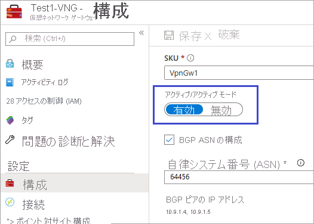
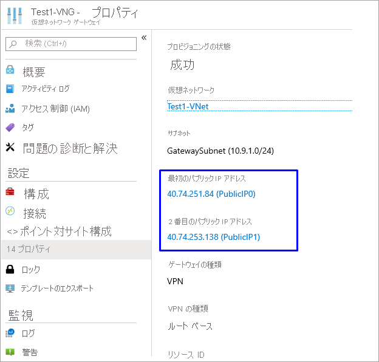
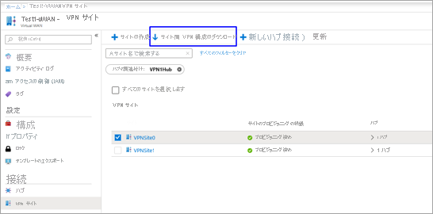
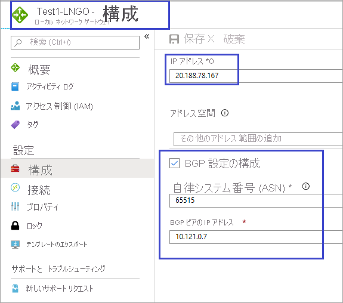
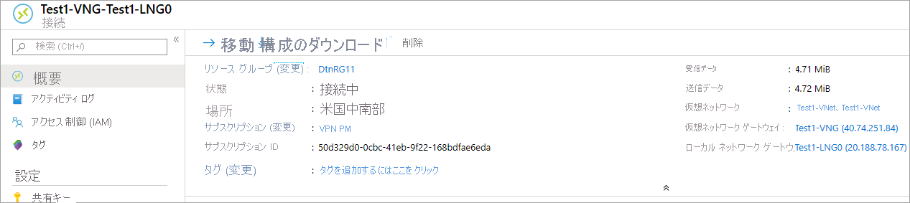

# VPN Gateway (仮想ネットワーク ゲートウェイ) を Virtual WAN に接続する

この記事は、Azure VPN Gateway (仮想ネットワーク ゲートウェイ) から Azure Virtual WAN (VPN ゲートウェイ) への接続を設定する作業を支援するものです。 VPN Gateway (仮想ネットワーク ゲートウェイ) から Virtual WAN (VPN ゲートウェイ) への接続を作成する方法は、ブランチの VPN サイトから仮想 WAN への接続を設定する方法によく似ています。

この記事では、2 つの機能を混同するリスクを最小限に抑えるために、ゲートウェイ名の前に機能の名称を付けて表記します。 たとえば、VPN Gateway 仮想ネットワーク ゲートウェイ、Virtual WAN VPN ゲートウェイのようになります。

## 開始する前に

開始する前に、次のリソースを作成します。

Azure Virtual WAN

* [仮想 WAN を作成します](virtual-wan-site-to-site-portal.md#openvwan)。
* [ハブを作成します](virtual-wan-site-to-site-portal.md#hub)。 この仮想ハブには、Virtual WAN VPN ゲートウェイが含まれます。

Azure Virtual Network

* 仮想ネットワーク ゲートウェイのない仮想ネットワークを作成します。 オンプレミス ネットワークのどのサブネットも接続先の仮想ネットワークと重複していないことを確認してください。 Azure portal で仮想ネットワークを作成するには、[クイックスタート](../virtual-network/quick-create-portal.md)を参照してください。

## 1.Azure 仮想ネットワーク ゲートウェイを作成する

仮想ネットワークのために、アクティブ/アクティブ モードで仮想ネットワークの VPN Gateway 仮想ネットワーク ゲートウェイを作成します。 ゲートウェイを作成する際には、2 つのゲートウェイ インスタンスについて既存のパブリック IP アドレスを使用するか、新しいパブリック IP を作成するかを選ぶことができます。 これらのパブリック IP は、Virtual WAN サイトを設定するときに使用します。 アクティブ/アクティブ モードに関する詳細については、[アクティブ/アクティブ接続の構成](../vpn-gateway/vpn-gateway-activeactive-rm-powershell.md#aagateway)に関するページを参照してください。

### アクティブ/アクティブ モードの設定

### BGP の設定

BGP の ASN を 65515 にすることはできません。 66515 は、Azure Virtual WAN が使用します。

### パブリック IP アドレス

ゲートウェイを作成する際には、 **[プロパティ]** ページに移動します。 プロパティと構成の設定は、次の例のようになります。 ゲートウェイに使用しているパブリック IP アドレスが 2 つあることに注目してください。

## 2.Virtual WAN VPN サイトを作成する

Virtual WAN VPN サイトを作成するには、仮想 WAN に移動し、 **[接続]** の下にある **[VPN サイト]** を選択します。 このセクションでは、前のセクションで作成した仮想ネットワーク ゲートウェイに対応する Virtual WAN VPN サイトを 2 つ作成します。

1. **[+ サイトの作成]** を選択します。
2. **[VPN サイトを作成する]** ページで、次の値を入力します。

   * **[リージョン]** - (Azure VPN Gateway 仮想ネットワーク ゲートウェイと同じリージョン)
   * **[デバイス ベンダー]** - デバイスの製造元 (任意の名前) を入力します
   * **[プライベート アドレス空間]** - (値を入力します。BGP が有効になっている場合には空欄にしてください)
   * **[Border Gateway Protocol]** - (Azure VPN Gateway 仮想ネットワーク ゲートウェイで BGP を有効にしている場合には **[有効にする]** に設定します)
   * **[Connect to Hubs]\(ハブに接続する\)** (ドロップダウンから、前提条件のところで作成したハブを選択します)
3. **[リンク]** で、次の値を入力します。

   * **[プロバイダー名]** - リンク名とプロバイダー名 (任意の名前) を入力します
   * **[速度]** - 速度 (任意の数字)
   * **[IP アドレス]** - IP アドレスを入力します ( これは、(VPN Gateway) 仮想ネットワーク ゲートウェイのプロパティに表示されている 1 つ目のパブリック IP アドレスと同じ値です)
   * **[BGP アドレス]** と **[ASN]** - BGP アドレスと ASN です。 それぞれ、[手順 1](#vnetgw) で構成した VPN Gateway 仮想ネットワーク ゲートウェイの BGP ピア IP アドレスおよび ASN の値と同じにする必要があります (BGP ピア IP アドレスについては、いずれか 1 つを選択してください)。
4. 見直しを終えたら **[確認]** を選択してサイトを作成します。
5. ここまでの手順をもう一度繰り返して、VPN Gateway 仮想ネットワーク ゲートウェイの 2 つ目のインスタンスに対応するサイトを作成します。 使用する設定は同じですが、パブリック IP アドレスと BGP ピア IP アドレスについては、VPN Gateway の構成にあるもののうち、先ほどと異なる方を使用してください。
6. これで 2 つのサイトのプロビジョニングが終わったので、次の構成ファイルをダウンロードするセクションに進みます。

## 3.VPN 構成ファイルをダウンロードする

このセクションでは、1 つ前のセクションで作成したサイトのそれぞれで使用する VPN 構成ファイルをダウンロードします。

1. Virtual WAN の **[VPN サイト]** ページの上部で、 **[サイト]** 、 **[Download Site-to-site VPN configuration]\(サイト間 VPN 構成をダウンロードする\)** の順に選択します。 Azure により、設定情報を格納した構成ファイルが作成されます。

   
2. 構成ファイルをダウンロードし、開きます。
3. 2 つ目のサイトについても、ここまでの手順を繰り返します。 両方の構成ファイルを開いたら、次のセクションに進みます。

## 4.ローカル ネットワーク ゲートウェイを作成する

このセクションでは、Azure VPN Gateway ローカル ネットワーク ゲートウェイを 2 つ作成します。 前の手順で入手した構成ファイルには、ゲートウェイの構成に関する設定が格納されています。 その設定を使用し、Azure VPN Gateway ローカル ネットワーク ゲートウェイを作成および構成していきます。

1. 上に挙げた設定を使用してローカル ネットワーク ゲートウェイを作成します。 VPN Gateway ローカル ネットワーク ゲートウェイの作成方法の詳細については、VPN Gateway に関する記事の[ローカル ネットワーク ゲートウェイの作成](../vpn-gateway/vpn-gateway-howto-site-to-site-resource-manager-portal.md#LocalNetworkGateway)に関するセクションを参照してください。

   * **[IP アドレス]** - 構成ファイルの *gatewayconfiguration* にある Instance0 の IP アドレスを使用します。
   * **[BGP]** - 接続に BGP を使用する場合は、 **[BGP 設定の構成]** をオンにして ASN "65515" を入力します。 IP アドレスは BGP ピアのものを入力します。 構成ファイルの *gatewayconfiguration* にある "Instance0 BgpPeeringAddresses" を使用してください。
   * **[サブスクリプション]、[リソース グループ]、[場所]** については、Virtual WAN ハブと同じです。
2. 見直しを終えたら、ローカル ネットワーク ゲートウェイを作成します。 作成したローカル ネットワーク ゲートウェイは、次の例のようになります。

   
3. ここまでの手順を繰り返して、ローカル ネットワーク ゲートウェイをもう 1 つ作成します。ただし、今度は構成ファイルの "Instance0" の値ではなく "Instance1" の値を使用します。

   

## 5.接続を作成する

このセクションでは、VPN Gateway ローカル ネットワーク ゲートウェイと仮想ネットワーク ゲートウェイの間の接続を作成します。 VPN Gateway の接続を作成する手順については、[接続の構成](../vpn-gateway/vpn-gateway-howto-site-to-site-resource-manager-portal.md#CreateConnection)に関するページを参照してください。

1. ポータルで仮想ネットワーク ゲートウェイに移動し、 **[接続]** をクリックします。 [接続] ページの上部にある **[+追加]** をクリックして **[接続の追加]** ページを開きます。
2. **[接続の追加]** ページで、接続に関する次の値を構成します。

   * **[名前]:** 接続に名前を付けます。
   * **[接続の種類]** : **[サイト対サイト (IPsec)]** を選択します。
   * **[仮想ネットワーク ゲートウェイ]** :このゲートウェイから接続するため、この値は固定されています。
   * **[ローカル ネットワーク ゲートウェイ]:** この接続では、仮想ネットワーク ゲートウェイをローカル ネットワーク ゲートウェイに接続します。 前に作成したローカル ネットワーク ゲートウェイのいずれか 1 つを選択してください。
   * **共有キー:** 共有キーを入力します。
   * **[IKE プロトコル]:** IKE プロトコルを選択します。
   * **[BGP]:** 接続が BGP 経由の場合には、 **[BGP を有効にする]** を選択します。
3. **[OK]** をクリックして、接続を作成します。
4. 仮想ネットワーク ゲートウェイの **[接続]** ページで接続を確認できます。

   
5. 上記の手順をもう一度繰り返して、2 つ目の接続を作成します。 2 つ目の接続については、作成したローカル ネットワーク ゲートウェイのうち、先ほど選択しなかった方を選択します。

## 6.テスト接続

仮想マシンを 2 台 (1 台は VPN Gateway 仮想ネットワーク ゲートウェイ側に、もう 1 台は Virtual WAN 用の仮想ネットワークに) 作成したうえで、両方の仮想マシンに対して ping を実行すると、接続をテストすることができます。

1. Azure VPN Gateway (Test1-VNG) 用の仮想ネットワーク (Test1-VNet) 内に、仮想マシンを 1 台作成します。 GatewaySubnet には仮想マシンを作成しないでください。
2. 仮想 WAN に接続するための別個の仮想ネットワークを作成します。 この仮想ネットワークのサブネットに、仮想マシンを 1 台作成します。 この仮想ネットワークに仮想ネットワーク ゲートウェイを含めることはできません。 [サイト間接続](virtual-wan-site-to-site-portal.md#vnet)に関する記事に掲載している PowerShell を使った手順を使うと、仮想ネットワークをすばやく作成できます。 値は必ず、コマンドレットを実行する前に変更しておくようにしてください。
3. VNet を Virtual WAN ハブに接続します。 仮想 WAN のページで **[仮想ネットワーク接続]** 、 **[+ 接続の追加]** の順に選択します。 **[接続の追加]** ページで、次のフィールドに入力します。

    * **[接続名]** - 接続に名前を付けます。
    * **[ハブ]** - この接続に関連付けるハブを選択します。
    * **[サブスクリプション]** - サブスクリプションを確認します。
    * **[仮想ネットワーク]** - このハブに接続する仮想ネットワークを選択します。 仮想ネットワークに既存の仮想ネットワーク ゲートウェイを設定することはできません。
4. **[OK]** をクリックして、仮想ネットワーク接続を作成します。
5. VM の間に接続が設定されます。 ファイアウォールのような通信をブロックするポリシーがない限り、一方の VM からもう一方の VM に対して ping を実行できるはずです。

## 次のステップ

カスタム IPsec ポリシーを構成する手順については、[Virtual WAN 用のカスタム IPsec ポリシーの構成](virtual-wan-custom-ipsec-portal.md)に関するページを参照してください。
仮想 WAN の詳細については、「[About Azure Virtual WAN](virtual-wan-about.md)」(Azure Virtual WAN について) および「[Azure Virtual WAN FAQ](virtual-wan-faq.md)」(Azure Virtual WAN のよくあるご質問) を参照してください。