# Azure Virtual WAN に移行する

Azure Virtual WAN を使用する企業は、Microsoft の世界的なネットワークの規模を活用して、自社のグローバルな接続を簡素化できます。 この記事には、お客様が管理する既存のハブアンドスポーク トポロジから、Microsoft が管理する仮想 WAN ハブを活用した設計へ、移行を希望する企業向けの技術情報を記載しています。

クラウド中心の最新のエンタープライズ グローバル ネットワークを採用している企業が Azure Virtual WAN で得ることができるメリットについては、「[グローバル トランジット ネットワーク アーキテクチャと Virtual WAN](virtual-wan-global-transit-network-architecture.md)」を参照してください。

**図 1:Azure Virtual WAN**

Azure 仮想データセンター (VDC) のハブアンドスポーク接続モデルは、Azure ネットワークの既定の推移的なルーティング動作を利用して、シンプルでスケーラブルなクラウド ネットワークを構築するために、数千の顧客によって採用されています。 Azure Virtual WAN はこれらの概念に基づいて構築されており、グローバルな接続が可能なトポロジが新機能として導入されています。これでは、オンプレミスの場所と Azure の間だけでなく、Microsoft ネットワークの規模を活用して、お客様の既存のグローバル ネットワークを拡張することが可能です。

この記事では、既存のハイブリッド環境を Virtual WAN に移行する方法について説明します。

## シナリオ

Contoso は、ヨーロッパとアジアの両方にオフィスを持つグローバルな金融機関です。 同社は既存のアプリケーションをオンプレミスのデータ センターから Azure に移行する予定であり、リージョン別にお客様が管理しているハイブリッド接続用のハブ仮想ネットワークなど、VDC アーキテクチャに基づく基礎設計を構築しています。 クラウドベース テクノロジへの移行の一環として、ネットワーク チームは、今後のビジネスの前進に対し接続が最適化されていることを確認する必要があります。

次の図は、複数の Azure リージョンへの接続を含む、既存のグローバル ネットワークの概要を示しています。

**図:Contoso の既存のネットワーク トポロジ**

既存のネットワーク トポロジからは、次のことを理解できます。

- ハブアンドスポーク トポロジは、共通のプライベート WAN に接続するために、ExpressRoute Premium 回線を含む複数のリージョンで使用されています。

- これらのサイトの中には、Microsoft クラウド内でホストされているアプリケーションに接続するために、VPN トンネルが Azure に直接接続されているものもある。

## 必要条件

ネットワーク チームは、Contoso のクラウドへの移行をサポート可能なグローバル ネットワーク モデルを提供する任務を負っており、コスト、スケール、およびパフォーマンスの分野で最適化する必要があります。 要約すると、次の要件を満たす必要があります。

- 本社 (HQ) とブランチ オフィスの両方に、クラウドでホストされているアプリケーションへの最適化されたパスを提供する。
- VPN の終了に伴い既存のオンプレミス データ センター (DC) に依存しないようにし、以下の接続パスを維持したままにする。
  - **ブランチから VNet へ**:VPN に接続されたオフィスは、ローカルの Azure リージョンのクラウドに移行されたアプリケーションにアクセスできる必要があります。
  - **ブランチからハブ、ハブからハブ、ハブから VNet へ**:VPN に接続されたオフィスは、リモートの Azure リージョンのクラウドに移行されたアプリケーションにアクセスできる必要があります。
  - **ブランチからブランチへ**:リージョンの VPN に接続されたオフィスは、互いに通信でき、ExpressRoute に接続された HQ/DC サイトと通信できる必要があります。
  - **ブランチからハブ、ハブからハブ、ハブからブランチへ**:グローバルに分離された VPN に接続されたオフィスは、互いに通信でき、ExpressRoute に接続されたあらゆる HQ/DC サイトと通信できる必要があります。
  - **ブランチからインターネットへ**:接続されているサイトは、インターネット通信が可能になっている必要があります。 このトラフィックは、フィルター処理されログが記述される必要があります。
  - **VNet から VNet へ**:同じリージョン内のスポーク仮想ネットワークが相互に通信できる必要があります。
  - **VNet からハブ、ハブからハブ、ハブから VNet へ**:異なるリージョン内のスポーク仮想ネットワークが相互に通信できる必要があります。
- Contoso のローミング ユーザー (ノート PC および電話のユーザー) が企業ネットワーク上にいないときに会社のリソースにアクセスできるようにします。

## Azure Virtual WAN アーキテクチャ

次の図は、前のセクションで詳しく説明した要件を満たす、Azure Virtual WAN を使用した更新されたターゲット トポロジの概要を示しています。

**図:Azure Virtual WAN のアーキテクチャ**

概要:

- ヨーロッパの HQ は ExpressRoute に接続されたままで、ヨーロッパのオンプレミスの DC は Azure に完全に移行し、今後は使用停止になります。
- アジアの DC と HQ は、プライベート WAN に接続されたままです。 ローカル通信事業者のネットワークを増強し、グローバル接続を提供するために、Azure Virtual WAN が使用されるようになりました。
- 西ヨーロッパと東南アジアの両方の Azure リージョンにデプロイされた Azure Virtual WAN ハブは、ExpressRoute 接続デバイスと VPN 接続デバイスの接続ハブとなります。
- ハブはさらに、グローバル メッシュ ネットワークへの OpenVPN 接続を使用する複数のクライアント タイプのローミング ユーザー向けの VPN 終端機能を提供します。これにより、Azure に移行されたアプリケーションだけでなく、オンプレミスに残るすべてのリソースにもアクセスできるようになります。
- Azure Virtual WAN によって提供される仮想ネットワーク内のリソース向けのインターネット接続。

リモート サイト向けのインターネット接続も Azure Virtual WAN によって提供されます。 Office 365 などの SaaS サービスへのアクセスを最適化するために、パートナー統合によってサポートされるローカル インターネット ブレークアウト。

## Virtual WAN に移行する

このセクションでは、Azure Virtual WAN に移行するためのさまざまな手順について説明します。

### 手順 1:VDC ハブアンドスポークの単一リージョン

アーキテクチャを確認する 次の図は、Azure Virtual WAN をロールアウトする前の Contoso の単一リージョン トポロジを示しています。

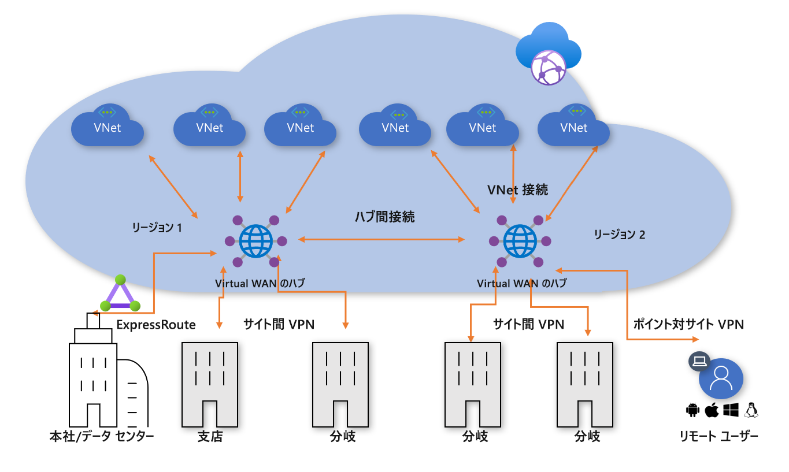
**図 1:VDC ハブアンドスポークの単一リージョン**

仮想データ センター (VDC) のアプローチに従い、顧客が管理するハブ仮想ネットワークにはいくつかの機能ブロックが含まれています。

- 共有サービス (複数のスポークで必要な共通の機能)。 例:Contoso が使用する、サービスとしてのインフラストラクチャ (IaaS) 仮想マシン上の Windows Server ドメイン コントローラー。
- サードパーティのネットワーク仮想アプライアンスによって IP/ルーティング ファイアウォール サービスが提供され、スポーク間のレイヤー 3 IP ルーティングを実現します。
- インターネット イングレス/エグレス サービス。これにはインバウンドの HTTP 要求のための Azure Application Gateway と、インターネット リソースへのフィルターされた発信アクセスのために仮想マシン上で実行されるサードパーティ プロキシ サービスが含まれます。
- オンプレミス ネットワークに接続するための ExpressRoute および VPN 仮想ネットワーク ゲートウェイ。

### 手順 2:仮想 WAN ハブをデプロイする

各リージョンに Virtual WAN ハブをデプロイします。 次の記事で説明するように、VPN Gateway と ExpressRoute ゲートウェイを使用して Virtual WAN ハブを設定します。

- [チュートリアル:Azure Virtual WAN を使用してサイト間接続を作成する](virtual-wan-site-to-site-portal.md)
- [チュートリアル:Azure Virtual WAN を使用して ExpressRoute の関連付けを作成する](virtual-wan-expressroute-portal.md)

> [!NOTE]
> Azure Virtual WAN では、この記事で説明されているトラフィック パスの一部を有効にするために Standard SKU が使用されている必要があります。

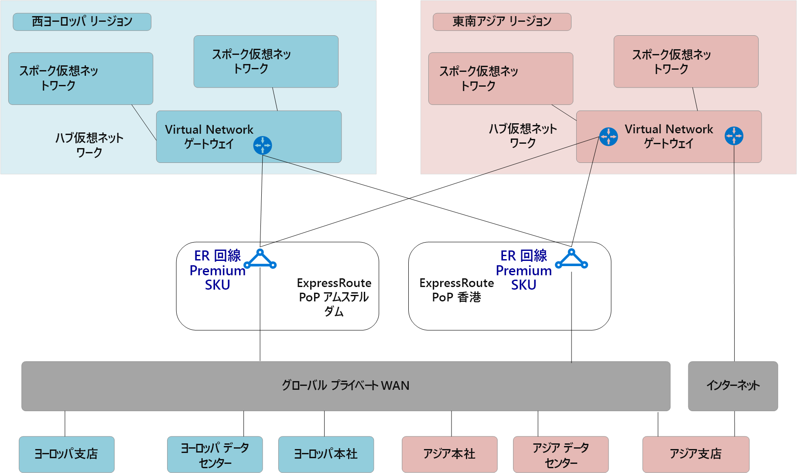
**図 2:VDC ハブアンドスポークから Virtual WAN への移行**

### 手順 3:リモート サイト (ExpressRoute と VPN) を Virtual WAN に接続する

Virtual WAN ハブを既存の ExpressRoute 回線に接続し、インターネット経由で任意のリモート ブランチにサイト間 VPN を設定します。

> [!NOTE]
> 仮想 WAN ハブに接続するには、Express Route 回線を Premium SKU タイプにアップグレードする必要があります。

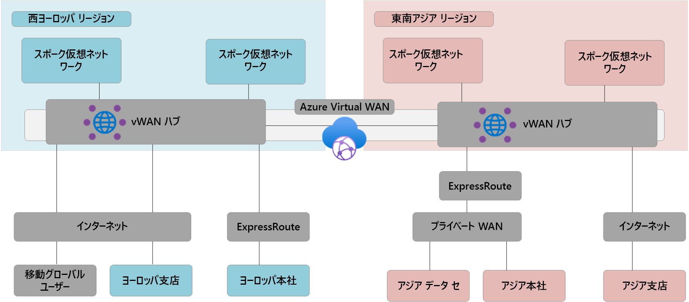
**図 3:VDC ハブアンドスポークから Virtual WAN への移行**

この時点で、オンプレミスのネットワーク機器は、Virtual WAN で管理されているハブ VNet に割り当てられた IP アドレス空間を反映したルートの受信を開始します。 この段階で、VPN 接続されたリモート ブランチは、スポーク仮想ネットワーク内の既存のアプリケーションへの 2 つのパスを認識します。 これらのデバイスは、移行フェーズ中に対称ルーティングを確保するように、引き続き VDC ハブへのトンネルを使用するように構成する必要があります。

### 手順 4:Virtual WAN を使用してハイブリッド接続をテストする

運用環境の接続にマネージド Virtual WAN ハブを利用する前に、テスト スポークの仮想ネットワークと Virtual WAN VNet 接続を設定することをお勧めします。 次の手順に進む前に、このテスト環境への接続が ExpressRoute とサイト間 VPN 経由で動作することを確認してください。

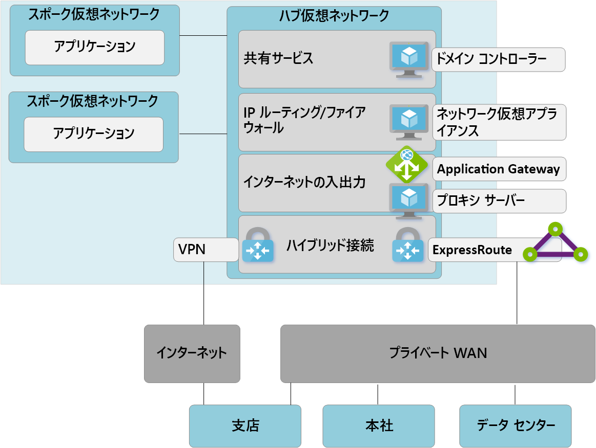
**図 4:VDC ハブアンドスポークから Virtual WAN への移行**

### 手順 5:仮想 WAN ハブへの接続を移行する

**図 5:VDC ハブアンドスポークから Virtual WAN への移行**

**a**。 スポーク仮想ネットワークから古い VDC ハブへの既存のピアリング接続を削除します。 スポーク仮想ネットワーク内のアプリケーションへのアクセスは、手順 a ~ c が完了するまで使用できません。

**b**. VNet 接続を使用して、スポーク仮想ネットワークを Virtual WAN ハブに接続します。

**c**. スポーク仮想ネットワーク内で以前に使用されていたスポーク間通信用のすべてのユーザー定義ルート (UDR) を削除します。 このパスは、Virtual WAN ハブ内で使用可能な動的ルーティングによって有効になりました。

**d**. VDC ハブの既存の ExpressRoute および VPN ゲートウェイは、次の手順 (e) を可能にするために使用停止になりました。

**e**. 新しい VNet 接続を使用して、古い VDC ハブ (ハブ仮想ネットワーク) を Virtual WAN ハブに接続します。

### 手順 6:古いハブが共有サービスのスポークになる

Azure ネットワークを再設計し、Virtual WAN ハブが新しいトポロジの中心点となるようにしました。

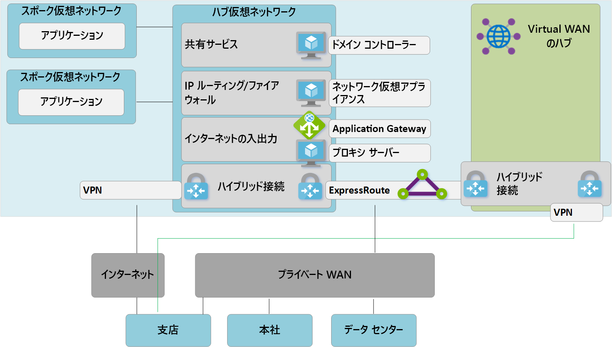
**図 6:VDC ハブアンドスポークから Virtual WAN への移行**

Virtual WAN ハブはマネージド エンティティであるため、仮想マシンなどのカスタム リソースのデプロイが許可されていません。そのため、共有サービス ブロックは、スポーク仮想ネットワークとして存在するようになり、Azure Application Gateway やネットワーク仮想化アプライアンスを経由したインターネット イングレスなどの機能をホストします。 共有サービス環境とバックエンド仮想マシン間のトラフィックは、Virtual WAN で管理されるハブを経由するようになりました。

### 手順 7:オンプレミスの接続を最適化して Virtual WAN を完全に活用する

この段階では、Contoso は Microsoft Cloud へのビジネス アプリケーションの移行をほぼ完了し、オンプレミスの DC 内にいくつかのレガシ アプリケーションだけが残っています。

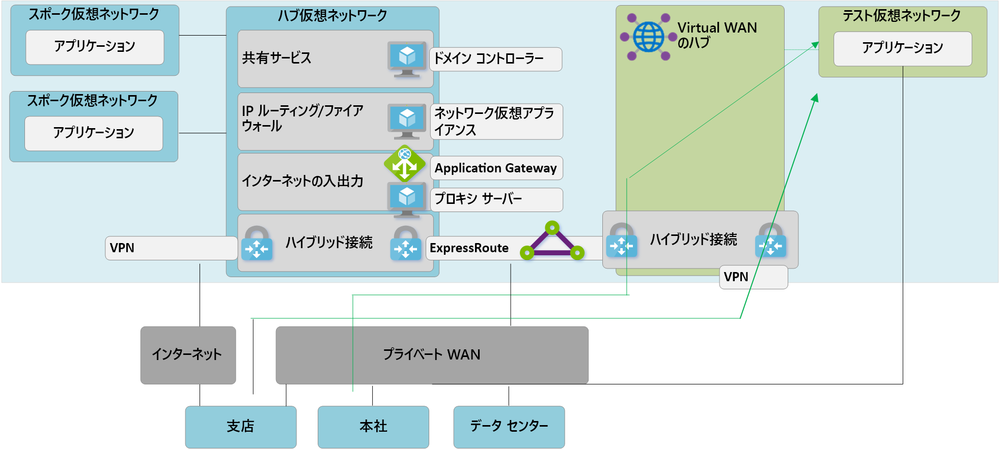
**図 7:VDC ハブアンドスポークから Virtual WAN への移行**

Contoso は、Azure Virtual WAN の機能を十分に活用するために、レガシのオンプレミス VPN 接続の使用を停止することを決定します。 HQ ネットワークまたは DC ネットワークにアクセスし続けるすべてのブランチは、Azure Virtual WAN の組み込みのトランジット ルーティングを使用して Microsoft グローバル ネットワークを経由することができます。

> [!NOTE]
> ExpressRoute Global Reach は、Microsoft のバックボーンを利用してお客様の既存のプライベート WAN を補完することを希望するお客様が選択できる別の方法です。

## 終了状態のアーキテクチャおよびトラフィック パス

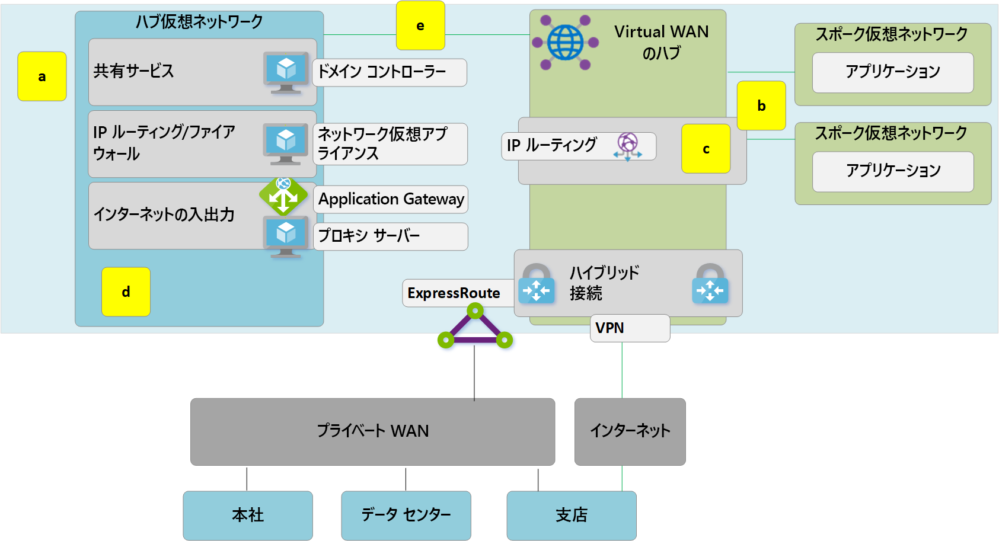
**図:2 つのリージョンの Virtual WAN**

このセクションでは、トラフィック フローの例をいくつか見ることで、このトポロジが元の要件をどのように満たすかを要約して説明します。

### パス 1

パス 1 は、アジアのサイト間 VPN 接続ブランチから、東南アジア リージョンの Azure VNet へのトラフィック フローです。

トラフィックは次のようにルーティングされます。

- アジア ブランチは、回復性のある S2S BGP 対応トンネルを介して、東南アジアの仮想 WAN ハブに接続されます。

- アジアの仮想 WAN ハブは、接続された VNet に対してトラフィックをローカルにルーティングします。

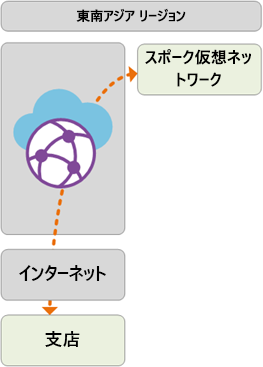

### パス 2

パス 2 は、ExpressRoute で接続されたヨーロッパ HQ から、東南アジア リージョンの Azure VNet へのトラフィック フローです。

トラフィックは次のようにルーティングされます。

- ヨーロッパの HQ は、Premium ExpressRoute 回線経由で西ヨーロッパの Virtual WAN ハブに接続されます。

- Virtual WAN のハブからハブへのグローバル接続により、リモート リージョンで接続されている VNet へのトラフィックの転送が可能になります。

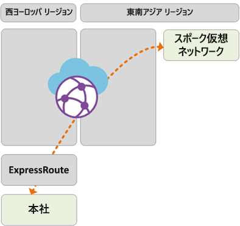

### パス 3

パス 3 は、プライベート WAN に接続されたアジアのオンプレミス DC からヨーロッパのサイト間接続されたブランチへのトラフィック フローです。

トラフィックは次のようにルーティングされます。

- アジア DC はローカル プライベート WAN の通信事業者に接続されています。

- プライベート WAN でローカルに終了する ExpressRoute 回線は、東南アジアの Virtual WAN ハブに接続します。

- Virtual WAN のハブからハブへのグローバル接続により、トラフィックの転送が可能になります。

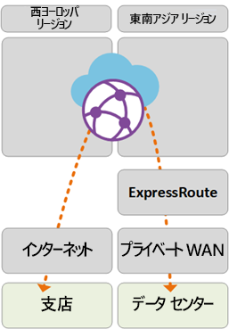

### パス 4

パス 4 は、東南アジア リージョンの Azure VNet から、西ヨーロッパ リージョンの Azure VNet へのトラフィック フローです。

トラフィックは次のようにルーティングされます。

- Virtual WAN のハブからハブへのグローバル接続により、ユーザーが追加構成することなく、接続されているすべての Azure VNet のネイティブ転送が可能になります。

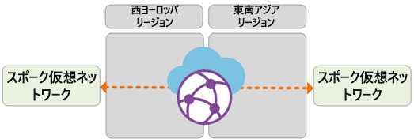

### パス 5

パス 5 は、ローミング VPN (P2S) ユーザーから西ヨーロッパ リージョンの Azure VNet へのトラフィック フローです。

トラフィックは次のようにルーティングされます。

- ノート PC およびモバイル デバイスのユーザーは、OpenVPN クライアントを使用して、西ヨーロッパの P2S VPN ゲートウェイに透過的に接続します。

- 西ヨーロッパの仮想 WAN ハブは、接続された VNet に対してトラフィックをローカルにルーティングします。

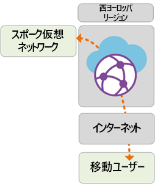

## Azure Firewall によるセキュリティとポリシーの制御

Contoso は、この記事で説明済みの要件に従って、すべてのブランチと VNet の間の接続を検証しました。 セキュリティ制御とネットワーク分離の要件を満たすには、ハブ ネットワークを介して引き続きトラフィックを分離し、ログに記録する必要があります。 この機能は、以前はネットワーク仮想アプライアンス (NVA) によって実行されていました。 また、Contoso は、既存のプロキシ サービスを使用停止にし、発信インターネット フィルター処理にネイティブ Azure サービスを使用したいと考えています。

**図:Virtual WAN での Azure Firewall (セキュリティ保護付き仮想ハブ)**

次の大まかな手順は、Azure Firewall を Virtual WAN ハブに導入し、ポリシー制御の統合ポイントを有効にするために必要です。 この手順およびセキュリティ保護付き仮想ハブの概要については、[Azure Firewall Manager](../firewall-manager/index.yml) に関する記事を参照してください。

1. Azure Firewall ポリシーを作成する。
2. ファイアウォール ポリシーを Azure Virtual WAN ハブとリンクする。 この手順では、既存の Virtual WAN ハブをセキュリティ保護付き仮想ハブとして機能させることができ、必要な Azure Firewall リソースをデプロイします。

> [!NOTE]
> Azure Firewall が標準の Virtual WAN ハブにデプロイされている場合 (SKU:Standard):V2V、B2V、V2I、B2I の FW ポリシーは、Azure FW がデプロイされている特定のハブ (セキュリティ保護付きハブ) に接続されている VNet およびブランチから送信されたトラフィックにのみ適用されます。 同じ Virtual WAN 内の他の Virtual WAN ハブに接続されているリモートの VNet およびブランチから送信されるトラフィックは、これらのリモート ブランチおよび VNet が Virtual WAN のハブ間リンクを介して相互接続されていても、ファイアウォールの対象になりません。 ハブ間のファイアウォールのサポートは、Azure Virtual WAN と Firewall Manager のロードマップにあります。

次のパスは、Azure のセキュリティ保護付き仮想ハブを利用して有効になっている接続パスです。

### パス 6

パス 6 は、同じリージョン内の VNet 間のセキュリティで保護されたトラフィック フローです。

トラフィックは次のようにルーティングされます。

- 同じセキュリティ保護付き仮想ハブに接続されている仮想ネットワークは、Azure Firewall 経由でトラフィックをルーティングするようになりました。

- Azure Firewall はポリシーをこれらのフローに適用できます。

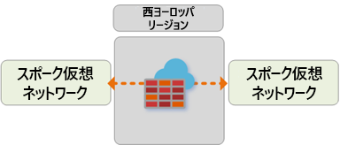

### パス 7

パス 7 は、Azure VNet からインターネットまたはサードパーティのセキュリティ サービスへのトラフィック フローです。

トラフィックは次のようにルーティングされます。

- セキュリティで保護された仮想ハブに接続されている仮想ネットワークは、インターネット アクセスの中央点としてセキュリティで保護されたハブを使用して、インターネット上のパブリックな宛先にトラフィックを送信できます。

- このトラフィックは、Azure Firewall の FQDN 規則を使用してローカルでフィルター処理するか、または検査のためにサードパーティのセキュリティ サービスに送信することができます。

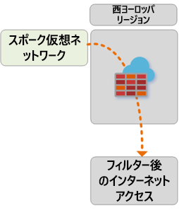

### パス 8

パス 8 は、ブランチとインターネットの間、またはサードパーティのセキュリティ サービスからのトラフィック フローです。

トラフィックは次のようにルーティングされます。

- セキュリティ保護付き仮想ハブに接続されているブランチは、インターネット アクセスの中央点としてセキュリティ保護付きハブを使用して、インターネット上のパブリックな宛先にトラフィックを送信できます。

- このトラフィックは、Azure Firewall の FQDN 規則を使用してローカルでフィルター処理するか、または検査のためにサードパーティのセキュリティ サービスに送信することができます。

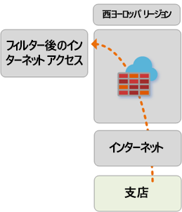 

## 次のステップ

[Azure Virtual WAN](virtual-wan-about.md) の詳細を理解する
