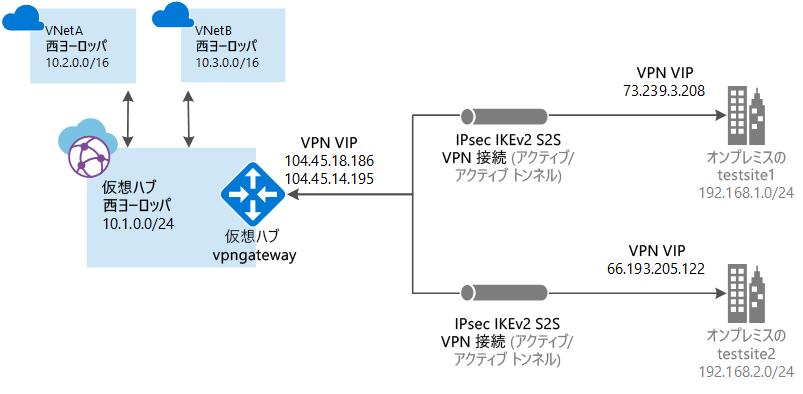

# Azure Virtual WAN とは (プレビュー)

Azure Virtual WAN は、Azure を介して支店間接続を最適化し、自動化するネットワーク サービスです。 Virtual WAN を使用すると、ブランチ デバイスを接続および構成して Azure と通信できます。 これは、手動で行うことも、Virtual WAN パートナーを介して推奨プロバイダー デバイスを使用して行うこともできます。 推奨プロバイダー デバイスを使用すると、使いやすさ、接続の簡素化、および構成管理を実現できます。 Azure WAN の組み込みダッシュボードにはすぐに使用できるトラブルシューティング用分析情報が用意されているため、時間を節約でき、大規模なサイト間接続を簡単に表示することができます。

> [!IMPORTANT]
> Azure Virtual WAN は、現在、マネージド パブリック プレビュー段階です。 Virtual WAN を使用するには、[プレビューに登録する](#enroll)必要があります。
>
> このパブリック プレビュー版はサービス レベル アグリーメントなしで提供されています。運用環境のワークロードに使用することは避けてください。 特定の機能はサポート対象ではなく、機能が制限されることがあるか、Azure の場所によっては利用できない場合があります。 詳しくは、「[Microsoft Azure プレビューの追加使用条件](https://azure.microsoft.com/support/legal/preview-supplemental-terms/)」をご覧ください。

この記事では、Azure と Azure 以外のワークロードのネットワーク接続を簡単に説明します。 Virtual WAN には次の利点があります。

* **ハブとスポーク型の統合された接続ソリューション:** オンプレミスのサイトと Azure ハブとの間のサイト間の構成と接続を、Virtual WAN パートナー ソリューションを含むさまざまなソースから自動化します。
* **スポークの設定と構成の自動化:** 仮想ネットワークとワークロードを Azure ハブにシームレスに接続します。
* **直感的なトラブルシューティング:** Azure 内でエンドツーエンドのフローを確認し、この情報を使用して必要なアクションを実行します。

## Virtual WAN パートナーとの連携

1. ブランチ デバイス (VPN/SDWAN) コントローラーが、Azure サービス プリンシパルを使用してサイト中心の情報を Azure にエクスポートするために認証を受けます。
2. ブランチ デバイス (VPN/SDWAN) コントローラーが、Azure 接続構成を取得し、ローカル デバイスを更新します。 これにより、オンプレミス VPN デバイスの構成のダウンロード、編集、および更新が自動化されます。
3. デバイスに適切な Azure 構成が設定されると、Azure WAN に対してサイト間接続 (2 つのアクティブなトンネル) が確立されます。 Azure で IKEv2 をサポートするには、ブランチ (VPN/SDWAN) コントローラーが必要です。 BGP はオプションです。

## Virtual WAN リソース

エンドツーエンドの仮想 WAN を構成するには、次のリソースを作成します。

* **virtualWAN:** virtualWAN リソースは、Azure ネットワークの仮想オーバーレイを表し、複数のリソースのコレクションです。 これには、仮想 WAN 内に配置するすべての仮想ハブへのリンクが含まれます。 Virtual WAN リソースは相互に分離されており、共通のハブを含むことはできません。 Virtual WAN 上の仮想ハブは互いに通信しません。

* **サイト:** vpnsite と呼ばれるサイト リソースは、オンプレミスの VPN デバイスとその設定を表します。 Virtual WAN パートナーと連携することで、この情報を Azure に自動的にエクスポートする組み込みのソリューションが得られます。

* **ハブ:** 仮想ハブは、Microsoft が管理する仮想ネットワークです。 ハブには、オンプレミス ネットワーク (vpnsite) からの接続を可能にするさまざまなサービス エンドポイントが含まれています。 ハブは、リージョン内のネットワークのコアです。 1 つの Azure リージョンに配置できるハブは 1 つのみです。 Azure portal を使用してハブを作成すると、仮想ハブ VNet と仮想ハブ vpngateway が自動的に作成されます。

  ハブ ゲートウェイは、ExpressRoute および VPN Gateway に使用する仮想ネットワーク ゲートウェイと同じではありません。 たとえば、Virtual WAN を使用する場合は、オンプレミス サイトから直接 VNet にサイト間接続を作成しません。 代わりに、ハブへのサイト間接続を作成します。 トラフィックは、常にハブ ゲートウェイを通過します。 これは、VNet には独自の仮想ネットワーク ゲートウェイが必要ないことを意味します。 Virtual WAN により、VNet は、仮想ハブと仮想ハブ ゲートウェイを介して簡単にスケーリングできます。 

* **ハブ仮想ネットワーク接続:** ハブ仮想ネットワーク接続リソースは、ハブを仮想ネットワークにシームレスに接続するために使用します。 現時点では、同じハブ リージョン内にある仮想ネットワークにのみ接続できます。

##プレビューに登録する

Virtual WAN を構成する前に、まずプレビューにサブスクリプションを登録する必要があります。 これを行わないと、ポータルで Virtual WAN を使用できません。 登録するには、サブスクリプション ID を明記して、<azurevirtualwan@microsoft.com> にメールを送信します。 サブスクリプションが登録されると、メールが届きます。

## FAQ

[!INCLUDE [Virtual WAN FAQ](../../includes/virtual-wan-faq-include.md)]

## プレビューのフィードバック

お客様からのフィードバックをお待ちしています。 Virtual WAN に関する問題を報告したり (肯定的、否定的を問わず) フィードバックを送信するには、<azurevirtualwan@microsoft.com> までメールをお送りください。 件名の “[ ]” には、お客様の会社名を入力してください。 また、問題を報告する場合は、サブスクリプション ID も入力してください。

## 次の手順

Virtual WAN を使用してサイト間接続を作成するには、[Virtual WAN パートナー](https://aka.ms/virtualwan)を利用するか、手動で接続を作成します。 手動で接続を作成するには、[Virtual WAN を使用したサイト間接続の作成](virtual-wan-site-to-site-portal.md)に関するページを参照してください。
