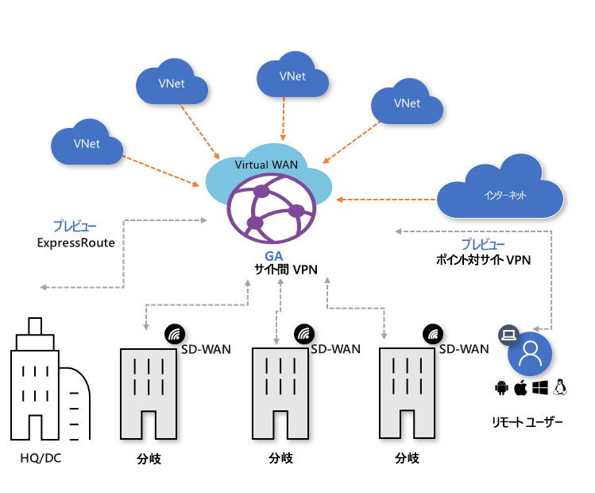

# Azure Virtual WAN とは

Azure Virtual WAN は、Azure への、または Azure 経由での、最適化および自動化されたブランチ接続を提供するネットワーク サービスです。 Azure リージョンは、ブランチの接続先として選択できるハブとして機能します。 Azure バックボーンを利用してブランチを接続し、ブランチから VNet への接続を利用することもできます。 Azure Virtual WAN VPN による接続の自動化をサポートするパートナーの一覧があります。 詳細については、[Virtual WAN のパートナーと場所](virtual-wan-locations-partners.md)に関する記事を参照してください。

Azure Virtual WAN は、サイト間 VPN、ExpressRoute、ポイント対サイト ユーザー VPN など、多数の Azure クラウド接続サービスを 1 つの操作インターフェイスにまとめたものです。 Azure VNet への接続は、仮想ネットワーク接続を使用して確立されます。

ExpressRoute および Virtual WAN 向けポイント対サイト ユーザー VPN は現在プレビューの段階です。

この記事では、Azure Virtual WAN のネットワーク接続について簡単に説明します。 Virtual WAN には次の利点があります。

* **ハブ アンド スポーク型の統合された接続ソリューション:** オンプレミス サイトと Azure ハブの間のサイト間の構成と接続を自動化します。
* **自動化されたスポークの設定と構成:** 仮想ネットワークとワークロードを Azure ハブにシームレスに接続します。
* **直感的なトラブルシューティング:** Azure 内でエンド ツー エンドのフローを確認し、この情報を使用して必要なアクションを実行できます。

## Virtual WAN リソース

エンド ツー エンドの Virtual WAN を構成するには、次のリソースを作成します。

* **virtualWAN:** virtualWAN リソースは、Azure ネットワークの仮想オーバーレイを表し、複数のリソースのコレクションです。 これには、仮想 WAN 内に配置するすべての仮想ハブへのリンクが含まれます。 Virtual WAN リソースは相互に分離されており、共通のハブを含むことはできません。 Virtual WAN 上の仮想ハブは互いに通信しません。 "ブランチ間のトラフィックを許可する" プロパティにより、VPN サイト間と VPN 対 ExpressRoute (現在プレビュー段階) 対応サイト間のトラフィックが有効になります。

* **ハブ:** 仮想ハブは、Microsoft のマネージド仮想ネットワークです。 ハブには、オンプレミス ネットワーク (vpnsite) からの接続を可能にするさまざまなサービス エンドポイントが含まれています。 ハブは、リージョン内のネットワークのコアです。 1 つの Azure リージョンに配置できるハブは 1 つのみです。 Azure portal を使用してハブを作成すると、仮想ハブ VNet と仮想ハブ vpngateway が作成されます。

  ハブ ゲートウェイは、ExpressRoute および VPN Gateway に使用する仮想ネットワーク ゲートウェイと同じではありません。 たとえば、Virtual WAN を使用する場合は、オンプレミス サイトから直接 VNet にサイト間接続を作成しません。 代わりに、ハブへのサイト間接続を作成します。 トラフィックは、常にハブ ゲートウェイを通過します。 これは、VNet には独自の仮想ネットワーク ゲートウェイが必要ないことを意味します。 Virtual WAN により、VNet は、仮想ハブと仮想ハブ ゲートウェイを介して簡単にスケーリングできます。

* **ハブ仮想ネットワーク接続:** ハブ仮想ネットワーク接続リソースは、ハブを仮想ネットワークにシームレスに接続するために使用します。 現時点では、同じハブ リージョン内にある仮想ネットワークにのみ接続できます。

* **ハブのルート テーブル:** 仮想ハブのルートを作成して、そのルートを仮想ハブのルート テーブルに適用することができます。 仮想ハブのルート テーブルには、複数のルートを適用できます。

**追加の Virtual WAN リソース**

  * **サイト:** このリソースは、サイト間接続にのみ使用されます。 サイト リソースは **vpnsite** です。 これは、オンプレミスの VPN デバイスとその設定を表します。 Virtual WAN パートナーと連携することで、この情報を Azure に自動的にエクスポートする組み込みのソリューションが得られます。

## 接続

Virtual WAN では、サイト間、ポイント対サイト (プレビュー)、および ExpressRoute (プレビュー) という 3 種類の接続が可能です。

### サイト間 VPN 接続

Virtual WAN サイト間接続を作成するときに、利用可能なパートナーと連携できます。 パートナーを利用しない場合は、手動で接続を構成できます。 詳細については、[Virtual WAN を使用したサイト間接続の作成](virtual-wan-site-to-site-portal.md)に関するページを参照してください。

#### Virtual WAN パートナーのワークフロー

Virtual WAN パートナーと連携する場合のワークフローは、次のとおりです。

1. ブランチ デバイス (VPN/SDWAN) コントローラーが、[Azure サービス プリンシパル](../active-directory/develop/howto-create-service-principal-portal.md)を使用してサイト中心の情報を Azure にエクスポートするために認証を受けます。
2. ブランチ デバイス (VPN/SDWAN) コントローラーが、Azure 接続構成を取得し、ローカル デバイスを更新します。 これにより、オンプレミス VPN デバイスの構成のダウンロード、編集、および更新が自動化されます。
3. デバイスに適切な Azure 構成が設定されると、Azure WAN に対してサイト間接続 (2 つのアクティブなトンネル) が確立されます。 Azure では、IKEv1 と IKEv2 の両方がサポートされています。 BGP はオプションです。

#### サイト間 Virtual WAN 接続のパートナー

利用可能なパートナーと場所の一覧については、[Virtual WAN のパートナーと場所](virtual-wan-locations-partners.md)に関する記事を参照してください。

### ポイント対サイト VPN 接続 (プレビュー)

ポイント対サイト (P2S) 接続では、個々のクライアント コンピューターから仮想ハブへの、セキュリティで保護された接続を作成することができます。 P2S 接続は、クライアント コンピューターから接続を開始することによって確立されます。 このソリューションは、在宅勤務の人間が自宅や会議室など、リモートの場所から接続する場合に便利です。 P2S VPN は、接続する必要があるクライアントが数台のみの場合に、S2S VPN の代わりに使用するソリューションとしても便利です。

接続を作成するには、[Virtual WAN を使用したポイント対サイト接続の作成](virtual-wan-point-to-site-portal.md)に関するページを参照してください。

### ExpressRoute 接続 (プレビュー)

ExpressRoute を使用すると、プライベート接続を介してオンプレミス ネットワークを Azure に接続できます。 接続を作成するには、[Virtual WAN を使用した ExpressRoute 接続の作成](virtual-wan-expressroute-portal.md)に関するページを参照してください。

## 場所

場所の情報については、[Virtual WAN のパートナーと場所](virtual-wan-locations-partners.md)に関する記事を参照してください。

## FAQ

[!INCLUDE [Virtual WAN FAQ](../../includes/virtual-wan-faq-include.md)]

## 次の手順

[Virtual WAN を使用してサイト間接続を作成する](virtual-wan-site-to-site-portal.md)
