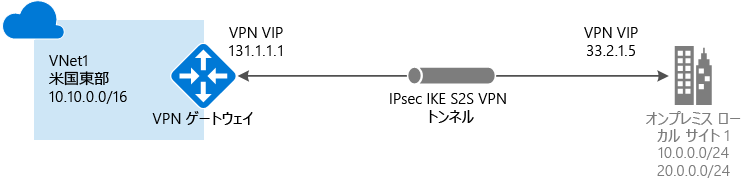
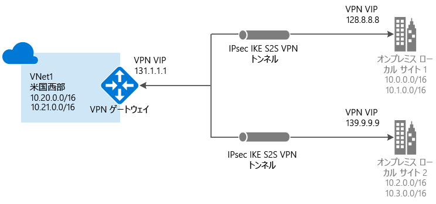
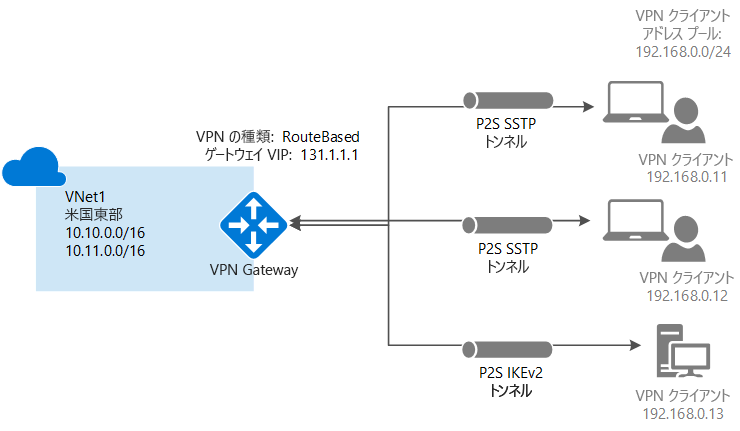
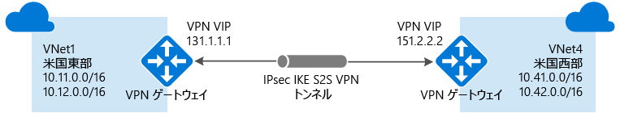
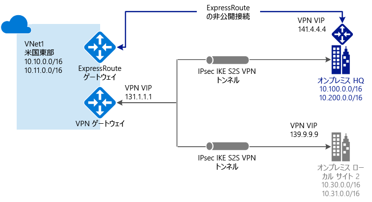

# VPN ゲートウェイとは

VPN ゲートウェイは、特定の種類の仮想ネットワーク ゲートウェイで、パブリック インターネットを介して Azure 仮想ネットワークとオンプレミスの場所の間で暗号化されたトラフィックを送信するために使用されます。 VPN ゲートウェイを使用すると、Microsoft ネットワークを経由して Azure 仮想ネットワーク間で暗号化されたトラフィックを送信することもできます。 各仮想ネットワークには VPN ゲートウェイを 1 つだけ作成できます。 ただし、同一の VPN ゲートウェイに対して複数の接続を作成することができます。 同一の VPN ゲートウェイへの複数の接続を作成する場合、利用できるゲートウェイ帯域幅はすべての VPN トンネルによって共有されます。

## 仮想ネットワーク ゲートウェイとは

仮想ネットワーク ゲートウェイは、作成する特定のサブネットにデプロイされる 2 台以上の仮想マシンで構成され、"*ゲートウェイ サブネット*" と呼ばれます。 ゲートウェイ サブネットに配置される VM は、仮想ネットワーク ゲートウェイの作成時に作成されます。 仮想ネットワーク ゲートウェイの VM は、ゲートウェイ固有のルーティング テーブルとゲートウェイ サービスを含むように構成されます。 仮想ネットワーク ゲートウェイの一部である VM を直接構成することはできません。また、ゲートウェイ サブネットに、その他のリソースをデプロイすべきではありません。

VPN ゲートウェイを Azure Availability Zones にデプロイすることはできません。 これにより、仮想ネットワーク ゲートウェイに回復性、スケーラビリティ、高可用性が提供されます。 Azure Availability Zones にゲートウェイをデプロイすると、オンプレミス ネットワークの Azure への接続をゾーン レベルの障害から保護しながら、ゲートウェイを 1 つのリージョン内に物理的かつ論理的に分離できます。 「[Azure Availability Zones でのゾーン冗長仮想ネットワーク ゲートウェイについて](about-zone-redundant-vnet-gateways.md)」を参照してください。

仮想ネットワーク ゲートウェイの作成は、完了するまでに最大で 45 分かかる場合があります。 仮想ネットワーク ゲートウェイを作成すると、ゲートウェイ VM はゲートウェイ サブネットにデプロイされ、指定した設定で構成されます。 構成する設定の 1 つは、ゲートウェイの種類です。 ゲートウェイの種類 "vpn" は、作成される仮想ネットワーク ゲートウェイの種類が VPN ゲートウェイであることを示します。 VPN ゲートウェイを作成した後、その VPN ゲートウェイと別の VPN ゲートウェイ間に IPsec/IKE VPN トンネル接続を作成するか (VNet 間)、VPN ゲートウェイとオンプレミスの VPN デバイス間にクロスプレミス IPsec/IKE VPN トンネル接続を作成できます (サイト間)。 また、ポイント対サイト VPN 接続 (OpenVPN、IKEv2、または SSTP 経由の VPN) を作成することもできます。これにより、会議や自宅などの遠隔地から仮想ネットワークに接続できます。

## VPN ゲートウェイの構成

VPN ゲートウェイ接続は、特定の設定で構成された複数のリソースに依存します。 ほとんどのリソースは個別に構成できますが、一部のリソースは特定の順序で構成する必要があります。

### 設定

リソースごとに選択した設定は、適切な接続を作成するうえで非常に重要です。 VPN Gateway の個々のリソースと設定については、「 [VPN Gateway の設定について](vpn-gateway-about-vpn-gateway-settings.md)」を参照してください。 この記事には、ゲートウェイの種類、ゲートウェイの SKU、VPN の種類、接続の種類、ゲートウェイ サブネット、ローカル ネットワーク ゲートウェイ、検討が必要なその他のさまざまなリソース設定を把握するのに役立つ情報が記載されています。

### デプロイ ツール

Azure Portal などの構成ツールをどれか 1 つ使用して、リソースの作成と構成を開始できます。 その後、追加のリソースを構成したり、適用できる場合に既存のリソースを変更したりするために、PowerShell などの別のツールに切り替えることができます。 現時点では、すべてのリソースとリソースの設定を Azure Portal で構成することはできません。 各接続トポロジの記事の手順では、特定の構成ツールが必要な場合が指定されています。 

### デプロイメント モデル

現在、Azure には 2 つのデプロイ モデルがあります。 VPN ゲートウェイを構成する手順は、仮想ネットワークの作成に使用したデプロイメント モデルによって異なります。 たとえば、クラシック デプロイ モデルを使用して VNet を作成した場合は、クラシック デプロイ モデルに対応したガイドラインと手順を使用して VPN ゲートウェイ設定を作成し、構成します。 デプロイ モデルの詳細については、[Resource Manager デプロイ モデルとクラシック デプロイ モデルについて](../azure-resource-manager/resource-manager-deployment-model.md)のページを参照してください。

### 計画表

次の表は、ソリューションに最適な接続オプションを決定するのに役立ちます。

[!INCLUDE [cross-premises](../../includes/vpn-gateway-cross-premises-include.md)]

## ゲートウェイの SKU

仮想ネットワーク ゲートウェイを作成するときには、使用するゲートウェイの SKU を指定します。 ワークロード、スループット、機能、および SLA の種類に基づいて、要件を満たす SKU を選択します。 サポートされる機能、実稼働環境と開発テスト環境、構成手順など、ゲートウェイ SKU について詳しくは、[VPN Gateway の設定のゲートウェイ SKU](vpn-gateway-about-vpn-gateway-settings.md#gwsku) に関する記事をご覧ください。 レガシ SKU については、[レガシ SKU の使用](vpn-gateway-about-skus-legacy.md)に関する記事をご覧ください。

### 各ゲートウェイ SKU のトンネル数、接続数、およびスループット

[!INCLUDE [Aggregated throughput by SKU](../../includes/vpn-gateway-table-gwtype-aggtput-include.md)]

## 接続トポロジの図

VPN ゲートウェイ接続ではさまざまな構成が利用できることを理解しておくことが重要です。 また、どの構成が自分のニーズに最適かを判断する必要があります。 以下のセクションでは、次の VPN ゲートウェイ接続に関する情報とトポロジの図を確認できます。以下の各セクションには、次の情報をまとめた表があります。

* 利用可能なデプロイメント モデル
* 利用可能な構成ツール
* 記事に直接移動するリンク (利用可能な場合)

図と説明を参考にして、要件を満たす接続トポロジを選択できます。 図は主要なベースライン トポロジを示していますが、図をガイドラインとして使用して、より複雑な構成を構築することもできます。

## サイト間とマルチサイト (IPsec/IKE VPN トンネル)

### サイト間

サイト間 (S2S) VPN ゲートウェイ接続とは、IPsec/IKE (IKEv1 または IKEv2) VPN トンネルを介した接続です。 S2S 接続は、クロスプレミスおよびハイブリッド構成に使用できます。 S2S 接続では、オンプレミスの VPN デバイスが必要です。そのデバイスは、パブリック IP アドレスを割り当てられていて、NAT の内側に配置されていない必要があります。 VPN デバイスの選択に関する詳細については、[VPN Gateway に関する FAQ の VPN デバイスに関する項目](vpn-gateway-vpn-faq.md#s2s)を参照してください。

### マルチサイト

この種類の接続は、サイト間接続の一種です。 仮想ネットワーク ゲートウェイから複数の VPN 接続を作成し、通常は複数のオンプレミスのサイトに接続します。 複数の接続を使用する場合は、(クラシック VNet を使用する際に動的ゲートウェイと呼ばれる) RouteBased という VPN の種類を使用する必要があります。 各仮想ネットワークに配置できる VPN ゲートウェイは 1 つのみであるため、ゲートウェイを経由するすべての接続は、使用可能な帯域幅を共有します。 この種類の接続は、一般に "マルチサイト" 接続と呼ばれます。

### サイト間接続とマルチサイト接続で使用できるデプロイメント モデルとデプロイ方法

[!INCLUDE [site-to-site and multi-site table](../../includes/vpn-gateway-table-site-to-site-include.md)]

## ポイント対サイト VPN

ポイント対サイト (P2S) VPN ゲートウェイ接続では、個々のクライアント コンピューターから仮想ネットワークへの、セキュリティで保護された接続を作成することができます。 P2S 接続は、クライアント コンピューターから接続を開始することによって確立されます。 このソリューションは、在宅勤務者が自宅や会議室など、遠隔地から Azure VNet に接続する場合に便利です。 P2S VPN は、VNet への接続を必要とするクライアントが数台である場合に、S2S VPN の代わりに使用するソリューションとしても便利です。

S2S 接続とは異なり、P2S 接続には、オンプレミスの公開 IP アドレスまたは VPN デバイスは必要ありません。 P2S 接続と S2S 接続は、両者の構成要件がすべて両立する場合に、同じ VPN ゲートウェイを使って併用することができます。 ポイント対サイト接続について詳しくは、「[ポイント対サイト VPN について](point-to-site-about.md)」を参照してください。

### P2S で使用できるデプロイメント モデルとデプロイ方法

[!INCLUDE [vpn-gateway-table-site-to-site](../../includes/vpn-gateway-table-point-to-site-include.md)]

## VNet 間接続 (IPsec/IKE VPN トンネル)

仮想ネットワークから別の仮想ネットワーク (VNet 対 Vnet) への接続は、VNet からオンプレミス サイトの場所への接続に似ています。 どちらの接続タイプでも、VPN ゲートウェイを使用して、IPsec/IKE を使った安全なトンネルが確保されます。 マルチサイト接続構成と VNet 間通信を組み合わせることもできます。 そのため、クロスプレミス接続と仮想ネットワーク間接続とを組み合わせたネットワーク トポロジを確立することができます。

以下のような VNet を接続できます。

* 同じリージョンまたは異なるリージョンにある
* 同じサブスクリプションまたは異なるサブスクリプションにある 
* 同じデプロイメント モデルまたは異なるデプロイメント モデルである

### デプロイメント モデル間の接続

Azure には現在、クラシックと Resource Manager という 2 つのデプロイメント モデルがあります。 これまで Azure を使用してきているユーザーであれば、おそらく Azure VM およびクラシック VNet で実行されているインスタンス ロールを利用されていることでしょう。 新しい VM とロール インスタンスが、Resource Manager で作成された VNet 上で実行されていることも考えられます。 VNet 間に接続を作成し、一方の VNet 内のリソースがもう一方の VNet 内のリソースと直接通信できるようにすることが可能です。

### VNET ピアリング

仮想ネットワークが特定の要件を満たしていれば、接続の作成に VNET ピアリングを使用することができます。 VNET ピアリングは、仮想ネットワーク ゲートウェイを使用しません。 詳細については、「 [VNet ピアリング](../virtual-network/virtual-network-peering-overview.md)」を参照してください。

### VNet 間接続で使用できるデプロイメント モデルとデプロイ方法

[!INCLUDE [vpn-gateway-table-vnet-to-vnet](../../includes/vpn-gateway-table-vnet-to-vnet-include.md)]

## ExpressRoute (プライベート接続)

ExpressRoute を利用すると、接続プロバイダーが提供するプライベート接続を介して、オンプレミスのネットワークを Microsoft クラウドに拡張できます。 ExpressRoute では、Microsoft Azure、Office 365、CRM Online などの Microsoft クラウド サービスへの接続を確立できます。 接続には、任意の環境間 (IP VPN) 接続、ポイントツーポイントのイーサネット接続、共有施設での接続プロバイダーによる仮想交差接続があります。

ExpressRoute 接続では、公共のインターネットを利用できません。 それにより、ExpressRoute 接続はインターネット経由の一般的な接続に比べて、安全性と信頼性が高く、待機時間も短く、高速です。

ExpressRoute 接続では、仮想ネットワーク ゲートウェイが必要な構成の一部として使用されます。 ExpressRoute 接続では、仮想ネットワーク ゲートウェイは "Vpn" ではなく "ExpressRoute" というゲートウェイの種類で構成されます。 ExpressRoute 回線を経由するトラフィックは既定では暗号化されませんが、ExpressRoute 回線経由で暗号化されたトラフィックを送信できるソリューションを作成することができます。 ExpressRoute の詳細については、「 [ExpressRoute の技術概要](../expressroute/expressroute-introduction.md)」を参照してください。

## サイト間と ExpressRoute の共存接続

ExpressRoute は、パブリックなインターネットを経由せずに WAN から Azure などの Microsoft サービスに直接アクセスする、プライベート接続です。 サイト間 VPN トラフィックは、暗号化が施されたうえでパブリック インターネット経由で送受信されます。 同じ仮想ネットワークに対してサイト間 VPN と ExpressRoute 接続が構成可能な場合、いくつかの利点があります。

ExpressRoute 用にセキュリティで保護されたフェールオーバー パスとしてサイト間 VPN を構成したり、サイト間 VPN を使用して、ネットワークの一部ではないものの、ExpressRoute 経由で接続されているサイトに接続したりすることができます。 この構成では、同一の仮想ネットワークに 2 つの仮想ネットワーク ゲートウェイが必要なことに注意してください (1 つのゲートウェイの種類は "Vpn"、もう 1 つのゲートウェイの種類は "ExpressRoute")。

### S2S と ExpressRoute の共存で使用できるデプロイメント モデルとデプロイ方法

[!INCLUDE [vpn-gateway-table-coexist](../../includes/vpn-gateway-table-coexist-include.md)]

## 価格

[!INCLUDE [vpn-gateway-about-pricing-include](../../includes/vpn-gateway-about-pricing-include.md)]

VPN ゲートウェイの SKU の詳細については、「[ゲートウェイの SKU](vpn-gateway-about-vpn-gateway-settings.md#gwsku)」を参照してください。

## FAQ

VPN Gateway に関してよく寄せられる質問については、「[VPN Gateway に関する FAQ](vpn-gateway-vpn-faq.md)」を参照してください。

## 次の手順

- 詳細については、「[VPN Gateway に関する FAQ](vpn-gateway-vpn-faq.md)」を参照してください。
- [サブスクリプションとサービスの制限](../azure-subscription-service-limits.md#networking-limits)に関するページを参照してください。
- Azure のその他の重要な[ネットワーク機能](../networking/networking-overview.md)について参照してください。
