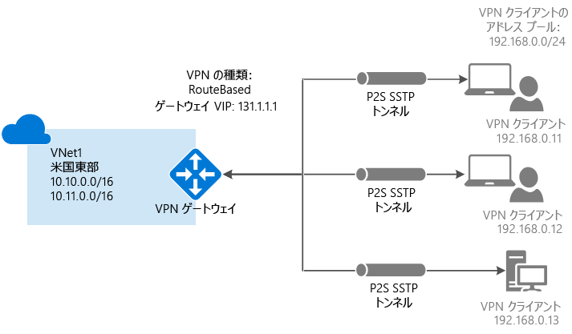

# VPN Gateway について
Azure 仮想ネットワークとオンプレミスのサイトとの間でネットワーク トラフィックを送信する場合は、仮想ネットワーク用の仮想ネットワーク ゲートウェイを作成する必要があります。 VPN ゲートウェイは、パブリック接続で暗号化されたトラフィックを送信する仮想ネットワーク ゲートウェイの一種です。 VPN ゲートウェイを使用すると、Microsoft ネットワークを経由して Azure 仮想ネットワーク間でトラフィックを送信することもできます。

"ExpressRoute" と "Vpn" という&2; 種類の仮想ネットワーク ゲートウェイがあります。 仮想ネットワーク ゲートウェイを作成する場合、作成するゲートウェイの種類を指定する必要があります。 VPN ゲートウェイは、ゲートウェイの種類 "Vpn" を使用した仮想ネットワーク ゲートウェイです。 

各仮想ネットワークに配置できる仮想ネットワーク ゲートウェイは&2; つですが、種類はいずれか&1; つのみになります。 選択する設定によっては、1 つの VPN ゲートウェイへの複数の接続を作成できます。 その一例は、マルチサイト接続構成です。 同一の VPN ゲートウェイへの複数の接続を作成する場合、そのゲートウェイで利用できる帯域幅は、(ポイント対サイト VPN を含め) すべての VPN トンネルによって共有されます。

## VPN ゲートウェイの構成
VPN ゲートウェイ接続は、特定の設定で構成された複数のリソースに依存します。 ほとんどのリソースは個別に構成できますが、場合によってはある一定の順序で構成を行う必要があります。

###[設定]
リソースごとに選択した設定は、適切な接続を作成するうえで非常に重要です。 VPN Gateway の個々のリソースと設定については、「 [VPN Gateway の設定について](vpn-gateway-about-vpn-gateway-settings.md)」を参照してください。 ゲートウェイの種類、VPN の種類、接続の種類、ゲートウェイ サブネット、ローカル ネットワーク ゲートウェイ、検討が必要なその他のさまざまなリソース設定を把握するのに役立つ情報が記載されています。

###デプロイ ツール
Azure Portal などの構成ツールをどれか&1; つ使用して、リソースの作成と構成を開始できます。 その後、追加のリソースを構成したり、適用できる場合に既存のリソースを変更したりするために、PowerShell などの別のツールに切り替えることができます。 現時点では、すべてのリソースとリソースの設定を Azure Portal で構成することはできません。 各接続トポロジの記事の手順では、特定の構成ツールが必要な場合が指定されています。 

###デプロイメント モデル
VPN ゲートウェイを構成する手順は、仮想ネットワークの作成に使用したデプロイメント モデルによって異なります。 たとえば、クラシック デプロイメント モデルを使用して VNet を作成した場合は、クラシック デプロイメント モデルに対応したガイドラインと手順を使用して VPN ゲートウェイ設定を作成し、構成します。 デプロイメント モデルの詳細については、 [Resource Manager デプロイメント モデルとクラシック デプロイメント モデルについて](../azure-resource-manager/resource-manager-deployment-model.md)のページを参照してください。

## 接続トポロジの図
VPN ゲートウェイ接続ではさまざまな構成が利用できることを理解しておくことが重要です。 また、どの構成が自分のニーズに最適かを判断する必要があります。 以下のセクションでは、次の VPN ゲートウェイ接続に関する情報とトポロジの図を確認できます。また、これらのセクションには次の一覧が記載された表があります。

* 利用可能なデプロイメント モデル
* 利用可能な構成ツール
* 記事に直接移動するリンク (利用可能な場合)

図と説明を参考にして、要件を満たす接続トポロジを選択できます。 図は主要なベースライン トポロジを示していますが、図をガイドラインとして使用して、より複雑な構成を構築することもできます。

## サイト間とマルチサイト (IPsec/IKE VPN トンネル)
### サイト間
サイト間 (S2S) VPN ゲートウェイ接続とは、IPsec/IKE (IKEv1 または IKEv2) VPN トンネルを介した接続です。 この種類の接続では、オンプレミスの VPN デバイスが必要です。そのデバイスは、パブリック IP アドレスを割り当てられていて、NAT の内側に配置されていない必要があります。 S2S 接続は、クロスプレミスおよびハイブリッド構成に使用できます。   

### マルチサイト
この種類の接続は、サイト間接続の一種です。 仮想ネットワーク ゲートウェイから複数の VPN 接続を作成し、通常は複数のオンプレミスのサイトに接続します。 複数の接続を使用する場合は、(クラシック VNet を使用する際に動的ゲートウェイと呼ばれる) RouteBased という VPN の種類を使用する必要があります。 各仮想ネットワークに配置できる VPN ゲートウェイは&1; つのみであるため、ゲートウェイを経由するすべての接続は、使用可能な帯域幅を共有します。 これは一般に "マルチサイト" 接続と呼ばれます。

### サイト間接続とマルチサイト接続で使用できるデプロイメント モデルとデプロイ方法
[!INCLUDE [vpn-gateway-table-site-to-site](../../includes/vpn-gateway-table-site-to-site-include.md)]

## ポイント対サイト (VPN over SSTP)
ポイント対サイト (P2S) VPN ゲートウェイ接続では、個々のクライアント コンピューターから仮想ネットワークへの、セキュリティで保護された接続を作成することができます。 P2S は、SSTP (Secure Socket トンネリング プロトコル) 経由の VPN 接続です。 P2S 接続を機能させるために、VPN デバイスや公開 IP アドレスは必要ありません。 VPN 接続を確立するには、クライアント コンピューターから接続を開始します。 これは、自宅や会議室など、リモートの場所から VNet に接続する場合や、VNet に接続する必要があるクライアントの数が少ない場合などに便利です。 P2S 接続と S2S 接続は、両者の構成要件がすべて両立する場合に、同じ VPN ゲートウェイを使って組み合わせて使用できます。

### ポイント対サイト接続で使用できるデプロイメント モデルとデプロイ方法
[!INCLUDE [vpn-gateway-table-point-to-site](../../includes/vpn-gateway-table-point-to-site-include.md)]

## VNet 間接続 (IPsec/IKE VPN トンネル)
仮想ネットワークどうし (VNet 間) の接続は、VNet をオンプレミス サイトの場所に接続することと似ています。 どちらの接続タイプでも、VPN ゲートウェイを使用して、IPsec/IKE を使った安全なトンネルが確保されます。 マルチサイト接続構成と VNet 間通信を組み合わせることもできます。 そのため、クロスプレミス接続と仮想ネットワーク間接続とを組み合わせたネットワーク トポロジを確立することができます。

以下のような VNet を接続できます。

* 同じリージョンまたは異なるリージョンにある
* 同じサブスクリプションまたは異なるサブスクリプションにある 
* 同じデプロイメント モデルまたは異なるデプロイメント モデルである

###デプロイメント モデル間の接続
Azure には現在、クラシックと Resource Manager という&2; つのデプロイメント モデルがあります。 これまで Azure を使用してきているユーザーであれば、おそらく Azure VM およびクラシック VNet で実行されているインスタンス ロールを利用されていることでしょう。 新しい VM とロール インスタンスが、Resource Manager で作成された VNet 上で実行されていることも考えられます。 VNet 間に接続を作成し、一方の VNet 内のリソースがもう一方の VNet 内のリソースと直接通信できるようにすることが可能です。

###VNET ピアリング
仮想ネットワークが特定の要件を満たしていれば、接続の作成に VNET ピアリングを使用することができます。 VNET ピアリングは、仮想ネットワーク ゲートウェイを使用しません。 詳細については、「 [VNet ピアリング](../virtual-network/virtual-network-peering-overview.md)」を参照してください。

###VNet 間接続で使用できるデプロイメント モデルとデプロイ方法
[!INCLUDE [vpn-gateway-table-vnet-to-vnet](../../includes/vpn-gateway-table-vnet-to-vnet-include.md)]

## ExpressRoute (専用のプライベート接続)
Microsoft Azure ExpressRoute を利用すれば、接続プロバイダーが提供する専用プライベート接続で、オンプレミスのネットワークを Microsoft クラウドに拡張できます。 ExpressRoute では、Microsoft Azure、Office 365、CRM Online などの Microsoft クラウド サービスへの接続を確立できます。 接続には、任意の環境間 (IP VPN) 接続、ポイントツーポイントのイーサネット接続、共有施設での接続プロバイダーによる仮想交差接続があります。

ExpressRoute 接続では、公共のインターネットを利用できません。 それにより、ExpressRoute 接続はインターネット経由の一般的な接続に比べて、安全性と信頼性が高く、待機時間も短く、高速です。

ExpressRoute 接続では VPN ゲートウェイは使用されませんが、仮想ネットワーク ゲートウェイが必要な構成の一部として使用されます。 ExpressRoute 接続では、仮想ネットワーク ゲートウェイは "Vpn" ではなく "ExpressRoute" というゲートウェイの種類で構成されます。 ExpressRoute の詳細については、「 [ExpressRoute の技術概要](../expressroute/expressroute-introduction.md)」を参照してください。

## サイト間と ExpressRoute の共存接続
ExpressRoute は、パブリックなインターネットを経由せずに WAN から Azure などの Microsoft サービスに直接アクセスする、専用の接続です。 サイト間 VPN トラフィックは、暗号化が施されたうえでパブリック インターネット経由で送受信されます。 同じ仮想ネットワークに対してサイト間 VPN と ExpressRoute 接続が構成可能な場合、いくつかの利点があります。

ExpressRoute 用にセキュリティで保護されたフェールオーバー パスとしてサイト間 VPN を構成したり、サイト間 VPN を使用して、ネットワークの一部ではないものの、ExpressRoute 経由で接続されているサイトに接続したりすることができます。 この構成では、同一の仮想ネットワークに&2; つの仮想ネットワーク ゲートウェイが必要なことに注意してください (1 つのゲートウェイの種類は "Vpn"、もう&1; つのゲートウェイの種類は "ExpressRoute")。

### S2S 接続と ExpressRoute 接続で使用できるデプロイメント モデルとデプロイ方法
[!INCLUDE [vpn-gateway-table-coexist](../../includes/vpn-gateway-table-coexist-include.md)]

## 価格
[!INCLUDE [vpn-gateway-about-pricing-include](../../includes/vpn-gateway-about-pricing-include.md)]

## ゲートウェイの SKU
[!INCLUDE [vpn-gateway-gwsku-include](../../includes/vpn-gateway-gwsku-include.md)]

VPN ゲートウェイの SKU の詳細については、「[ゲートウェイの SKU](vpn-gateway-about-vpn-gateway-settings.md#gwsku)」を参照してください。

### SKU の予測される合計スループット
[!INCLUDE [vpn-gateway-table-gwtype-aggthroughput](../../includes/vpn-gateway-table-gwtype-aggtput-include.md)]

## 次のステップ
- VPN ゲートウェイの構成を計画します。 [VPN Gateway の計画と設計](vpn-gateway-plan-design.md)に関するページを参照してください。
- 詳細については、「[VPN Gateway に関する FAQ](vpn-gateway-vpn-faq.md)」を参照してください。
- [サブスクリプションとサービスの制限](../azure-subscription-service-limits.md#networking-limits)に関するページを参照してください。

