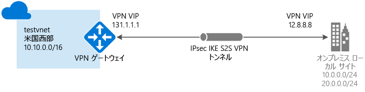

# PowerShell を使用してサイト間 VPN 接続を備えた VNet を作成する
> [!div class="op_single_selector"]
> * [Resource Manager - Azure Portal](vpn-gateway-howto-site-to-site-resource-manager-portal.md)
> * [Resource Manager - PowerShell](vpn-gateway-create-site-to-site-rm-powershell.md)
> * [クラシック - Azure Portal](vpn-gateway-howto-site-to-site-classic-portal.md)
> * [クラシック - クラシック ポータル](vpn-gateway-site-to-site-create.md)
>
>

この記事では、Azure Resource Manager デプロイメント モデルを使用して、仮想ネットワークと、オンプレミス ネットワークに対するサイト間 VPN Gateway 接続を作成する手順について説明します。 サイト間接続は、クロスプレミスおよびハイブリッド構成に使用できます。

### サイト間接続のデプロイメント モデルとデプロイ方法
[!INCLUDE [deployment models](../../includes/vpn-gateway-deployment-models-include.md)]

以下の表は、サイト間の構成に関して現在利用できるデプロイメント モデルとデプロイ方法を示しています。 構成手順を説明した記事が利用できるようになったら、表から直接リンクできるようにします。

[!INCLUDE [site-to-site table](../../includes/vpn-gateway-table-site-to-site-include.md)]

#### 追加の構成
VNet どうしは接続しても、オンプレミスへの接続は作成しない場合は、 [VNet 間の接続の構成](vpn-gateway-vnet-vnet-rm-ps.md)に関するページを参照してください。 既存の接続が存在する VNet にサイト間接続を追加する場合は、[VPN Gateway 接続が既に存在する VNet へのサイト間接続の追加](vpn-gateway-howto-multi-site-to-site-resource-manager-portal.md)に関するページを参照してください。

## 開始する前に
構成を開始する前に、以下がそろっていることを確認します。

* 互換性のある VPN デバイスおよびデバイスを構成できる人員。 「 [VPN デバイスについて](vpn-gateway-about-vpn-devices.md)」を参照してください。 VPN デバイスの構成に詳しくない場合や、オンプレミス ネットワーク構成の IP アドレス範囲を把握していない場合は、詳細な情報を把握している担当者と協力して作業を行ってください。
* VPN デバイスの外部接続用パブリック IP アドレス。 この IP アドレスを NAT の内側に割り当てることはできません。
* Azure サブスクリプション。 Azure サブスクリプションをまだお持ちでない場合は、[MSDN サブスクライバーの特典](https://azure.microsoft.com/pricing/member-offers/msdn-benefits-details)を有効にするか、[無料アカウント](https://azure.microsoft.com/pricing/free-trial)にサインアップしてください。
* Azure Resource Manager PowerShell コマンドレットの最新版。 PowerShell コマンドレットのインストールの詳細については、「 [Azure PowerShell のインストールおよび構成方法](/powershell/azureps-cmdlets-docs) 」を参照してください。

## 1.サブスクリプションへの接続
リソース マネージャー コマンドレットを使用するように PowerShell モードを切り替えてください。 詳細については、「 [リソース マネージャーでの Windows PowerShell の使用](../powershell-azure-resource-manager.md)」を参照してください。

PowerShell コンソールを開き、アカウントに接続します。 接続するには、次のサンプルを参照してください。

    Login-AzureRmAccount

アカウントのサブスクリプションを確認します。

    Get-AzureRmSubscription

使用するサブスクリプションを指定します。

    Select-AzureRmSubscription -SubscriptionName "Replace_with_your_subscription_name"

## 2.仮想ネットワークとゲートウェイ サブネットを作成する
例では、/28 のゲートウェイ サブネットを使用します。 /29 と同程度の小規模なゲートウェイ サブネットを作成することはできますが、少なくとも /28 または /27 以上を選択してさらに多くのアドレスが含まれる大規模なサブネットを作成することをお勧めします。 これにより、十分な数のアドレスが、将来的に必要になる可能性のある追加の構成に対応できるようになります。

/29 以上の規模のゲートウェイ サブネットを持つ仮想ネットワークが既にある場合は、「 [ローカル ネットワーク ゲートウェイを追加する](#localnet)」に進むことができます。

[!INCLUDE [vpn-gateway-no-nsg](../../includes/vpn-gateway-no-nsg-include.md)]

### 仮想ネットワークとゲートウェイ サブネットを作成するには
仮想ネットワークとゲートウェイ サブネットを作成するには、次のサンプルを使用してください。 サンプル値は実際の値に変更してください。

まず、リソース グループを作成します。

    New-AzureRmResourceGroup -Name testrg -Location 'West US'

次に、仮想ネットワークを作成します。 指定したアドレス空間がオンプレミス ネットワーク内に存在するあらゆるアドレス空間と重複していないことを確認します。

次のサンプルでは、*testvnet* という仮想ネットワークに加えて、*GatewaySubnet* と *Subnet1* という&2; つのサブネットを作成します。 特に *GatewaySubnet*というサブネットを作成する必要があります。 別の名前にすると、接続の構成は失敗します。

変数を設定します。

    $subnet1 = New-AzureRmVirtualNetworkSubnetConfig -Name 'GatewaySubnet' -AddressPrefix 10.0.0.0/28
    $subnet2 = New-AzureRmVirtualNetworkSubnetConfig -Name 'Subnet1' -AddressPrefix '10.0.1.0/28'

VNet を作成します。

    New-AzureRmVirtualNetwork -Name testvnet -ResourceGroupName testrg `
    -Location 'West US' -AddressPrefix 10.0.0.0/16 -Subnet $subnet1, $subnet2

### 作成済みの仮想ネットワークにゲートウェイ サブネットを追加するには
この手順は、前の手順で作成した VNet にゲートウェイ サブネットを追加する必要がある場合にのみ必要です。

以下のサンプルを使用して、ゲートウェイ サブネットを作成することができます。 ゲートウェイ サブネットには、必ず 'GatewaySubnet' という名前を付けてください。 別の名前を付けてサブネットを作成しても、Azure はそれをゲートウェイ サブネットとして扱いません。

変数を設定します。

    $vnet = Get-AzureRmVirtualNetwork -ResourceGroupName testrg -Name testvnet

ゲートウェイ サブネットを作成します。

    Add-AzureRmVirtualNetworkSubnetConfig -Name 'GatewaySubnet' -AddressPrefix 10.0.3.0/28 -VirtualNetwork $vnet

構成を設定します。

    Set-AzureRmVirtualNetwork -VirtualNetwork $vnet

## 手順&3;.ローカル ネットワーク ゲートウェイを追加する
仮想ネットワークでは、ローカル ネットワーク ゲートウェイは通常、オンプレミスの場所を指します。 そのサイトを Azure が参照できるように名前を付け、ローカル ネットワーク ゲートウェイのアドレス空間のプレフィックスも指定します。

指定した IP アドレス プレフィックスは、Azure がオンプレミスの場所に送信するトラフィックを特定するときに使用されます。 つまり、ローカル ネットワーク ゲートウェイに関連付ける各アドレス プレフィックスを指定する必要があります。 オンプレミス ネットワークが変わる場合でも、アドレス プレフィックスを簡単に更新できます。

PowerShell の例を使用する場合は、以下の点に注意してください。

* *GatewayIPAddress* は、オンプレミス VPN デバイスの IP アドレスです。 VPN デバイスを NAT の内側に配置することはできません。
* *AddressPrefix* は、オンプレミスのアドレス空間です。

1 つのアドレス プレフィックスを含むローカル ネットワーク ゲートウェイを追加するには

    New-AzureRmLocalNetworkGateway -Name LocalSite -ResourceGroupName testrg `
    -Location 'West US' -GatewayIpAddress '23.99.221.164' -AddressPrefix '10.5.51.0/24'

複数のアドレス プレフィックスを含むローカル ネットワーク ゲートウェイを追加するには

    New-AzureRmLocalNetworkGateway -Name LocalSite -ResourceGroupName testrg `
    -Location 'West US' -GatewayIpAddress '23.99.221.164' -AddressPrefix @('10.0.0.0/24','20.0.0.0/24')

### ローカル ネットワーク ゲートウェイ用の IP アドレスのプレフィックスを変更するには
ローカル ネットワーク ゲートウェイのプレフィックスは変わる場合があります。 IP アドレス プレフィックスを変更する手順は、VPN ゲートウェイ接続を作成したかどうかによって異なります。 「 [ローカル ネットワーク ゲートウェイ用の IP アドレスのプレフィックスを変更するには](#modify) 」セクションを参照してください。

## 4.VPN ゲートウェイのパブリック IP アドレスを要求する
次に、Azure VNet VPN ゲートウェイに割り当てるパブリック IP アドレスを要求します。 これは VPN デバイスに割り当てられているものと同じ IP アドレスではなく、Azure VPN ゲートウェイ自体に割り当てられている IP アドレスです。 使用する IP アドレスを指定することはできません。 IP アドレスはゲートウェイに動的に割り当てられます。 ゲートウェイに接続するオンプレミス VPN デバイスを構成するときに、この IP アドレスを使用します。

リソース マネージャーのデプロイ モデル用の Azure VPN ゲートウェイは、現在、動的割り当て方法を使用してパブリック IP アドレスのみをサポートしています。 ただし、これは IP アドレスが変更されるという意味ではありません。 Azure VPN ゲートウェイの IP アドレスが変更されるのは、ゲートウェイが削除され、再度作成されたときのみです。 ゲートウェイのパブリック IP アドレスは、Azure VPN ゲートウェイのサイズ変更、リセット、その他の内部メンテナンス/アップグレードの際には変更されません。

次の PowerShell サンプルを使用します。

    $gwpip= New-AzureRmPublicIpAddress -Name gwpip -ResourceGroupName testrg -Location 'West US' -AllocationMethod Dynamic

## 5.ゲートウェイ IP アドレス指定の構成を作成する
ゲートウェイの構成で、使用するサブネットとパブリック IP アドレスを定義します。 次のサンプルを使用して、ゲートウェイの構成を作成します。

    $vnet = Get-AzureRmVirtualNetwork -Name testvnet -ResourceGroupName testrg
    $subnet = Get-AzureRmVirtualNetworkSubnetConfig -Name 'GatewaySubnet' -VirtualNetwork $vnet
    $gwipconfig = New-AzureRmVirtualNetworkGatewayIpConfig -Name gwipconfig1 -SubnetId $subnet.Id -PublicIpAddressId $gwpip.Id

## 6.仮想ネットワーク ゲートウェイを作成する
この手順では、仮想ネットワーク ゲートウェイを作成します。 ゲートウェイの作成には、しばらく時間がかかる場合があります。 45 分以上かかることも珍しくありません。

次の値を使用します。

* サイト間構成の *-GatewayType* は *Vpn* です。 ゲートウェイの種類は常に、実装する構成に対応するものとなります。 たとえば、他のゲートウェイ構成では、-GatewayType に ExpressRoute を必要とする場合があります。
* *-VpnType* には、*RouteBased* (ドキュメントによっては動的ゲートウェイと呼ばれます) または *PolicyBased* (ドキュメントによっては静的ゲートウェイと呼ばれます) を指定できます。 VPN ゲートウェイの種類については、「[VPN Gateway について](vpn-gateway-about-vpngateways.md)」を参照してください。
* *-GatewaySku* には、*Basic*、*Standard*、*HighPerformance* のいずれかを指定できます。     

        New-AzureRmVirtualNetworkGateway -Name vnetgw1 -ResourceGroupName testrg `
        -Location 'West US' -IpConfigurations $gwipconfig -GatewayType Vpn `
        -VpnType RouteBased -GatewaySku Standard

## 7.VPN デバイスの構成
オンプレミス VPN デバイスを構成するには、この時点で仮想ネットワーク ゲートウェイのパブリック IP アドレスが必要です。 具体的な構成方法については、お使いのデバイスの製造元の情報を参照してください。 詳細については、[VPN デバイス](vpn-gateway-about-vpn-devices.md)に関するページをご覧ください。

仮想ネットワーク ゲートウェイのパブリック IP アドレスを検索するには、次のサンプルを使用します。

    Get-AzureRmPublicIpAddress -Name gwpip -ResourceGroupName testrg

## 8.VPN 接続を作成する
次に、仮想ネットワーク ゲートウェイと VPN デバイスの間にサイト間 VPN 接続を作成します。 サンプルの値は必ず実際の値に変更してください。 共有キーは、VPN デバイスの構成に使用したものと同じ値にする必要があります。 サイト間接続の `-ConnectionType` は *IPsec*です。

変数を設定します。

    $gateway1 = Get-AzureRmVirtualNetworkGateway -Name vnetgw1 -ResourceGroupName testrg
    $local = Get-AzureRmLocalNetworkGateway -Name LocalSite -ResourceGroupName testrg

接続を作成します。

    New-AzureRmVirtualNetworkGatewayConnection -Name localtovon -ResourceGroupName testrg `
    -Location 'West US' -VirtualNetworkGateway1 $gateway1 -LocalNetworkGateway2 $local `
    -ConnectionType IPsec -RoutingWeight 10 -SharedKey 'abc123'

しばらくすると、接続が確立されます。

## VPN 接続を検証するには
VPN 接続を検証する方法はいくつかあります。

[!INCLUDE [vpn-gateway-verify-connection-rm](../../includes/vpn-gateway-verify-connection-rm-include.md)]

## ローカル ネットワーク ゲートウェイの IP アドレスのプレフィックスを変更するには
ローカル ネットワーク ゲートウェイのプレフィックスを変更する必要がある場合は、以下の手順に従います。 2 種類の手順があります。 どちらの手順を選択するかは、既にゲートウェイ接続を作成しているかどうかによって異なります。

[!INCLUDE [vpn-gateway-modify-ip-prefix-rm](../../includes/vpn-gateway-modify-ip-prefix-rm-include.md)]

## ローカル ネットワーク ゲートウェイの IP アドレスを変更するには
[!INCLUDE [vpn-gateway-modify-lng-gateway-ip-rm](../../includes/vpn-gateway-modify-lng-gateway-ip-rm-include.md)]

## 次のステップ
*  接続が完成したら、仮想ネットワークに仮想マシンを追加することができます。 詳細については、[Virtual Machines](https://docs.microsoft.com/azure/#pivot=services&panel=Compute) に関するページを参照してください。
* BGP の詳細については、[BGP の概要](vpn-gateway-bgp-overview.md)に関する記事と [BGP の構成方法](vpn-gateway-bgp-resource-manager-ps.md)に関する記事を参照してください。

