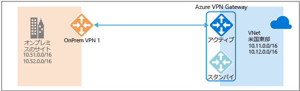
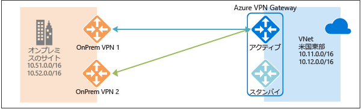
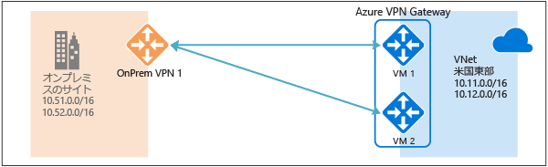
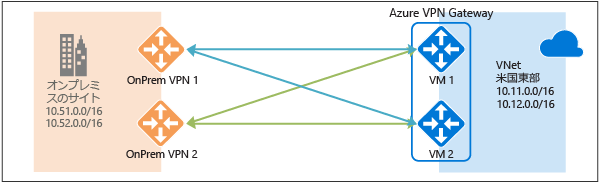
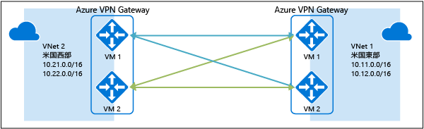

# 高可用性のクロスプレミス接続および VNet 間接続
この記事では、Azure VPN Gateway を使用したクロスプレミス接続と VNet 間接続の高可用性構成オプションの概要を説明します。

## Azure VPN Gateway の冗長性について
すべての Azure VPN Gateway は、アクティブ/スタンバイ構成の 2 つのインスタンスから成ります。 アクティブなインスタンスに対して計画的なメンテナンスまたは計画外の中断が発生すると、スタンバイ インスタンスが自動的に引き継ぎ (フェールオーバーし)、S2S VPN または VNet 間接続が再開されます。 切り替わる際に、短い中断が発生します。 計画的なメンテナンスの場合は、10 ～ 15 秒以内に接続が復元されます。 予期しない問題の場合は、接続の復旧にかかる時間は長くなり、約 1 分から最悪の場合は 1 分 30 秒かかります。 ゲートウェイへの P2S VPN クライアント接続の場合、P2S 接続が切断されるため、ユーザーがクライアント コンピューターから再接続する必要があります。

## 高可用性のクロスプレミス接続
クロスプレミス接続の可用性を向上させるには、いくつかのオプションがあります。

* 複数のオンプレミスの VPN デバイス
* アクティブ/アクティブの Azure VPN Gateway
* 両方の組み合わせ

### 複数のオンプレミスの VPN デバイス
次の図に示すように、オンプレミス ネットワークの複数の VPN デバイスを使用して、Azure VPN Gateway に接続できます。

この構成では、同じ Azure VPN Gateway から同じ場所にあるオンプレミスのデバイスへの複数のアクティブなトンネルが提供されます。 いくつかの要件と制約があります。

1. VPN デバイスから Azure への S2S VPN 接続を複数作成する必要があります。 同じオンプレミス ネットワークから Azure に複数の VPN デバイスを接続する場合、VPN デバイスごとに 1 つのローカル ネットワーク ゲートウェイを作成し、Azure VPN Gateway から各ローカル ネットワーク ゲートウェイへの接続を 1 つ作成する必要があります。
2. VPN デバイスに対応するローカル ネットワーク ゲートウェイには、"GatewayIpAddress" プロパティに一意のパブリック IP アドレスが指定されている必要があります。
3. この構成には BGP が必要です。 VPN デバイスを表す各ローカル ネットワーク ゲートウェイには、"BgpPeerIpAddress" プロパティに BGP ピアの一意の IP アドレスが指定されている必要があります。
4. 各ローカル ネットワーク ゲートウェイの AddressPrefix プロパティ フィールドが重複しないようにする必要があります。 AddressPrefix フィールドには、/32 CIDR 形式で "BgpPeerIpAddress" を指定する必要があります (例: 10.200.200.254/32)。
5. BGP を使用して、同じオンプレミス ネットワーク プレフィックスの同じプレフィックスを Azure VPN Gateway にアドバタイズする必要があります。トラフィックは、同時にこれらのトンネルを介して転送されます。
6. 等コスト マルチパス ルーティング (ECMP) を使用する必要があります。
7. 各接続は、Azure VPN Gateway のトンネルの最大数 (Basic と Standard SKU では 10、HighPerformance SKU では 30) にカウントされます。 

この構成では、Azure VPN Gateway はアクティブ/スタンバイ モードのままです。そのため、[上](#activestandby)で説明したのと同じフェールオーバー動作と短い中断が発生します。 ただし、この設定により、オンプレミス ネットワークと VPN デバイスの障害や中断から保護されます。

### アクティブ/アクティブの Azure VPN Gateway
次の図に示すように、ゲートウェイ VM の両方のインスタンスでオンプレミスの VPN デバイスへの S2S VPN トンネルを確立するアクティブ/アクティブ構成の Azure VPN Gateway を作成できます。

この構成では、各 Azure ゲートウェイ インスタンスが一意のパブリック IP アドレスを持ち、ローカル ネットワーク ゲートウェイと接続で指定されたオンプレミスの VPN デバイスへの IPsec/IKE S2S VPN トンネルを確立します。 両方の VPN トンネルは実際には同じ接続の一部であることに注意してください。 この構成でも、これら 2 つの Azure VPN Gateway のパブリック IP アドレスへの 2 つの S2S VPN トンネルを受け入れるか確立するようにオンプレミスの VPN デバイスを構成する必要があります。

Azure ゲートウェイ インスタンスがアクティブ/アクティブ構成であるため、オンプレミスの VPN デバイスで一方のトンネルを優先している場合でも、Azure Virtual Network からオンプレミス ネットワークへのトラフィックは同時に両方のトンネルを介してルーティングされます。 いずれかのインスタンスでメンテナンス イベントが発生しない限り、同じ TCP または UDP フローは常に同じトンネルまたはパスを経由することに注意してください。

1 つのゲートウェイ インスタンスに対して計画的なメンテナンスまたは計画外のイベントが発生すると、そのインスタンスからオンプレミスの VPN デバイスへの IPsec トンネルが切断されます。 VPN デバイスの対応するルートは自動的に削除または無効にされ、トラフィックはもう一方のアクティブな IPsec トンネルに切り替えられます。 Azure 側では、影響を受けるインスタンスからアクティブ インスタンスに自動的に切り替わります。

### デュアル冗長性: Azure とオンプレミスの両方のネットワークのアクティブ/アクティブ VPN Gateway
最も信頼性の高いオプションは、次の図に示すように、ネットワークと Azure の両方でアクティブ/アクティブ ゲートウェイを組み合わせることです。

ここでは、アクティブ/アクティブ構成の Azure VPN Gateway を作成および設定し、上に示したように 2 つのオンプレミスの VPN デバイスに対して 2 つのローカル ネットワーク ゲートウェイと 2 つの接続を作成します。 その結果、Azure Virtual Network とオンプレミス ネットワークの間に 4 つの IPsec トンネルが存在するフル メッシュ接続になります。

すべてのゲートウェイとトンネルは、Azure 側からはアクティブです。そのため、トラフィックは 4 つすべてのトンネルで同時に分散されます。ただし、この場合も、各 TCP または UDP フローは Azure 側からは同じトンネルまたはパスを経由します。 トラフィックを分散させることで IPsec トンネルよりもわずかにスループットが向上する場合がありますが、この構成の主な目的は高可用性を実現することです。 分散の統計的性質により、さまざまなアプリケーションのトラフィック状況による全体のスループットへの影響を測定することが困難になります。

このトポロジでは、オンプレミスの VPN デバイスのペアをサポートするために 2 つのローカル ネットワーク ゲートウェイと 2 つの接続が必要です。また、同じオンプレミス ネットワークへの接続を 2 つ確立するために、BGP が必要です。 これらの要件は、[上記](#activeactiveonprem)と同じです。 

## Azure VPN Gateway を介した高可用性の VNet 間接続
同じアクティブ/アクティブ構成を Azure VNet 間接続にも適用できます。 両方の仮想ネットワークにアクティブ/アクティブ VPN ゲートウェイを作成し、両方を接続して、次の図に示すように、2 つの VNet 間に 4 つのトンネルが存在する同じフル メッシュ接続を構成できます。

これにより、すべての計画的なメンテナンス イベントに備えて 2 つの仮想ネットワーク間にトンネルのペアが常に存在し、より高い可用性が実現されます。 クロスプレミス接続の同じトポロジには 2 つの接続が必要ですが、前に示した VNet 間トポロジではゲートウェイごとに必要な接続は 1 つだけです。 さらに、VNet 間接続経由のトランジット ルーティングが必要でない限り、BGP はオプションです。

## 次のステップ
アクティブ/アクティブのクロスプレミス接続と VNet 間接続を構成する手順については、[クロスプレミス接続と VNet 間接続のアクティブ/アクティブ VPN Gateway の構成](vpn-gateway-activeactive-rm-powershell.md)に関するページを参照してください。

