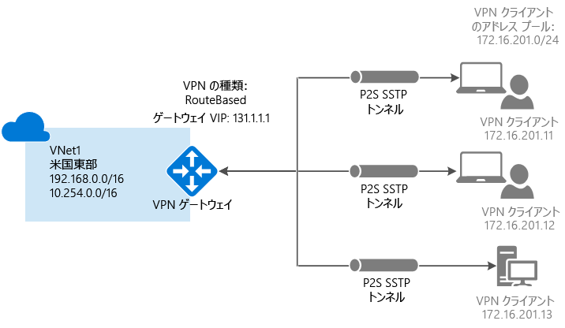
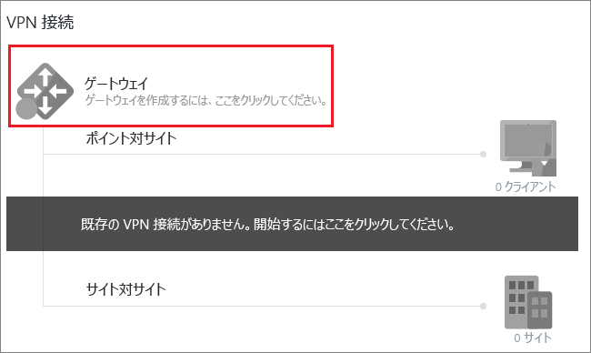
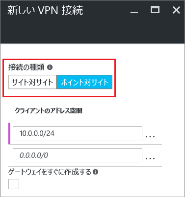
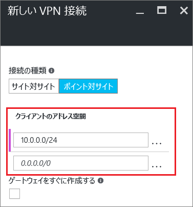
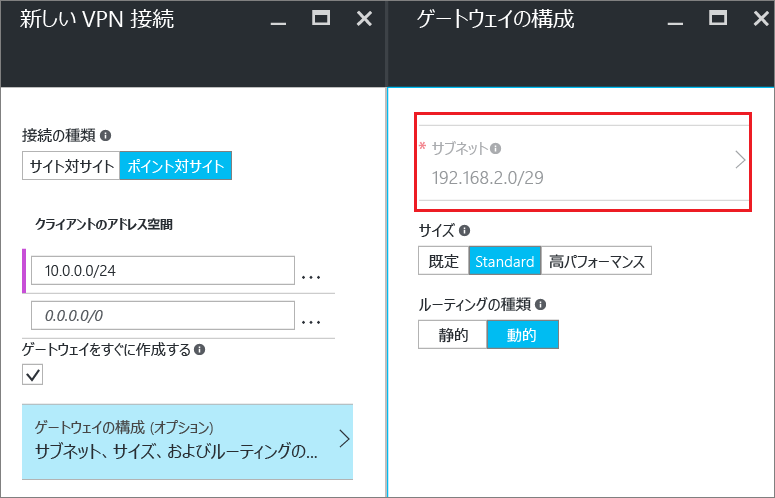
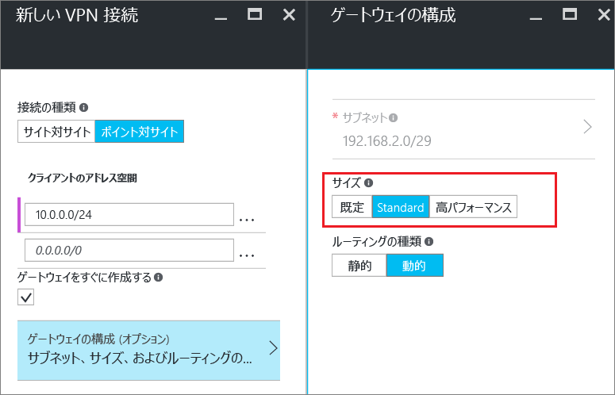
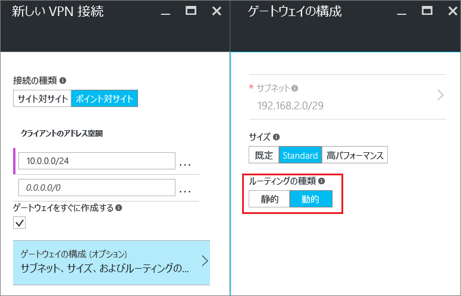
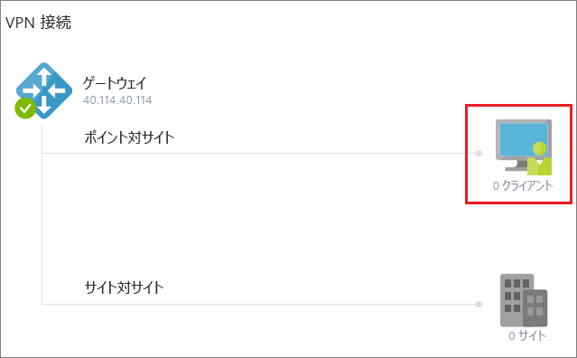
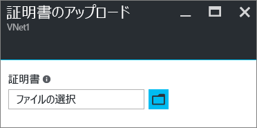
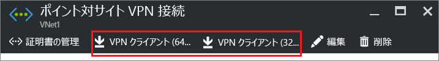

# <a name="configure-a-point-to-site-connection-by-using-certificate-authentication-classic"></a>証明書認証 (クラシック) を使用してポイント対サイト接続を構成する

[!INCLUDE [deployment models](../../includes/vpn-gateway-classic-deployment-model-include.md)]

この記事では、ポイント対サイト接続を備えた VNet を作成する方法について説明します。 この Vnet は、Azure Portal を使用してクラシック デプロイ モデルで作成します。 この構成では、自己署名証明書または CA によって発行された証明書を使用して接続クライアントを認証します。 また、次の記事で説明されているオプションを使用して、別のデプロイ ツールまたはモデルでこの構成を作成することもできます。

> [!div class="op_single_selector"]
> * [Azure Portal](vpn-gateway-howto-point-to-site-resource-manager-portal.md)
> * [PowerShell](vpn-gateway-howto-point-to-site-rm-ps.md)
> * [Azure Portal (クラシック)](vpn-gateway-howto-point-to-site-classic-azure-portal.md)
>

個々のクライアント コンピューターから仮想ネットワークへのセキュリティで保護された接続を作成するには、ポイント対サイト (P2S) VPN ゲートウェイを使用します。 ポイント対サイト VPN 接続は、リモートの場所から VNet に接続する場合に役立ちます。 VNet に接続する必要のあるクライアントが少数しか存在しない場合は、P2S VPN が、サイト間 VPN の代わりに使用する有効なソリューションになります。 P2S VPN 接続は、クライアント コンピューターから接続を開始することによって確立されます。

> [!IMPORTANT]
> クラシック デプロイ モデルでは、Windows VPN クライアントのみをサポートし、SSL ベースの VPN プロトコルである Secure Socket トンネリング プロトコル (SSTP) を使用します。 Windows 以外の VPN クライアントをサポートするには、Resource Manager デプロイ モデルで VNet を作成する必要があります。 Resource Manager デプロイ モデルでは、SSTP に加えて IKEv2 VPN をサポートしています。 詳細については、[P2S 接続](point-to-site-about.md)に関するページを参照してください。
>
>



## <a name="prerequisites"></a>前提条件

ポイント対サイトの証明書認証接続には、次の前提条件が必要です。

* Dynamic VPN ゲートウェイ。
* Azure にアップロードされた、ルート証明書の公開キー (.cer ファイル)。 このキーは信頼された証明書と見なされ、認証に使用されます。
* ルート証明書から生成され、接続する各クライアント コンピューターにインストールされたクライアント証明書。 この証明書はクライアントの認証に使用されます。
* VPN クライアント構成パッケージが生成され、接続するすべてのクライアント コンピューターにインストールされていること。 このクライアント構成パッケージは、VNet に接続するための必要な情報を持つ、既にオペレーティング システム上に存在するネイティブ VPN クライアントを構成します。

ポイント対サイト接続には、VPN デバイスやオンプレミスの公開された IP アドレスは必要ありません。 VPN 接続は、SSTP (Secure Socket トンネリング プロトコル) 経由で作成されます。 サーバー側でのサポート対象の SSTP バージョンは、1.0、1.1、1.2 です。 使用するバージョンはクライアントによって決まります。 Windows 8.1 以降の場合、SSTP では既定で 1.2 が使用されます。 

ポイント対サイト接続の詳細については、「[ポイント対サイトに関する FAQ](#point-to-site-faq)」を参照してください。

### <a name="example-settings"></a>設定例

テスト環境を作成するには、次の値を使用します。または、この記事にある例をより適切に理解するには、これらの値を参照してください。

- **[仮想ネットワーク (クラシック) の作成] の設定**
   - **[名前]**: 「*VNet1*」と入力します。
   - **[アドレス空間]**: 「*192.168.0.0/16*」と入力します。 この例では、1 つのアドレス空間のみを使用します。 図に示すように、VNet では複数のアドレス空間を使用することができます。
   - **[サブネット名]**: 「*FrontEnd*」と入力します。
   - **[サブネットのアドレス範囲]**: 「*192.168.1.0/24*」と入力します。
   - **サブスクリプション**:使用可能なサブスクリプションの一覧からサブスクリプションを選択します。
   - **[リソース グループ]**: 「*TestRG*」と入力します。 リソース グループが存在しない場合は、**[新規作成]** を選択します。
   - **[場所]**: 一覧から **[米国東部]** を選択します。

 - **[VPN 接続] の設定**
   - **[接続の種類]**: **[ポイント対サイト]** を選択します。
   - **[クライアント アドレス空間]**: 「*172.16.201.0/24*」と入力します。 このポイント対サイト接続を使用して VNet に接続する VPN クライアントは、指定されたプールから IP アドレスを受信します。

- **[Gateway configuration subnet] (ゲートウェイ構成サブネット) の設定**
   - **[名前]**: 「*GatewaySubnet*」が自動入力されます。
   - **[アドレス範囲]**: 「*192.168.200.0/24*」と入力します。 

- **[ゲートウェイの構成] の設定**: 
   - **[サイズ]**:使用するゲートウェイ SKU を選択します。
   - **[ルーティングの種類]**: **[動的]** を選択します。

## <a name="create-a-virtual-network-and-a-vpn-gateway"></a>仮想ネットワークと VPN ゲートウェイを作成する

開始する前に、Azure サブスクリプションを持っていることを確認してください。 Azure サブスクリプションをまだお持ちでない場合は、[MSDN サブスクライバーの特典](https://azure.microsoft.com/pricing/member-offers/msdn-benefits-details)を有効にするか、[無料アカウント](https://azure.microsoft.com/pricing/free-trial)にサインアップしてください。

### <a name="part-1-create-a-virtual-network"></a>パート 1:仮想ネットワークの作成

まだ仮想ネットワーク (VNet) がない場合は、作成してください。 スクリーンショットは例として示されています。 サンプルの値は必ず実際の値に変更してください。 Azure Portal を使用して VNet を作成するには、以下の手順に従ってください。

1. [Azure Portal](http://portal.azure.com) にサインインし、**[リソースの作成]** を選択します。 **[新規]** ページが開きます。 

2. **[Marketplace を検索]** フィールドに「*仮想ネットワーク*」と入力し、返された一覧から **[仮想ネットワーク]** を選択します。 **[仮想ネットワーク]** ページが開きます。

3. **[デプロイ モデルの選択]** 一覧から、**[Classic] (クラシック)**、**[作成]** の順に選択します。 **[仮想ネットワークの作成]** ページが開きます。

4. **[仮想ネットワークの作成]** ページで、VNet の設定を構成します。 このページでは、最初のアドレス空間と 1 つのサブネット アドレスの範囲を追加します。 VNet の作成が完了したら、戻って、さらにサブネットとアドレス空間を追加できます。

   ![[仮想ネットワークの作成] ページ](./media/vpn-gateway-howto-point-to-site-classic-azure-portal/vnet125.png)

5. ドロップダウン リストから、使用する **[サブスクリプション]** を選択します。

6. 既存の **[リソース グループ]** を選択します。 または、**[新規作成]** を選択することによって新しいリソース グループを作成し、名前を入力します。 新しいリソース グループを作成している場合は、計画された構成値に従ってリソース グループに名前を付けます。 リソース グループの詳細については、「[Azure Resource Manager の概要](../azure-resource-manager/resource-group-overview.md#resource-groups)」を参照してください。

7. VNet の **[場所]** を選択します。 この設定によって、この VNet にデプロイするリソースの地理的な場所が決定されます。

8. **[作成]** を選択して VNet を作成します。 **[通知]** ページに、"**デプロイを実行しています**" というメッセージが表示されます。

8. 仮想ネットワークが作成されると、**[通知]** ページ上のメッセージが "**デプロイメントに成功しました**" に変化します。 ダッシュボードで VNet を簡単に見つけるには、**[ダッシュボードにピン留めする]** を選択します。 

10. DNS サーバーを追加します (省略可)。 仮想ネットワークを作成した後は、名前解決に使用する DNS サーバーの IP アドレスを追加できます。 指定する DNS サーバーの IP アドレスは、VNet 内のリソースの名前を解決できる DNS サーバーのアドレスである必要があります。

    DNS サーバーを追加するには、VNet ページから **[DNS サーバー]** を選択します。 次に、使用する DNS サーバーの IP アドレスを入力し、**[保存]** を選択します。

### <a name="part-2-create-a-gateway-subnet-and-a-dynamic-routing-gateway"></a>パート 2:ゲートウェイ サブネットと動的ルーティング ゲートウェイを作成する

この手順では、ゲートウェイ サブネットと動的ルーティング ゲートウェイを作成します。 クラシック デプロイ モデルの Azure Portal では、同じ構成ページを使用してゲートウェイ サブネットとゲートウェイを作成します。 ゲートウェイ サブネットは、ゲートウェイ サービスにのみ使用します。 ゲートウェイ サブネットに VM やその他のサービスを直接デプロイしないでください。

1. Azure Portal で、ゲートウェイを作成する仮想ネットワークに移動します。

2. 仮想ネットワークのページで **[概要]** を選択し、**[VPN 接続]** セクションで **[ゲートウェイ]** を選択します。

  
3. **[新しい VPN 接続]** ページで、**[ポイント対サイト]** を選択します。

  
4. **[クライアント アドレス空間]** で、VPN クライアントが接続時に IP アドレスを受信する IP アドレス範囲を追加します。 接続元のオンプレミスの場所や、接続先の VNet と重複しないプライベート IP アドレス範囲を使用します。 自動入力された範囲は、使用するプライベート IP アドレス範囲で上書きすることができます。 この例は、自動入力された範囲を示しています。 

  
5. **[ゲートウェイをすぐに作成する]** をオンにし、**[ゲートウェイの構成 (オプション)]** を選択して **[ゲートウェイの構成]** ページを開きます。

  ![[ゲートウェイの構成 (オプション)] を選択する](./media/vpn-gateway-howto-point-to-site-classic-azure-portal/optsubnet125.png)

6. **[ゲートウェイの構成]** ページから、**[サブネット]** を選択してゲートウェイ サブネットを追加します。 /29 という小さなゲートウェイ サブネットを作成できます。 ただし、少なくとも /28 または /27 を選択することによって、さらに多くのアドレスを含むより大きなサブネットを作成することをお勧めします。 そうすることにより、将来必要になる可能性がある追加の構成に対応できる十分なアドレスが確保されます。 ゲートウェイ サブネットを使用する場合は、ゲートウェイ サブネットにネットワーク セキュリティ グループ (NSG) を関連付けないようにしてください。 このサブネットにネットワーク セキュリティ グループを関連付けると、VPN ゲートウェイが期待どおりに機能しなくなる可能性があります。 **[OK]** を選択してこの設定を保存します。

  
7. ゲートウェイの **[サイズ]** を選択します。 このサイズは、ご使用の仮想ネットワーク ゲートウェイの SKU です。 Azure Portal では、既定の SKU は **[Default]** です。 ゲートウェイ SKU の詳細については、[VPN ゲートウェイ の設定](vpn-gateway-about-vpn-gateway-settings.md#gwsku)に関するページを参照してください。

  
8. ゲートウェイの **[ルーティングの種類]** を選択します。 P2S 構成には、**動的**なルーティングの種類が必要です。 このページの構成を完了したら、**[OK]** を選択します。

  

9. **[新しい VPN 接続]** ページで、ページの一番下にある **[OK]** を選択して、仮想ネットワーク ゲートウェイの作成を開始します。 選択したゲートウェイ SKU によっては、VPN ゲートウェイの完了に最大 45 分かかることがあります。
 
## <a name="generatecerts"></a>証明書を作成する

Azure は、ポイント対サイト VPN の VPN クライアントを認証するために証明書を使用します。 そのため、ルート証明書の公開キー情報を Azure にアップロードします。 それにより、その公開キーは*信頼できる*と見なされます。 信頼されたルート証明書からクライアント証明書を生成し、各クライアント コンピューターの Certificates-Current User\Personal\Certificates 証明書ストアにインストールする必要があります。 この証明書は、VNet に接続しようとするクライアントを認証するために使用されます。 

自己署名証明書を使用する場合は、特定のパラメーターを使用してその証明書を作成する必要があります。 自己署名証明書は、[PowerShell と Windows 10](vpn-gateway-certificates-point-to-site.md)、または [MakeCert](vpn-gateway-certificates-point-to-site-makecert.md) の手順を使用して作成できます。 自己署名ルート証明書を使用したり、自己署名ルート証明書からクライアント証明書を生成したりする場合は、これらの説明にある手順に従うことが重要です。 そうしないと、作成する証明書が P2S 接続との互換性がなくなり、接続エラーが表示されます。

### <a name="acquire-the-public-key-cer-for-the-root-certificate"></a>ルート証明書の公開キー (.cer) を取得する

[!INCLUDE [vpn-gateway-basic-vnet-rm-portal](../../includes/vpn-gateway-p2s-rootcert-include.md)]

### <a name="generate-a-client-certificate"></a>クライアント証明書を生成

[!INCLUDE [vpn-gateway-basic-vnet-rm-portal](../../includes/vpn-gateway-p2s-clientcert-include.md)]

## <a name="upload-the-root-certificate-cer-file"></a>ルート証明書 .cer ファイルのアップロード

ゲートウェイが作成されたら、信頼されたルート証明書の .cer ファイル (公開キー情報を含む) を Azure サーバーにアップロードします。 ルート証明書の秘密キーをアップロードしないでください。 証明書をアップロードした後、Azure はそれを使用して、信頼されたルート証明書から生成されたクライアント証明書がインストールされているクライアントを認証します。 後で、必要に応じて、追加の信頼されたルート証明書ファイルを (最大 20 個) アップロードできます。  

1. VNet のページの **[VPN 接続]** セクションで、クライアントのグラフィックを選択して **[ポイント対サイト VPN 接続]** ページを開きます。

  

2. **[ポイント対サイト VPN 接続]** ページで、**[証明書の管理]** を選択して **[証明書]** ページを開きます。

  ![[証明書] ページ](./media/vpn-gateway-howto-point-to-site-classic-azure-portal/ptsmanage.png)

1. **[証明書]** ページで、**[アップロード]** を選択して **[証明書のアップロード]** ページを開きます。

    ![[証明書のアップロード] ページ](./media/vpn-gateway-howto-point-to-site-classic-azure-portal/uploadcerts.png)

4. フォルダーのグラフィックを選択して .cer ファイルを参照します。 ファイルを選択し、**[OK]** を選択します。 アップロードされた証明書が **[証明書]** ページに表示されます。

  


## <a name="configure-the-client"></a>クライアントの構成

ポイント対サイト VPN を使用して VNet に接続するには、各クライアントにネイティブ Windows VPN クライアントを構成するためのパッケージをインストールする必要があります。 構成パッケージは、仮想ネットワークに接続するために必要な設定を使って、ネイティブ Windows VPN クライアントを構成します。

バージョンがクライアントのアーキテクチャと一致すれば、各クライアント コンピューターで同じ VPN クライアント構成パッケージを使用できます。 サポートされているクライアント オペレーティング システムの一覧については、[ポイント対サイト接続の FAQ](#point-to-site-faq) に関するページを参照してください。

### <a name="generate-and-install-a-vpn-client-configuration-package"></a>VPN クライアント構成パッケージを生成してインストールする

1. Azure Portal で、VNet の **[概要]** ページの **[VPN 接続]** にあるクライアントのグラフィックを選択して、**[ポイント対サイト VPN 接続]** ページを開きます。

2. **[ポイント対サイト VPN 接続]** ページから、インストール先のクライアント オペレーティング システムに対応するダウンロード パッケージを選択します。

  * 64 ビット クライアントの場合は、**[VPN クライアント (64 ビット)]** を選択します。
  * 32 ビット クライアントの場合は、**[VPN クライアント (32 ビット)]** を選択します。

  

3. パッケージが生成されたら、それをダウンロードしてクライアント コンピューターにインストールします。 SmartScreen ポップアップが表示された場合は、**[詳細]**、**[実行]** の順に選択します。 パッケージを保存して、他のクライアント コンピューターにインストールすることもできます。

### <a name="install-a-client-certificate"></a>クライアント証明書をインストールする

クライアント証明書を生成するために使用されたものとは異なるクライアント コンピューターから P2S 接続を作成するには、クライアント証明書をインストールします。 クライアント証明書をインストールする場合は、そのクライアント証明書がエクスポートされたときに作成されたパスワードが必要です。 通常、その証明書はダブルクリックするだけでインストールできます。 詳細については、「[エクスポートしたクライアント証明書のインストール](vpn-gateway-certificates-point-to-site.md#install)」を参照してください。


## <a name="connect-to-your-vnet"></a>VNet への接続

>[!NOTE]
>接続元のクライアント コンピューターの管理者権限が必要です。
>
>

1. VNet に接続するには、クライアント コンピューターで Azure Portal の **[VPN 接続]** に移動し、作成した VPN 接続を見つけます。 この VPN 接続には、仮想ネットワークと同じ名前が付いています。 **[接続]** を選択します。 証明書に関するポップアップ メッセージが表示された場合は、**[続行]** を選択して管理者特権を使用します。

2. **[接続]** 状態ページで、**[接続]** を選択して接続を開始します。 **[証明書の選択]** 画面が表示された場合は、表示されているクライアント証明書が正しいものであることを確認します。 そうでない場合は、ドロップダウン リストから正しい証明書を選択し、**[OK]** を選択します。

3. 接続が成功すると、**[接続中]** の通知が表示されます。


### <a name="troubleshooting-p2s-connections"></a>P2S 接続のトラブルシューティング

[!INCLUDE [verify-client-certificates](../../includes/vpn-gateway-certificates-verify-client-cert-include.md)]

## <a name="verify-the-vpn-connection"></a>VPN 接続の確認

1. VPN 接続がアクティブであることを確認します。 クライアント コンピューターで管理者特権でのコマンド プロンプトを開き、**ipconfig/all** を実行します。
2. 結果を表示します。 受信した IP アドレスが、VNet の作成時に指定したポイント対サイト接続アドレス範囲内のアドレスのいずれかであることに注意してください。 結果は、次の例のようになります。

  ```
    PPP adapter VNet1:
        Connection-specific DNS Suffix .:
        Description.....................: VNet1
        Physical Address................:
        DHCP Enabled....................: No
        Autoconfiguration Enabled.......: Yes
        IPv4 Address....................: 192.168.130.2(Preferred)
        Subnet Mask.....................: 255.255.255.255
        Default Gateway.................:
        NetBIOS over Tcpip..............: Enabled
  ```

## <a name="connect-to-a-virtual-machine"></a>仮想マシンへの接続

[!INCLUDE [Connect to a VM](../../includes/vpn-gateway-connect-vm-p2s-classic-include.md)]

## <a name="add-or-remove-trusted-root-certificates"></a>信頼されたルート証明書を追加または削除する

信頼されたルート証明書を Azure に追加したり、Azure から削除したりできます。 ルート証明書を削除すると、そのルートから生成された証明書を含むクライアントは認証を受けて接続することができなくなります。 それらのクライアントが再び認証を受けて接続するには、Azure に信頼されているルート証明書から生成された新しいクライアント証明書をインストールする必要があります。

### <a name="to-add-a-trusted-root-certificate"></a>信頼されたルート証明書を追加するには

信頼されたルート証明書 .cer ファイルを最大 20 個まで Azure に追加できます。 手順については、[ルート証明書 .cer ファイルのアップロード](#upload-the-root-certificate-.cer-file)に関するページを参照してください。

### <a name="to-remove-a-trusted-root-certificate"></a>信頼されたルート証明書を削除するには

1. VNet のページの **[VPN 接続]** セクションで、クライアントのグラフィックを選択して **[ポイント対サイト VPN 接続]** ページを開きます。

   

2. **[ポイント対サイト VPN 接続]** ページで、**[証明書の管理]** を選択して **[証明書]** ページを開きます。

   ![[証明書] ページ](./media/vpn-gateway-howto-point-to-site-classic-azure-portal/ptsmanage.png)

3. **[証明書]** ページで、削除する証明書の横にある省略記号を選択し、**[削除]** を選択します。

   

## <a name="revoke-a-client-certificate"></a>クライアント証明書の失効

必要に応じて、クライアント証明書を失効させることができます。 証明書失効リストを使用すると、個々のクライアント証明書に基づくポイント対サイト接続を選択して拒否することができます。 この方法は、信頼されたルート証明書の削除とは異なります。 信頼されたルート証明書 .cer を Azure から削除すると、失効したルート証明書によって生成または署名されたすべてのクライアント証明書のアクセス権が取り消されます。 ルート証明書ではなくクライアント証明書を失効させることで、ルート証明書から生成されたその他の証明書は、その後もポイント対サイト接続の認証に使用できます。

一般的な方法としては、ルート証明書を使用してチームまたは組織レベルでアクセスを管理し、失効したクライアント証明書を使用して、個々のユーザーの細かいアクセス制御を構成します。

### <a name="to-revoke-a-client-certificate"></a>クライアント証明書を失効させるには

失効リストに拇印を追加することで、クライアント証明書を失効させることができます。

1. クライアント証明書の拇印を取得します。 詳細については、「[方法: 証明書のサムプリントを取得する](https://msdn.microsoft.com/library/ms734695.aspx)」を参照してください。
2. この情報をテキスト エディターにコピーし、連続した文字列になるようにスペースを削除します。
3. クラシック仮想ネットワークに移動します。 **[ポイント対サイト VPN 接続]** を選択し、**[証明書の管理]** を選択して **[証明書]** ページを開きます。
4. **[失効リスト]** を選択して **[失効リスト]** ページを開きます。 
5. **[証明書の追加]** を選択して **[失効リストに証明書を追加する]** ページを開きます。
6. **[Thumbprint] (サムプリント)** で、証明書のサムプリントをスペースのない連続した 1 行のテキストとして貼り付けます。 **[OK]** を選択して完了します。

更新が完了した後は、証明書を接続に使用することができなくなります。 この証明書を使用して接続しようとするクライアントは、その証明書が有効でなくなったことを示すメッセージを受信します。

## <a name="point-to-site-faq"></a>ポイント対サイトに関する FAQ

[!INCLUDE [Point-to-Site FAQ](../../includes/vpn-gateway-faq-point-to-site-classic-include.md)]

## <a name="next-steps"></a>次の手順

- 接続が完了したら、仮想ネットワークに仮想マシンを追加できます。 詳細については、[Virtual Machines](https://docs.microsoft.com/azure/#pivot=services&panel=Compute) に関するページを参照してください。 

- ネットワークと Linux 仮想マシンに関する詳細を理解するには、[Azure と Linux の VM ネットワークの概要](../virtual-machines/linux/network-overview.md)に関するページを参照してください。

- P2S のトラブルシューティング情報については、[Azure ポイント対サイト接続のトラブルシューティング](vpn-gateway-troubleshoot-vpn-point-to-site-connection-problems.md)に関するページを参照してください。