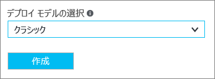
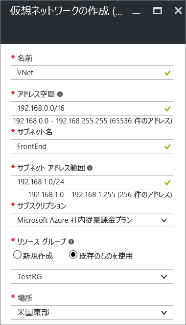
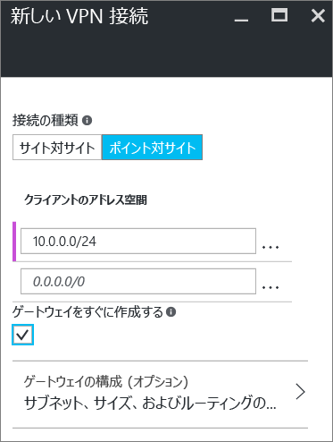

# Azure Portal を使用した VNet へのポイント対サイト接続の構成 (クラシック)
> [!div class="op_single_selector"]
> * [Resource Manager - Azure Portal](vpn-gateway-howto-point-to-site-resource-manager-portal.md)
> * [Resource Manager - PowerShell](vpn-gateway-howto-point-to-site-rm-ps.md)
> * [クラシック - Azure Portal](vpn-gateway-howto-point-to-site-classic-azure-portal.md)
>
>

ポイント対サイト (P2S) 構成では、個々のクライアント コンピューターから仮想ネットワークへのセキュリティで保護された接続を作成することができます。 P2S は、SSTP (Secure Socket トンネリング プロトコル) 経由の VPN 接続です。 ポイント対サイト接続は、自宅や会議室など、リモートの場所から VNet に接続する場合や、仮想ネットワークに接続する必要があるクライアントの数が少ない場合に便利です。 P2S 接続に VPN デバイスや公開 IP アドレスは必要ありません。 VPN 接続は、クライアント コンピューターから確立します。

この記事では、Azure Portal を使用して、ポイント対サイト接続を備えた VNet をクラシック デプロイメント モデルで作成する手順を説明します。 ポイント対サイト接続の詳細については、この記事の最後にある「[ポイント対サイト接続に関してよく寄せられる質問](#faq)」を参照してください。

### P2S 接続のデプロイメント モデルとデプロイ方法
[!INCLUDE [deployment models](../../includes/vpn-gateway-deployment-models-include.md)]

次の表は、2 つのデプロイメント モデルと、P2S 構成で使用可能なデプロイ方法を示しています。 構成手順を説明した記事が利用できるようになったら、表から直接リンクできるようにします。

[!INCLUDE [vpn-gateway-clasic-rm](../../includes/vpn-gateway-table-point-to-site-include.md)]

## 基本的なワークフロー

以降のセクションでは、仮想ネットワークに対してセキュリティで保護されたポイント対サイト接続を作成する方法を説明します。

1. 仮想ネットワークと VPN ゲートウェイの作成
2. 証明書の生成
3. .cer ファイルのアップロード
4. VPN クライアント構成パッケージの生成
5. クライアント コンピューターの構成
6. Connect to Azure

### 設定例
以下の設定例を使用できます。

* **名前: VNet1**
* **アドレス空間: 192.168.0.0/16** この例では、1 つのアドレス空間のみを使用します。 VNet には、複数のアドレス空間を使用することができます。
* **サブネット名: FrontEnd**
* **サブネットのアドレス範囲: 192.168.1.0/24**
* **サブスクリプション:** サブスクリプションが複数ある場合は、適切なサブスクリプションを使用していることを確認します。
* **リソース グループ: TestRG**
* **場所: 米国東部**
* **接続の種類: ポイント対サイト**
* **クライアント アドレス空間: 172.16.201.0/24**。 このポイント対サイト接続を利用して VNet に接続する VPN クライアントは、指定したプールから IP アドレスを受け取ります。
* **GatewaySubnet: 192.168.200.0/24**。 ゲートウェイ サブネット名は、"GatewaySubnet" にする必要があります。
* **サイズ:** 使用するゲートウェイ SKU を選択します。
* **ルーティングの種類: 動的**

## セクション 1 - 仮想ネットワークと VPN ゲートウェイの作成

最初に Azure サブスクリプションを持っていることを確認します。 Azure サブスクリプションをまだお持ちでない場合は、[MSDN サブスクライバーの特典](https://azure.microsoft.com/pricing/member-offers/msdn-benefits-details)を有効にするか、[無料アカウント](https://azure.microsoft.com/pricing/free-trial)にサインアップしてください。
### パート 1: 仮想ネットワークの作成
まだ仮想ネットワークがない場合は作成します。 スクリーンショットは例として示されています。 サンプルの値は必ず実際の値に変更してください。 Azure Portal を使用して VNet を作成するには、以下の手順に従ってください。

1. ブラウザーから [Azure Portal](http://portal.azure.com) に移動します。必要であれば Azure アカウントでサインインします。
2. **[新規]**をクリックします。 **[Marketplace を検索]** フィールドに「仮想ネットワーク」と入力します。 検索結果の一覧から **[仮想ネットワーク]** を探してクリックし、**[仮想ネットワーク]** ブレードを開きます。

    ![[仮想ネットワーク] ブレードの検索](./media/vpn-gateway-howto-point-to-site-classic-azure-portal/newvnetportal700.png)
3. [仮想ネットワーク] ブレードの下の方にある **[デプロイ モデルの選択]** の一覧で、**[クラシック]** を選択し、**[作成]** をクリックします。

    
4. **[仮想ネットワークの作成]** ブレードで、VNet の設定を構成します。 このブレードでは、最初のアドレス空間と 1 つのサブネット アドレスの範囲を追加します。 VNet の作成が完了したら、戻って、さらにサブネットとアドレス空間を追加できます。

    
5. **サブスクリプション** が正しいものであることを確認します。 ドロップダウンを使用して、サブスクリプションを変更できます。
6. **[リソース グループ]** をクリックし、既存のリソース グループを選択するか、新しいリソース グループの名前を入力して新しく作成します。 新しいグループを作成する場合は、計画した構成値に基づいて、リソース グループに名前を付けます。 リソース グループの詳細については、「[Azure Resource Manager の概要](../azure-resource-manager/resource-group-overview.md#resource-groups)」を参照してください。
7. 次に、VNet の **[場所]** 設定を選択します。 この場所の設定によって、VNet にデプロイしたリソースがどこに配置されるかが決まります。
8. ダッシュボードで VNet を簡単に検索できるようにするには、**[ダッシュボードにピン留めする]** を選択します。その後、**[作成]** をクリックします。

    
9. [作成] をクリックした後で、VNet の進捗状況を反映するタイルがダッシュボードに表示されます。 タイルは、VNet の作成が進むに従って変化します。

    
10. 仮想ネットワークを作成した後は、名前解決を処理するために、DNS サーバーの IP アドレスを追加できます。 仮想ネットワークの設定を開き、DNS サーバーをクリックして、使用する DNS サーバーの IP アドレスを追加します。 この設定で、新しい DNS サーバーが作成されることはありません。 リソースが通信できる DNS サーバーを必ず追加してください。

仮想ネットワークが作成されると、Azure クラシック ポータルの [ネットワーク] ページの **[状態]** に **[作成済み]** と表示されます。

### パート 2: ゲートウェイ サブネットと動的ルーティング ゲートウェイの作成
この手順では、ゲートウェイ サブネットと動的ルーティング ゲートウェイを作成します。 クラシック デプロイメント モデルの Azure Portal では、ゲートウェイ サブネットとゲートウェイを同じ構成ブレードで作成できます。

1. ポータルで、ゲートウェイを作成する仮想ネットワークに移動します。
2. 仮想ネットワークのブレードの **[概要]** ブレードにある [VPN 接続] で、**[ゲートウェイ]** をクリックします。

    
3. **[新しい VPN 接続]** ブレードで、**[ポイント対サイト]** を選択します。

    
4. **[クライアント アドレス空間]** で、IP アドレスの範囲を追加します。 これは、VPN クライアントが接続時に受け取る IP アドレスの範囲です。 自動入力される範囲を削除して、独自の範囲を追加します。

    
5. **[ゲートウェイをすぐに作成する]** チェック ボックスをオンにします。

    
6. **[ゲートウェイの構成 (オプション)]** をクリックして、**[ゲートウェイの構成]** ブレードを開きます。

    ![[ゲートウェイの構成 (オプション)] をクリック](./media/vpn-gateway-howto-point-to-site-classic-azure-portal/optsubnet125.png)
7. **[Subnet Configure required settings (サブネット構成の必須設定)]** をクリックして、**ゲートウェイ サブネット**を追加します。 /29 と同程度の小規模なゲートウェイ サブネットを作成することはできますが、少なくとも /28 または /27 以上を選択してさらに多くのアドレスが含まれる大規模なサブネットを作成することをお勧めします。 これにより、十分な数のアドレスが、将来的に必要になる可能性のある追加の構成に対応できるようになります。

   > [!IMPORTANT]
   > ゲートウェイ サブネットを使用する場合は、ゲートウェイ サブネットにネットワーク セキュリティ グループ (NSG) を関連付けないようにしてください。 このサブネットにネットワーク セキュリティ グループを関連付けると、VPN ゲートウェイが正常に動作しなくなることがあります。 ネットワーク セキュリティ グループの詳細については、「[ネットワーク セキュリティ グループ (NSG) について](../virtual-network/virtual-networks-nsg.md)」を参照してください。
   >
   >

    
8. ゲートウェイの **[サイズ]** を選択します。 これは、仮想ネットワーク ゲートウェイの作成に使用するゲートウェイ SKU です。 ポータルでは、既定の SKU は **[Basic]** です。 ゲートウェイ SKU の詳細については、「[VPN Gateway の設定について](vpn-gateway-about-vpn-gateway-settings.md#gwsku)」を参照してください。

    
9. ゲートウェイの **[ルーティングの種類]** を選択します。 P2S 構成には、**動的**なルーティングの種類が必要です。 このブレードの構成を終了したら、**[OK]** をクリックします。

    
10. **[新しい VPN 接続]** ブレードで、ブレードの下部にある **[OK]** をクリックして、仮想ネットワーク ゲートウェイの作成を開始します。 完了するまで最大 45 分かかることがあります。

## セクション 2: 証明書の作成
証明書は、ポイント対サイト VPN の VPN クライアントを認証するために、Azure によって使用されます。 ルート証明書の作成後、(秘密キーではなく) 公開証明書データを、Base-64 でエンコードされた X.509 .cer ファイルとしてエクスポートします。 その後、公開証明書データをルート証明書から Azure にアップロードします。

ポイント対サイトで VNet に接続するすべてのクライアント コンピューターには、クライアント証明書がインストールされている必要があります。 クライアント証明書はルート証明書から生成され、各クライアント コンピューターにインストールされます。 有効なクライアント証明書がインストールされていない状態でクライアントが VNet に接続した場合、認証に失敗します。

### パート 1: ルート証明書に使用する公開キー (.cer) の取得

####エンタープライズ証明書
 
エンタープライズ ソリューションを使用している場合、既存の証明書チェーンを使うことができます。 使用するルート証明書の .cer ファイルを取得します。

####自己署名ルート証明書

エンタープライズ証明書ソリューションを使用していない場合は、自己署名ルート証明書を作成する必要があります。 P2S 認証に必要なフィールドを含む自己署名証明書は、PowerShell を使用して作成できます。 自己署名ルート証明書の作成手順については、[PowerShell を使ったポイント対サイト接続用の自己署名証明書の作成](vpn-gateway-certificates-point-to-site.md)に関するページで確認できます。

> [!NOTE]
> 以前は、自己署名ルート証明書を作成してポイント対サイト接続用のクライアント証明書を生成する手段として makecert が推奨されていました。 現在は、PowerShell を使用してそれらの証明書を作成できるようになっています。 PowerShell を使う利点は、SHA-2 証明書を作成できることです。 必要な値については、[PowerShell を使ったポイント対サイト接続用の自己署名証明書の作成](vpn-gateway-certificates-point-to-site.md)に関するページを参照してください。
>
>

#### 自己署名ルート証明書用の公開キーをエクスポートするには

ポイント対サイト接続では、公開キー (.cer) が Azure にアップロードされている必要があります。 次の手順で、自己署名ルート証明書の .cer ファイルをエクスポートしてください。

1. 証明書から .cer ファイルを取得するには、 **certmgr.msc**を開きます。 自己署名ルート証明書を探して右クリックします (通常は 'Current User\Personal\Certificates' にあります)。 **[すべてのタスク]**、**[エクスポート]** の順にクリックします。 **証明書のエクスポート ウィザード**が開きます。
2. ウィザードで **[次へ]** をクリックします。 **[いいえ、秘密キーをエクスポートしません]** を選択して、**[次へ]** をクリックします。
3. **[エクスポート ファイルの形式]** ページで **[Base-64 encoded X.509 (.CER)]** を選択し、**[次へ]** をクリックします。 
4. **[エクスポートするファイル]** で、**[参照]** をクリックして証明書をエクスポートする場所を選択します。 **[ファイル名]**に証明書ファイルの名前を指定します。 その後、 **[次へ]**をクリックします。
5. **[完了]** をクリックして、証明書をエクスポートします。 "**エクスポートに成功しました**" というメッセージが表示されます。 **[OK]** をクリックしてウィザードを閉じます。

### パート 2: クライアント証明書の生成

接続するクライアントごとに一意の証明書を生成することも、複数のクライアントに同じ証明書を使用することもできます。 一意のクライアント証明書を生成する利点は、必要に応じて 1 つの証明書を失効させることができる点です。 そうでなければ、すべてのユーザーが同じクライアント証明書を使用していて、1 つのクライアントの証明書を失効させる必要がある場合は、認証にその証明書を使用するすべてのクライアントに新しい証明書を生成してインストールする必要があります。

####エンタープライズ証明書
- エンタープライズ証明書ソリューションを使用している場合は、"domain name\username" 形式ではなく、共通名の値の形式 "name@yourdomain.com" を使用してクライアント証明書を生成します。
- 発行するクライアント証明書が、使用リストの最初の項目としてスマート カード ログオンなどではなく "クライアント認証" が指定されている "ユーザー" 証明書テンプレートに基づいていることを確認します。証明書を確認するには、クライアント証明書をダブルクリックし、**[詳細]、[拡張キー使用法]** の順に選択して表示します。

####自己署名ルート証明書 
自己署名ルート証明書を使用する場合、[PowerShell を使ったクライアント証明書の生成](vpn-gateway-certificates-point-to-site.md#clientcert)に関するページで、ポイント対サイト接続に合ったクライアント証明書を生成する手順を参照してください。

### パート 3: クライアント証明書のエクスポート
[PowerShell](vpn-gateway-certificates-point-to-site.md#clientcert) を使った手順で自己署名ルート証明書からクライアント証明書を生成した場合、その作業に使用したコンピューターに自動的にクライアント証明書がインストールされます。 クライアント証明書を別のクライアント コンピューターにインストールする場合は、その証明書をエクスポートする必要があります。

1. クライアント証明書をエクスポートするには、 **certmgr.msc**を開きます。 エクスポートするクライアント証明書を右クリックして、**[すべてのタスク]**、**[エクスポート]** の順にクリックします。 **証明書のエクスポート ウィザード**が開きます。
2. ウィザードで **[次へ]** をクリックし、**[はい、秘密キーをエクスポートします]** を選択して、**[次へ]** をクリックします。
3. **[エクスポート ファイルの形式]** ページでは、既定値をそのまま使用します。 **[証明のパスにある証明書を可能であればすべて含む]** がオンになっていることを確認します。 その後、 **[次へ]**をクリックします。
4. **[セキュリティ]** ページでは、秘密キーを保護する必要があります。 パスワードを使用する場合は、この証明書に設定したパスワードを必ず記録しておくか、覚えておいてください。 その後、 **[次へ]**をクリックします。
5. **[エクスポートするファイル]** で、**[参照]** をクリックして証明書をエクスポートする場所を選択します。 **[ファイル名]**に証明書ファイルの名前を指定します。 その後、 **[次へ]**をクリックします。
6. **[完了]** をクリックして、証明書をエクスポートします。

## セクション 3: ルート証明書 .cer ファイルのアップロード
ゲートウェイが作成されたら、信頼されたルート証明書の .cer ファイルを Azure にアップロードできます。 最大 20 個のルート証明書のファイルをアップロードすることができます。 ルート証明書の秘密キーは、Azure にアップロードしません。 .cer ファイルをアップロードすると、Azure は仮想ネットワークに接続するクライアントの認証にそれを使用します。

1. VNet のブレードの **[VPN 接続]** セクションで**クライアント**のグラフィックをクリックして、**[ポイント対サイト VPN 接続]** ブレードを開きます。

    
2. **[ポイント対サイト接続]** ブレードで **[証明書の管理]** をクリックして、**[証明書]** ブレードを開きます。 

    ![[証明書] ブレード](./media/vpn-gateway-howto-point-to-site-classic-azure-portal/ptsmanage.png)  
3. **[証明書]** ブレードで **[アップロード]** をクリックして、**[証明書のアップロード]** ブレードを開きます。 

    ![[証明書のアップロード] ブレード](./media/vpn-gateway-howto-point-to-site-classic-azure-portal/uploadcerts.png) 
4. フォルダーのグラフィックをクリックして、.cer ファイルを参照します。 ファイルを選択し、**[OK]** をクリックします。 ページを更新して、アップロードした証明書を **[証明書]** ブレードで確認します。

     

## セクション 4: VPN クライアント構成パッケージの生成
仮想ネットワークに接続するには、VPN クライアントも構成する必要があります。 クライアント コンピューターが接続するためには、クライアント証明書と適切な VPN クライアント構成パッケージの両方が必要です。

VPN クライアント パッケージには、Windows に組み込まれた VPN クライアント ソフトウェアを構成する構成情報が含まれています。 このパッケージでは、追加のソフトウェアはインストールされません。 この設定は、接続先の仮想ネットワークに固有です。 サポートされているクライアント オペレーティング システムの一覧については、この記事の最後にある「[ポイント対サイト接続に関してよく寄せられる質問](#faq)」を参照してください。

### VPN クライアント構成パッケージを生成するには
1. Azure Portal で、VNet の **[概要]** ブレードの **[VPN 接続]** にあるクライアントのグラフィックをクリックして、**[ポイント対サイト VPN 接続]** ブレードを開きます。
2. **[ポイント対サイト VPN 接続]** ブレードの上部で、インストール先のクライアントのオペレーティング システムに対応するダウンロード パッケージをクリックします。

   * 64 ビット クライアントの場合は、**[VPN クライアント (64 ビット)]** を選択します。
   * 32 ビット クライアントの場合は、**[VPN クライアント (32 ビット)]** を選択します。

      
3. Azure が仮想ネットワークの VPN クライアント構成パッケージを生成しているというメッセージが表示されます。 数分後にパッケージが生成され、パッケージがダウンロードされたというメッセージがローカル コンピューターに表示されます。 構成パッケージ ファイルを保存します。 これを、P2S を使用して仮想ネットワークに接続する各クライアント コンピューターにインストールします。

## セクション 5: クライアント コンピューターの構成
### パート 1: エクスポートしたクライアント証明書のインストール

クライアント証明書の生成に使用したクライアント コンピューター以外から P2S 接続を作成する場合は、クライアント証明書をインストールする必要があります。 クライアント証明書をインストールするときに、クライアント証明書のエクスポート時に作成されたパスワードが必要になります。

1. *.pfx* ファイルを見つけ、クライアント コンピューターにコピーします。 クライアント コンピューターで、 *.pfx* ファイルをダブルクリックしてインストールします。 **[ストアの場所]** は **[現在のユーザー]** のままにしておき、**[次へ]** をクリックします。
2. **[インポートするファイル]** ページでは、何も変更しないでください。 **[次へ]**をクリックします。
3. **[秘密キーの保護]** ページで、証明書にパスワードを使用した場合はそのパスワード入力するか、証明書をインストールするセキュリティ プリンシパルが正しいことを確認し、**[次へ]** をクリックします。
4. **[証明書ストア]** ページで、既定の場所をそのまま使用し、**[次へ]** をクリックします。
5. **[完了]**をクリックします。 証明書のインストールの **[セキュリティ警告]** で **[はい]** をクリックします。 証明書を生成したので、[はい] をクリックしても問題ありません。 これで証明書がインポートされます。

### パート 2: VPN クライアント構成パッケージのインストール
バージョンがクライアントのアーキテクチャと一致すれば、各クライアント コンピューターで同じ VPN クライアント構成パッケージを使用できます。

1. 仮想ネットワークに接続するコンピューターのローカルに構成ファイルをコピーします。 
2. .exe ファイルをダブルクリックしてパッケージをクライアント コンピューターにインストールします。 自分で作成した構成パッケージは署名されていません。 そのため、警告が表示されることがあります。 Windows SmartScreen ポップアップが表示された場合は、**[詳細]** (左側)、**[実行]** の順にクリックして、パッケージをインストールします。
3. クライアント コンピューターで **[ネットワークの設定]** に移動し、**[VPN]** をクリックします。 接続が一覧で表示されます。 接続先となる仮想ネットワークの名前が、次のように表示されます。

    

## セクション 6 - Azure への接続
### VNet への接続
1. VNet に接続するには、クライアント コンピューターで [VPN 接続] に移動し、作成した VPN 接続を見つけます。 仮想ネットワークと同じ名前が付いています。 **[接続]**をクリックします。 証明書を使用することを示すポップアップ メッセージが表示される場合があります。 その場合、 **[続行]** をクリックして、昇格された特権を使用します。
2. **接続**の状態ページで、**[接続]** をクリックして接続を開始します。 **[証明書の選択]** 画面が表示された場合は、表示されているクライアント証明書が接続に使用する証明書であることを確認します。 そうでない場合は、ドロップダウン矢印を使用して適切な証明書を選択し、 **[OK]**をクリックします。

    
3. これで接続が確立されたはずです。

    

> [!NOTE]
> エンタープライズ CA ソリューションを使用して発行した証明書を使用している場合に認証の問題が発生したときは、クライアント証明書の認証の順序を確認します。 認証の一覧の順序を確認するには、クライアント証明書をダブルクリックし、**[詳細]、[拡張キー使用法]** の順に選択します。 一覧の最初の項目として "クライアント認証" が表示されていることを確認します。 表示されていない場合は、一覧の最初の項目が "クライアント認証" であるユーザー テンプレートに基づいたクライアント証明書を発行する必要があります。 
>
>

### VPN 接続の確認
1. VPN 接続がアクティブであることを確認するには、管理者特権でのコマンド プロンプトを開いて、 *ipconfig/all*を実行します。
2. 結果を表示します。 受信した IP アドレスが、VNet の作成時に指定したポイント対サイト接続アドレス範囲内のアドレスのいずれかであることに注意してください。 結果は、次のようになります。

例:

    PPP adapter VNet1:
        Connection-specific DNS Suffix .:
        Description.....................: VNet1
        Physical Address................:
        DHCP Enabled....................: No
        Autoconfiguration Enabled.......: Yes
        IPv4 Address....................: 192.168.130.2(Preferred)
        Subnet Mask.....................: 255.255.255.255
        Default Gateway.................:
        NetBIOS over Tcpip..............: Enabled

## 信頼されたルート証明書を追加または削除する

信頼されたルート証明書を Azure に追加したり、Azure から削除したりできます。 信頼された証明書を削除すると、そのルート証明書から生成されたクライアント証明書は、ポイント対サイトを介して Azure に接続することができなくなります。 クライアントが接続できるようにするには、Azure で信頼されている証明書から生成された新しいクライアント証明書をインストールする必要があります。

### 信頼されたルート証明書を追加するには

信頼されたルート証明書 .cer ファイルを最大 20 個まで Azure に追加できます。 手順については、「[セクション 3: ルート証明書 .cer ファイルのアップロード](#upload)」を参照してください。

### 信頼されたルート証明書を削除するには

1. VNet のブレードの **[VPN 接続]** セクションで**クライアント**のグラフィックをクリックして、**[ポイント対サイト VPN 接続]** ブレードを開きます。

    
2. **[ポイント対サイト接続]** ブレードで **[証明書の管理]** をクリックして、**[証明書]** ブレードを開きます。 

    ![[証明書] ブレード](./media/vpn-gateway-howto-point-to-site-classic-azure-portal/ptsmanage.png)  
3. **[証明書]** ブレードで、削除する証明書の横にある省略記号をクリックしてから **[削除]** をクリックします。

      

## クライアント証明書の失効
クライアント証明書は失効させることができます。 証明書失効リストを使用すると、個々のクライアント証明書に基づくポイント対サイト接続を選択して拒否することができます。 これは、信頼されたルート証明書を削除する場合とは異なります。 信頼されたルート証明書 .cer を Azure から削除すると、失効したルート証明書によって生成または署名されたすべてのクライアント証明書のアクセス権が取り消されます。 ルート証明書ではなくクライアント証明書を失効させることで、ルート証明書から生成されたその他の証明書は、その後もポイント対サイト接続の認証に使用できます。

一般的な方法としては、ルート証明書を使用してチームまたは組織レベルでアクセスを管理し、失効したクライアント証明書を使用して、個々のユーザーの細かいアクセス制御を構成します。

### クライアント証明書を失効させるには

失効リストに拇印を追加することで、クライアント証明書を失効させることができます。

1. クライアント証明書の拇印を取得します。 詳細については、「[方法: 証明書のサムプリントを取得する](https://msdn.microsoft.com/library/ms734695.aspx)」を参照してください。
2. 情報をテキスト エディターにコピーし、文字列が 1 つにつながるようにスペースをすべて削除します。
3. **"クラシック仮想ネットワーク名"、[ポイント対サイト VPN 接続]、[証明書]** ブレードの順に移動し、**[失効リスト]** をクリックして失効リストのブレードを開きます。 
4. **[失効リスト]** ブレードで、**[+証明書の追加]** をクリックして **[失効リストに証明書を追加する]** ブレードを開きます。
5. **[失効リストに証明書を追加する]** ブレードで、スペースのない 1 行の連続したテキストとして証明書の拇印を貼り付けます。 ブレードの下部にある **[OK]** をクリックします。
6. 更新が完了した後は、証明書を接続に使用することができなくなります。 この証明書を使用して接続を試みたクライアントには、証明書が無効になっていることを示すメッセージが表示されます。

## ポイント対サイト接続に関してよく寄せられる質問

[!INCLUDE [Point-to-Site FAQ](../../includes/vpn-gateway-point-to-site-faq-include.md)]

## 次のステップ
接続が完成したら、仮想ネットワークに仮想マシンを追加することができます。 詳細については、[Virtual Machines](https://docs.microsoft.com/azure/#pivot=services&panel=Compute) に関するページを参照してください。 ネットワークと仮想マシンの詳細については、「[Azure と Linux の VM ネットワークの概要](../virtual-machines/linux/azure-vm-network-overview.md)」を参照してください。

