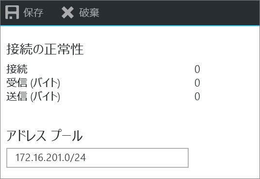
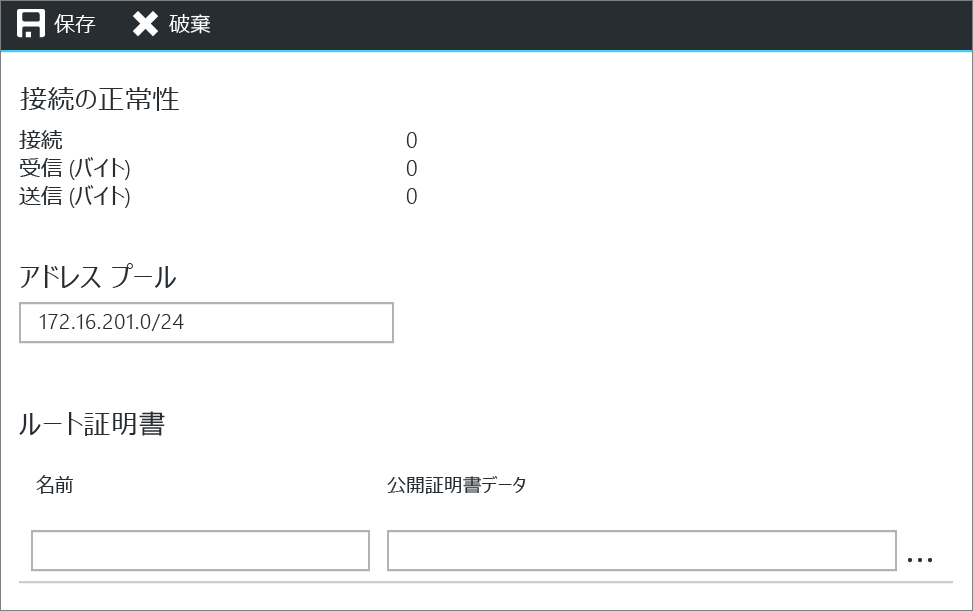
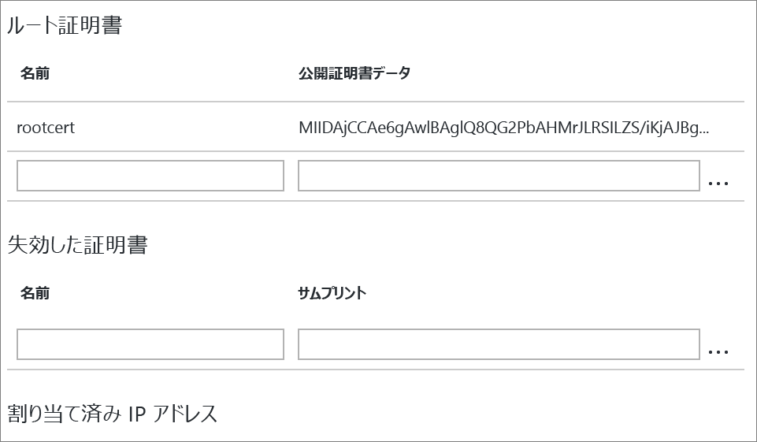
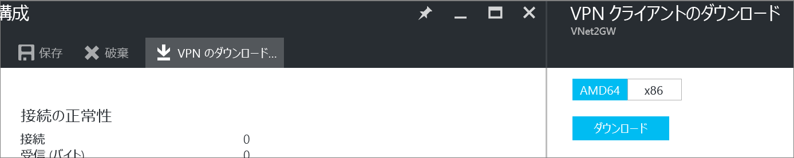

# Azure Portal を使用した VNet へのポイント対サイト接続の構成
> [!div class="op_single_selector"]
> * [Resource Manager - Azure Portal](vpn-gateway-howto-point-to-site-resource-manager-portal.md)
> * [Resource Manager - PowerShell](vpn-gateway-howto-point-to-site-rm-ps.md)
> * [クラシック - Azure Portal](vpn-gateway-howto-point-to-site-classic-azure-portal.md)
> 
> 

ポイント対サイト (P2S) 構成では、個々のクライアント コンピューターから仮想ネットワークへのセキュリティで保護された接続を作成することができます。 P2S 接続は、自宅や会議室など、リモートの場所から VNet に接続する場合や、仮想ネットワークに接続する必要があるクライアントの数が少ない場合に便利です。 

ポイント対サイト接続を機能させるために、VPN デバイスや公開 IP アドレスは必要ありません。 VPN 接続を確立するには、クライアント コンピューターからの接続を開始します。 ポイント対サイト接続の詳細については、「[VPN Gateway に関する FAQ](vpn-gateway-vpn-faq.md#point-to-site-connections)」と[計画と設計](vpn-gateway-plan-design.md)に関するページを参照してください。

この記事では、Azure Portal を使用した、Resource Manager デプロイメント モデルでのポイント対サイト接続を持つ VNet の作成について説明します。

### P2S 接続のデプロイメント モデルとデプロイ方法
[!INCLUDE [deployment models](../../includes/vpn-gateway-deployment-models-include.md)]

次の表は、2 つのデプロイメント モデルと、P2S 構成で使用可能なデプロイ方法を示しています。 構成手順を説明した記事が利用できるようになったら、表から直接リンクできるようにします。

[!INCLUDE [vpn-gateway-clasic-rm](../../includes/vpn-gateway-table-point-to-site-include.md)]

## 基本的なワークフロー

### 値の例
* **名前: VNet1**
* **アドレス空間: 192.168.0.0/16** この例では、1 つのアドレス空間のみを使用します。 VNet には、複数のアドレス空間を使用することができます。
* **サブネット名: FrontEnd**
* **サブネットのアドレス範囲: 192.168.1.0/24**
* **サブスクリプション:** サブスクリプションが複数ある場合は、適切なサブスクリプションを使用していることを確認します。
* **リソース グループ: TestRG**
* **場所: 米国東部**
* **GatewaySubnet: 192.168.200.0/24**
* **仮想ネットワーク ゲートウェイ名: VNet1GW**
* **ゲートウェイの種類: VPN**
* **VPN の種類: ルート ベース**
* **パブリック IP アドレス: VNet1GWpip**
* **接続の種類: ポイント対サイト**
* **クライアント アドレス プール: 172.16.201.0/24** このポイント対サイト接続を利用して VNet に接続する VPN クライアントは、クライアント アドレス プールから IP アドレスを受け取ります。

## 作業を開始する前に
* Azure サブスクリプションを持っていることを確認します。 Azure サブスクリプションをまだお持ちでない場合は、[MSDN サブスクライバーの特典](https://azure.microsoft.com/pricing/member-offers/msdn-benefits-details)を有効にするか、[無料アカウント](https://azure.microsoft.com/pricing/free-trial)にサインアップしてください。

## パート 1 - 仮想ネットワークの作成
練習としてこの構成を作成する場合は、[値の例](#example)を参照してください。

[!INCLUDE [vpn-gateway-basic-vnet-rm-portal](../../includes/vpn-gateway-basic-vnet-rm-portal-include.md)]

### 2.アドレス空間とサブネットの追加
VNet が作成されたら、アドレス空間とサブネットをさらに追加できます。

[!INCLUDE [vpn-gateway-additional-address-space](../../includes/vpn-gateway-additional-address-space-include.md)]

### 3.ゲートウェイ サブネットの作成
仮想ネットワークをゲートウェイに接続する前に、まず、接続先の仮想ネットワークのゲートウェイ サブネットを作成する必要があります。 将来的な構成要件も見越して十分な IP アドレスを確保するために、可能であれば、/28 または /27 の CIDR ブロックを使用してゲートウェイ サブネットを作成することをお勧めします。

このセクションのスクリーンショットは、参照用の例です。 構成に必要な値に対応する GatewaySubnet アドレス範囲を使用するようにしてください。

**ゲートウェイ サブネットを作成するには**

[!INCLUDE [vpn-gateway-add-gwsubnet-rm-portal](../../includes/vpn-gateway-add-gwsubnet-rm-portal-include.md)]

### 4.DNS サーバーの指定 (省略可能)
[!INCLUDE [vpn-gateway-add-dns-rm-portal](../../includes/vpn-gateway-add-dns-rm-portal-include.md)]

## パート 2 - 仮想ネットワーク ゲートウェイの作成
ポイント対サイト接続では、以下の設定が必要です。

* ゲートウェイの種類: VPN
* VPN の種類: ルート ベース

### 仮想ネットワーク ゲートウェイを作成するには
[!INCLUDE [vpn-gateway-add-gw-rm-portal](../../includes/vpn-gateway-add-gw-rm-portal-include.md)]

## パート 3 - 証明書の生成
証明書は、ポイント対サイト VPN の VPN クライアントを認証するために、Azure によって使用されます。 秘密キーではなく公開証明書データを Base 64 エンコードの X.509 .cer ファイルとして、エンタープライズ証明書ソリューションによって生成されたルート証明書から、または自己署名ルート証明書からエクスポートします。 その後、公開証明書データをルート証明書から Azure にインポートします。 また、クライアントのルート証明書からクライアント証明書を生成する必要があります。 P2S 接続を使用して仮想ネットワークに接続する各クライアントには、ルート証明書から生成されたクライアント証明書をインストールする必要があります。

### 1.ルート証明書の .cer ファイルの取得
エンタープライズ ソリューションを使用している場合、既存の証明書チェーンを使うことができます。 エンタープライズ CA ソリューションを使用していない場合、自己署名ルート証明書を作成できます。 自己署名証明書を作成する方法の 1 つに、makecert があります。

* エンタープライズ証明書システムを使用している場合は、使用するルート証明書の .cer ファイルを取得します。 
* エンタープライズ証明書ソリューションを使用していない場合は、自己署名ルート証明書を生成する必要があります。 Windows 10 向けの手順については、 [ポイント対サイト構成の自己署名ルート証明書の操作](vpn-gateway-certificates-point-to-site.md)に関する記事を参照してください。

1. 証明書から .cer ファイルを取得するには、**certmgr.msc** を開き、ルート証明書を見つけます。 自己署名ルート証明書を右クリックし、**[すべてのタスク]** をクリックしてから **[エクスポート]** をクリックします。 **証明書のエクスポート ウィザード**が開きます。
2. ウィザードで **[次へ]** をクリックし、**[いいえ、秘密キーをエクスポートしません]** を選択して、**[次へ]** をクリックします。
3. **[エクスポート ファイルの形式]** ページで、**[Base-64 encoded X.509 (.CER)]** を選択します。 次に、 **[次へ]**をクリックします。 
4. **[エクスポートするファイル]** で、**[参照]** をクリックして証明書をエクスポートする場所を選択します。 **[ファイル名]**に証明書ファイルの名前を指定します。 その後、 **[次へ]**をクリックします。
5. **[完了]** をクリックして、証明書をエクスポートします。

### 2.クライアント証明書を生成
接続するクライアントごとに一意の証明書を生成することも、複数のクライアントに同じ証明書を使用することもできます。 一意のクライアント証明書を生成する利点は、必要に応じて 1 つの証明書を失効させることができる点です。 そうでなければ、すべてのユーザーが同じクライアント証明書を使用していて、1 つのクライアントの証明書を失効させる必要がある場合は、認証にその証明書を使用するすべてのクライアントに新しい証明書を生成してインストールする必要があります。

* エンタープライズ証明書ソリューションを使用している場合は、"domain name\username" 形式ではなく、共通名の値の形式 "'name@yourdomain.com'," を使用してクライアント証明書を生成します。 
* 自己署名証明書を使用している場合は、 [ポイント対サイト構成の自己署名ルート証明書の操作](vpn-gateway-certificates-point-to-site.md) に関する記事を参照して、クライアント証明書を生成してください。

### 3.クライアント証明書のエクスポート
クライアント証明書は認証に必要です。 クライアント証明書を生成した後、それをエクスポートします。 エクスポートしたクライアント証明書は、後で各クライアント コンピューターにインストールされます。

1. クライアント証明書をエクスポートするには、 *certmgr.msc*を使用できます。 エクスポートするクライアント証明書を右クリックして、**[すべてのタスク]**、**[エクスポート]** の順にクリックします。
2. クライアント証明書と秘密キーをエクスポートします。 これは *.pfx* ファイルです。 この証明書に設定したパスワード (キー) を記録するか、覚えておいてください。

## パート 4 - クライアント アドレス プールの追加
1. 仮想ネットワーク ゲートウェイが作成されたら、[仮想ネットワーク ゲートウェイ] ブレードの **[設定]** セクションに移動します。 **[設定]** セクションで **[ポイント対サイトの構成]** をクリックして、**[構成]** ブレードを開きます。
   
    
2. **アドレス プール**は、接続するクライアントが受け取る IP アドレスのプールです。 アドレス プールを追加し、**[保存]** をクリックします。
   
    

## パート 5 - ルート証明書 .cer ファイルのアップロード
ゲートウェイが作成されたら、信頼されたルート証明書の .cer ファイルを Azure にアップロードできます。 最大 20 個のルート証明書のファイルをアップロードすることができます。 ルート証明書の秘密キーは、Azure にアップロードしません。 .cer ファイルをアップロードすると、Azure は仮想ネットワークに接続するクライアントの認証にそれを使用します。

1. **[ポイント対サイトの構成]** ブレードに移動します。 このブレードの **[ルート証明書]** セクションで .cer ファイルを追加することになります。
   
    
2. ルート証明書を Base 64 でエンコードされた X.509 (.cer) ファイルとしてエクスポートしたことを確認してください。 証明書をテキスト エディターで開くことができるように、この形式でエクスポートする必要があります。
3. 証明書をメモ帳などのテキスト エディターで開きます。 次のセクションだけをコピーします。
   
    
4. ポータルの **[公開証明書データ]** セクションに証明書データを貼り付けます。 証明書の名前を **[名前]** 領域に入力し、**[保存]** をクリックします。 最大 20 個の信頼されたルート証明書を追加できます。
   
    

## パート 6 - VPN クライアント構成パッケージのダウンロードとインストール
P2S を使用して Azure に接続するクライアントには、クライアント証明書と VPN クライアント構成パッケージの両方がインストールされている必要があります。 Windows クライアントの場合、VPN クライアント構成パッケージが利用できます。 

VPN クライアント パッケージには、Windows に組み込まれている VPN クライアント ソフトウェアを構成するための情報が含まれています。 構成は、接続先の VPN に固有です。 このパッケージでは、追加のソフトウェアはインストールされません。 詳細については、「 [VPN Gateway に関する FAQ](vpn-gateway-vpn-faq.md#point-to-site-connections) 」を参照してください。

1. **[ポイント対サイトの構成]** ブレードで **[Download VPN client (VPN クライアントのダウンロード)]** をクリックして、**[Download VPN client (VPN クライアントのダウンロード)]** ブレードを開きます。
   
    
2. クライアント用の適切なパッケージを選択して、**[ダウンロード]** をクリックします。 64 ビット クライアントの場合は、**[AMD64]** を選択します。 32 ビット クライアントの場合は、**[x86]** を選択します。
3. パッケージをクライアント コンピューターにインストールします。 SmartScreen ポップアップが表示された場合は、**[詳細]**、**[実行]** の順にクリックして、パッケージをインストールします。
4. クライアント コンピューターで **[ネットワークの設定]** に移動し、**[VPN]** をクリックします。 接続が一覧で表示されます。 接続先となる仮想ネットワークの名前が、次の例のように表示されます。 
   
    

## パート 7 - クライアント証明書のインストール
各クライアント コンピューターには、認証のためにクライアント証明書が必要です。 クライアント証明書をインストールするときに、クライアント証明書のエクスポート時に作成されたパスワードが必要になります。

1. .pfx ファイルをクライアント コンピューターにコピーします。
2. .pfx ファイルをダブルクリックしてインストールします。 インストール先は変更しないでください。

## パート 8 - Azure への接続
1. VNet に接続するには、クライアント コンピューターで [VPN 接続] に移動し、作成した VPN 接続を見つけます。 仮想ネットワークと同じ名前が付いています。 **[接続]**をクリックします。 証明書を使用することを示すポップアップ メッセージが表示される場合があります。 その場合、 **[続行]** をクリックして、昇格された特権を使用します。 
2. **接続**の状態ページで、**[接続]** をクリックして接続を開始します。 **[証明書の選択]** 画面が表示された場合は、表示されているクライアント証明書が接続に使用する証明書であることを確認します。 そうでない場合は、ドロップダウン矢印を使用して適切な証明書を選択し、 **[OK]**をクリックします。
   
    
3. これで接続が確立されたはずです。
   
    

## パート 9 - 接続の確認
1. VPN 接続がアクティブであることを確認するには、管理者特権でのコマンド プロンプトを開いて、 *ipconfig/all*を実行します。
2. 結果を表示します。 受信した IP アドレスが、構成に指定したポイント対サイト VPN クライアント アドレス プール内のアドレスのいずれかであることに注意してください。 結果は、次のようになります。
   
        PPP adapter VNet1:
            Connection-specific DNS Suffix .:
            Description.....................: VNet1
            Physical Address................:
            DHCP Enabled....................: No
            Autoconfiguration Enabled.......: Yes
            IPv4 Address....................: 172.16.201.3(Preferred)
            Subnet Mask.....................: 255.255.255.255
            Default Gateway.................:
            NetBIOS over Tcpip..............: Enabled

## 信頼されたルート証明書を追加または削除するには
信頼されたルート証明書を Azure から削除できます。 信頼された証明書を削除すると、そのルート証明書から生成されたクライアント証明書は、ポイント対サイトを介して Azure に接続することができなくなります。 クライアントが接続できるようにするには、Azure で信頼されている証明書から生成された新しいクライアント証明書をインストールする必要があります。

**[ポイント対サイトの構成]** ブレードで、失効したクライアント証明書の一覧を管理できます。 このブレードは、[信頼されたルート証明書のアップロード](#uploadfile)に使用したものです。

## 失効したクライアント証明書のリストを管理するには
クライアント証明書は失効させることができます。 証明書失効リストを使用すると、個々のクライアント証明書に基づくポイント対サイト接続を選択して拒否することができます。 ルート証明書 .cer を Azure から削除すると、失効したルート証明書によって生成または署名されたすべてのクライアント証明書のアクセス権は取り消されます。 ルート証明書ではなく、特定のクライアント証明書を失効させることもできます。 この場合、ルート証明書から生成された他の証明書は有効なままです。 

一般的な方法としては、ルート証明書を使用してチームまたは組織レベルでアクセスを管理し、失効したクライアント証明書を使用して、個々のユーザーの細かいアクセス制御を構成します。

**[ポイント対サイトの構成]** ブレードで、失効したクライアント証明書の一覧を管理できます。 このブレードは、[信頼されたルート証明書のアップロード](#uploadfile)に使用したものです。

## 次のステップ
接続が完成したら、仮想ネットワークに仮想マシンを追加することができます。 詳細については、[Virtual Machines](https://docs.microsoft.com/azure/#pivot=services&panel=Compute) に関するページを参照してください。

<!--HONumber=Nov16_HO3-->

