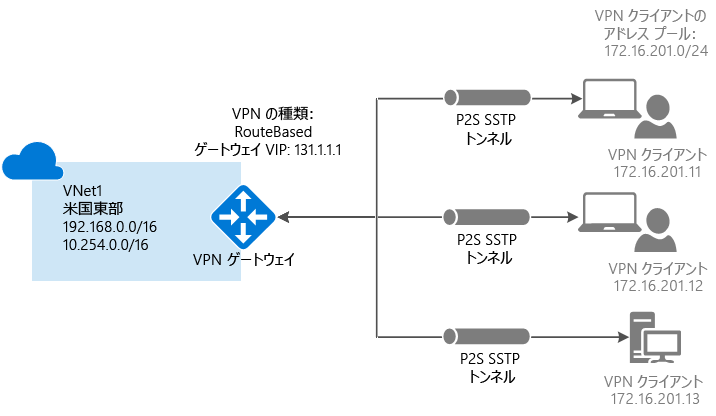
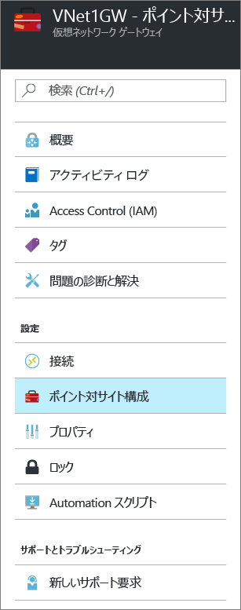
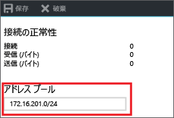
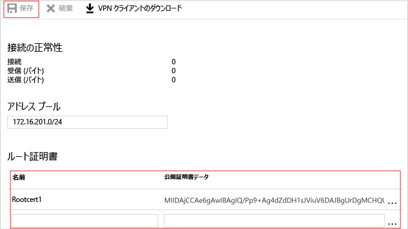

# Azure Portal を使用した VNet へのポイント対サイト接続の構成
> [!div class="op_single_selector"]
> * [Resource Manager - Azure Portal](vpn-gateway-howto-point-to-site-resource-manager-portal.md)
> * [Resource Manager - PowerShell](vpn-gateway-howto-point-to-site-rm-ps.md)
> * [クラシック - Azure Portal](vpn-gateway-howto-point-to-site-classic-azure-portal.md)
> 
> 

ポイント対サイト (P2S) 構成では、個々のクライアント コンピューターから仮想ネットワークへのセキュリティで保護された接続を作成することができます。 P2S は、SSTP (Secure Socket トンネリング プロトコル) 経由の VPN 接続です。 ポイント対サイト接続は、自宅や会議室など、リモートの場所から VNet に接続する場合や、仮想ネットワークに接続する必要があるクライアントの数が少ない場合に便利です。 P2S 接続に VPN デバイスや公開 IP アドレスは必要ありません。 VPN 接続は、クライアント コンピューターから確立します。

この記事では、Azure Portal を使用して、ポイント対サイト接続を備えた VNet を作成する手順を説明します。 ポイント対サイト接続の詳細については、この記事の最後にある「[ポイント対サイト接続に関してよく寄せられる質問](#faq)」を参照してください。

### P2S 接続のデプロイメント モデルとデプロイ方法
[!INCLUDE [deployment models](../../includes/vpn-gateway-deployment-models-include.md)]

次の表は、2 つのデプロイメント モデルと、P2S 構成で使用可能なデプロイ方法を示しています。 構成手順を説明した記事が利用できるようになったら、表から直接リンクできるようにします。

[!INCLUDE [vpn-gateway-clasic-rm](../../includes/vpn-gateway-table-point-to-site-include.md)]

## 基本的なワークフロー

### 値の例
* **名前: VNet1**
* **アドレス空間: 192.168.0.0/16** この例では、1 つのアドレス空間のみを使用します。 VNet には、複数のアドレス空間を使用することができます。
* **サブネット名: FrontEnd**
* **サブネットのアドレス範囲: 192.168.1.0/24**
* **サブスクリプション:** サブスクリプションが複数ある場合は、適切なサブスクリプションを使用していることを確認します。
* **リソース グループ: TestRG**
* **場所: 米国東部**
* **GatewaySubnet: 192.168.200.0/24**
* **仮想ネットワーク ゲートウェイ名: VNet1GW**
* **ゲートウェイの種類: VPN**
* **VPN の種類: ルート ベース**
* **パブリック IP アドレス: VNet1GWpip**
* **接続の種類: ポイント対サイト**
* **クライアント アドレス プール: 172.16.201.0/24** このポイント対サイト接続を利用して VNet に接続する VPN クライアントは、クライアント アドレス プールから IP アドレスを受け取ります。

## パート 1 - 仮想ネットワークの作成
最初に Azure サブスクリプションを持っていることを確認します。 Azure サブスクリプションをまだお持ちでない場合は、[MSDN サブスクライバーの特典](https://azure.microsoft.com/pricing/member-offers/msdn-benefits-details)を有効にするか、[無料アカウント](https://azure.microsoft.com/pricing/free-trial)にサインアップしてください。 練習としてこの構成を作成する場合は、[値の例](#example)を参照してください。

[!INCLUDE [vpn-gateway-basic-vnet-rm-portal](../../includes/vpn-gateway-basic-vnet-rm-portal-include.md)]

## パート 2 - アドレス空間とサブネットの指定
VNet が作成されたら、アドレス空間とサブネットをさらに追加できます。

[!INCLUDE [vpn-gateway-additional-address-space](../../includes/vpn-gateway-additional-address-space-include.md)]

## パート 3 - ゲートウェイ サブネットの追加

仮想ネットワークをゲートウェイに接続する前に、まず、接続先の仮想ネットワークのゲートウェイ サブネットを作成する必要があります。 ゲートウェイ サービスでは、ゲートウェイ サブネット内に指定された IP アドレスを使用します。 将来的な構成要件も見越して十分な IP アドレスを確保するために、可能であれば、/28 または /27 の CIDR ブロックを使用してゲートウェイ サブネットを作成します。

このセクションのスクリーンショットは、参照用の例です。 構成に必要な値に対応する GatewaySubnet アドレス範囲を使用するようにしてください。

###ゲートウェイ サブネットを作成するには

[!INCLUDE [vpn-gateway-add-gwsubnet-rm-portal](../../includes/vpn-gateway-add-gwsubnet-rm-portal-include.md)]

## パート 4 - DNS サーバーの指定 (省略可能)

ポイント対サイト接続に DNS は不要です。 ただし仮想ネットワークにデプロイされたリソースで名前解決を使用する場合は、DNS サーバーを指定する必要があります。 この設定では、この仮想ネットワークの名前解決に使用する DNS サーバーを指定することができます。 この設定で、DNS サーバーは作成されません。

[!INCLUDE [vpn-gateway-add-dns-rm-portal](../../includes/vpn-gateway-add-dns-rm-portal-include.md)]

## パート 5 - 仮想ネットワーク ゲートウェイの作成
ポイント対サイト接続では、以下の設定が必要です。

* ゲートウェイの種類: VPN
* VPN の種類: ルート ベース

### 仮想ネットワーク ゲートウェイを作成するには
[!INCLUDE [vpn-gateway-add-gw-rm-portal](../../includes/vpn-gateway-add-gw-rm-portal-include.md)]

## パート 6 - 証明書の生成

証明書は、ポイント対サイト VPN の VPN クライアントを認証するために、Azure によって使用されます。 ルート証明書の作成後、(秘密キーではなく) 公開証明書データを、Base-64 でエンコードされた X.509 .cer ファイルとしてエクスポートします。 その後、公開証明書データをルート証明書から Azure にアップロードします。

ポイント対サイトで VNet に接続するすべてのクライアント コンピューターには、クライアント証明書がインストールされている必要があります。 クライアント証明書はルート証明書から生成され、各クライアント コンピューターにインストールされます。 有効なクライアント証明書がインストールされていない状態でクライアントが VNet に接続した場合、認証に失敗します。

### 手順 1 - ルート証明書の .cer ファイルの取得

####エンタープライズ証明書
 
エンタープライズ ソリューションを使用している場合、既存の証明書チェーンを使うことができます。 使用するルート証明書の .cer ファイルを取得します。

####自己署名ルート証明書

エンタープライズ証明書ソリューションを使用していない場合は、自己署名ルート証明書を作成する必要があります。 P2S 認証に必要なフィールドを含む自己署名ルート証明書は、PowerShell を使用して作成できます。 自己署名ルート証明書の作成手順については、「[Create a self-signed root certificate for Point-to-Site connections using PowerShell (PowerShell を使ったポイント対サイト接続用自己署名ルート証明書の作成)](vpn-gateway-certificates-point-to-site.md)」で確認できます。

> [!NOTE]
> 以前は、自己署名ルート証明書を作成してポイント対サイト接続用のクライアント証明書を生成する手段として makecert が推奨されていました。 現在は、PowerShell を使用してそれらの証明書を作成できるようになっています。 PowerShell を使う利点は、SHA-2 証明書を作成できることです。 必要な値については、「[Create a self-signed root certificate for Point-to-Site connections using PowerShell (PowerShell を使ったポイント対サイト接続用自己署名ルート証明書の作成)](vpn-gateway-certificates-point-to-site.md)」を参照してください。
>
>

#### 自己署名ルート証明書用の公開キーをエクスポートするには

ポイント対サイト接続では、公開キー (.cer) が Azure にアップロードされている必要があります。 次の手順で、自己署名ルート証明書の .cer ファイルをエクスポートしてください。

1. 証明書から .cer ファイルを取得するには、 **certmgr.msc**を開きます。 自己署名ルート証明書を探して右クリックします (通常は 'Current User\Personal\Certificates' にあります)。 **[すべてのタスク]**、**[エクスポート]** の順にクリックします。 **証明書のエクスポート ウィザード**が開きます。
2. ウィザードで **[次へ]** をクリックします。 **[いいえ、秘密キーをエクスポートしません]** を選択して、**[次へ]** をクリックします。
3. **[エクスポート ファイルの形式]** ページで **[Base-64 encoded X.509 (.CER)]** を選択し、**[次へ]** をクリックします。 
4. **[エクスポートするファイル]** で、**[参照]** をクリックして証明書をエクスポートする場所を選択します。 **[ファイル名]**に証明書ファイルの名前を指定します。 その後、 **[次へ]**をクリックします。
5. **[完了]** をクリックして、証明書をエクスポートします。 "**エクスポートに成功しました**" というメッセージが表示されます。 **[OK]** をクリックしてウィザードを閉じます。

### 手順 2 - クライアント証明書の生成
仮想ネットワークに接続するクライアントごとに一意の証明書を生成することも、複数のクライアントに同じ証明書を使用することもできます。 一意のクライアント証明書を生成する利点は、必要に応じて 1 つの証明書を失効させることができる点です。 そうでなければ、すべてのユーザーが同じクライアント証明書を使用していて、1 つのクライアントの証明書を失効させる必要がある場合は、認証にその証明書を使用するすべてのクライアントに新しい証明書を生成してインストールする必要があります。

####エンタープライズ証明書
- エンタープライズ証明書ソリューションを使用している場合は、"domain name\username" 形式ではなく、共通名の値の形式 "name@yourdomain.com" を使用してクライアント証明書を生成します。
- 発行するクライアント証明書が、使用リストの最初の項目としてスマート カード ログオンなどではなく "クライアント認証" が指定されている "ユーザー" 証明書テンプレートに基づいていることを確認します。証明書を確認するには、クライアント証明書をダブルクリックし、**[詳細]、[拡張キー使用法]** の順に選択して表示します。

####自己署名ルート証明書 
自己署名ルート証明書を使用する場合、[PowerShell を使ったクライアント証明書の生成](vpn-gateway-certificates-point-to-site.md#clientcert)に関するページで、ポイント対サイト接続に合ったクライアント証明書を生成する手順を参照してください。

### 手順 3 - クライアント証明書のエクスポート
[PowerShell](vpn-gateway-certificates-point-to-site.md#clientcert) を使った手順で自己署名ルート証明書からクライアント証明書を生成した場合、その作業に使用したコンピューターに自動的にクライアント証明書がインストールされます。 クライアント証明書を別のクライアント コンピューターにインストールする場合は、その証明書をエクスポートする必要があります。

1. クライアント証明書をエクスポートするには、 **certmgr.msc**を開きます。 エクスポートするクライアント証明書を右クリックして、**[すべてのタスク]**、**[エクスポート]** の順にクリックします。 **証明書のエクスポート ウィザード**が開きます。
2. ウィザードで **[次へ]** をクリックし、**[はい、秘密キーをエクスポートします]** を選択して、**[次へ]** をクリックします。
3. **[エクスポート ファイルの形式]** ページでは、既定値をそのまま使用します。 **[証明のパスにある証明書を可能であればすべて含む]** がオンになっていることを確認します。 その後、 **[次へ]**をクリックします。 
4. **[セキュリティ]** ページでは、秘密キーを保護する必要があります。 パスワードを使用する場合は、この証明書に設定したパスワードを必ず記録しておくか、覚えておいてください。 その後、 **[次へ]**をクリックします。
5. **[エクスポートするファイル]** で、**[参照]** をクリックして証明書をエクスポートする場所を選択します。 **[ファイル名]**に証明書ファイルの名前を指定します。 その後、 **[次へ]**をクリックします。
6. **[完了]** をクリックして、証明書をエクスポートします。   

## パート 7 - クライアント アドレス プールの追加
1. 仮想ネットワーク ゲートウェイが作成されたら、[仮想ネットワーク ゲートウェイ] ブレードの **[設定]** セクションに移動します。 **[設定]** セクションで **[ポイント対サイトの構成]** をクリックして、**[構成]** ブレードを開きます。
   
    
2. **アドレス プール**は、接続するクライアントが受け取る IP アドレスのプールです。 アドレス プールを追加し、**[保存]** をクリックします。
   
    

## パート 8 - ルート証明書 .cer ファイルのアップロード
ゲートウェイが作成されたら、信頼されたルート証明書の .cer ファイルを Azure にアップロードできます。 最大 20 個のルート証明書のファイルをアップロードすることができます。 ルート証明書の秘密キーは、Azure にアップロードしません。 .cer ファイルをアップロードすると、Azure は仮想ネットワークに接続するクライアントの認証にそれを使用します。

1. 証明書は、**[ルート証明書]** セクションの **[ポイント対サイトの構成]** ブレードで追加します。  
2. ルート証明書を Base 64 でエンコードされた X.509 (.cer) ファイルとしてエクスポートしたことを確認してください。 証明書をテキスト エディターで開くことができるように、この形式でエクスポートする必要があります。
3. 証明書をメモ帳などのテキスト エディターで開きます。 次のセクションのみを 1 つの連続した行としてコピーします。
   
    

    > [!NOTE]
    > 証明書データをコピーするときはに、必ず、テキストを復帰や改行のない 1 つの連続した行としてコピーしてください。 復帰や改行を確認するには、テキスト エディターのビューを "記号を表示する/すべての文字を表示する" ように変更することが必要になる場合があります。                                                                                                                                                                            
    >
    >

4. **[公開証明書データ]** フィールドに証明書データを貼り付けます。 証明書に**名前**を付けて、**[保存]** をクリックします。 最大 20 個の信頼されたルート証明書を追加できます。
   
    

## パート 9 - VPN クライアント構成パッケージのダウンロードとインストール
P2S を使用して Azure に接続するクライアントには、クライアント証明書と VPN クライアント構成パッケージの両方がインストールされている必要があります。 Windows クライアントの場合、VPN クライアント構成パッケージが利用できます。 

VPN クライアント パッケージには、Windows に組み込まれている VPN クライアント ソフトウェアを構成するための情報が含まれています。 構成は、接続先の VPN に固有です。 このパッケージでは、追加のソフトウェアはインストールされません。

バージョンがクライアントのアーキテクチャと一致すれば、各クライアント コンピューターで同じ VPN クライアント構成パッケージを使用できます。

### 手順 1 - クライアント構成パッケージをダウンロードする

1. **[ポイント対サイトの構成]** ブレードで **[Download VPN client (VPN クライアントのダウンロード)]** をクリックして、**[Download VPN client (VPN クライアントのダウンロード)]** ブレードを開きます。 パッケージの生成には 1 ～ 2 分かかります。
   
    
2. クライアント用の適切なパッケージを選択して、**[ダウンロード]** をクリックします。 構成パッケージ ファイルを保存します。 これを、仮想ネットワークに接続する各クライアント コンピューターにインストールします。

    

### 手順 2 - クライアント構成パッケージをインストールする

1. 仮想ネットワークに接続するコンピューターのローカルに構成ファイルをコピーします。 
2. .exe ファイルをダブルクリックしてパッケージをクライアント コンピューターにインストールします。 自分で作成した構成パッケージは署名されていません。 そのため、警告が表示されることがあります。 Windows SmartScreen ポップアップが表示された場合は、**[詳細]** (左側)、**[実行]** の順にクリックして、パッケージをインストールします。
3. クライアント コンピューターで **[ネットワークの設定]** に移動し、**[VPN]** をクリックします。 接続が一覧で表示されます。 接続先となる仮想ネットワークの名前が、次のように表示されます。
3. パッケージをクライアント コンピューターにインストールします。 Windows SmartScreen ポップアップが表示された場合は、**[詳細]** (左側)、**[実行]** の順にクリックして、パッケージをインストールします。
4. クライアント コンピューターで **[ネットワークの設定]** に移動し、**[VPN]** をクリックします。 接続が一覧で表示されます。 接続先となる仮想ネットワークの名前が、次の例のように表示されます。 
   
    

## パート 10: エクスポートしたクライアント証明書のインストール

クライアント証明書の生成に使用したクライアント コンピューター以外から P2S 接続を作成する場合は、クライアント証明書をインストールする必要があります。 クライアント証明書をインストールするときに、クライアント証明書のエクスポート時に作成されたパスワードが必要になります。 

1. *.pfx* ファイルを見つけ、クライアント コンピューターにコピーします。 クライアント コンピューターで、 *.pfx* ファイルをダブルクリックしてインストールします。 **[ストアの場所]** は **[現在のユーザー]** のままにしておき、**[次へ]** をクリックします。
2. **[インポートするファイル]** ページでは、何も変更しないでください。 **[次へ]**をクリックします。
3. **[秘密キーの保護]** ページで、証明書にパスワードを使用した場合はそのパスワード入力するか、証明書をインストールするセキュリティ プリンシパルが正しいことを確認し、**[次へ]** をクリックします。
4. **[証明書ストア]** ページで、既定の場所をそのまま使用し、**[次へ]** をクリックします。
5. **[完了]**をクリックします。 証明書のインストールの **[セキュリティ警告]** で **[はい]** をクリックします。 証明書を生成したので、[はい] をクリックしても問題ありません。 これで証明書がインポートされます。

## パート 11 - Azure への接続
1. VNet に接続するには、クライアント コンピューターで [VPN 接続] に移動し、作成した VPN 接続を見つけます。 仮想ネットワークと同じ名前が付いています。 **[接続]**をクリックします。 証明書を使用することを示すポップアップ メッセージが表示される場合があります。 その場合、 **[続行]** をクリックして、昇格された特権を使用します。 
2. **接続**の状態ページで、**[接続]** をクリックして接続を開始します。 **[証明書の選択]** 画面が表示された場合は、表示されているクライアント証明書が接続に使用する証明書であることを確認します。 そうでない場合は、ドロップダウン矢印を使用して適切な証明書を選択し、 **[OK]**をクリックします。
   
    

    
3. これで接続が確立されたはずです。
   
    
                                                                                                                                                                           

> [!NOTE]
> エンタープライズ CA ソリューションを使用して発行した証明書を使用している場合に認証の問題が発生したときは、クライアント証明書の認証の順序を確認します。 認証の一覧の順序を確認するには、クライアント証明書をダブルクリックし、**[詳細]、[拡張キー使用法]** の順に選択します。 一覧の最初の項目として "クライアント認証" が表示されていることを確認します。 表示されていない場合は、一覧の最初の項目が "クライアント認証" であるユーザー テンプレートに基づいたクライアント証明書を発行する必要があります。 
>
>

## パート 12 - 接続の確認
1. VPN 接続がアクティブであることを確認するには、管理者特権でのコマンド プロンプトを開いて、 *ipconfig/all*を実行します。
2. 結果を表示します。 受信した IP アドレスが、構成に指定したポイント対サイト VPN クライアント アドレス プール内のアドレスのいずれかであることに注意してください。 結果は、次のようになります。
   
        PPP adapter VNet1:
            Connection-specific DNS Suffix .:
            Description.....................: VNet1
            Physical Address................:
            DHCP Enabled....................: No
            Autoconfiguration Enabled.......: Yes
            IPv4 Address....................: 172.16.201.3(Preferred)
            Subnet Mask.....................: 255.255.255.255
            Default Gateway.................:
            NetBIOS over Tcpip..............: Enabled

## 信頼されたルート証明書を追加または削除する
信頼されたルート証明書を Azure に追加したり、Azure から削除したりできます。 信頼された証明書を削除すると、そのルート証明書から生成されたクライアント証明書は、ポイント対サイトを介して Azure に接続することができなくなります。 クライアントが接続できるようにするには、Azure で信頼されている証明書から生成された新しいクライアント証明書をインストールする必要があります。

### 信頼されたルート証明書を追加するには

信頼されたルート証明書 .cer ファイルを最大 20 個まで Azure に追加できます。 手順については、この記事の[信頼されたルート証明書のアップロード](#uploadfile)に関するセクションを参照してください。

### 信頼されたルート証明書を削除するには

1. 信頼されたルート証明書を削除するには、仮想ネットワーク ゲートウェイの **[ポイント対サイトの構成]** ブレードに移動します。
2. ブレードの **[ルート証明書]** セクションで、削除する証明書を見つけます。
3. 証明書の横にある省略記号をクリックし、[削除] をクリックします。

## クライアント証明書の失効
クライアント証明書は失効させることができます。 証明書失効リストを使用すると、個々のクライアント証明書に基づくポイント対サイト接続を選択して拒否することができます。 これは、信頼されたルート証明書を削除する場合とは異なります。 信頼されたルート証明書 .cer を Azure から削除すると、失効したルート証明書によって生成または署名されたすべてのクライアント証明書のアクセス権が取り消されます。 ルート証明書ではなくクライアント証明書を失効させることで、ルート証明書から生成されたその他の証明書は、その後もポイント対サイト接続の認証に使用できます。

一般的な方法としては、ルート証明書を使用してチームまたは組織レベルでアクセスを管理し、失効したクライアント証明書を使用して、個々のユーザーの細かいアクセス制御を構成します。

### クライアント証明書を失効させるには

失効リストに拇印を追加することで、クライアント証明書を失効させることができます。

1. クライアント証明書の拇印を取得します。 詳細については、「[方法: 証明書のサムプリントを取得する](https://msdn.microsoft.com/library/ms734695.aspx)」を参照してください。
2. 情報をテキスト エディターにコピーし、文字列が 1 つにつながるようにスペースをすべて削除します。
3. 仮想ネットワーク ゲートウェイの **[ポイント対サイトの構成]** ブレードに移動します。 このブレードは、[信頼されたルート証明書のアップロード](#uploadfile)に使用したものです。
4. **[失効した証明書]** セクションで、証明書のフレンドリ名を入力します (証明書 CN にする必要はありません)。
5. 拇印の文字列をコピーして **[拇印]** フィールドに貼り付けます。
6. 拇印が検証され、自動的に失効リストに追加されます。 リストが更新されていることを示すメッセージが画面に表示されます。 
7. 更新が完了した後は、証明書を接続に使用することができなくなります。 この証明書を使用して接続を試みたクライアントには、証明書が無効になっていることを示すメッセージが表示されます。

## ポイント対サイト接続に関してよく寄せられる質問

[!INCLUDE [Point-to-Site FAQ](../../includes/vpn-gateway-point-to-site-faq-include.md)]

## 次のステップ
接続が完成したら、仮想ネットワークに仮想マシンを追加することができます。 詳細については、[Virtual Machines](https://docs.microsoft.com/azure/#pivot=services&panel=Compute) に関するページを参照してください。 ネットワークと仮想マシンの詳細については、「[Azure と Linux の VM ネットワークの概要](../virtual-machines/linux/azure-vm-network-overview.md)」を参照してください。

