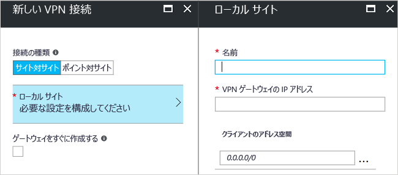

# <a name="create-a-site-to-site-connection-using-the-azure-portal-classic"></a>Azure Portal を使用してサイト間接続を作成する (クラシック)


この記事では、Azure Portal を使用して、オンプレミス ネットワークから VNet へのサイト間 VPN Gateway 接続を作成する方法について説明します。 この記事の手順は、クラシック デプロイ モデルに適用され、現在のデプロイ モデルである Resource Manager には適用されません。 また、この構成の作成には、次のリストから別のオプションを選択して、別のデプロイ ツールまたはデプロイ モデルを使用することもできます。

> [!div class="op_single_selector"]
> * [Azure Portal](vpn-gateway-howto-site-to-site-resource-manager-portal.md)
> * [PowerShell](vpn-gateway-create-site-to-site-rm-powershell.md)
> * [CLI](vpn-gateway-howto-site-to-site-resource-manager-cli.md)
> * [Azure Portal (クラシック)](vpn-gateway-howto-site-to-site-classic-portal.md)
> 
>

サイト間 VPN Gateway 接続は、IPsec/IKE (IKEv1 または IKEv2) VPN トンネルを介してオンプレミス ネットワークを Azure 仮想ネットワークに接続するために使用します。 この種類の接続では、外部接続用パブリック IP アドレスが割り当てられていてるオンプレミスの VPN デバイスが必要です。 VPN Gateway の詳細については、「[VPN Gateway について](vpn-gateway-about-vpngateways.md)」を参照してください。


## <a name="before"></a>開始する前に

構成を開始する前に、以下の条件を満たしていることを確認します。

* クラシック デプロイ モデルで作業することを確認します。 Resource Manager デプロイ モデルで作業する場合は、[サイト間接続の作成 (Resource Manager)](vpn-gateway-howto-site-to-site-resource-manager-portal.md) に関する記事を参照してください。 可能であれば、Resource Manager デプロイ モデルの使用をお勧めします。
* 互換性のある VPN デバイスがあり、デバイスを構成できる人員がいることを確認します。 互換性のある VPN デバイスとデバイスの構成の詳細については、[VPN デバイスの概要](vpn-gateway-about-vpn-devices.md)に関する記事を参照してください。
* VPN デバイスの外部接続用パブリック IPv4 アドレスがあることを確認します。
* オンプレミス ネットワーク構成の IP アドレス範囲を把握していない場合は、詳細な情報を把握している担当者と協力して作業を行ってください。 この構成を作成する場合は、Azure がオンプレミスの場所にルーティングする IP アドレス範囲のプレフィックスを指定する必要があります。 オンプレミス ネットワークのサブネットと接続先の仮想ネットワーク サブネットが重複しないようにしなければなりません。
* 現時点では、共有キーの指定と VPN ゲートウェイ接続の作成に PowerShell が必要です。 Azure サービス管理 (SM) PowerShell コマンドレットの最新版をインストールしてください。 コマンドレットをインストールするには、[サービス管理](/powershell/azure/servicemanagement/install-azure-ps)に関するページをご覧ください。 一般的な PowerShell のインストールの詳細については、[Azure PowerShell のインストールおよび構成方法](/powershell/azure/overview)に関するページをご覧ください。 この構成に PowerShell を使用する場合は、必ず管理者として実行するようにしてください。

### <a name="values"></a>この演習のサンプル構成値

この記事の例では、次の値を使用します。 この値を使用して、テスト環境を作成できます。また、この値を参考にしながら、この記事の例を確認していくこともできます。

* **VNet 名:** TestVNet1
* **アドレス空間:** 
  * 10.11.0.0/16
  * 10.12.0.0/16 (この演習では省略可能)
* **サブネット:**
  * FrontEnd:10.11.0.0/24
  * BackEnd: 10.12.0.0/24 (この演習では省略可能)
* **GatewaySubnet:** 10.11.255.0/27
* **[リソース グループ]:** TestRG1
* **[場所]:** East US
* **DNS サーバー:** 10.11.0.3 (この演習では省略可能)
* **ローカル サイト名:** Site2
* **[クライアント アドレス空間]:** オンプレミスのサイトにあるアドレス空間。

## <a name="CreatVNet"></a>1.仮想ネットワークの作成

S2S 接続に使用する仮想ネットワークを作成する際には、指定するアドレス空間が、接続先のローカル サイトのクライアント アドレス空間と重複しないようにする必要があります。 サブネットの重複があると、接続が適切に動作しません。

* 既に VNet がある場合は、設定が VPN ゲートウェイの設計に適合していることを確認します。 特に、他のネットワークと重複している可能性のあるサブネットに注意してください。 

* まだ仮想ネットワークがない場合は作成します。 スクリーンショットは例として示されています。 サンプルの値は必ず実際の値に変更してください。

### <a name="to-create-a-virtual-network"></a>仮想ネットワークを作成するには

1. ブラウザーから [Azure Portal](https://portal.azure.com) に移動します。必要であれば Azure アカウントでサインインします。
2. * *[+ リソースの作成]* をクリックします。 **[Marketplace を検索]** フィールドに「仮想ネットワーク」と入力します。 検索結果の一覧から **[仮想ネットワーク]** を探してクリックし、 **[仮想ネットワーク]** ページを開きます。
3. **[(change to Classic)]\((クラシックに変更)\)** をクリックしてから、 **[作成]** をクリックします。
4. **[仮想ネットワーク (クラシック) の作成]** ページで、VNet の設定を構成します。 このページでは、最初のアドレス空間と 1 つのサブネット アドレスの範囲を追加します。 VNet の作成が完了したら、戻って、さらにサブネットとアドレス空間を追加できます。

   ![[仮想ネットワークの作成]](./media/vpn-gateway-howto-site-to-site-classic-portal/createvnet.png "[仮想ネットワークの作成] ページ") ページ
5. **サブスクリプション** が正しいものであることを確認します。 ドロップダウンを使用して、サブスクリプションを変更できます。
6. **[リソース グループ]** をクリックし、既存のリソース グループを選択するか、名前を入力して新しいリソース グループを作成します。 リソース グループの詳細については、「 [Azure リソース マネージャーの概要](../azure-resource-manager/management/overview.md#resource-groups)」を参照してください。
7. 次に、VNet の **[場所]** 設定を選択します。 この場所の設定によって、この VNet にデプロイしたリソースの配置先が決まります。
8. **[作成]** をクリックして、VNet を作成します。
9. [作成] をクリックした後で、VNet の進捗状況を反映するタイルがダッシュボードに表示されます。 タイルは、VNet の作成が進むに従って変化します。

## <a name="additionaladdress"></a>2.アドレス空間の追加

仮想ネットワークを作成したら、アドレス空間を追加できます。 S2S 構成ではアドレス空間の追加は必須の手順ではありませんが、複数のアドレス空間が必要な場合、次の手順を使用してください。

1. ポータルで仮想ネットワークを見つけます。
2. その仮想ネットワークのページで、 **[設定]** セクションの **[アドレス空間]** をクリックします。
3. [アドレス空間] ページで **[+追加]** をクリックし、追加のアドレス空間を入力します。

## <a name="dns"></a>3.DNS サーバーの指定

S2S 構成では DNS の設定は必須の手順ではありませんが、名前解決を行う場合は DNS が必要になります。 値を指定しても新しい DNS サーバーは作成されません。 指定する DNS サーバーの IP アドレスは、接続先のリソースの名前を解決できる DNS サーバーの IP アドレスである必要があります。 この設定例では、プライベート IP アドレスを使用しました。 ここで使用している IP アドレスはおそらく実際の DNS サーバーの IP アドレスと一致しません。 実際には独自の値を使用してください。

仮想ネットワークを作成した後は、名前解決を処理するために、DNS サーバーの IP アドレスを追加できます。 仮想ネットワークの設定を開き、DNS サーバーをクリックして、名前解決に使用する DNS サーバーの IP アドレスを追加します。

1. ポータルで仮想ネットワークを見つけます。
2. その仮想ネットワークのページで、 **[設定]** セクションの **[DNS サーバー]** をクリックします。
3. DNS サーバーを追加します。
4. 設定を保存するには、ページの上部にある **[保存]** をクリックします。

## <a name="localsite"></a>4.ローカル サイトの構成

通常、ローカル サイトとはオンプレミスの場所を指します。 ここには、接続の作成先となる VPN デバイスの IP アドレスのほか、VPN ゲートウェイ経由で VPN デバイスにルーティングされる IP アドレス範囲が含まれます。

1. VNet のページの **[設定]** で、 **[ダイアグラム]** をクリックします。
1. **[VPN 接続]** ページで、 **[既存の VPN 接続がありません。開始するにはここをクリックしてください]** をクリックします。
1. **[接続の種類]** については、 **[サイト対サイト]** を選択したままにします。
4. **[ローカル サイト] の [Configure required settings]\(必要な設定の構成\)** をクリックして、 **[ローカル サイト]** ページを開きます。 設定を構成してから **[OK]** をクリックし、設定を保存します。
   - **[名前]:** 特定しやすいようにローカル サイトに名前を付けます。
   - **[VPN ゲートウェイの IP アドレス]:** これは、オンプレミス ネットワークの VPN デバイスのパブリック IP アドレスです。 VPN デバイスには IPv4 パブリック IP アドレスが必要です。 接続先となる VPN デバイスに有効なパブリック IP アドレスを指定します。 これは Azure で到達可能である必要があります。 VPN デバイスの IP アドレスが不明な場合は、(有効なパブリック IP アドレスの形式で) プレースホルダーの値を入力しておき、後で変更することができます。
   - **[クライアント アドレス空間]:** このゲートウェイ経由でオンプレミスのローカル ネットワークにルーティングする IP アドレス範囲を一覧表示します。 複数のアドレス領域の範囲を追加することができます。 ここで指定する範囲は、仮想ネットワークの接続先となる他のネットワークの範囲、または仮想ネットワーク自体のアドレス範囲と重複しないようにしてください。

   

**[OK]** をクリックして、[ローカル サイト] ページを閉じます。 **[OK] をクリックして、[新しい VPN 接続] ページを閉じないでください**。

## <a name="gatewaysubnet"></a>5.ゲートウェイ サブネットの構成

VPN ゲートウェイのゲートウェイ サブネットを作成する必要があります。 ゲートウェイ サブネットには、VPN ゲートウェイ サービスが使用する IP アドレスが含まれます。


1. **[新しい VPN 接続]** ページで、 **[ゲートウェイをすぐに作成する]** チェック ボックスをオンにします。 [ゲートウェイの構成 (オプション)] ページが表示されます。 チェック ボックスをオンにしないと、ゲートウェイ サブネットを構成するページが表示されません。

   ![[ゲートウェイの構成] - [サブネット、サイズ、およびルーティングの種類]](./media/vpn-gateway-howto-site-to-site-classic-portal/optional.png "[ゲートウェイの構成] - [サブネット、サイズ、およびルーティングの種類]")
2. **[ゲートウェイの構成]** ページを開くには、 **[ゲートウェイの構成 (オプション)] の [サブネット、サイズ、およびルーティングの種類]** をクリックします。
3. **[ゲートウェイの構成]** ページで、 **[サブネット] の [Configure required settings]\(必要な設定の構成\)** をクリックして、 **[サブネットの追加]** ページを開きます。 これらの設定の構成が完了したら、 **[OK]** をクリックします。

   ![[ゲートウェイの構成] - ゲートウェイ サブネット](./media/vpn-gateway-howto-site-to-site-classic-portal/subnetrequired.png "[ゲートウェイの構成] - ゲートウェイ サブネット")
4. **[サブネットの追加]** ページで、ゲートウェイ サブネットを追加します。 指定したゲートウェイ サブネットのサイズは、作成する VPN ゲートウェイの構成によって異なります。 /29 のような小さいゲートウェイ サブネットを作成できますが、/27 または /28 を使用することをお勧めします。 これにより、より多くのアドレスを含む大きなサブネットが作成されます。 大規模なゲートウェイ サブネットを使用すると、将来の構成に対応するのに十分な IP アドレスを確保できます。

   

## <a name="sku"></a>6.SKU と VPN の種類の指定

1. ゲートウェイの **[サイズ]** を選択します。 これは、仮想ネットワーク ゲートウェイの作成に使用するゲートウェイ SKU です。 クラシック VPN ゲートウェイでは、古い (レガシ) ゲートウェイ SKU が使用されます。 レガシ ゲートウェイ SKU の詳細については、[仮想ネットワーク ゲートウェイ SKU (古い SKU) の利用](vpn-gateway-about-skus-legacy.md)に関するページを参照してください。

   
2. ゲートウェイの **[ルーティングの種類]** を選択します。 これは VPN の種類とも呼ばれます。 ゲートウェイの種類は切り替えることができないため、適切な種類を選択することが重要です。 VPN デバイスは、選択するルーティングの種類に適合している必要があります。 ルーティングの種類の詳細については、「[VPN の種類](vpn-gateway-about-vpn-gateway-settings.md#vpntype)」を参照してください。 "RouteBased" と "PolicyBased" という VPN の種類の項目がありますが、 "動的" は "RouteBased"、"静的" は "PolicyBased" に対応しています。
3. **[OK]** をクリックして設定を保存します。
4. **[新しい VPN 接続]** ページで、ページの下部にある **[OK]** をクリックして、仮想ネットワーク ゲートウェイのデプロイを開始します。 選択した SKU によっては、仮想ネットワーク ゲートウェイを作成するまでに最大で 45 分かかります。

## <a name="vpndevice"></a>7.VPN デバイスの構成

オンプレミス ネットワークとのサイト間接続には VPN デバイスが必要です。 この手順では、VPN デバイスを構成します。 VPN デバイスを構成する際に、次の情報が必要になります。

- 共有キー。 サイト間 VPN 接続を作成するときにも、これと同じ共有キーを指定します。 ここで紹介している例では、基本的な共有キーを使用しています。 実際には、もっと複雑なキーを生成して使用することをお勧めします。
- 仮想ネットワーク ゲートウェイのパブリック IP アドレス。 パブリック IP アドレスは、Azure Portal、PowerShell、または CLI を使用して確認できます。

[!INCLUDE [vpn-gateway-configure-vpn-device-rm](../../includes/vpn-gateway-configure-vpn-device-rm-include.md)]

## <a name="CreateConnection"></a>8.接続の作成
この手順では、共有キーを設定して接続を作成します。 設定するキーは、VPN デバイスの構成で使用したものと同じである必要があります。

> [!NOTE]
> 現時点では、この手順は Azure Portal で実行できません。 サービス管理 (SM) バージョンの Azure PowerShell コマンドレットを使用する必要があります。 これらのコマンドレットのインストールについては、「[開始する前に](#before)」を参照してください。
>

### <a name="step-1-connect-to-your-azure-account"></a>手順 1. Azure アカウントに接続する

これらのコマンドは、PowerShell サービス管理モジュールを使用してローカルで実行する必要があります。 サービス管理に切り替えるには、このコマンドを使用します。

```powershell
azure config mode asm
```

1. 管理者特権で PowerShell コンソールを開き、アカウントに接続します。 接続については、次の例を参考にしてください。

   ```powershell
   Add-AzureAccount
   ```
2. アカウントのサブスクリプションを確認します。

   ```powershell
   Get-AzureSubscription
   ```
3. 複数のサブスクリプションがある場合は、使用するサブスクリプションを選択します。

   ```powershell
   Select-AzureSubscription -SubscriptionId "Replace_with_your_subscription_ID"
   ```

### <a name="step-2-set-the-shared-key-and-create-the-connection"></a>手順 2. 共有キーを設定して接続を作成する

(PowerShell を使用せずに) ポータルでクラシック VNet を作成すると、Azure によってリソース グループ名が短い名前に追加されます。 たとえば、Azure に従って、この演習用に作成した VNet の名前は、"TestVNet1" ではなく、"Group TestRG1 TestVNet1" になります。 PowerShell では、ポータルに表示される短い名前ではなく、仮想ネットワークの完全な名前が必要です。 長い名前はポータルに表示されません。 次の手順は、ネットワーク構成ファイルをエクスポートして、仮想ネットワーク名の正確な値を取得するのに役立ちます。 

1. コンピューターにディレクトリを作成し、ネットワーク構成ファイルをそのディレクトリにエクスポートします。 次の例では、ネットワーク構成ファイルは C:\AzureNet にエクスポートされます。

   ```powershell
   Get-AzureVNetConfig -ExportToFile C:\AzureNet\NetworkConfig.xml
   ```
2. XML エディターでネットワーク構成ファイルを開いて、"LocalNetworkSite name" と "VirtualNetworkSite name" の値を確認します。 この演習の例を、xml の値を反映するように変更します。 スペースを含む名前を指定するときは、単一引用符を使って値を囲みます。

3. 共有キーを設定して接続を作成します。 "-SharedKey" は、生成して指定する値です。 この例では "abc123" を使いましたが、さらに複雑な値を生成して使うこともできます (推奨)。 重要なのは、ここで指定する値は、VPN デバイスを構成する際に指定した値と同じにする必要があることです。

   ```powershell
   Set-AzureVNetGatewayKey -VNetName 'Group TestRG1 TestVNet1' `
   -LocalNetworkSiteName 'D1BFC9CB_Site2' -SharedKey abc123
   ```
   接続が作成されたら、結果として **Status: Successful** を示している必要があります。

## <a name="verify"></a>9.接続を確認する

[!INCLUDE [vpn-gateway-verify-connection-azureportal-classic](../../includes/vpn-gateway-verify-connection-azureportal-classic-include.md)]

接続に問題がある場合は、左ペインの目次の「**トラブルシューティング**」セクションを参照してください。

## <a name="reset"></a>VPN ゲートウェイをリセットする方法

1 つ以上のサイト間 VPN トンネルのクロスプレミス VPN 接続が失われた場合、Azure VPN Gateway をリセットすることによって解決できる場合があります。 この状況では、オンプレミスの VPN デバイスがすべて正しく機能していても、Azure VPN Gateway との間で IPsec トンネルを確立することができません。 手順については、「[VPN Gateway のリセット](vpn-gateway-resetgw-classic.md#resetclassic)」を参照してください。

## <a name="changesku"></a>ゲートウェイ SKU を変更する方法

ゲートウェイ SKU を変更する手順については、[ゲートウェイ SKU のサイズ変更](vpn-gateway-about-SKUS-legacy.md#classicresize)に関するページを参照してください。

## <a name="next-steps"></a>次のステップ

* 接続が完成したら、仮想ネットワークに仮想マシンを追加することができます。 詳細については、[Virtual Machines](https://docs.microsoft.com/azure/) に関するページを参照してください。
* 強制トンネリングについては、[強制トンネリング](vpn-gateway-about-forced-tunneling.md)に関する記事を参照してください。
