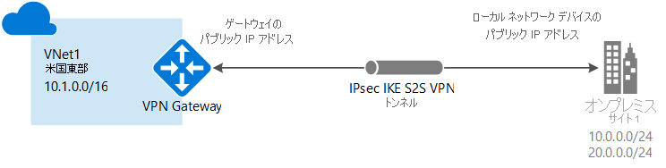

# Azure Portal でサイト間接続を作成する

この記事では、Azure Portal を使用して、オンプレミス ネットワークから VNet へのサイト間 VPN Gateway 接続を作成する方法について説明します。 この記事の手順は、Resource Manager デプロイ モデルに適用されます。 また、この構成の作成には、次のリストから別のオプションを選択して、別のデプロイ ツールまたはデプロイ モデルを使用することもできます。

> [!div class="op_single_selector"]
> * [Azure Portal](vpn-gateway-howto-site-to-site-resource-manager-portal.md)
> * [PowerShell](vpn-gateway-create-site-to-site-rm-powershell.md)
> * [CLI](vpn-gateway-howto-site-to-site-resource-manager-cli.md)
> * [Azure Portal (クラシック)](vpn-gateway-howto-site-to-site-classic-portal.md)
> 
>

サイト間 VPN Gateway 接続は、IPsec/IKE (IKEv1 または IKEv2) VPN トンネルを介してオンプレミス ネットワークを Azure 仮想ネットワークに接続するために使用します。 この種類の接続では、外部接続用パブリック IP アドレスが割り当てられていてるオンプレミスの VPN デバイスが必要です。 VPN Gateway の詳細については、「[VPN Gateway について](vpn-gateway-about-vpngateways.md)」を参照してください。

## 開始する前に

構成を開始する前に、以下の条件を満たしていることを確認します。

* 互換性のある VPN デバイスがあり、デバイスを構成できる人員がいることを確認します。 互換性のある VPN デバイスとデバイスの構成の詳細については、[VPN デバイスの概要](vpn-gateway-about-vpn-devices.md)に関する記事を参照してください。
* VPN デバイスの外部接続用パブリック IPv4 アドレスがあることを確認します。
* オンプレミス ネットワーク構成の IP アドレス範囲を把握していない場合は、詳細な情報を把握している担当者と協力して作業を行ってください。 この構成を作成する場合は、Azure がオンプレミスの場所にルーティングする IP アドレス範囲のプレフィックスを指定する必要があります。 オンプレミス ネットワークのサブネットと接続先の仮想ネットワーク サブネットが重複しないようにしなければなりません。 

### 値の例

この記事の例では、次の値を使用します。 この値を使用して、テスト環境を作成できます。また、この値を参考にしながら、この記事の例を確認していくこともできます。 VPN ゲートウェイの一般的な設定の詳細については、[VPN Gateway の設定](vpn-gateway-about-vpn-gateway-settings.md)に関するページを参照してください。

* **VNet 名:** TestVNet1
* **アドレス空間:** 10.1.0.0/16
* **サブスクリプション:** 使用するサブスクリプション
* **リソース グループ:** TestRG1
* **[場所]:** 米国東部
* **サブネット:** FrontEnd:10.1.0.0/24、BackEnd:10.1.1.0/24 (この演習では省略可能)
* **ゲートウェイ サブネット名:** GatewaySubnet (ポータルではこの名前が自動入力されます)
* **ゲートウェイ サブネットのアドレス範囲**:10.1.255.0/27
* **DNS サーバー:** 8.8.8.8 - 省略可能。 DNS サーバーの IP アドレス。
* **仮想ネットワーク ゲートウェイ名:** VNet1GW
* **パブリック IP:** VNet1GWIP
* **VPN の種類:** ルート ベース
* **接続の種類:** サイト間 (IPsec)
* **ゲートウェイの種類:** VPN
* **ローカル ネットワーク ゲートウェイ名:** Site1
* **接続名:** VNet1toSite1
* **共有キー:** この例では、abc123 を使用します。 ただし、お使いの VPN ハードウェアと互換性があれば何を使用してもかまいません。 重要なことは、接続の両側で値が一致していることです。

## 1.仮想ネットワークの作成

[!INCLUDE [Create a virtual network](../../includes/vpn-gateway-create-virtual-network-portal-include.md)]

## 2.DNS サーバーの指定

サイト間接続の作成では DNS は不要です。 ただし仮想ネットワークにデプロイされたリソースで名前解決を使用する場合は、DNS サーバーを指定する必要があります。 この設定では、この仮想ネットワークの名前解決に使用する DNS サーバーを指定することができます。 この設定で、DNS サーバーは作成されません。 名前解決の詳細については、「[VM とロール インスタンスの名前解決](../virtual-network/virtual-networks-name-resolution-for-vms-and-role-instances.md)」を参照してください。

[!INCLUDE [Specify a dns server - optional](../../includes/vpn-gateway-specify-dns-portal-include.md)]

## 3.ゲートウェイ サブネットを作成する

[!INCLUDE [About gateway subnets](../../includes/vpn-gateway-about-gwsubnet-include.md)]

[!INCLUDE [Add a gateway subnet](../../includes/vpn-gateway-add-gateway-subnet-portal-include.md)]

[!INCLUDE [NSG warning](../../includes/vpn-gateway-no-nsg-include.md)]

## 4.VPN ゲートウェイを作成する

[!INCLUDE [Create a vpn gateway](../../includes/vpn-gateway-add-gateway-portal-include.md)]

## 5.ローカル ネットワーク ゲートウェイを作成する

ローカル ネットワーク ゲートウェイは通常、オンプレミスの場所を指します。 サイトに Azure が参照できる名前を付け、接続を作成するオンプレミス VPN デバイスの IP アドレスを指定します。 また、VPN ゲートウェイを介して VPN デバイスにルーティングされる IP アドレスのプレフィックスも指定します。 指定するアドレスのプレフィックスは、オンプレミス ネットワークのプレフィックスです。 オンプレミスのネットワークが変更された場合、または VPN デバイスのパブリック IP アドレスを変更する必要がある場合、これらの値を後で簡単に更新できます。

[!INCLUDE [Add a local network gateway](../../includes/vpn-gateway-add-local-network-gateway-portal-include.md)]

## 6.VPN デバイスの構成

オンプレミス ネットワークとのサイト間接続には VPN デバイスが必要です。 この手順では、VPN デバイスを構成します。 VPN デバイスを構成する際に、次の情報が必要になります。

- 共有キー。 サイト間 VPN 接続を作成するときにも、これと同じ共有キーを指定します。 ここで紹介している例では、基本的な共有キーを使用しています。 実際には、もっと複雑なキーを生成して使用することをお勧めします。
- 仮想ネットワーク ゲートウェイのパブリック IP アドレス。 パブリック IP アドレスは、Azure Portal、PowerShell、または CLI を使用して確認できます。 Azure Portal を使用して VPN ゲートウェイのパブリック IP アドレスを調べるには、**[仮想ネットワーク ゲートウェイ]** に移動し、該当するゲートウェイの名前をクリックします。

[!INCLUDE [Configure a VPN device](../../includes/vpn-gateway-configure-vpn-device-include.md)]

## 7.VPN 接続を作成する

仮想ネットワーク ゲートウェイとオンプレミス VPN デバイスとの間にサイト間 VPN 接続を作成します。

[!INCLUDE [Add a site-to-site connection](../../includes/vpn-gateway-add-site-to-site-connection-portal-include.md)]

## 8.VPN 接続の確認

[!INCLUDE [Verify the connection](../../includes/vpn-gateway-verify-connection-portal-include.md)]

## 仮想マシンに接続するには

[!INCLUDE [Connect to a VM](../../includes/vpn-gateway-connect-vm-s2s-include.md)]

## VPN ゲートウェイをリセットする方法

1 つ以上のサイト間 VPN トンネルのクロスプレミス VPN 接続が失われた場合、Azure VPN Gateway をリセットすることによって解決できる場合があります。 この状況では、オンプレミスの VPN デバイスがすべて正しく機能していても、Azure VPN Gateway との間で IPsec トンネルを確立することができません。 手順については、「[VPN Gateway のリセット](vpn-gateway-resetgw-classic.md)」を参照してください。

## ゲートウェイ SKU を変更する方法 (ゲートウェイのサイズ変更)

ゲートウェイ SKU を変更する手順については、「[ゲートウェイの SKU](vpn-gateway-about-vpn-gateway-settings.md#gwsku)」を参照してください。

## VPN ゲートウェイに新しい接続を追加する方法

他の接続とアドレス空間が重複しなければ、新たに接続を追加することができます。

1. 新たに接続を追加するには、VPN ゲートウェイに移動し、**[接続]** をクリックして [接続] ページを開きます。
2. **[+追加]** をクリックして接続を追加します。 "VNet 間" (別の VNet ゲートウェイに接続する場合) または "サイト対サイト" を考慮して接続の種類を調整します。
3. "サイト対サイト" を使用して接続している場合で、かつまだ接続先となるサイトのローカル ネットワーク ゲートウェイを作成していない場合は、新たに作成することができます。
4. 使用する共有キーを指定し、**[OK]** をクリックして接続を作成します。

## 次の手順

* BGP の詳細については、[BGP の概要](vpn-gateway-bgp-overview.md)に関する記事と [BGP の構成方法](vpn-gateway-bgp-resource-manager-ps.md)に関する記事を参照してください。
* 強制トンネリングについては、[強制トンネリング](vpn-gateway-forced-tunneling-rm.md)に関する記事を参照してください。
* 高可用性のアクティブ/アクティブ接続については、「[高可用性のクロスプレミス接続および VNet 間接続](vpn-gateway-highlyavailable.md)」を参照してください。
* 仮想ネットワーク内のリソースへのネットワーク トラフィックを制限する方法については、「[ネットワークのセキュリティ](../virtual-network/security-overview.md)」を参照してください。
* Azure がトラフィックを Azure、オンプレミス、インターネット リソースの間でどのようにルーティングするかについては、「[仮想ネットワーク トラフィックのルーティング](../virtual-network/virtual-networks-udr-overview.md)」を参照してください。
* Azure Resource Manager テンプレートを使用してサイト間 VPN 接続を作成する方法については、「[Create a Site-to-Site VPN Connection (サイト間 VPN 接続の作成)](https://azure.microsoft.com/resources/templates/101-site-to-site-vpn-create/)」を参照してください。
* Azure Resource Manager テンプレートを使用して VNet 間 VPN 接続を作成する方法については、「[Deploy HBase geo replication (HBase geo レプリケーションのデプロイ)](https://azure.microsoft.com/resources/templates/101-hdinsight-hbase-replication-geo/)」を参照してください。
