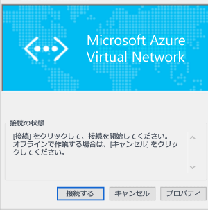

<properties
   pageTitle="クラシック ポータルを使用した Azure Virtual Network へのポイント対サイト VPN ゲートウェイ接続の構成 | Microsoft Azure"
   description="ポイント対サイト VPN ゲートウェイ接続を作成することで、Azure Virtual Network に安全に接続します。"
   services="vpn-gateway"
   documentationCenter="na"
   authors="cherylmc"
   manager="carmonm"
   editor=""
   tags="azure-service-management"/>

<tags
   ms.service="vpn-gateway"
   ms.devlang="na"
   ms.topic="hero-article"
   ms.tgt_pltfrm="na"
   ms.workload="infrastructure-services"
   ms.date="09/27/2016"
   ms.author="cherylmc"/>

# クラシック ポータルを使用した VNet へのポイント対サイト接続の構成

> [AZURE.SELECTOR]
- [Resource Manager - PowerShell](vpn-gateway-howto-point-to-site-rm-ps.md)
- [クラシック - クラシック ポータル](vpn-gateway-point-to-site-create.md)

ポイント対サイト (P2S) 構成では、個々のクライアント コンピューターから仮想ネットワークへのセキュリティで保護された接続を作成することができます。P2S 接続は、自宅や会議室など、リモートの場所から VNet に接続する場合や、仮想ネットワークに接続する必要があるクライアントの数が少ない場合に便利です。

この記事では、**クラシック ポータル**を使用して、ポイント対サイト接続を備えた VNet を**クラシック デプロイメント モデル**で作成する手順を説明します。

ポイント対サイト接続を機能させるために、VPN デバイスや公開 IP アドレスは必要ありません。VPN 接続を確立するには、クライアント コンピューターからの接続を開始します。ポイント対サイト接続の詳細については、「[VPN Gateway に関する FAQ](vpn-gateway-vpn-faq.md#point-to-site-connections)」と[計画と設計](vpn-gateway-plan-design.md)に関するページを参照してください。

### P2S 接続のデプロイメント モデルとデプロイ方法

[AZURE.INCLUDE [vpn-gateway-table-point-to-site](../../includes/vpn-gateway-table-point-to-site-include.md)]

**Azure のデプロイ モデルについて**

[AZURE.INCLUDE [vpn-gateway-clasic-rm](../../includes/vpn-gateway-classic-rm-include.md)]

## ポイント対サイト接続の作成について
 
次の手順では、仮想ネットワークに対してセキュリティで保護されたポイント対サイト接続を作成する方法を説明します。

ポイント対サイト接続の構成は、4 つのセクションに分かれています。各セクションを構成する順序が重要です。手順をスキップしたり、先に進んだりしないでください。

- **セクション 1** 仮想ネットワークと VPN ゲートウェイの作成
- **セクション 2** 認証に使用する証明書の作成とアップロード
- **セクション 3** クライアント証明書のエクスポートとインストール
- **セクション 4** VPN クライアントの構成

## セクション 1 - 仮想ネットワークと VPN ゲートウェイの作成

### パート 1: 仮想ネットワークの作成

1. [Azure クラシック ポータル](https://manage.windowsazure.com/)にログインします。以下の手順では、Azure ポータルではなく、クラシック ポータルを使用します。現時点では、Azure ポータルを使用して P2S 接続を作成することはできません。

2. 画面の左下隅で **[新規]** をクリックします。ナビゲーション ウィンドウで **[Network Services]** をクリックし、**[Virtual Network]** をクリックします。**[カスタム作成]** をクリックして、構成ウィザードを開始します。

3. **[仮想ネットワークの詳細]** ページで、次の情報を入力し、右下にある次へ進む矢印をクリックします。
	- **[名前]**: 仮想ネットワークの名前を指定します。たとえば、「VNet1」と入力します。これは、この VNet に VM をデプロイするときに参照する名前です。
	- **[場所]**: 場所は、リソース (VM) を配置する物理的な場所 (リージョン) に直接関連します。たとえば、この仮想ネットワークにデプロイする VM を物理的に米国東部に配置する場合は、場所として米国東部を選択します。仮想ネットワークを作成した後で、その仮想ネットワークに関連付けられたリージョンを変更することはできません。

4. **[DNS サーバーおよび VPN 接続]** ページで次の情報を入力し、右下にある次へ進む矢印をクリックします。
	- **[DNS サーバー]**: DNS サーバー名と IP アドレスを入力するか、以前に登録した DNS サーバーをショートカット メニューから選択します。この設定で、DNS サーバーは作成されません。この設定では、この仮想ネットワークの名前解決に使用する DNS サーバーを指定することができます。Azure の既定の名前解決サービスを使用する場合は、このセクションは空白のままにします。
	- **[ポイント対サイト VPN の構成]**: チェック ボックスをオンにします。

5. **[ポイント対サイト接続]** ページで、接続時に VPN が IP アドレスを受け取る際の IP アドレスの範囲を指定します。指定可能なアドレスの範囲については、いくつかの規則があります。指定した範囲が、オンプレミス ネットワーク上のどの範囲とも重複しないことを確認することが重要です。

6. 次の情報を入力して、次へ進む矢印をクリックします。
 - **[アドレス空間]**: 開始 IP と CIDR (アドレス数) を指定します。
 - **[アドレス空間の追加]**: ネットワーク設計に必要な場合にのみ、アドレス空間を追加します。

7. **[仮想ネットワーク アドレス空間]** ページで、仮想ネットワークに使用するアドレス範囲を指定します。これらが動的 IP アドレス (DIPS) として、この仮想ネットワークにデプロイする VM や各種ロール インスタンスに割り当てられます。  オンプレミス ネットワークに使用されているどの範囲とも重複しない範囲を選択することが特に重要です。仮想ネットワークに使用するオンプレミス ネットワークのアドレス空間から、ネットワーク管理者が IP アドレスの範囲を分割しなければならない可能性があるため、ネットワーク管理者と調整する必要があります。

8. 次の情報を入力し、チェックマークをクリックして仮想ネットワークの作成を開始します。
 - **[アドレス空間]**: 開始 IP や数など、この仮想ネットワークで使用する内部 IP アドレスの範囲を追加します。オンプレミス ネットワークに使用されている範囲と重複しない範囲を選択することが重要です。
 - **[サブネットの追加]**: 追加サブネットは必須ではありませんが、VM 用に静的 DIP を持つ別のサブネットを作成することをお勧めします。または、他のロール インスタンスとは分離したサブネットに VM を配置することができます。
 - **[ゲートウェイ サブネットの追加]**: ゲートウェイ サブネットはポイント対サイト VPN に必須です。クリックして、ゲートウェイ サブネットを追加します。ゲートウェイ サブネットは仮想ネットワーク ゲートウェイにのみ使用されます。

9. 仮想ネットワークが作成されると、Azure クラシック ポータルの [ネットワーク] ページの **[状態]** に **[作成済み]** と表示されます。仮想ネットワークが作成されると、動的ルーティング ゲートウェイを作成できます。

### パート 2: 動的ルーティング ゲートウェイの作成

ゲートウェイの種類として、動的ゲートウェイを構成する必要があります。静的ルーティング ゲートウェイでは、この機能に対応できません。

1. Azure クラシック ポータルの **[ネットワーク]** ページで、作成した仮想ネットワークをクリックし、**[ダッシュボード]** ページに移動します。

2. **[ダッシュボード]** ページの下部にある **[ゲートウェイの作成]** をクリックします。"**仮想ネットワーク 'VNet1' にゲートウェイを作成しますか?**" というメッセージが表示されます。**[はい]** をクリックして、ゲートウェイの作成を開始します。ゲートウェイの作成には 15 分ほどかかることがあります。

## セクション 2 - 証明書の生成とアップロード

証明書は、ポイント対サイト VPN の VPN クライアントの認証に使用されます。エンタープライズ証明書ソリューションによって生成されたルート証明書を使用することも、自己署名証明書を使用することもできます。Azure には最大で 20 個のルート証明書をアップロードできます。.cer ファイルがアップロードされると、Azure はこのファイルに含まれる情報を使用して、クライアント証明書がインストールされているクライアントを認証できます。クライアント証明書は、.cer ファイルが表しているのと同じ証明書から生成する必要があります。

このセクションでは、次の手順を実行します。

- ルート証明書の .cer ファイルを取得します。自己署名証明書を指定することも、エンタープライズ証明書システムを使用することもできます。
- .cer ファイルを Azure にアップロードします。
- クライアント証明書を生成します。

### パート 1: ルート証明書の .cer ファイルの取得

エンタープライズ証明書システムを使用している場合は、使用するルート証明書の .cer ファイルを取得します。[パート 3](#createclientcert) で、このルート証明書からクライアント証明書を生成します。

エンタープライズ証明書ソリューションを使用していない場合は、自己署名ルート証明書を生成する必要があります。Windows 10 向けの手順については、[ポイント対サイト構成の自己署名ルート証明書の操作](vpn-gateway-certificates-point-to-site.md)に関する記事を参照してください。この記事では、makecert を使用して自己署名証明書を生成し、.cer ファイルをエクスポートする手順について説明します。

### パート 2: Azure クラシック ポータルへのルート証明書 .cer ファイルのアップロード

信頼された証明書を Azure に追加します。Base64 でエンコードされた X.509 (.cer) ファイルを Azure に追加すると、このファイルが表すルート証明書を信頼するよう Azure に伝えることになります。

1. Azure クラシック ポータルで、仮想ネットワークの **[証明書]** ページにある **[ルート証明書のアップロード]** をクリックします。

2. **[証明書のアップロード]** ページで、.cer ルート証明書を参照して、チェックマークをクリックします。

### パート 3: クライアント証明書の生成

次に、クライアント証明書を生成します。接続するクライアントごとに一意の証明書を生成することも、複数のクライアントに同じ証明書を使用することもできます。一意のクライアント証明書を生成する利点は、必要に応じて 1 つの証明書を失効させることができる点です。そうでなければ、すべてのユーザーが同じクライアント証明書を使用していて、1 つのクライアントの証明書を失効させる必要がある場合は、認証に証明書を使用するすべてのクライアントに新しい証明書を生成してインストールする必要があります。

- エンタープライズ証明書ソリューションを使用している場合は、NetBIOS "DOMAIN\\username" 形式ではなく、共通名の値の形式 "name@yourdomain.com" を使用してクライアント証明書を生成します。

- 自己署名証明書を使用している場合は、[ポイント対サイト構成の自己署名ルート証明書の操作](vpn-gateway-certificates-point-to-site.md)に関する記事を参照して、クライアント証明書を生成してください。

## セクション 3 - クライアント証明書のエクスポートとインストール

仮想ネットワークに接続する各コンピューターに、クライアント証明書をインストールします。クライアント証明書は認証に必要です。クライアント証明書は、自動でも手動でもインストールできます。次の手順では、手動によるクライアント証明書のエクスポートとインストールについて説明します。

1. クライアント証明書をエクスポートするには、*certmgr.msc* を使用できます。エクスポートするクライアント証明書を右クリックして、**[すべてのタスク]**、**[エクスポート]** の順にクリックします。
2. クライアント証明書と秘密キーをエクスポートします。これは *.pfx* ファイルです。この証明書に設定したパスワード (キー) を記録するか、覚えておいてください。
3. *.pfx* ファイルをクライアント コンピューターにコピーします。クライアント コンピューターで、*.pfx* ファイルをダブルクリックしてインストールします。要求された場合は、パスワードを入力します。インストール先は変更しないでください。

## セクション 4 - VPN クライアントの構成

仮想ネットワークに接続するには、VPN クライアントも構成する必要があります。クライアントが接続するために、クライアント証明書と適切な VPN クライアント構成の両方が必要です。VPN クライアントを構成するには、次の手順を順に実行します。

### パート 1: VPN クライアント構成パッケージの作成

1. Azure クラシック ポータルで、仮想ネットワークの **[ダッシュボード]** ページにアクセスし、右隅にある [概要] メニューに移動します。サポートされているクライアント オペレーティング システムの一覧については、「VPN Gateway に関する FAQ」の「[ポイント対サイト接続](vpn-gateway-vpn-faq.md#point-to-site-connections)」セクションを参照してください。VPN クライアント パッケージには、Windows に組み込まれた VPN クライアント ソフトウェアを構成する構成情報が含まれています。このパッケージでは、追加のソフトウェアはインストールされません。設定は接続先の仮想ネットワークに固有です。  インストール先のクライアント オペレーティング システムに対応するダウンロード パッケージを選択してください。
 - 32 ビットのクライアントの場合は、**[32 ビットのクライアント VPN パッケージのダウンロード]** を選択します。
 - 64 ビットのクライアントの場合は、**[64 ビットのクライアント VPN パッケージのダウンロード]** を選択します。

2. クライアント パッケージの作成には数分かかります。パッケージの作成が完了したら、ファイルをダウンロードできます。ダウンロードした *.exe* ファイルは、ローカル コンピューターに安全に格納することができます。

3. Azure クラシック ポータルで VPN クライアント パッケージを生成してダウンロードした後、仮想ネットワークに接続するクライアント コンピューターにクライアント パッケージをインストールすることができます。複数のクライアント コンピューターに VPN クライアント パッケージをインストールする場合は、各コンピューターにクライアント証明書がインストールされていることを確認します。

### パート 2: クライアントへの VPN 構成パッケージのインストール

1. 仮想ネットワークに接続するコンピューターのローカルに構成ファイルをコピーして、.exe ファイルをダブルクリックします。

2. パッケージがインストールされると、VPN 接続を開始できます。構成パッケージは Microsoft によって署名されていません。パッケージは、組織の署名サービスを使用して署名できます。または、[SignTool](http://go.microsoft.com/fwlink/p/?LinkId=699327) を使用してユーザー自身が署名することもできます。署名なしでパッケージを使用することもできます。ただし、パッケージが署名されていない場合は、パッケージのインストール時に警告が表示されます。

3. クライアント コンピューターで **[ネットワークの設定]** に移動し、**[VPN]** をクリックします。接続が一覧で表示されます。接続先となる仮想ネットワークの名前が、次のように表示されます。

	

### パート 3: Azure への接続

1. VNet に接続するには、クライアント コンピューターで [VPN 接続] に移動し、作成した VPN 接続を見つけます。仮想ネットワークと同じ名前が付いています。**[接続]** をクリックします。証明書を使用することを示すポップアップ メッセージが表示される場合があります。その場合、**[続行]** をクリックして、昇格された特権を使用します。

2. **接続**の状態ページで、**[接続]** をクリックして接続を開始します。**[証明書の選択]** 画面が表示された場合は、表示されているクライアント証明書が接続に使用する証明書であることを確認します。そうでない場合は、ドロップダウン矢印を使用して適切な証明書を選択し、**[OK]** をクリックします。

	

3. これで接続が確立されたはずです。

	

### パート 4: VPN 接続の確認

1. VPN 接続がアクティブであることを確認するには、管理者特権でのコマンド プロンプトを開いて、*ipconfig/all* を実行します。
2. 結果を表示します。受信した IP アドレスが、VNet の作成時に指定したポイント対サイト接続アドレス範囲内のアドレスのいずれかであることに注意してください。結果は、次のようになります。

例:

    PPP adapter VNet1:
		Connection-specific DNS Suffix .:
		Description.....................: VNet1
		Physical Address................:
		DHCP Enabled....................: No
		Autoconfiguration Enabled.......: Yes
		IPv4 Address....................: 192.168.130.2(Preferred)
		Subnet Mask.....................: 255.255.255.255
		Default Gateway.................:
		NetBIOS over Tcpip..............: Enabled

## 次のステップ

仮想ネットワークに仮想マシンを追加できます。「[カスタム仮想マシンを作成する方法](../virtual-machines/virtual-machines-windows-classic-createportal.md)」を参照してください。

Virtual Network の詳細については、[Virtual Network のドキュメント](https://azure.microsoft.com/documentation/services/virtual-network/)に関するページを参照してください。

<!---HONumber=AcomDC_0928_2016-->