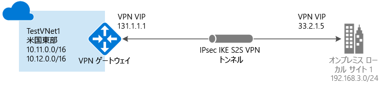

# クラシック ポータルを使用してサイト間接続を備えた VNet を作成する (クラシック)

[!INCLUDE [deployment models](../../includes/vpn-gateway-classic-deployment-model-include.md)]

この記事では、クラシック ポータルを使用して、オンプレミス ネットワークから VNet へのサイト間 VPN Gateway 接続を作成する方法について説明します。 この記事のこの手順は、クラシック デプロイメント モデルに適用されます。 また、この構成の作成には、次のリストから別のオプションを選択して、別のデプロイ ツールまたはデプロイ モデルを使用することもできます。

> [!div class="op_single_selector"]
> * [Azure ポータル](vpn-gateway-howto-site-to-site-resource-manager-portal.md)
> * [PowerShell](vpn-gateway-create-site-to-site-rm-powershell.md)
> * [CLI](vpn-gateway-howto-site-to-site-resource-manager-cli.md)
> * [Azure Portal (クラシック)](vpn-gateway-howto-site-to-site-classic-portal.md)
> * [クラシック ポータル (クラシック)](vpn-gateway-site-to-site-create.md)
> 
>

サイト間 VPN Gateway 接続は、IPsec/IKE (IKEv1 または IKEv2) VPN トンネルを介してオンプレミス ネットワークを Azure 仮想ネットワークに接続するために使用します。 この種類の接続では、外部接続用パブリック IP アドレスが割り当てられていてるオンプレミスの VPN デバイスが必要です。 VPN Gateway の詳細については、「[VPN Gateway について](vpn-gateway-about-vpngateways.md)」を参照してください。

#### 追加の構成

VNet どうしを接続する場合は、「 [クラシック デプロイメント モデルで VNet 対 VNet 接続を構成する](virtual-networks-configure-vnet-to-vnet-connection.md)」を参照してください。 既存の接続が存在する VNet にサイト間接続を追加する場合は、[VPN Gateway 接続が既に存在する VNet へのサイト間接続の追加](vpn-gateway-multi-site.md)に関するページを参照してください。
## 開始する前に

[!INCLUDE [deployment models](../../includes/vpn-gateway-deployment-models-include.md)]

構成を開始する前に、以下が揃っていることを確認します。

* 互換性のある VPN デバイスおよびデバイスを構成できる人員。 「 [VPN デバイスについて](vpn-gateway-about-vpn-devices.md)」を参照してください。 VPN デバイスの構成に詳しくない場合や、オンプレミス ネットワーク構成の IP アドレス範囲を把握していない場合は、詳細な情報を把握している担当者と協力して作業を行ってください。
* VPN デバイスの外部接続用パブリック IP アドレス。 この IP アドレスを NAT の内側に割り当てることはできません。
* Azure サブスクリプション。 Azure サブスクリプションをまだお持ちでない場合は、[MSDN サブスクライバーの特典](https://azure.microsoft.com/pricing/member-offers/msdn-benefits-details)を有効にするか、[無料アカウント](https://azure.microsoft.com/pricing/free-trial)にサインアップしてください。

## 仮想ネットワークの作成
1. [Azure クラシック ポータル](https://manage.windowsazure.com/)にログインします。
2. 画面の左下隅で **[新規]**をクリックします。 ナビゲーション ウィンドウで **[Network Services]** をクリックし、**[Virtual Network]** をクリックします。 **[カスタム作成]** をクリックして、構成ウィザードを開始します。
3. VNet を作成するには、次のページで構成設定を入力します。

## [仮想ネットワークの詳細] ページ
次の情報を入力します。

* **[名前]**: 仮想ネットワークの名前を指定します。 ここでは、 *EastUSVNet*のように名前を入力します。 VM と PaaS インスタンスをデプロイするときにこの仮想ネットワーク名を使用するため、あまり複雑な名前を付けないようにすることを推奨します。
* **[場所]**: 場所は、リソース (VM) を配置する物理的な場所 (リージョン) に直接関連します。 たとえば、物理的に *米国東部*に存在する VM をこの仮想ネットワークにデプロイする場合は、その場所を選択します。 仮想ネットワークを作成した後で、その仮想ネットワークに関連付けられたリージョンを変更することはできません。

## [DNS サーバーおよび VPN 接続] ページ
次の情報を入力し、矢印をクリックして次へ進みます。

* **[DNS サーバー]**: DNS サーバー名と IP アドレスを入力するか、以前に登録した DNS サーバーをショートカット メニューから選択します。 この設定で、DNS サーバーは作成されません。 この設定では、この仮想ネットワークの名前解決に使用する DNS サーバーを指定することができます。
* **[サイト間 VPN の構成]**: **[サイト間 VPN の構成]** のチェック ボックスをオンにします。
* **[ローカル ネットワーク]**: ローカル ネットワークとは、物理的なオンプレミスの場所を表します。 ここでは、以前作成したローカル ネットワークを選択するか、または新しいローカル ネットワークを作成することができます。 ただし、以前作成したローカル ネットワークを使用する場合は、VPN デバイスの IP アドレス (外部に公開されている IPv4 アドレス) が正確であるかどうかを **[ローカル ネットワーク]** 構成ページで確認します。

## [サイト間接続] ページ
ローカル ネットワークを新しく作成する場合は、**[サイト間接続]** ページが表示されます。 以前作成したローカル ネットワークを使用する場合は、このページはウィザードで表示されず次のセクションに進みます。

次の情報を入力して、次へ進む矢印をクリックします。

* **[名前]**: ローカル (オンプレミス) ネットワーク サイトの名前です。
* **[VPN デバイスの IP アドレス]**: Azure への接続に使用するオンプレミスの VPN デバイスで使用される、外部に公開されている IPv4 アドレスです。 VPN デバイスは NAT の内側に配置することはできません。
* **[アドレス空間]**: IP アドレスの開始点と CIDR (アドレス数) を指定します。 仮想ネットワーク ゲートウェイからローカルのオンプレミスの場所への接続に使用するアドレス範囲を指定します。 宛先 IP アドレスがここで指定した範囲内に存在する場合は、仮想ネットワーク ゲートウェイを経由してルーティングされます。
* **[アドレス空間の追加]**: 仮想ネットワーク ゲートウェイでの接続に複数のアドレス範囲を使用する場合は、それぞれのアドレス範囲を追加します。 アドレス範囲は、後から **[ローカル ネットワーク]** ページで追加または削除することができます。

## [仮想ネットワーク アドレス空間] ページ
仮想ネットワークで使用するアドレス範囲を指定します。 これらが動的 IP アドレス (DIPS) として、この仮想ネットワークにデプロイする VM や各種ロール インスタンスに割り当てられます。

オンプレミス ネットワークに使用されている範囲と重複しない範囲を選択することが特に重要です。 ネットワーク管理者と相談して調整する必要があります。 ネットワーク管理者は、場合によっては仮想ネットワークで使用する IP アドレス範囲をオンプレミス ネットワークのアドレス空間の中から確保する必要があるため、ネットワーク管理者との調整が必要です。

以下の情報を入力し、右下のチェックマークをクリックしてネットワークを構成します。

* **[アドレス空間]**: IP アドレスの開始点とアドレス数を指定します。 指定したアドレス空間がオンプレミス ネットワーク内に存在するあらゆるアドレス空間と重複していないことを確認します。
* **[サブネットの追加]**: IP アドレスの開始点とアドレス数を指定します。 追加サブネットは必須ではありませんが、VM 用に静的 DIP を持つ別のサブネットを作成することをお勧めします。 または、他のロール インスタンスとは分離したサブネットに VM を配置することができます。
* **ゲートウェイ サブネットの追加**: ゲートウェイ サブネットを追加する場合はクリックします。 ゲートウェイ サブネットは仮想ネットワーク ゲートウェイにのみ適用されます。この構成では、ゲートウェイ サブネットは必須です

ページ下部のチェックマークをクリックして、仮想ネットワークを作成します。 完了すると、Azure クラシック ポータルの **[ネットワーク]** ページにある **[状態]** に **[作成済み]** と表示されます。 VNet の作成が完了したら、仮想ネットワーク ゲートウェイを構成できます。

[!INCLUDE [vpn-gateway-no-nsg](../../includes/vpn-gateway-no-nsg-include.md)]

## 仮想ネットワーク ゲートウェイの構成
仮想ネットワーク ゲートウェイを構成して、セキュリティで保護されたサイト間接続を作成します。 [Azure クラシック ポータルでの仮想ネットワーク ゲートウェイの構成](vpn-gateway-configure-vpn-gateway-mp.md)に関するページを参照してください。

## 次のステップ
 接続が完成したら、仮想ネットワークに仮想マシンを追加することができます。 詳細については、[Virtual Machines](https://docs.microsoft.com/azure/#pivot=services&panel=Compute) に関するページを参照してください。

