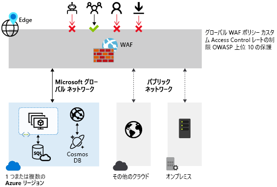
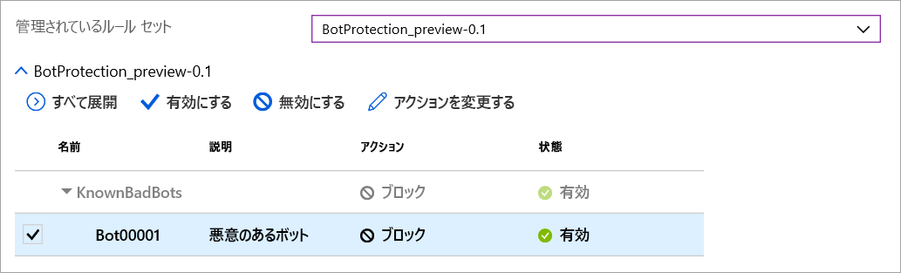

# Azure Front Door 上の Azure Web アプリケーション ファイアウォール

Azure Front Door の Azure Web アプリケーション ファイアウォール (WAF) は、Web アプリケーションに対する一元的な保護を提供します。 WAF は、一般的な悪用や脆弱性から Web サービスを守ります。 ユーザーに対するサービスの高可用性が維持され、コンプライアンス要件を満たしやすくなります。

Front Door 上の WAF は、グローバルな一元的ソリューションです。 デプロイされる場所は、世界中の Azure ネットワーク エッジです。 WAF 対応の Web アプリケーションは、ネットワーク エッジの Front Door によって配信されたすべての受信要求を検査します。 

WAF は仮想ネットワークに入る前の攻撃ソースの近くで悪意のある攻撃を防ぐことができます。 パフォーマンスを損なうことなく大規模でグローバルな保護機能を利用することができます。 WAF のポリシーはサブスクリプション内の任意の Front Door プロファイルに簡単にリンクできます。 新しいルールを数分で展開できるので、脅威のパターンの変化にすばやく対応できます。

## WAF のポリシーと規則

WAF ポリシーを構成し、保護のためにそのポリシーを 1 つ以上の Front Door フロントエンドと関連付けることができます。 WAF ポリシーは、2 種類のセキュリティ規則で構成されます。

- お客様によって作成されたカスタム規則。

- Azure で管理される事前に構成された一連の規則のコレクションであるマネージド規則セット。

両方ともある場合、マネージド規則セットの規則が処理される前に、カスタム規則が処理されます。 規則は、一致条件、優先順位、およびアクションで構成されます。 サポートされているアクションの種類は次のとおりです: 許可、ブロック、ログ、リダイレクト。 マネージド規則とカスタム規則を組み合わせることで、特定のアプリケーション保護要件を満たす完全にカスタマイズされたポリシーを作成することができます。

ポリシー内の規則は、優先順位に従って処理されます。 優先順位は、規則の処理順序を定義する一意の整数です。 整数値が小さいほど高い優先順位を表し、大きい整数値の規則より前に評価されます。 規則が一致すると、規則で定義されている対応するアクションが要求に対して適用されます。 このような一致が処理された後、優先順位の低い規則はそれ以上処理されません。

Front Door によって提供される Web アプリケーションには、一度に 1 つの WAF ポリシーだけを関連付けることができます。 ただし、Front Door の構成に WAF ポリシーを関連付けなくてもかまいません。 WAF ポリシーが存在する場合は、世界中のセキュリティ ポリシーで一貫性が保たれるよう、すべてのエッジの場所にポリシーがレプリケートされます。

## WAF のモード

WAF ポリシーは、次の 2 つのモードで実行するように構成できます。

- **検出モード:** 検出モードで実行されている WAF では、監視以外の他のアクションは実施されず、要求とそれに一致した WAF ルールが WAF ログに記録されます。 Front Door では、診断のログ記録を有効にすることができます。 ポータルを使用しているときに、 **[診断]** セクションに移動します。

- **防止モード:** 防止モードの WAF は、要求が規則に一致すると指定されたアクションを実行します。 一致が見つかった場合、それより優先順位が低い規則は評価されません。 一致した要求は、WAF ログにも記録されます。

## WAF のアクション

WAF のお客様は、要求が規則の条件と一致したときに実行するアクションを 1 つ選択できます。

- "**許可:** "要求は WAF を通過し、バックエンドに転送されます。 それより優先順位の低い規則によって、この要求をブロックすることはできません。
- **ブロック:** 要求はブロックされ、WAF はバックエンドに要求を転送せず、クライアントに応答を送信します。
- **ログ:** 要求は WAF ログに記録され、WAF は優先順位の低い規則の評価を続行します。
- **リダイレクト:** WAF は、指定された URI に要求をリダイレクトします。 指定される URI は、ポリシー レベルの設定です。 いったん構成すると、**リダイレクト** アクションと一致するすべての要求が、その URI に送信されます。

## WAF の規則

WAF ポリシーは、2 種類のセキュリティ規則で構成できます。お客様が作成するカスタム規則と、Azure によって管理される事前構成済みの規則のセットであるマネージド規則セットです。

### カスタム作成規則

お客様は、次のようにしてカスタム規則 WAF を構成できます。

- **IP 許可リストと禁止リスト:** クライアント IP アドレスのリストまたは IP アドレス範囲に基づいて Web アプリケーションへのアクセスを制御することができます。 IPV4 と IPV6 の両方のアドレス タイプがサポートされています。 このリストを構成し、ソース IP アドレスがリストの IP アドレスと一致した要求を、許可またはブロックできます。

- **地理ベースのアクセス制御:** クライアントの IP アドレスに関連付けられている国番号に基づいて Web アプリケーションへのアクセスを制御することができます。

- **HTTP パラメーター ベースのアクセス制御:** HTTP/HTTPS 要求パラメーターに含まれる文字列の一致を規則の基準にすることができます  (クエリ文字列、POST 引数、要求 URI、要求ヘッダー、要求本文など)。

- **要求メソッド ベースのアクセス制御:** 要求の HTTP 要求メソッドを規則の基準にします (GET、PUT、HEAD など)。

- **サイズ制約:** クエリ文字列、URI、要求本文など、要求の特定の部分の長さを規則の基準にすることができます。

- **レート制限規則:** レート制御ルールでは、クライアント IP からの異常に多いトラフィックが制限されます。 1 分間に許可されるクライアント IP アドレスからの Web 要求の数に、しきい値を構成することができます。 この規則は、クライアントの IP アドレスからのすべての要求を許可またはブロックする点が、IP リストに基づく許可または禁止のカスタム規則と異なります。 詳細なレート制御については、レート制限を、HTTP(S) パラメーター一致などの他の一致条件と組み合わせることができます。

### Azure で管理される規則セット

Azure で管理される規則セットでは、一般的なセキュリティ脅威のセットに対する保護をデプロイする簡単な方法が提供されます。 そのような規則セットが Azure によって管理されるので、新しい攻撃シグネチャから保護するために、必要に応じて規則が更新されます。 パブリック プレビューの Azure で管理される既定の規則セットには、次の脅威カテゴリに対する規則が含まれます。

- クロスサイト スクリプティング
- Java 攻撃
- ローカル ファイル インクルージョン
- PHP インジェクション攻撃
- リモート コマンド実行
- リモート ファイル インクルージョン
- セッション固定
- SQL インジェクションからの保護
- プロトコル攻撃者

既定の規則セットのバージョン番号は、新しい攻撃シグネチャが規則セットに追加されると増分されます。
WAF ポリシーの検出モードでは、既定の規則セットが既定で有効になります。 ご自分のアプリケーション要件に合わせて、既定の規則セット内の規則を個別に有効または無効にすることができます。 また、規則ごとに特定のアクション (許可/ブロック/リダイレクト/ログ) を設定することもできます。

既定のアクションはブロックです。 さらに、既定の規則セット内の事前構成済みの規則のいずれかをバイパスしたい場合は、同じ WAF ポリシーでカスタム規則を構成できます。

カスタム規則は常に、既定の規則セット内の規則が評価される前に適用されます。 要求がカスタム規則に一致した場合、対応する規則のアクションが適用されます。 要求はブロックされるか、バックエンドに渡されます。 他のカスタム規則や既定の規則セット内の規則は処理されません。 既定の規則セットを WAF ポリシーから削除することもできます。

### ボット保護規則セット (プレビュー)

マネージド ボット保護規則セットを有効にすると、既知のボット カテゴリからの要求に対してカスタム アクションを実行することができます。 

サポートされるボット カテゴリは、悪性、良性、不明の 3 つです。 ボットの署名は、WAF プラットフォームによって管理され、動的に更新されます。

悪性ボットの例として、悪意のある IP アドレスからのボットや、ID が偽装されたボットが挙げられます。 悪意のある IP アドレスは、Microsoft の脅威インテリジェンス フィードを情報源とし、1 時間おきに更新されます。 [インテリジェント セキュリティ グラフ](https://www.microsoft.com/security/operations/intelligence)は、Microsoft の脅威インテリジェンスを動作させ、Azure Security Center を含む複数のサービスによって使用されます。

良性ボットには、検証済みの検索エンジンが含まれます。 不明のカテゴリには、ボットを自称するその他のボット グループが含まれます。 たとえば、マーケット アナライザー、フィード フェッチャー、データ収集エージェントが該当します。 

不明なボットは、公開されているユーザー エージェントにより、特別な検証を行うことなく分類されます。 さまざまな種類のボットに対してブロック、許可、ログ、またはリダイレクトを実行するカスタム アクションを設定できます。

> [!IMPORTANT]
> ボット保護規則セットは、現在パブリック プレビュー段階であり、プレビュー サービス レベル アグリーメントで提供されます。 特定の機能はサポート対象ではなく、機能が制限されることがあります。  詳しくは、「[Microsoft Azure プレビューの追加使用条件](https://azure.microsoft.com/support/legal/preview-supplemental-terms/)」をご覧ください。

ボット保護が有効になっている場合、ボット規則に一致する着信要求は FrontdoorWebApplicationFirewallLog ログに記録されます。 WAF ログにはストレージ アカウント、イベント ハブ、またはログ分析からアクセスできます。

## 構成

どの種類の WAF 規則も、Azure portal、REST API、Azure Resource Manager テンプレート、Azure PowerShell を使用して構成、デプロイすることができます。

## 監視

Front Door での WAF の監視は、Azure Monitor と統合されており、アラートを追跡し、トラフィックの傾向を簡単に監視できます。

## 次のステップ

- 「[Azure Application Gateway 上の Web アプリケーション ファイアウォール](../ag/ag-overview.md)」を参照してください