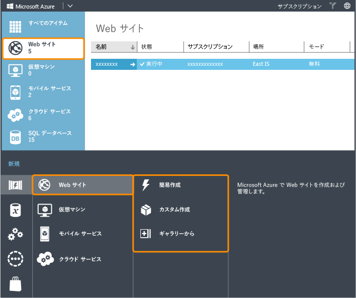
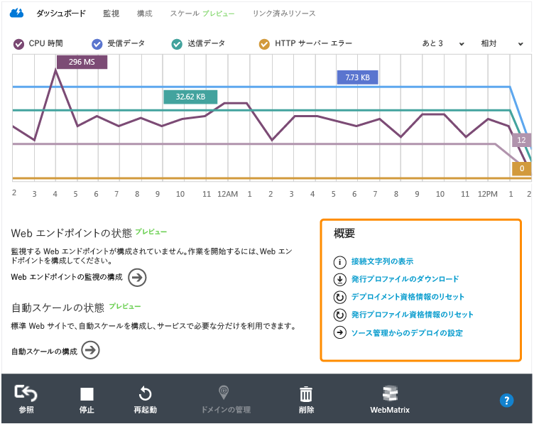
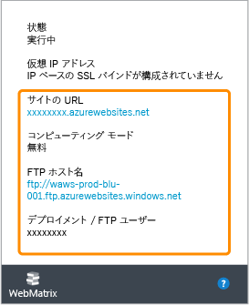
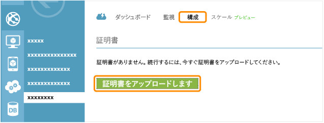
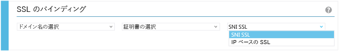
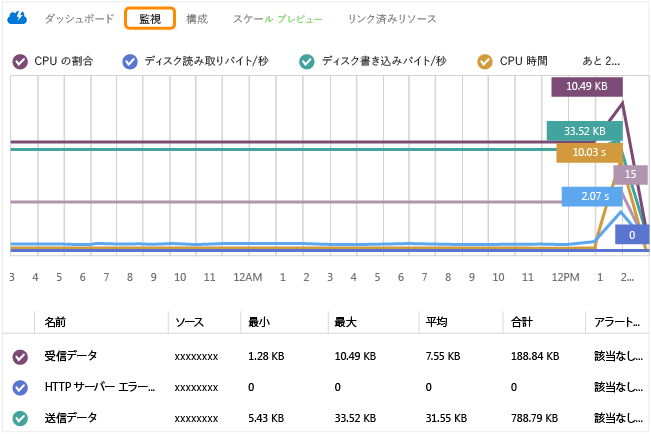
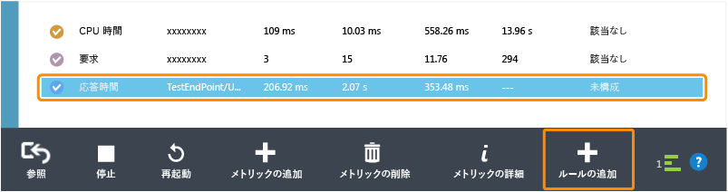

<properties linkid="websites-global-web-presence" urlDisplayName="Create a Global Web Presence on Azure Websites" pageTitle="Create a Global Web Presence on Azure Websites" metaKeywords="" description="This guide provides a technical overview of how to host your organization's (.COM) site on Azure Websites. This includes deployment, custom domains, SSL, and monitoring." metaCanonical="http://www.windowsazure.com/ja-jp/documentation/articles/web-sites-global-web-presence-solution-overview/" services="" documentationCenter="" title="Create a Global Web Presence on Azure Websites" authors="jroth" solutions="" manager="paulettm" editor="mollybos" />

<tags ms.service="web-sites" ms.workload="web" ms.tgt_pltfrm="na" ms.devlang="na" ms.topic="article" ms.date="01/01/1900" ms.author="jroth" />

# Azure Websites でのグローバル Web プレゼンスの作成

このガイドでは、Azure の Web サイトで組織の (.COM) サイトをホストする方法 (技術概要) について説明します。このシナリオは "グローバル Web プレゼンス" とも呼ばれます。このガイドで紹介するのは [Azure Websites][Azure Websites] でホストする方法です。Websites を使用すれば、Azure 上に Web アプリケーションをすばやく作成または移行し、それらの Web アプリケーションの規模設定や管理を容易に行えます。ただし、アプリケーションの要件によっては、[Azure のクラウド サービス][Azure のクラウド サービス]または IIS を実行する [Azure の仮想マシン][Azure の仮想マシン]の方が適している場合もあります。これらは Web アプリケーションをホストする際にも適しています。初期の計画段階で、「[Azure Websites、Cloud Services、VM: いつ、どれを使用するか][Azure Websites、Cloud Services、VM: いつ、どれを使用するか]」を参照してください。Cloud Services または Virtual Machines を使用する必要がない場合は、Websites を使用して組織の .com サイトをホストすることをお勧めします。ここでは、このシナリオでの Azure Websites の使用方法を紹介します。

このガイドの内容は次のとおりです。

-   [Azure の Web サイトの作成](#createwebsite)
-   [Web サイトのデプロイ](#deploywebsite)
-   [カスタム ドメインの追加](#customdomain)
-   [Web サイトを SSL で保護](#ssl)
-   [Web サイトの監視](#monitor)

<strong>注</strong>

このガイドで取り上げるのは公開 .COM サイト開発で必要となる最も一般的な分野やタスクですが、Azure Websites には特殊なニーズに対応できるその他の機能も備わっています。これらの機能については、<a href="http://www.windowsazure.com/ja-jp/manage/services/web-sites/digital-marketing-campaign-solution-overview">デジタル マーケティング キャンペーン</a>および<a href="http://www.windowsazure.com/ja-jp/manage/services/web-sites/business-application-solution-overview">基幹業務アプリケーション</a>のガイドを参照してください。

## Azure Website の作成

Azure 管理ポータルでは、いくつかの方法で新しい Azure Website を作成できます。ポータルの下部にある **[新規]** をクリックすると、次のようなダイアログ ボックスが表示されます。

新しい Website を作成する方法として、**[簡易作成]**、**[カスタム作成]**、**[ギャラリーから]** という 3 つのオプションがあります。どのオプションを選択した場合も、大多数のユーザーが所在している Azure リージョンを選択します。

既存のサイトを移行する場合に **[カスタム作成]** オプションを選択すると、SQL データベースまたは MySQL データベースを作成するか、またはこれらを関連付けることができます。[カスタム作成] では、GitHub や Team Foundation Server (TFS) などデプロイのソース管理オプションも指定できます。既にソース管理機能を使って Web サイトを管理している場合、Azure Website のデプロイをすばやく設定できます。

**[ギャラリーから]** を選択した場合、いずれかのフレームワーク (Drupal や WordPress など) を指定して新しいサイトをセットアップします。この方法では、新しいサイトをすばやくセットアップし、選択したフレームワーク内でそのサイトをカスタマイズできます。

Azure のほとんどのサービスと同様、新しい Website の Azure リージョンを選択する必要があります。Azure は世界中の複数のリージョンに配置されています。Website をいずれか 1 つのリージョンにデプロイすれば、世界各国どこからでもインターネット経由でそのサイトにアクセスできます。一方、複数のリージョンにデプロイした場合は柔軟性が高まります。たとえば、ユーザーに最も近いリージョンにサイトをデプロイできます。

新しい Web サイトの詳しい作成手順については、「[Azure Web サイトと ASP.NET の使用][Azure Web サイトと ASP.NET の使用]」を参照してください。

## Web サイトのデプロイ

Web サイトを Azure にデプロイするにはいくつかの方法があります。ギャラリーからフレームワークを選択するだけで基本的なサイトをデプロイできますが、必要であれば、目的に合わせてサイトとデプロイ設定を編集してください。次のような展開オプションがあります。

-   FTP クライアントを使用する
-   ソース管理からデプロイする
-   Visual Studio から公開する
-   [WebMatrix][WebMatrix] から発行する

これらのオプションにはそれぞれ利点があります。FTP クライアントから公開すれば、新しいファイルをサイトへ簡単に取り込むことができます。また、Azure Websites では、FTP を利用した既存の発行ツールや発行プロセスを引き続き利用できます。サイト コンテンツのリリースを管理するには "ソース管理" が最も適しています。変更を追跡および公開し、必要に応じて前のバージョンへロールバックできます。開発者が Visual Studio または Web Matrix を使用している場合は、これらのツールから直接公開する機能が役立ちます。たとえば、プロジェクトやプロトタイプの初期段階では、開発環境からコンテンツを直接発行してテストできると便利です。

ここで行う展開作業の多くは、Azure 管理ポータルの情報を使用します。対象となる Web サイトへ移動して **[ダッシュボード]** タブを選択し、**[概要]** セクションを参照してください。次のスクリーンショットにはいくつかのオプションが表示されています。

一部のソース管理ツールと FTP クライアントは、ユーザー名とパスワードを入力してアクセスする必要があります。新しい Website の資格情報は自動的に作成されませんが、**[展開資格情報のリセット]** をクリックすれば簡単に作成できます。資格情報を作成した後、**[ダッシュボード]** ページにそれらの資格情報と **[FTP ホスト名]** を入力すれば、FTP クライアントを使用して Web サイトをデプロイできます。

デプロイ/FTP ユーザー名は、Website 名と指定したユーザー名の組み合わせになります。たとえば、サイトが "<http://contoso.azurewebsite.net>" でユーザー名が "myuser" の場合、デプロイおよび FTP のユーザー名は "contoso\\myuser" になります。

GitHub や TFS Online などのソース管理サービスを介して展開する方法もあります。**[ソース管理からの展開の設定]** をクリックし、使用するソース管理システムまたはサービスの指示に従います。ローカル Git リポジトリから発行する詳しい手順については、「[ソース管理から Azure の Web サイトへの発行][ソース管理から Azure の Web サイトへの発行]」を参照してください。

Visual Studio を使用してサイトを作成および管理する場合は、Visual Studio から直接発行できます。たとえば、**[発行プロファイルのダウンロード]** をクリックして publishsettings ファイルを保存し、このファイルを Visual Studio にインポートして Web 発行で使用できます。

<strong>注</strong>

<i>publishsettings</i> ファイルは、ソース管理以外の安全な場所に保管してください。このファイルには、展開のユーザー名とパスワード、およびリンクされているすべてのデータベースの接続文字列が保存されています。

サブスクリプション情報を Visual Studio へ直接インポートすることもできます。たとえば、Visual Studio でローカル ASP.NET プロジェクトを開発している場合、目的の Web プロジェクトを右クリックして **[発行]** を選択します。**[Web の発行]** ダイアログ ボックスで **[インポート]** をクリックすると、Azure のサブスクリプション設定が保存されたファイル、または Websites のダッシュボードからダウンロードした publishsettings ファイルをインポートできます。次のスクリーンショットを参照してください。

Visual Studio から Azure への発行の詳細については、「ASP.NET Web アプリケーションを Azure Website にデプロイする」を参照してください。

Web サイトを開発して展開する方法として、Azure 管理ポータルには WebMatrix も用意されています。

この方法の詳細については、「[Microsoft WebMatrix を使用して Web サイトを開発して展開する][Microsoft WebMatrix を使用して Web サイトを開発して展開する]」を参照してください。

これらの手順に従えば .COM サイトを展開できますが、現在のコンテンツ発行サイクルを管理するための計画も作成してください。これらのオプションには、カスタム ソリューションの導入、時おり変更されるサイトへの定期的な再デプロイ、すべての機能を備えたコンテンツ管理システム (CMS) などがあります。新しい Web サイトを作成する場合、既存の CMS フレームワーク ([Drupal][Drupal]、[Umbraco][Umbraco] など) を使用するためのオプションがギャラリーに用意されています。

## カスタム ドメインの追加

組織の .COM サイトを作成する場合、通常はその Web サイトに登録済みのドメイン名を関連付けます。多くのサードパーティ プロバイダーがドメイン登録サービスを行っており、各種 DNS レコードの作成とドメイン管理をサポートしています。DNS レコードを使用すれば、対象サイトをホストする実際の URL や IP アドレスに親しみやすい URL ("www.contoso.com" など) を関連付けることができます。

<strong>注</strong>

この後の説明では 2 種類の DNS レコード (CNAME レコードと A レコード) を取り上げます。CNAME レコードは、ある URL ("www.contoso.com" など) から別の URL ("contoso.azurewebsites.net") へリダイレクトします。A レコードは、URL ("www.contoso.com" など) を IP アドレス (172.16.48.1. など) に関連付けます。

Azure Website では、最初に CNAME レコードを作成する必要があります。この設定を行うにはサードパーティの登録サイトを使用します。CNAME レコードの例を次に示します。

<table cellspacing="0" border="1">
<tr>
   <th align="left" valign="top">種類</th>
   <th align="left" valign="top">ホスト</th>
   <th align="left" valign="top">リダイレクト先</th>
   <th align="left" valign="top">TTL</th>
</tr>
<tr>
   <td valign="top"><strong>CNAME</strong></td>
   <td valign="top">www.contoso.com</td>
   <td valign="top">contoso.azurewebsites.net</td>
   <td valign="top">8000</td>
</tr>
</table>

ドメインを新しく登録した場合、そのドメインがすべての DNS サーバーに反映されるには 1 日以上かかることがあります (キャッシュされた DNS エントリとは別に動作します)。ただし、ドメインが既に存在する場合、CNAME の変更は 1 分ほどで反映されます。CNAME レコードは、ドメイン ("www" などのサブドメイン エイリアスを使用) と Azure Website の URL を関連付けることができます。CNAME レコードのどちら側にも "http://" プレフィックスは付きません。

Azure 管理ポータルの **[スケール]** タブで、**[Shared]** モードまたは [Standard] モードを選択していることを確認してください (**[Free]** モードの Web サイトはカスタム ドメインを使用できません)。**[構成]** タブへ移動し、**[ドメインの管理]** をクリックします。Web サイトにカスタム ドメイン名を関連付けられるようになります。

一覧にカスタム ドメインを追加するには、まず、DNS プロバイダーへアクセスして CNAME レコードを作成する必要があります。その際、カスタム ドメイン (www.contoso.com) と Azure Website (contoso.azurewebsites.net) の URL を関連付けます。これで、上記のスクリーンショットのダイアログにカスタム ドメインを入力できるようになります。この Web サイトを参照する www.contoso.com の CNAME レコードを作成することで、指定したドメイン名をこの Web サイトで使用する権限が与えられます。この時点で、ダイアログ ボックスの下部の IP アドレスを使用して A レコードを作成できます。

<table cellspacing="0" border="1">
<tr>
   <th align="left" valign="top">種類</th>
   <th align="left" valign="top">ホスト</th>
   <th align="left" valign="top">リダイレクト先</th>
   <th align="left" valign="top">TTL</th>
</tr>
<tr>
   <td valign="top"><strong>A</strong></td>
   <td valign="top">contoso.com</td>
   <td valign="top">172.16.48.1</td>
   <td valign="top">8000</td>
</tr>
</table>

詳細については、<a href="/ja-jp/develop/net/common-tasks/custom-dns-web-site/">Azure の Web サイトのカスタム ドメイン名の構成に関するページ</a>を参照してください。

<h2 id="secure-the-website-with-ssl">SSL による Web サイトのセキュリティ保護</h2>

サイトで公開する情報が読み取り専用の場合、そのサイトへのアクセスをセキュリティで保護する必要はありません。ただし、ユーザー情報を収集したり、通信販売を行ったり、その他の機密データを管理したりする場合は、サイトを保護しなければなりません。セキュリティは大きなテーマなので、すべてのベスト プラクティスや手法をこのドキュメントで取り上げることはできません。ただし、中でも重要なのは、Secure Sockets Layer (SSL) を有効にして Web サイトを保護することです。SSL はユーザーがサイトへ接続する際の通信を暗号化する技術であり、HTTP の代わりに HTTPS アドレスを用います。Azure Websites で SSL を使用するには、決められた手順に従う必要があります。

Azure Websites では、実際のサイト URL への接続が自動的に保護されます。たとえば、サイトが <a href="http://contoso.azurewebsites.net" class="uri">http://contoso.azurewebsites.net</a> の場合、&quot;http&quot; を &quot;https&quot; に変更する (<strong>https</strong>://contoso.azurewebsites.net) だけで SSL 経由で接続できます。

ただし、カスタム ドメイン名を使用する場合は、Web サイトの Azure 管理ポータルから証明書をアップロードして SSL を有効にする必要があります。この後、そのための大まかな手順を説明しますが、詳細については「<a href="/ja-jp/develop/net/common-tasks/enable-ssl-web-site/">Azure の Web サイトの SSL 証明書の構成</a>」を参照してください。

まず、証明機関から SSL 証明書を取得します。保護対象のドメインが複数のサブドメインで構成されている場合は、ワイルドカード証明書を取得する必要があります (たとえば、www.contoso.com と staging.contoso.com の場合、ワイルドカード証明書 *.contoso.com を取得します)。ワイルドカード証明書は通常より費用がかかるので、ワイルドカード証明書によって得られる柔軟性がその費用に見合うかを検討する必要があります。

証明機関から証明書を取得した後、そのままのフォーマットでは Azure へアップロードできません。openssl コマンドを使用して .pfx ファイルを生成する必要があります。openssl コマンドは OpenSSL プロジェクトの一部です。ソースは <a href="http://www.openssl.org/">OpenSSL Web サイト</a>で配布されていますが、このツールのコンパイル済みバージョンもインターネットで入手できます。次の例では、証明書 myserver.crt と 秘密キー ファイル myserver.key を使用して .pfx ファイルを作成します。

<pre><code data-inline="1">openssl pkcs12 -export -out myserver.pfx -inkey myserver.key -in myserver.crt</code></pre>

証明書を Azure へアップロードするには、<strong>[スケール]</strong>  タブを開き、<strong>[標準]</strong> モードで実行していることを確認します。<strong>[無料]</strong> モードと <strong>[共有]</strong> モードでは、カスタム ドメインを SSL で保護できません。<strong>[構成]</strong> タブで <strong>[証明書をアップロードします]</strong> をクリックします。

<strong>[SSL のバインディング]</strong> セクションで証明書を選択し、さらにその証明書が保護するドメイン名を選択します。証明書のマッピング方法には、SNI SSL と IP ベースの SSL があります。

<strong>[IP ベースの SSL]</strong> オプションは、専用のパブリック IP アドレスをドメイン名に関連付ける従来の方法です。この方法はすべてのブラウザーで使用できます。<strong>[SNI SSL]</strong> オプションを選択した場合、複数のドメインで同じ IP アドレスを共有でき、さらにドメインごとに異なる SSL 証明書を関連付けることができます。SNI SSL は一部の古いブラウザーでは機能しません (互換性については、<a href="http://en.wikipedia.org/wiki/Server_Name_Indication">SNI SSL に関するウィキペディア項目</a>を参照してください)。SSL 証明書ごとに毎月課金され (時間割り計算)、IP ベースの SSL を選択するか、SNI SSL を選択するかによって料金が異なります。料金については、「<a href="/ja-jp/pricing/details/web-sites/#service-ssl">Web サイトの料金詳細</a>」を参照してください。SSL 証明書の詳細については、「<a href="/ja-jp/develop/net/common-tasks/enable-ssl-web-site/">Azure の Web サイトの SSL 証明書の構成</a>」を参照してください。

<h2 id="monitor-the-site">Web サイトの監視</h2>

Web サイトでユーザーの要求を処理できるようになったら、運用状況を監視することが大切です。たとえば、ユーザー負荷により CPU 時間が増加している場合は、サイトを拡張する必要があります。また、アプリケーションの処理効率が低下すると、応答時間が長くなったり、エラーが発生したりする可能性があります。このセクションでは、Azure 管理ポータルに組み込まれている一部の監視機能を紹介します。

<strong>[監視]</strong> タブには、Web サイトの主な指標がグラフとして表示されます。

このグラフの指標をカスタマイズするには [メトリックの追加] をクリックします。

<strong>[標準]</strong> モードで実行しているサイトでは、エンドポイントの監視とアラートも有効にできます。<strong>[構成]</strong> タブの <strong>[監視]</strong> セクションでエンドポイントを構成します。このエンドポイントは指定した 1 つの場所から実行でき、定期的に Web サイトへのアクセスを試みます。タイミング情報とエラー情報の両方が収集されます。

<strong>[監視]</strong> タブには、このエンドポイントの応答時間が表示されます。エンドポイント メトリックを選択した後、<strong>[ルールの追加]</strong> アイコンをクリックしてアラート ルールを追加します。

ルールに基づき、応答時間が所定のしきい値を超えた時点で管理者またはその他の担当者に電子メールが送信されます。

サイトの規模設定 (スケール) が必要と判断した場合、<strong>[スケール]</strong> タブで手動で規模を設定するか、自動スケール (プレビュー) 機能を使用します。[スケール] タブでは、スケールアップ (専用マシンを増強する) とスケールアウト (同じサイズの共有インスタンスまたは専用インスタンスを追加する) の両方を設定できます。ただし、自動スケール (プレビュー) がサポートしているのはスケールアウトのみです。詳細については、<a href="/ja-jp/manage/services/web-sites/digital-marketing-campaign-solution-overview">デジタル マーケティング キャンペーン</a> シナリオの「ユーザーの需要に応じた規模設定 (スケーリング)」を参照してください。また、「<a href="/ja-jp/manage/services/web-sites/how-to-monitor-websites/">Web サイトの監視方法</a>」も参照してください。

<h2 id="summary">まとめ</h2>

組織の (.COM) サイトを作成する際の一般的な作業手順は、開発フレームワークの選択、サイトの作成とデプロイ、カスタム ドメインの割り当て、サイトの監視です。ユーザー データの保護を要するサイトでは SSL を使用してください。ここでは、Azure Websites を使用してこれらの作業を実施する方法を概説しました。詳細については、次の技術解説記事を参照してください。

<table cellspacing="0" border="1">
<tr>
<th align="left" valign="top">領域</th>
<th align="left" valign="top">リソース</th>
</tr>
<tr>
<td valign="middle"><strong>計画</strong></td>
<td valign="top">- <a href="http://www.windowsazure.com/ja-jp/manage/services/web-sites/choose-web-app-service">Azure Websites、クラウド サービス、仮想マシン: いつ、どれを使用するか</a></td>
</tr>
<tr>
<td valign="middle"><strong>作成</strong></td>
<td valign="top">- <a href="http://azure.microsoft.com/ja-jp/documentation/articles/web-sites-dotnet-get-started/">Azure Websites と ASP.NET を使用する</a></td>
</tr>
<tr>
<td valign="middle"><strong>展開</strong></td>
<td valign="top">- <a href="http://www.windowsazure.com/ja-jp/develop/net/common-tasks/publishing-with-git/">ソース管理から Azure Websites への発行</a> - <a href="http://www.windowsazure.com/ja-jp/develop/net/tutorials/get-started/">ASP.NET Web アプリケーションを Azure Website にデプロイする</a> - <a href="http://www.windowsazure.com/ja-jp/develop/net/tutorials/website-with-webmatrix/">Microsoft WebMatrix を使用して Web サイトを開発してデプロイする</a></td>
</tr>
<tr>
<td valign="middle"><strong>カスタム ドメイン</strong></td>
<td valign="top">- <a href="http://www.windowsazure.com/ja-jp/develop/net/common-tasks/custom-dns-web-site/">Azure の Web サイトのカスタム ドメイン名の構成</a></td>
</tr>
<tr>
<td valign="middle"><strong>SSL</strong></td>
<td valign="top">- <a href="http://www.windowsazure.com/ja-jp/develop/net/common-tasks/enable-ssl-web-site/">Azure Website の SSL 証明書の構成</a></td>
</tr>
<tr>
<td valign="middle"><strong>監視</strong></td>
<td valign="top">- <a href="http://www.windowsazure.com/ja-jp/manage/services/web-sites/how-to-monitor-websites/">Web サイトを監視する方法</a></td>
</tr>
</table>

  [Azure Websites]: /ja-jp/documentation/services/web-sites/
  [Azure のクラウド サービス]: /ja-jp/documentation/services/cloud-services/
  [Azure の仮想マシン]: /ja-jp/documentation/services/virtual-machines/
  [Azure Websites、Cloud Services、VM: いつ、どれを使用するか]: /ja-jp/manage/services/web-sites/choose-web-app-service

  [Azure Web サイトと ASP.NET の使用]: /ja-jp/documentation/articles/web-sites-dotnet-get-started
  [WebMatrix]: http://www.microsoft.com/web/webmatrix/
  [ソース管理から Azure の Web サイトへの発行]: /ja-jp/develop/net/common-tasks/publishing-with-git/
  [Microsoft WebMatrix を使用して Web サイトを開発して展開する]: /ja-jp/develop/net/tutorials/get-started/
  [Drupal]: https://drupal.org/
  [Umbraco]: http://umbraco.com/
