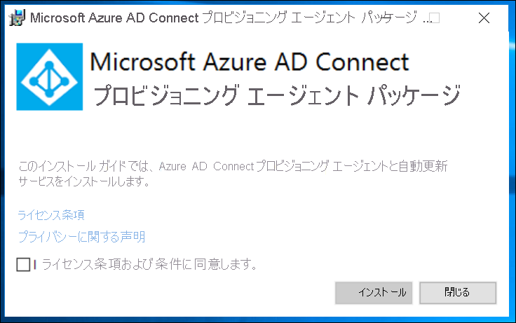
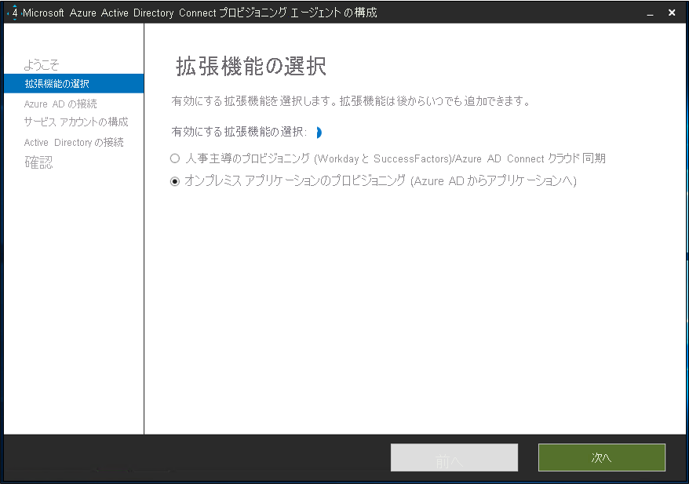

このドキュメントでは、ユーザーを Azure Active Directory (Azure AD) から SQL データベースに自動的にプロビジョニングおよびプロビジョニング解除するために実行する必要がある手順について説明します。 このドキュメントでは、AD LDSに焦点を当てしていますが、以下で説明するサポートされている LDAP ディレクトリにプロビジョニングできます。 このソリューションを使用Active Directory Domain Servicesへのユーザーのプロビジョニングはサポートされていません。 
 
このサービスが実行する内容、しくみ、よく寄せられる質問の重要な詳細については、「[Azure Active Directory による SaaS アプリへのユーザー プロビジョニングとプロビジョニング解除の自動化](../articles/active-directory/app-provisioning/user-provisioning.md)」を参照してください。

## <a name="prerequisites-for-provisioning-users-into-an-ldap-directory"></a>LDAP ディレクトリにユーザーをプロビジョニングするための前提条件

>[!IMPORTANT]
> オンプレミス プロビジョニング プレビューは現在、招待のみのプレビューとなります。 この機能へのアクセスを要求するには、[アクセス要求フォーム](https://aka.ms/onpremprovisioningpublicpreviewaccess)を使用してください。 今後数か月の間に、より多くのお客様および接続ユーザーにプレビューを公開し、一般提供に向けて準備を進めていく予定です。 このプレビューではActive Directory Domain Servicesへのユーザーのプロビジョニングはサポートされていません。 


### <a name="on-premises-prerequisites"></a>オンプレミスの前提条件

 - Active Directory Lightweight Services (AD LDS) などのターゲット システム。ユーザーを作成、更新、削除できます。 このAD LDSインスタンスを使用して、ユーザーを Azure AD にプロビジョニングする必要があります。これは、インスタンスを使用してループを作成Azure AD Connect。 
 - インターネット アクセス可能な TCP/IP アドレス、ターゲット システムへの接続のほか、login.microsoftonline.com への送信接続を備えた Windows Server 2016 以降のコンピューター。 1 つの例は、Azure IaaS でホストされているか、またはプロキシの背後にある Windows Server 2016 仮想マシンです。 サーバーには、少なくとも 3 GB の RAM が必要です。
 - .NET Framework 4.7.1 を含むコンピューター。
 - 省略可能: 必須ではありません。Microsoft Edge [Windows Server](https://www.microsoft.com/en-us/edge?r=1)用の Microsoft Edge をダウンロードし、Internet Explorer の代Internet Explorer。

選択するオプションによっては、ウィザードの一部の画面を使用できない場合があり、情報も多少異なる可能性があります。 この構成では、ユーザー オブジェクトの種類を使用します。 次の情報を使用して構成を進めます。 

#### <a name="supported-systems"></a>サポートされるシステム
* OpenLDAP
* Microsoft Active Directory ライトウェイト ディレクトリ サービス (AD LDS)
* 389 Directory Server
* Apache Directory Server
* IBM Tivoli DS
* Isode Directory
* NetIQ eDirectory
* Novell eDirectory
* Open DJ
* Open DS
* Open LDAP (openldap.org)
* Oracle (以前は Sun) Directory Server Enterprise Edition
* RadiantOne Virtual Directory Server (VDS)
* Sun One Directory Server


### <a name="cloud-requirements"></a>クラウドの要件

 - Azure AD Premium P1 または Premium P2 (または EMS E3 または E5) を持つ Azure AD テナント。 
 
    [!INCLUDE [active-directory-p1-license.md](active-directory-p1-license.md)]
 - プロビジョニング エージェントを構成するためのハイブリッド管理者ロールと、Azure portal でプロビジョニングを構成するためのアプリケーション管理者またはクラウド管理者ロール。

### <a name="more-recommendations-and-limitations"></a>推奨事項と制限事項
次の箇条書きは、より多くの推奨事項と制限事項です。
- クラウド同期とオンプレミス アプリのプロビジョニングに同じエージェントを使用することはできません。  クラウド同期には別のエージェントを使用し、もう 1 つはオンプレミス アプリのプロビジョニングに使用をお勧めします。
- 現時点AD LDS、ユーザーをパスワードでプロビジョニングすることはできません。  そのため、ユーザーのパスワード ポリシーを無効にするか、AD LDS状態でユーザーをプロビジョニングする必要があります。
- Active Directory Domains Services Azure Active Directoryユーザーのプロビジョニングはサポートされていません。
- LDAP からグループへのユーザー Azure ADはサポートされていません。

## <a name="prepare-the-ldap-directory"></a>LDAP ディレクトリを準備する
次の情報は、テスト環境の作成に役立AD LDSされています。  このセットアップでは、PowerShell と応答ファイルADAMInstall.exeを使用します。  このドキュメントでは、データ の詳細についてはAD LDS。  Microsoft Active Directory ライトウェイト ディレクトリ サービス ([AD LDS](/previous-versions/windows/it-pro/windows-server-2012-r2-and-2012/hh831593(v=ws.11))) 

テスト環境でAD LDSを既に使用している場合は、次のセクションをスキップし、ECMA ホスト コネクタセクションのインストールに進む必要があります。

### <a name="create-an-ssl-certificate-a-test-directory-and-install-ad-lds"></a>SSL 証明書、テスト ディレクトリを作成し、証明書をAD LDS。
付録 A の PowerShell スクリプト [を使用します](#appendix-a---install-ad-lds-powershell-script)。 スクリプトは、次のアクションを実行します。
  - LDAP コネクタによって使用される自己署名証明書を作成します
  - 機能インストール ログのディレクトリを作成します
  - 個人用ストア内の証明書をディレクトリにエクスポートします
  - ローカル コンピューターの信頼されたルートに証明書をインポートします
  - 仮想マシンAD LDSロールをインストールします 

Windows Server 仮想マシンでは、 を使用して LDAP コネクタで、管理者特権を持つ Windows PowerShellを使用してスクリプトを実行します。  

### <a name="create-an-instance-of-ad-lds"></a>のインスタンスを作成AD LDS
ロールがインストールされたので、 のインスタンスを作成する必要AD LDS。  インスタンスを作成するには、次に示す応答ファイルを使用できます。  このファイルは、UI を使用せずにインスタンスを自動的にインストールします。

付録 B の内容 [をメモ](#appendix-b---answer-file)帳にコピーし、answer.txt **C:\Windows\ADAM" に保存します**。

管理者特権でコマンド プロンプトを開き、次のコマンドを実行します。

```
C:\Windows\ADAM> ADAMInstall.exe /answer:answer.txt
```

### <a name="create-containers-and-a-service-account-for-ad-lds"></a>コンテナーとサービス アカウントを作成し、AD LDS。
付録 A の PowerShell スクリプト [を使用します](#appendix-c---populate-ad-lds-powershell-script)。 スクリプトは、次のアクションを実行します。
  - LDAP コネクタで使用されるサービス アカウントのコンテナーを作成します
  - クラウド ユーザーのコンテナーを作成します。  このコンテナーは、ユーザーのプロビジョニング先です。
  - サービス アカウントを AD LDS
  - サービス アカウントを追加します。
  - サービス アカウントを管理者ロールAD LDS追加します

Windows Server 仮想マシンでは、 を使用して LDAP コネクタで、管理者特権を持つ Windows PowerShellを使用してスクリプトを実行します。  

## <a name="grant-the-network-service-read-permissions-to-the-ssl-cert"></a>SSL 証明書に NETWORK SERVICE の読み取りアクセス許可を付与する
SSL が機能するには、新しく作成された証明書に対するネットワーク サービスの読み取りアクセス許可を付与する必要があります。  アクセス許可を付与するには、次の手順に従います。

 1. **C:\Program Data\Microsoft\Crypto\Keys に移動します**。
 2. ここに表示されているシステム ファイルを右クリックします。  これは guid です。  このコンテナーには、証明書が格納されています。
    a. プロパティの選択。
    b. 上部で **[サンプル]** タブを選択します。 **[編集]** を選択します。
    d. **[追加]** をクリックします。
    e. ボックスに「Network **Service」と入力し、[** 名前の確認 **] を選択します**。
    f. 一覧 **から [ネットワーク サービス]** を選択し **、[OK] をクリックします**。
    g. **[OK]** をクリックします。
    h. ネットワーク サービス アカウントに読み取りおよび読み取り&実行アクセス許可が与え、適用 **して****[OK] をクリックします**。

## <a name="verify-ssl-connectivity-with-ad-lds"></a>クライアントとの SSL 接続を確認AD LDS
証明書を構成し、ネットワーク サービス アカウントのアクセス許可を付与したので、接続をテストして、動作を確認します。
 1. [サーバー マネージャーを開き、左側AD LDSを選択します
 2. インスタンスを右クリックしAD LDSポップアップldp.exeを選択します。
   [](media/active-directory-app-provisioning-ldap/ldp-1.png#lightbox)</br>
 3. ldp.exe の上部にある [**接続**] を選択し、 **Connect**] をクリックします。
 4. Enter the following information and click **OK**.
    - サーバー: APP3
    - ポートは 80 にします。
    - [SSL] ボックスにチェック を入れる [ </br>
 5.  次のスクリーン ショットのような結果が表示されます。
    の成功 ](media/active-directory-app-provisioning-ldap/ldp-3.png#lightbox)</br>
 6.  上部の [ **接続** ] で [ **バインド**] を選択します。
 7. 既定値をそのまま使用し、**[Ok]** をクリックします。
   [](media/active-directory-app-provisioning-ldap/ldp-4.png#lightbox)</br>
 8. これで、 インスタンスに正常にバインドされます。
   [](media/active-directory-app-provisioning-ldap/ldp-5.png#lightbox)</br>


## <a name="download-install-and-configure-the-azure-ad-connect-provisioning-agent-package"></a>Azure AD Connect プロビジョニング エージェント パッケージのダウンロード、インストール、構成

 1. Azure ポータルにサインインします。
 2. **[エンタープライズ アプリケーション]**  >  **[新しいアプリケーションを追加]** に移動します。
 3. **[On-premises ECMA app]\(オンプレミス ECMA アプリ\)** のアプリケーションを検索し、テナント イメージに追加します。
 4. 追加された **オンプレミス ECMA アプリ** を選択します。
 5. **[Getting Started]\(作業の開始\)** の **[3. Provision user accounts]\(3. ユーザー アカウントのプロビジョニング\)** ボックスで、 **[Get started]\(作業の開始\)** を選択します。
 6. 上部のドロップダウンから、プロビジョニングを自動 に変更 **します**。  この操作により、以下 **にオンプレミス接続が表示** されます。
 7. **[オンプレミス接続]** で、エージェント インストーラーをダウンロードします。
 8. Azure AD Connect プロビジョニングのインストーラ (**AADConnectProvisioningAgentSetup.msi**) を実行します。
 9. **[Microsoft Azure AD Connect Provisioning Agent Package]** 画面で、ライセンス条項に同意し、 **[インストール]** を選択します。
     [](media/active-directory-app-provisioning-sql/install-1.png#lightbox)</br>
 10. この操作が完了すると、構成ウィザードが起動します。 **[次へ]** を選択します。
     [](media/active-directory-app-provisioning-sql/install-2.png#lightbox)</br>
 11. **[拡張機能の選択]** 画面で、 **[オンプレミス アプリケーションのプロビジョニング] (Azure AD からアプリへ)** を選択します。 **[次へ]** を選択します。
     [](media/active-directory-app-provisioning-sql/install-3.png#lightbox)</br>
 12. グローバル管理者アカウントを使用し、Azure AD にサインインします。
     [](media/active-directory-app-provisioning-sql/install-4.png#lightbox)</br>
 13. **[エージェントの構成]** 画面で、 **[確認]** を選択します。
     [](media/active-directory-app-provisioning-sql/install-5.png#lightbox)</br>
 14. インストールが完了すると、ウィザードの下部にメッセージが表示されます。 **[終了]** を選択します。
     [](media/active-directory-app-provisioning-sql/install-6.png#lightbox)</br>
 15. Azure portal の **[On-premises ECMA app]\(オンプレミス ECMA アプリ\)** アプリケーションに戻り、 **[Edit Provisioning]\(プロビジョニングの編集\)** に戻ります。
 16. **[プロビジョニング]** ページで、モードを **[自動]** に変更します。
     [![モードを [自動] への変更を示すスクリーンショット。](.\media\active-directory-app-provisioning-sql\configure-7.png)](.\media\active-directory-app-provisioning-sql\configure-7.png#lightbox)</br>
 17. **[オンプレミス接続]** セクションで、デプロイしたばかりのエージェントを選択し、 **[エージェントの割り当て]** をクリックします。
     [](.\media\active-directory-app-provisioning-ldap\assign-1.png#lightbox)</br>
     >[!NOTE]
     >エージェントの追加後、登録が完了するまで 10 分間待機してください。 登録が完了するまで、接続テストは機能しません。
     >
     >または、サーバーでプロビジョニング エージェントを再起動して、エージェントの登録を強制的に完了させることもできます。 サーバーに移動し、Windows 検索バーで **サービス** を検索し、**Azure AD Connect プロビジョニング エージェント サービス** を特定し、サービスを右クリックして再起動します。

 ## <a name="configure-the-azure-ad-ecma-connector-host-certificate"></a>Azure AD ECMA Connector Host の証明書を構成する
 1. デスクトップにある ECMA ショートカットを選択します。
 2. ECMA Connector Host の構成が開始したら、既定のポート **8585** のままにし、 **[生成]** を選択して証明書を生成します。 自動生成された証明書は、信頼ルートの一部として自己署名されます。 SAN はホスト名と一致します。
     [](.\media\active-directory-app-provisioning-sql\configure-1.png#lightbox)
 3. **[保存]** を選択します。


## <a name="configure-a-generic-ldap-connector"></a>汎用 LDAP コネクタを構成する
 1. デスクトップで、ECMA Connector Host のショートカットを選択します。
 2. **[新しいコネクタ]** を選択します。
     [](.\media\active-directory-app-provisioning-sql\sql-3.png#lightbox)</br>
 3. **[プロパティ]** ページでは、画像の下にある表に指定される値をボックスに入力し、 **[次へ]** を選択します。
     [](.\media\active-directory-app-provisioning-ldap\create-1.png#lightbox)

     |プロパティ|値|
     |-----|-----|
     |名前|LDAP|
     |AutoSync タイマー (分)|120|
     |シークレット トークン|ここに自身のキーを入力します。 12 文字以上である必要があります。|
     |拡張 DLL|汎用 SQL コネクタの場合、**Microsoft.IAM.Connector.GenericSql.dll** を選択します。|
4. **[接続性]** ページでは、画像の下にある表に指定される値をボックスに入力し、 **[次へ]** を選択します。
     [](.\media\active-directory-app-provisioning-ldap\create-2.png#lightbox)</br>
     
     |プロパティ|値|
     |-----|-----|
     |Host|APP3|
     |Port|636|
     |[接続タイムアウト]|180|
     |バインド|SSL|
     |[ユーザー名]|CN=svcAccount,CN=ServiceAccounts,CN=App,DC=contoso,DC=lab|
     |Password|指定されたユーザー名のパスワード|

     >[!NOTE]
     >接続しようとして問題が発生した場合は、 のサービス アカウントが有効AD LDS確認します。 
     
 5. **[ようこそ]** ページで **[次へ]** をクリックします。
 6. [パーティション] **ページで** 、既定値のままにして [次へ] を **選択します**。
 7. **[プロファイルの実行]** ページで **[エクスポート]** チェックボックスを選択したままにします。 **[フル インポート]** チェックボックスを選択して、 **[次へ]** を選択します。
     [](.\media\active-directory-app-provisioning-ldap\create-3.png#lightbox)</br>
     
     |プロパティ|説明|
     |-----|-----|
     |エクスポート|データを SQL にエクスポートする実行プロファイル。 この実行プロファイルは必須です。|
     |フル インポート|前に指定した SQL ソースからすべてのデータをインポートする実行プロファイル。|
     |差分インポート|最後のフルまたは差分インポート以降の SQL からの変更のみをインポートする実行プロファイル。|
 12. [エクスポート] **ページ** で、既定値のままにして [次へ] を **クリックします**。 
 13. [エクスポート] **ページ** で、既定値のままにして [次へ] を **クリックします**。 
 14. **[オブジェクトの種類]** ページで、ボックスに入力し、 **[次へ]** を選択します。 個々のボックスのガイダンスについては、画像の下にある表を参照してください。
      - **ターゲット オブジェクト**: このオブジェクトは、LDAP ディレクトリ内のターゲット オブジェクトです。
      - **Anchor**: この属性は、ターゲット システム内で一意である必要があります。 Azure AD プロビジョニング サービスでは、初期サイクル後、この属性を使用して ECMA ホストに対してクエリを実行します。 このアンカー値は、スキーマ 3 のアンカー値と同じである必要があります。
      - **Query Attribute**: ECMA ホストでメモリ内キャッシュに対してクエリを実行するために使用されます。 この属性は一意である必要があります。
      - **DN**:ターゲット オブジェクトの distinguishedName。
     [](.\media\active-directory-app-provisioning-ldap\create-4.png#lightbox)</br>
     
     |プロパティ|説明|
     |-----|-----|
     |ターゲット オブジェクト|ユーザー|
     |アンカー|objectGUID|
     |クエリ属性|_distingusishedName|
     |DN|dn|
     |自動生成|unchecked|      
 15. ECMA ホストでは、ターゲット システムでサポートされる属性が検出されます。 Azure AD に公開する属性を選択できます。 プロビジョニングのために、これらの属性を Azure portal で構成できます。**[属性の選択]** ページで、ドロップダウン リストのすべての属性を追加し、**[次へ]** を選択します。
     [![[属性の選択] ページを示すスクリーンショット。](.\media\active-directory-app-provisioning-ldap\create-5.png)](.\media\active-directory-app-provisioning-ldap\create-5.png#lightbox)</br>
      **[属性]** ドロップダウン リストには、ターゲット システムで検出され、以前の **[属性の選択]** ページでは選択 *されなかった* 属性が示されます。 
 
 16. **[プロビジョニング解除]** ページの **[フローを無効化]** で **[削除]** を選択します。 前のページで選択した属性を [プロビジョニング解除] ページで選択することはできません。 **[完了]** を選択します。

## <a name="ensure-ecma2host-service-is-running"></a>ECMA2Host サービスが実行されていることを確かめる
 1. Azure AD ECMA Connector Host を実行しているサーバーで、 **[開始]** をクリックします。
 2. **「run」** と入力し、ボックスに **「services.msc」** と入力します。
 3. **サービス** リストで、**Microsoft ECMA2Host** が確実に存在し、実行中であるようにします。 そうでない場合は、 **[開始]** を選択します。
     [](.\media\active-directory-app-provisioning-sql\configure-2.png#lightbox)


## <a name="test-the-application-connection"></a>アプリケーションの接続をテストする
 1. Azure portal にサインインします。
 2. **[エンタープライズ アプリケーション]** の **[On-premises ECMA app]\(オンプレミス ECMA アプリ\)** アプリケーションに移動します。
 3. **[Edit Provisioning]\(プロビジョニングの編集\)** に移動します。
 4. 10 分後、 **[管理者資格情報]** セクションで、次の URL を入力します。 `connectorName` 部分を、ECMA ホスト上のコネクタの名前に置き換えます。 `localhost` はホスト名に置き換えることもできます。

    |プロパティ|値|
    |-----|-----|
    |テナントの URL|https://localhost:8585/ecma2host_connectorName/scim|
 
 5. コネクタの作成時に定義した **シークレット トークン** の値を入力します。
 6. **[接続のテスト]** をクリックし、1 分待ちます。
     [](.\media\active-directory-app-provisioning-ldap\test-1.png#lightbox)
 7. 接続テストが成功したら、 **[保存]** を選択します。</br>
     [](.\media\active-directory-app-provisioning-sql\configure-9.png#lightbox)
## <a name="assign-users-to-an-application"></a>アプリケーションにユーザーを割り当てる
これで、Azure AD ECMA Connector Host が Azure AD と通信できるようになったので、プロビジョニングの対象ユーザーの構成に進むことができます。 

 1. Azure portal で、 **[エンタープライズ アプリケーション]** を選択します。
 2. **オンプレミスのプロビジョニング** アプリケーションを選択します。
 3. 左側のウィンドウの **[管理]** で、 **[ユーザーとグループ]** を選択します。
 4. **[Add user/group]\(ユーザーまたはグループの追加\)** を選択します。
     [](.\media\active-directory-app-provisioning-sql\app-2.png#lightbox)
5. **[ユーザー]** で **[選択なし]** を選択します。
     [](.\media\active-directory-app-provisioning-sql\app-3.png#lightbox)
 6. 右側からユーザーを選択し、 **[選択]** ボタンを選択します。</br>
     [](.\media\active-directory-app-provisioning-sql\app-4.png#lightbox)
 7. **[割り当て]** を選択します。
     [](.\media\active-directory-app-provisioning-sql\app-5.png#lightbox)


#### <a name="configure-attribute-mapping"></a>属性マッピングを構成する
 1. Azure AD ポータルの **[エンタープライズ アプリケーション]** で、 **[プロビジョニング]** ページを選択します。
 2. **[Get started]\(作業を開始する\)** を選択します。
 3. **[マッピング]** を展開して **[Azure Active Directory ユーザーをプロビジョニングする]** を選択します。
 4. **[新しいマッピングの追加]** を選択します。
 5. ソース属性とターゲット属性を指定し、次の表に示すすべてのマッピングを追加します。

     |マッピングの種類|ソース属性|ターゲット属性|
     |-----|-----|-----|
     |直接|userPrincipalName|urn:ietf:params:scim:schemas:extension:ECMA2Host:2.0:User:textID|
     |Expression|Join("","CN=", Word([userPrincipalName], 1, "@"), ",CN=CloudUsers,CN=App,DC=Contoso,DC=lab")|urn:ietf:params:scim:schemas:extension:ECMA2Host:2.0:User:Email|
     |直接|IsSoftDeleted|urn:ietf:params:scim:schemas:extension:ECMA2Host:2.0:User:textID|
     |直接|displayName|urn:ietf:params:scim:schemas:extension:ECMA2Host:2.0:User:textID|
     |直接|objectId|urn:ietf:params:scim:schemas:extension:ECMA2Host:2.0:User:textID|
  
     [](.\media\active-directory-app-provisioning-ldap\map-1.png#lightbox)
 
 6. **[保存]** を選択します。

## <a name="disable-the-local-password-policy"></a>ローカル パスワード ポリシーを無効にする
現時点では、LDAP コネクタは空のパスワードでユーザーをプロビジョニングします。  このプロビジョニングは、サーバー上のローカル パスワード ポリシーを満たしていないので、テスト目的で無効にします。  パスワードの複雑さを無効にするには、次の手順に従います。

>[!IMPORTANT]
>パスワード同期はオンプレミスの LDAP プロビジョニングの機能ではないので、AD LDS をフェデレーション アプリケーションと共に使用する場合、AD DS と組み合わせて使用する場合、または AD LDS のインスタンスで既存のユーザーを更新する場合は、AD LDS を使用するように推奨しています。
 
 1. サーバーで、[ **スタート**]、[ **実行**]、[gpedit.msc] の順にクリックし **ます。**
 2. グループ ポリシー管理エディターで、**[コンピューターの構成]**、[ポリシー]、[Windows の設定]、[セキュリティの設定]、[アカウント ポリシー]、[パスワード ポリシー] の順に移動します。
 3. 右側の [ **パスワードは、複雑さの要件を満たしている必要があり** ます] をダブルクリックし、[ **無効**] を選択します。
  [](.\media\active-directory-app-provisioning-ldap\local-1.png#lightbox)</br>
 5. [適用] をクリックし、[OK] をクリックします。
 6. ローカル グループ ポリシー エディターを開きます。
 
## <a name="test-provisioning"></a>プロビジョニングをテストする
属性がマップされたので、ユーザーの 1 人でオンデマンド プロビジョニングをテストできます。
 
 1. Azure portal で、 **[エンタープライズ アプリケーション]** を選択します。
 2. **オンプレミスのプロビジョニング** アプリケーションを選択します。
 3. 左側で **プロビジョニング** を選択します。
 4. **[Provision on demand] (オンデマンドでプロビジョニングする)** を選択します。
 5. テスト ユーザーのものを検索し、 **[プロビジョニング]** を選択します。
 [](.\media\active-directory-app-provisioning-ldap\test-2.png#lightbox)</br>

## <a name="start-provisioning-users"></a>ユーザーのプロビジョニングを開始する
 1. オンデマンド プロビジョニングが成功したら、プロビジョニングの構成ページに戻ります。 スコープが割り当てられたユーザーとグループのみに確実に設定されているようにし、プロビジョニングを [**オン]** にして、 **[保存]** を選択します。
 
 2. プロビジョニングが開始されるまで数分待機します。 最大 40 分かかる場合があります。 プロビジョニング ジョブが完了した後、次のセクションで説明されているように、プロビジョニングの状態を **[オフ]** に変更し、 **[保存]** をクリックできます。 これにより、プロビジョニング サービスは今後実行されなくなります。

## <a name="check-that-users-were-successfully-provisioned"></a>ユーザーが正常にプロビジョニングされたことを確認する
待機した後、SQL データベースを確認して、ユーザーがプロビジョニングされているのを確認します。

 1. [サーバー マネージャーを開き、左側AD LDSを選択します
 2. インスタンスを右クリックしAD LDSポップアップldp.exeを選択します。
   [](media/active-directory-app-provisioning-ldap/ldp-1.png#lightbox)</br>
 3. ldp.exe の上部にある [**接続**] を選択し、 **Connect**] をクリックします。
 4. Enter the following information and click **OK**.
   - サーバー: APP3
   - ポートは 80 にします。
   - [SSL] ボックスにチェック を入れる [ [](media/active-directory-app-provisioning-ldap/ldp-2.png#lightbox)</br>
 5. 上部の [ **接続** ] で [ **バインド**] を選択します。
 6. 既定値をそのまま使用し、**[Ok]** をクリックします。
 7. 上部にある [**表示** と **ツリー** ] を選択します。
 8. [BaseDN] に「 **CN = App, dc = contoso, dc = lab** 」と入力し、[ **OK]** をクリックします。
 9. 左側の [DN] を展開し、[ **cn = CloudUsers, cn = App, dc = contoso, dc = lab**] をクリックします。  クラウドのユーザーが表示できます。
  [](media/active-directory-app-provisioning-ldap/test-3.png#lightbox)</br>

## <a name="appendix-a---install-ad-lds-powershell-script"></a>付録 A-PowerShell スクリプトをインストール AD LDS
Active Directory ライトウェイトディレクトリサービスのインストールを自動化する PowerShell スクリプト。


```powershell
# Filename:    1_SetupADLDS.ps1
# Description: Creates a certificate that will be used for SSL and installs Active Directory Lighetweight Directory Services.
#
# DISCLAIMER:
# Copyright (c) Microsoft Corporation. All rights reserved. This 
# script is made available to you without any express, implied or 
# statutory warranty, not even the implied warranty of 
# merchantability or fitness for a particular purpose, or the 
# warranty of title or non-infringement. The entire risk of the 
# use or the results from the use of this script remains with you.
#
#
#
#
#Declare variables
$DNSName = 'APP3'
$CertLocation = 'cert:\LocalMachine\MY'
$logpath = "c:\" 
$dirname = "test"
$dirtype = "directory"
$featureLogPath = "c:\test\featurelog.txt" 

#Create a new self-signed certificate
New-SelfSignedCertificate -DnsName $DNSName -CertStoreLocation $CertLocation

#Create directory
New-Item -Path $logpath -Name $dirname -ItemType $dirtype

#Export the certifcate from the local machine personal store
Get-ChildItem -Path cert:\LocalMachine\my | Export-Certificate -FilePath c:\test\allcerts.sst -Type SST

#Import the certificate in to the trusted root
Import-Certificate -FilePath "C:\test\allcerts.sst" -CertStoreLocation cert:\LocalMachine\Root


#Install AD LDS
start-job -Name addFeature -ScriptBlock { 
Add-WindowsFeature -Name "ADLDS" -IncludeAllSubFeature -IncludeManagementTools 
 } 
Wait-Job -Name addFeature 
Get-WindowsFeature | Where installed >>$featureLogPath


 ```

## <a name="appendix-b---answer-file"></a>付録 B-応答ファイル
このファイルは、AD LDS のインスタンスを自動化および作成するために使用されます。

>[!IMPORTANT]
> このスクリプトでは、AD LDS サービスアカウントのローカル管理者を使用して、パスワードをハードコーディングしています。  このアクションは **テストのみ** を目的としており、運用環境では使用しないでください。

```
 [ADAMInstall]
 InstallType=Unique
 InstanceName=AD-APP-LDAP
 LocalLDAPPortToListenOn=51300
 LocalSSLPortToListenOn=51301
 NewApplicationPartitionToCreate=CN=App,DC=contoso,DC=lab
 DataFilesPath=C:\Program Files\Microsoft ADAM\AD-APP-LDAP\data
 LogFilesPath=C:\Program Files\Microsoft ADAM\AD-APP-LDAP\data
 ServiceAccount=APP3\Administrator
 ServicePassword=Pa$$Word1
 AddPermissionsToServiceAccount=Yes
 Administrator=APP3\Administrator
 ImportLDIFFiles="MS-User.LDF"
 SourceUserName=APP3\Administrator
 SourcePassword=Pa$$Word1
 ```
## <a name="appendix-c---populate-ad-lds-powershell-script"></a>付録 C-PowerShell スクリプト AD LDS の設定
コンテナーとサービスアカウントを使用して AD LDS を設定する PowerShell スクリプト。


```powershell
# Filename:    2_PopulateADLDS.ps1
# Description: Populates our AD LDS environment with 2 containers and a service account

# DISCLAIMER:
# Copyright (c) Microsoft Corporation. All rights reserved. This 
# script is made available to you without any express, implied or 
# statutory warranty, not even the implied warranty of 
# merchantability or fitness for a particular purpose, or the 
# warranty of title or non-infringement. The entire risk of the 
# use or the results from the use of this script remains with you.
#
#
#
#
# Create service accounts container
New-ADObject -Name "ServiceAccounts" -Type "container" -Path "CN=App,DC=contoso,DC=lab" -Server "APP3:389"
Write-Output "Creating ServiceAccounts container"

# Create cloud users container
New-ADObject -Name "CloudUsers" -Type "container" -Path "CN=App,DC=contoso,DC=lab" -Server "APP3:389"
Write-Output "Creating CloudUsers container"

# Create a new service account
New-ADUser -name "svcAccountLDAP" -accountpassword  (ConvertTo-SecureString -AsPlainText 'Pa$$1Word' -Force) -Displayname "LDAP Service Account" -server 'APP3:389' -path "CN=ServiceAccounts,CN=App,DC=contoso,DC=lab"
Write-Output "Creating service account"

# Enable the new service account
Enable-ADAccount -Identity "CN=svcAccountLDAP,CN=ServiceAccounts,CN=App,DC=contoso,DC=lab" -Server "APP3:389"
Write-Output "Enabling service account"

# Add the service account to the Administrators role
Get-ADGroup -Server "APP3:389" -SearchBase "CN=Administrators,CN=Roles,CN=App,DC=contoso,DC=lab" -Filter "name -like 'Administrators'" | Add-ADGroupMember -Members "CN=svcAccountLDAP,CN=ServiceAccounts,CN=App,DC=contoso,DC=lab"
Write-Output "Adding service accounnt to Administrators role"


 ```
