このドキュメントでは、ユーザーを Azure Active Directory (Azure AD) から SQL データベースに自動的にプロビジョニングおよびプロビジョニング解除するために実行する必要がある手順について説明します。  
 
このサービスが実行する内容、しくみ、よく寄せられる質問の重要な詳細については、「[Azure Active Directory による SaaS アプリへのユーザー プロビジョニングとプロビジョニング解除の自動化](../articles/active-directory/app-provisioning/user-provisioning.md)」を参照してください。

## <a name="prerequisites-for-provisioning-to-a-sql-database"></a>SQL Database にプロビジョニングするための前提条件

>[!IMPORTANT]
> オンプレミス プロビジョニング プレビューは現在、招待のみのプレビューとなります。 この機能へのアクセスを要求するには、[アクセス要求フォーム](https://aka.ms/onpremprovisioningpublicpreviewaccess)を使用してください。 今後数か月の間に、より多くのお客様および接続ユーザーにプレビューを公開し、一般提供に向けて準備を進めていく予定です。


### <a name="on-premises-prerequisites"></a>オンプレミスの前提条件

 - SQL データベースなど、ユーザーの作成、更新、および削除が可能なターゲット システム。
 - インターネット アクセス可能な TCP/IP アドレス、ターゲット システムへの接続のほか、login.microsoftonline.com への送信接続を備えた Windows Server 2016 以降のコンピューター。 1 つの例は、Azure IaaS でホストされているか、またはプロキシの背後にある Windows Server 2016 仮想マシンです。 サーバーには、少なくとも 3 GB の RAM が必要です。
 - .NET Framework 4.7.1 を含むコンピューター。

選択するオプションによっては、ウィザードの一部の画面を使用できない場合があり、情報も多少異なる可能性があります。 この構成では、ユーザー オブジェクトの種類を使用します。 次の情報を使用して構成を進めます。 

#### <a name="supported-systems"></a>サポートされるシステム
* Microsoft SQL Server と Azure SQL
* IBM DB2 10.x
* IBM DB2 9.x
* Oracle 10 および 11g
* Oracle 12c および 18c
* MySQL 5.x

注: 汎用 SQL コネクタでは、列名の大文字と小文字は区別されません。 MySQL は Linux では大文字と小文字が区別され、Postgres はプラットフォーム全体で大文字と小文字が区別されます。 そのため、現在はサポートされていません。 

### <a name="cloud-requirements"></a>クラウドの要件

 - Azure AD Premium P1 または Premium P2 (または EMS E3 または E5) を持つ Azure AD テナント。 
 
    [!INCLUDE [active-directory-p1-license.md](active-directory-p1-license.md)]
 - プロビジョニング エージェントを構成するためのハイブリッド管理者ロールと、Azure portal でプロビジョニングを構成するためのアプリケーション管理者またはクラウド管理者ロール。

## <a name="prepare-the-sample-database"></a>サンプル データベースの準備
SQL Server を実行しているサーバー上で、 [付録 A](#appendix-a) にある SQLスクリプトを実行します。このスクリプトでは、CONTOSO という名前のサンプル データベースを作成します。 これは、ユーザーをプロビジョニングするデータベースです。


## <a name="create-the-dsn-connection-file"></a>DSN 接続ファイルの作成
汎用 SQL コネクタは、SQL サーバーに接続するための DSN ファイルです。 最初に、ODBC 接続情報を含むファイルを作成する必要があります。

 1. サーバー上で ODBC 管理ユーティリティを起動します。
     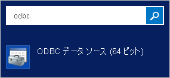</br>
 2. **[ファイル DSN]** タブを選択し、 **[追加]** を選択します。 
     ![[ファイル DSN] タブを示すスクリーンショット。](./media/active-directory-app-provisioning-sql/dsn-2.png)</br>
 3. **SQL Server Native Client 11.0** を選択し、 **[次へ]** を選択します。 
     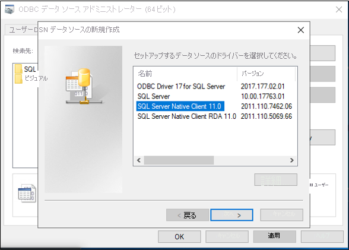</br>
 4. ファイルに **GenericSQL** などの名前を付け、 **[次へ]** を選択します。 
     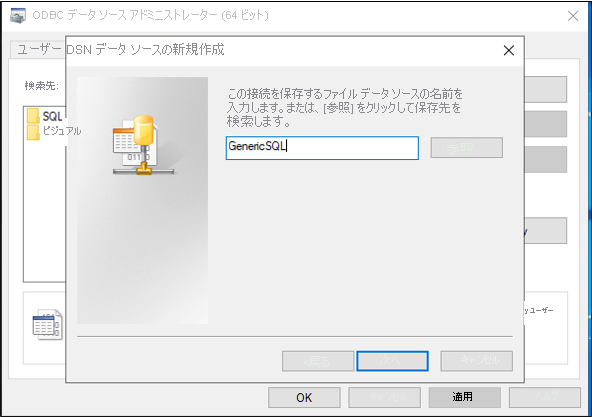</br>
 5. **[完了]** を選びます。 
     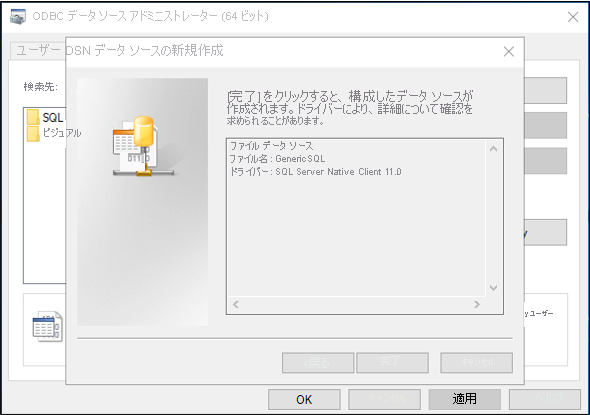</br>
 6. ここで接続を構成します。 サーバー名に **「APP1」** を入力し、 **[次へ]** を選択します。
     </br>
 7. Windows 認証を維持して **[次へ]** を選択します。
     </br>
 8. サンプル データベース名の **CONTOSO** を入力します。
     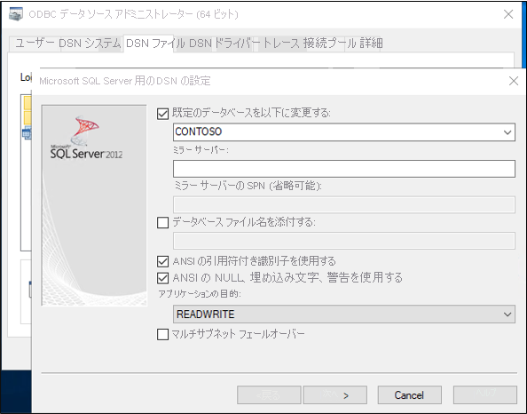
 9. この画面はすべて既定値のままにし、 **[完了]** を選択します。
     </br>
 10. 問題なく動作することを確認するには、 **[データ ソースのテスト]** を選択します。 
     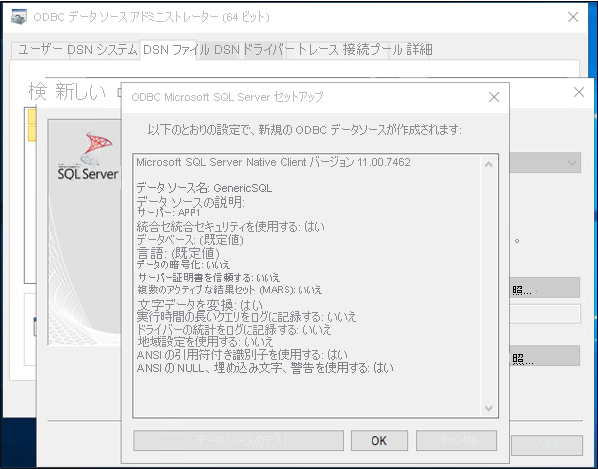</br>
 11. テストの成功を確認します。
     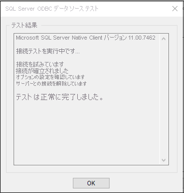</br>
 12. **[OK]** を 2 回選びます。 ODBC データ ソース アドミニストレーターを閉じます。


## <a name="download-install-and-configure-the-azure-ad-connect-provisioning-agent-package"></a>Azure AD Connect プロビジョニング エージェント パッケージのダウンロード、インストール、構成

 1. Azure ポータルにサインインします。
 2. **[エンタープライズ アプリケーション]**  >  **[新しいアプリケーションを追加]** に移動します。
 3. **[On-premises ECMA app]\(オンプレミス ECMA アプリ\)** のアプリケーションを検索し、テナント イメージに追加します。
 4. 追加された **オンプレミス ECMA アプリ** を選択します。
 5. **[Getting Started]\(作業の開始\)** の **[3. Provision user accounts]\(3. ユーザー アカウントのプロビジョニング\)** ボックスで、 **[Get started]\(作業の開始\)** を選択します。
 6. 上部にある **[Edit Provisioning]\(プロビジョニングの編集\)** を選択します。
 7. **[オンプレミス接続]** で、エージェント インストーラーをダウンロードします。     
     >[!NOTE]
     >オンプレミス アプリケーションのプロビジョニングと Azure AD Connect クラウド同期または人事主導のプロビジョニングには、異なるプロビジョニング エージェントを使用してください。 3 つのすべてのシナリオを同じエージェントで管理することはできません。 
 8. Azure AD Connect プロビジョニングのインストーラ (**AADConnectProvisioningAgentSetup.msi**) を実行します。
 9. **[Microsoft Azure AD Connect Provisioning Agent Package]** 画面で、ライセンス条項に同意し、 **[インストール]** を選択します。
     ![[Microsoft Azure AD Connect Provisioning Agent Package] 画面。](media/active-directory-app-provisioning-sql/install-1.png)</br>
 10. この操作が完了すると、構成ウィザードが起動します。 **[次へ]** を選択します。
     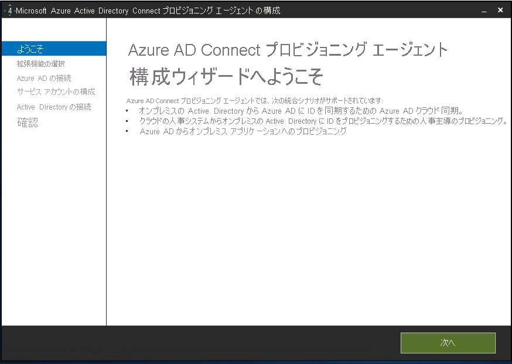</br>
 11. **[拡張機能の選択]** 画面で、 **[オンプレミス アプリケーションのプロビジョニング] (Azure AD からアプリへ)** を選択します。 **[次へ]** を選択します。
     ![[拡張機能の選択] を示すスクリーンショット。](media/active-directory-app-provisioning-sql/install-3.png)</br>
 12. グローバル管理者アカウントを使用し、Azure AD にサインインします。
     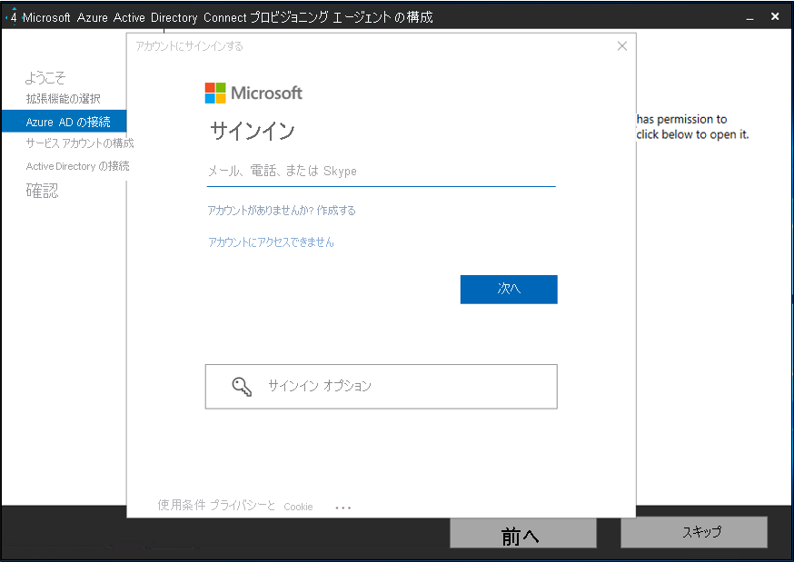</br>
 13. **[エージェントの構成]** 画面で、 **[確認]** を選択します。
     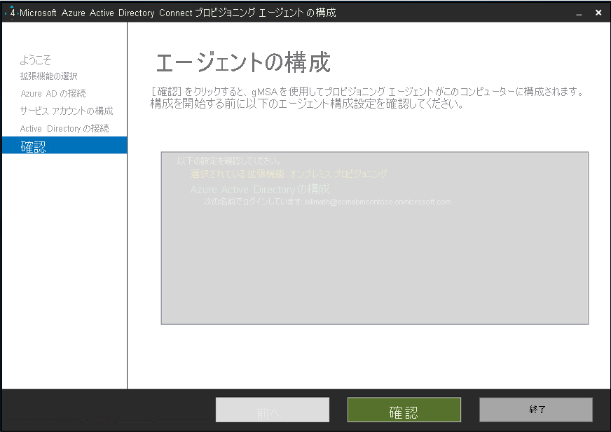</br>
 14. インストールが完了すると、ウィザードの下部にメッセージが表示されます。 **[終了]** を選択します。
     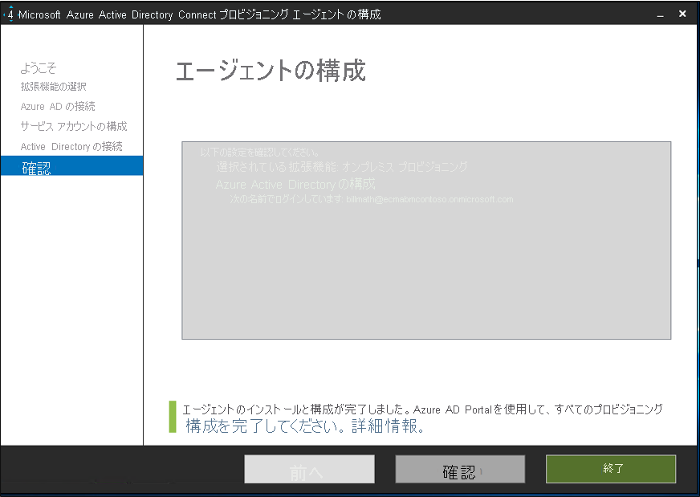</br>
 15. Azure portal の **[On-premises ECMA app]\(オンプレミス ECMA アプリ\)** アプリケーションに戻り、 **[Edit Provisioning]\(プロビジョニングの編集\)** に戻ります。
 16. **[プロビジョニング]** ページで、モードを **[自動]** に変更します。
     ![モードを [自動] への変更を示すスクリーンショット。](.\media\active-directory-app-provisioning-sql\configure-7.png)</br>
 17. **[オンプレミス接続]** セクションで、デプロイしたばかりのエージェントを選択し、 **[エージェントの割り当て]** をクリックします。
     </br>
     >[!NOTE]
     >エージェントの追加後、登録が完了するまで 10 分間待機してください。 登録が完了するまで、接続テストは機能しません。
     >
     >または、サーバーでプロビジョニング エージェントを再起動して、エージェントの登録を強制的に完了させることもできます。 サーバーに移動し、Windows 検索バーで **サービス** を検索し、**Azure AD Connect プロビジョニング エージェント サービス** を特定し、サービスを右クリックして再起動します。

  
 ## <a name="configure-the-azure-ad-ecma-connector-host-certificate"></a>Azure AD ECMA Connector Host の証明書を構成する
 1. デスクトップにある ECMA ショートカットを選択します。
 2. ECMA Connector Host の構成が開始したら、既定のポート **8585** のままにし、 **[生成]** を選択して証明書を生成します。 自動生成された証明書は、信頼ルートの一部として自己署名されます。 SAN はホスト名と一致します。
     
 3. **[保存]** を選択します。

## <a name="create-a-generic-sql-connector"></a>汎用 SQL コネクタを作成する
 1. デスクトップで、ECMA Connector Host のショートカットを選択します。
 2. **[新しいコネクタ]** を選択します。
     </br>
 3. **[プロパティ]** ページでは、画像の下にある表に指定される値をボックスに入力し、 **[次へ]** を選択します。
     

     |プロパティ|値|
     |-----|-----|
     |名前|SQL|
     |AutoSync タイマー (分)|120|
     |シークレット トークン|ここに自身のキーを入力します。 12 文字以上である必要があります。|
     |拡張 DLL|汎用 SQL コネクタの場合、**Microsoft.IAM.Connector.GenericSql.dll** を選択します。|
4. **[接続性]** ページでは、画像の下にある表に指定される値をボックスに入力し、 **[次へ]** を選択します。
     ![[接続性] ページを示すスクリーンショット。](.\media\active-directory-app-provisioning-sql\conn-2.png)</br>
     
     |プロパティ|説明|
     |-----|-----|
     |DSN ファイル|SQL Server インスタンスへの接続に使用するデータ ソース名ファイル|
     |[ユーザー名]|SQL Server インスタンスに対する権限を持つ個人のユーザー名。 スタンドアロン サーバーの場合は hostname\sqladminaccount で、ドメイン メンバー サーバーの場合は domain\sqladminaccount の形式を取る必要があります。|
     |パスワード|上記で指定したユーザー名のパスワード。|
     |DN is Anchor \(DN はアンカー\)|お使いの環境でこれらの設定が必要であるとわかっている場合を除いて、 **[DN is Anchor]\(DN はアンカー\)** および **[エクスポートの種類: オブジェクトの置換]** チェックボックスを選択しないでください。|
 5. **[スキーマ 1]** ページでは、画像の下にある表に指定される値をボックスに入力し、 **[次へ]** を選択します。
     ![[スキーマ 1] ページを示すスクリーンショット。](.\media\active-directory-app-provisioning-sql\conn-3.png)</br>

     |プロパティ|値|
     |-----|-----|
     |オブジェクトの種類の検出方法|Fixed Value|
     |固定値のリスト/テーブル/ビュー/SP|ユーザー|
 6. **[スキーマ 2]** ページでは、画像の下にある表に指定される値をボックスに入力し、 **[次へ]** を選択します。
     ![[スキーマ 2] ページを示すスクリーンショット。](.\media\active-directory-app-provisioning-sql\conn-4.png)</br>
 
     |プロパティ|値|
     |-----|-----|
     |ユーザー: 属性の検出|テーブル|
     |ユーザー: テーブル/ビュー/SP|Employees|
 7. **[スキーマ 3]** ページでは、画像の下にある表に指定される値をボックスに入力し、 **[次へ]** を選択します。
     ![[スキーマ 3] ページを示すスクリーンショット。](.\media\active-directory-app-provisioning-sql\conn-5.png)

     |プロパティ|説明|
     |-----|-----|
     |[:User] に[アンカー] を選択します|User:ContosoLogin|
     |ユーザーの DN 属性を選択してください|AzureID|
8. **[スキーマ 4]** ページでは、既定値のままにし、 **[次へ]** を選択します。
     ![[スキーマ 4] ページを示すスクリーンショット。](.\media\active-directory-app-provisioning-sql\conn-6.png)</br>
 9. **[グローバル]** ページで、ボックスに入力し、 **[次へ]** を選択します。 個々のボックスのガイダンスについては、画像の下にある表を参照してください。
     ![[グローバル] ページを示すスクリーンショット。](.\media\active-directory-app-provisioning-sql\conn-7.png)</br>
     
     |プロパティ|説明|
     |-----|-----|
     |データ ソースの日付と時刻の形式|yyyy-MM-dd HH:mm:ss|
 10. **[パーティション]** ページで **[次へ]** を選択します。
     ![[パーティション] ページを示すスクリーンショット。](.\media\active-directory-app-provisioning-sql\conn-8.png)</br>
 11. **[プロファイルの実行]** ページで **[エクスポート]** チェックボックスを選択したままにします。 **[フル インポート]** チェックボックスを選択して、 **[次へ]** を選択します。
     ![[実行プロファイル] ページを示すスクリーンショット。](.\media\active-directory-app-provisioning-sql\conn-9.png)</br>
     
     |プロパティ|説明|
     |-----|-----|
     |エクスポート|データを SQL にエクスポートする実行プロファイル。 この実行プロファイルは必須です。|
     |フル インポート|前に指定した SQL ソースからすべてのデータをインポートする実行プロファイル。|
     |差分インポート|最後のフルまたは差分インポート以降の SQL からの変更のみをインポートする実行プロファイル。|
 12. **[エクスポート]** ページで、ボックスに入力し、 **[次へ]** を選択します。 個々のボックスのガイダンスについては、画像の下にある表を参照してください。 
     ![[エクスポート] ページを示すスクリーンショット。](.\media\active-directory-app-provisioning-sql\conn-10.png)</br>
     
     |プロパティ|説明|
     |-----|-----|
     |操作方法|テーブル|
     |テーブル/ビュー/SP|Employees|
 13. **[フル インポート]** ページで、ボックスに入力し、 **[次へ]** を選択します。 個々のボックスのガイダンスについては、画像の下にある表を参照してください。 
     ![[フル インポート] ページを示すスクリーンショット。](.\media\active-directory-app-provisioning-sql\conn-11.png)</br>
     
     |プロパティ|説明|
     |-----|-----|
     |操作方法|テーブル|
     |テーブル/ビュー/SP|Employees|
 14. **[オブジェクトの種類]** ページで、ボックスに入力し、 **[次へ]** を選択します。 個々のボックスのガイダンスについては、画像の下にある表を参照してください。   
      - **Anchor**: この属性は、ターゲット システム内で一意である必要があります。 Azure AD プロビジョニング サービスでは、初期サイクル後、この属性を使用して ECMA ホストに対してクエリを実行します。 このアンカー値は、スキーマ 3 のアンカー値と同じである必要があります。
      - **Query Attribute**: ECMA ホストでメモリ内キャッシュに対してクエリを実行するために使用されます。 この属性は一意である必要があります。
      - **DN**: ほとんどの場合、**Autogenerated** オプションを選択する必要があります。 選択解除されている場合、DN 属性が、CN = anchorValue, Object = objectType の形式で、DN を格納している Azure AD 内の属性に確実にマップされるようにします。  アンカーと DN の詳細については、「[アンカー属性と識別名について](../articles/active-directory/app-provisioning/on-premises-application-provisioning-architecture.md#about-anchor-attributes-and-distinguished-names)」を参照してください。
     ![[オブジェクトの種類] ページを示すスクリーンショット。](.\media\active-directory-app-provisioning-sql\conn-12.png)</br>
     
     |プロパティ|説明|
     |-----|-----|
     |ターゲット オブジェクト|ユーザー|
     |アンカー|ContosoLogin|
     |クエリ属性|AzureID|
     |DN|AzureID|
     |自動生成|オン|      
 15. ECMA ホストでは、ターゲット システムでサポートされる属性が検出されます。 Azure AD に公開する属性を選択できます。 プロビジョニングのために、これらの属性を Azure portal で構成できます。 **[属性の選択]** ページで、ドロップダウン リストのすべての属性を追加し、 **[次へ]** を選択します。 
     ![[属性の選択] ページを示すスクリーンショット。](.\media\active-directory-app-provisioning-sql\conn-13.png)</br>
      **[属性]** ドロップダウン リストには、ターゲット システムで検出され、以前の **[属性の選択]** ページでは選択 *されなかった* 属性が示されます。 
 
 16. **[プロビジョニング解除]** ページの **[フローを無効化]** で **[削除]** を選択します。 前のページで選択した属性は [プロビジョニング解除] ページで選択できないことに注意してください。 **[完了]** を選びます。
     </br>


## <a name="ensure-the-ecma2host-service-is-running"></a>ECMA2Host サービスが実行されていることを確認する
 1. Azure AD ECMA Connector Host を実行しているサーバーで、 **[開始]** をクリックします。
 2. **「run」** と入力し、ボックスに **「services.msc」** と入力します。
 3. **サービス** リストで、**Microsoft ECMA2Host** が確実に存在し、実行中であるようにします。 そうでない場合は、 **[開始]** を選択します。
     


## <a name="test-the-application-connection"></a>アプリケーションの接続をテストする
 1. Azure portal にサインインします。
 2. **[エンタープライズ アプリケーション]** の **[On-premises ECMA app]\(オンプレミス ECMA アプリ\)** アプリケーションに移動します。
 3. **[Edit Provisioning]\(プロビジョニングの編集\)** に移動します。
 4. 10 分後、 **[管理者資格情報]** セクションで、次の URL を入力します。 `{connectorName}` 部分を、ECMA ホスト上のコネクタの名前に置き換えます。 `localhost` はホスト名に置き換えることもできます。

 |プロパティ|値|
 |-----|-----|
 |テナントの URL|https://localhost:8585/ecma2host_{connectorName}/scim|
 
 5. コネクタの作成時に定義した **シークレット トークン** の値を入力します。
 6. **[接続のテスト]** をクリックし、1 分待ちます。
     
 7. 接続テストが成功したら、 **[保存]** を選択します。</br>
     
## <a name="assign-users-to-an-application"></a>アプリケーションにユーザーを割り当てる
これで、Azure AD ECMA Connector Host が Azure AD と通信できるようになったので、プロビジョニングの対象ユーザーの構成に進むことができます。 

 1. Azure portal で、 **[エンタープライズ アプリケーション]** を選択します。
 2. **オンプレミスのプロビジョニング** アプリケーションを選択します。
 3. 左側のウィンドウの **[管理]** で、 **[ユーザーとグループ]** を選択します。
 4. **[Add user/group]\(ユーザーまたはグループの追加\)** を選択します。
     
5. **[ユーザー]** で **[選択なし]** を選択します。
     
 6. 右側からユーザーを選択し、 **[選択]** ボタンを選択します。</br>
     
 7. **[割り当て]** を選択します。
     

## <a name="configure-attribute-mappings"></a>属性マッピングの構成
次に、オンプレミス アプリケーションと SQL サーバー間で属性をマップする必要があります。

#### <a name="configure-attribute-mapping"></a>属性マッピングを構成する
 1. Azure AD ポータルの **[エンタープライズ アプリケーション]** で、 **[プロビジョニング]** ページを選択します。
 2. **[Get started]\(作業を開始する\)** を選択します。
 3. **[マッピング]** を展開して **[Azure Active Directory ユーザーをプロビジョニングする]** を選択します。
     </br>
4. **[新しいマッピングの追加]** を選択します。
     </br>
 5. ソース属性とターゲット属性を指定し、次の表に示すすべてのマッピングを追加します。
     </br>
     
     |マッピングの種類|ソース属性|ターゲット属性|
     |-----|-----|-----|
     |直接|userPrincipalName|urn:ietf:params:scim:schemas:extension:ECMA2Host:2.0:User:ContosoLogin|
     |直接|objectID|urn:ietf:params:scim:schemas:extension:ECMA2Host:2.0:User:AzureID|
     |直接|mail|urn:ietf:params:scim:schemas:extension:ECMA2Host:2.0:User:Email|
     |直接|givenName|urn:ietf:params:scim:schemas:extension:ECMA2Host:2.0:User:FirstName|
     |直接|surName|urn:ietf:params:scim:schemas:extension:ECMA2Host:2.0:User:LastName|
     |直接|mailNickname|urn:ietf:params:scim:schemas:extension:ECMA2Host:2.0:User:textID|
 
 6. **[保存]** を選択します。
     
## <a name="test-provisioning"></a>プロビジョニングをテストする
属性がマップされたので、ユーザーの 1 人でオンデマンド プロビジョニングをテストできます。
 
 1. Azure portal で、 **[エンタープライズ アプリケーション]** を選択します。
 2. **オンプレミスのプロビジョニング** アプリケーションを選択します。
 3. 左側で **プロビジョニング** を選択します。
 4. **[Provision on demand] (オンデマンドでプロビジョニングする)** を選択します。
 5. テスト ユーザーのものを検索し、 **[プロビジョニング]** を選択します。
     

## <a name="start-provisioning-users"></a>ユーザーのプロビジョニングを開始する
 1. オンデマンド プロビジョニングが成功したら、プロビジョニングの構成ページに戻ります。 スコープが割り当てられたユーザーとグループのみに確実に設定されているようにし、プロビジョニングを [**オン]** にして、 **[保存]** を選択します。
 
    
2. プロビジョニングが開始されるまで数分待機します。 最大 40 分かかる場合があります。 プロビジョニング ジョブが完了した後、次のセクションで説明されているように、プロビジョニングの状態を **[オフ]** に変更し、 **[保存]** をクリックできます。 これにより、プロビジョニング サービスは今後実行されなくなります。

## <a name="check-that-users-were-successfully-provisioned"></a>ユーザーが正常にプロビジョニングされたことを確認する
待機した後、SQL データベースを確認して、ユーザーがプロビジョニングされているのを確認します。

 

## <a name="appendix-a"></a>Azure BLOB ストレージ アカウントにデータを取得/アップロードする方法については、
次の SQL スクリプトを使用して、サンプル データベースを作成します。

```SQL
---Creating the Database---------
Create Database CONTOSO
Go
-------Using the Database-----------
Use [CONTOSO]
Go
-------------------------------------

/****** Object:  Table [dbo].[Employees]    Script Date: 1/6/2020 7:18:19 PM ******/
SET ANSI_NULLS ON
GO

SET QUOTED_IDENTIFIER ON
GO

CREATE TABLE [dbo].[Employees](
    [ContosoLogin] [nvarchar](128) NULL,
    [FirstName] [nvarchar](50) NOT NULL,
    [LastName] [nvarchar](50) NOT NULL,
    [Email] [nvarchar](128) NULL,
    [InternalGUID] [uniqueidentifier] NULL,
    [AzureID] [uniqueidentifier] NULL,
    [textID] [nvarchar](128) NULL
) ON [PRIMARY]
GO

ALTER TABLE [dbo].[Employees] ADD  CONSTRAINT [DF_Employees_InternalGUID]  DEFAULT (newid()) FOR [InternalGUID]
GO

```


