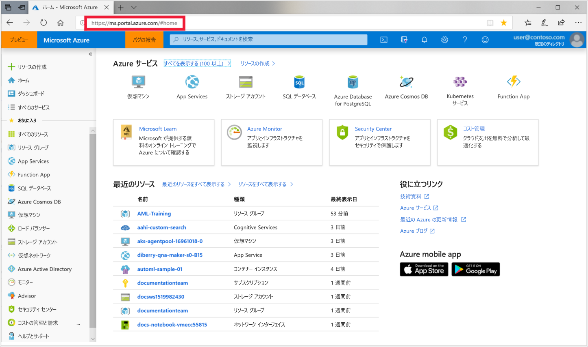
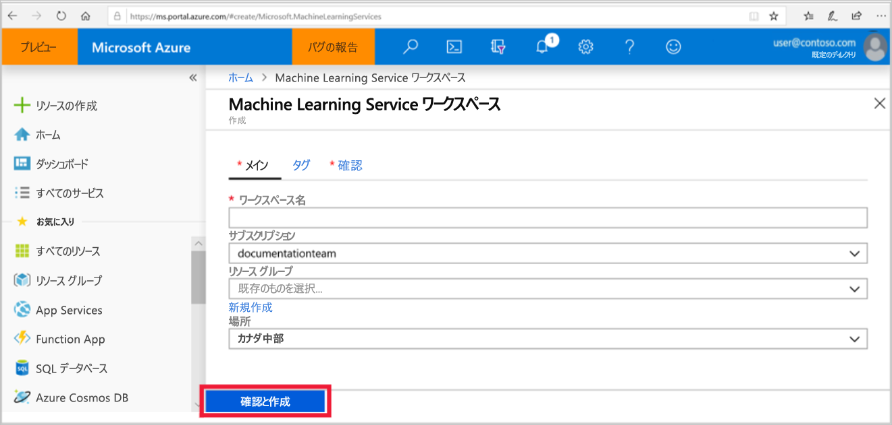

1. 使用する Azure サブスクリプションの資格情報を使って、[Azure portal](https://portal.azure.com/) にサインインします。 

   

1. ポータルの左上隅にある **[+ リソースの作成]** を選択します。

   

1. 検索バーに「**Machine Learning**」と入力します。 **[Machine Learning service workspace]** という検索結果を選択します。

   

1. **[ML サービス ワークスペース]** ウィンドウで、 **[作成]** を選択して開始します。

    ![[作成] ボタン](./media/aml-create-in-portal/portal-create-button-05-2019.png)

1. **[ML service Workspace]\(ML サービス ワークスペース\)** ウィンドウで、ワークスペースを構成します。

   フィールド|説明
   ---|---
   ワークスペース名 |ワークスペースを識別する一意名を入力します。 この例では、**docs-ws** を使用します。 名前は、リソース グループ全体で一意である必要があります。 覚えやすく、他のユーザーが作成したワークスペースと区別しやすい名前を使用します。  
   サブスクリプション |使用する Azure サブスクリプションを選択します。
   リソース グループ | サブスクリプションの既存のリソース グループを使用するか、任意の名前を入力して新しいリソース グループを作成します。 リソース グループは、Azure ソリューションの関連するリソースを保持します。 この例では、**docs-aml** を使用します。 
   Location | ユーザーとデータ リソースに最も近い場所を選択します。 この場所に、ワークスペースが作成されます。

   

1. 作成プロセスを開始するには、 **[確認および作成]** を選択します。

    

1. ワークスペースの構成を確認します。 正しい場合は、 **[作成]** を選択します。 ワークスペースの作成には、しばらく時間がかかる場合があります。

    

1. デプロイの状態を確認するには、ツール バーの [通知] アイコン (**ベル**) を選択します。

1. プロセスが完了すると、デプロイ成功メッセージが表示されます。 このメッセージは、通知セクションにも表示されます。 新しいワークスペースを表示するには、 **[Go to resource]\(リソースに移動\)** を選択します。

   
