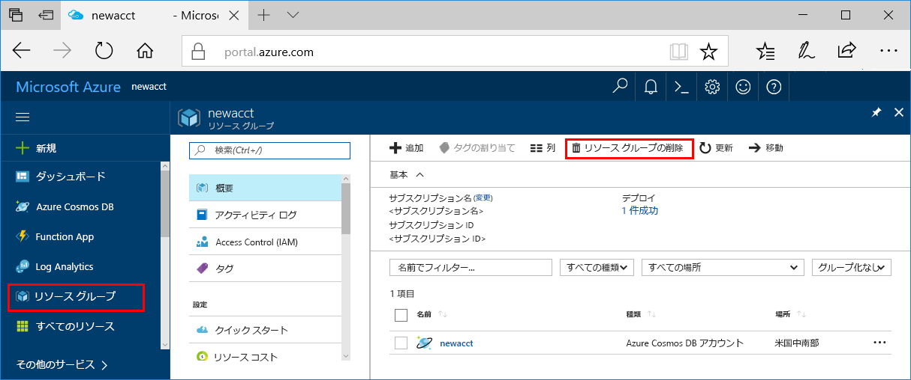

>[!IMPORTANT]
>作成したリソースは、Azure Machine Learning に関連したその他のチュートリアルおよびハウツー記事の前提条件として使用できます。 

このクイック スタートで作成したリソースを今後使う予定がない場合は、課金が発生しないよう削除してください。

1. Azure Portal で、左端にある **[リソース グループ]** を選択します。  
 
   

1. 作成したリソース グループを一覧から選択します。

1. **[リソース グループの削除]** を選択します。

1. リソース グループの名前を入力し、**[削除]** を選択します。

   "入れ子になっているリソースを削除する前にリソースを削除することはできません" というエラーが発生した場合は、入れ子になったリソースを先に削除しておいてください。 詳細については、[こちらのトラブルシューティング セクション](../articles/machine-learning/service/known-issues-and-troubleshooting-guide.md#cant-delete-experimentation-account)を参照してください。 