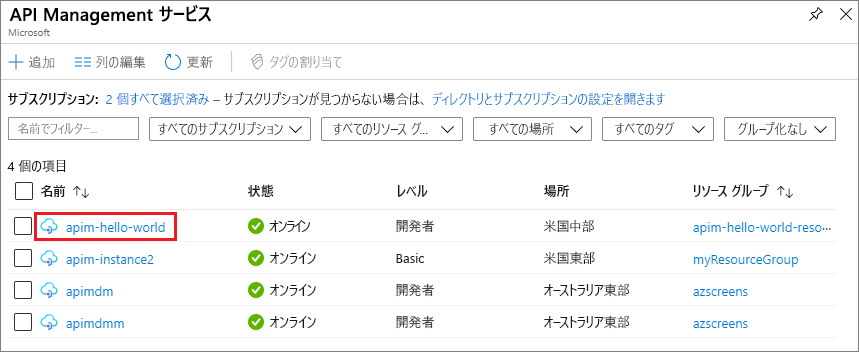

## API Management インスタンスに移動します。

1. Azure portal で、**API Management サービス** を検索して選択します。

   ![[API Management サービス] を選択する](media/api-management-navigate-to-instance/view-apim1.png)

1. **[API Management]** 画面で、ご自身の API Management インスタンスを選択します。

   

