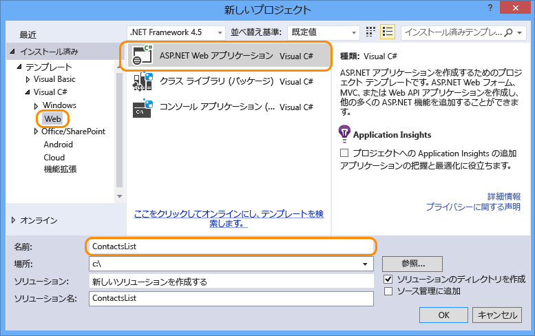
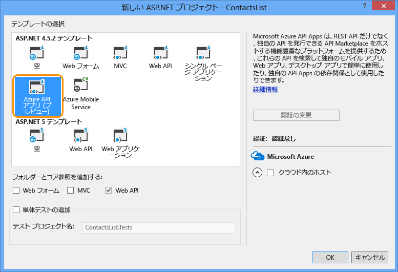

1. Visual Studio 2013 を開きます。

2. **[ファイル] メニューの [新しいプロジェクト]** をクリックします。

3. **[ASP.NET Web アプリケーション]** テンプレートを選択します。

4. **[Application Insights をプロジェクトに追加]** チェック ボックスがオフになっていることを確認します。

4. プロジェクトの名前を入力します。

	

5. **[OK]** をクリックします。

6. **[新しい ASP.NET プロジェクト]** ダイアログで、**[Azure API アプリ]** プロジェクト テンプレートを選択します。

	

7. **[OK]** をクリックしてプロジェクトを生成します。

Visual Studio によって、API アプリとしてデプロイされるように構成された Web API プロジェクトが作成されます。

<!---HONumber=July15_HO5-->