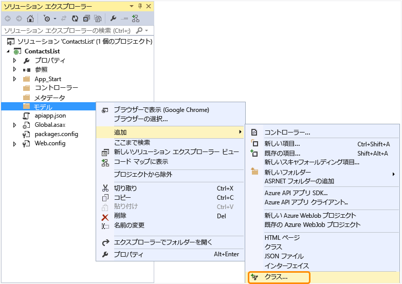
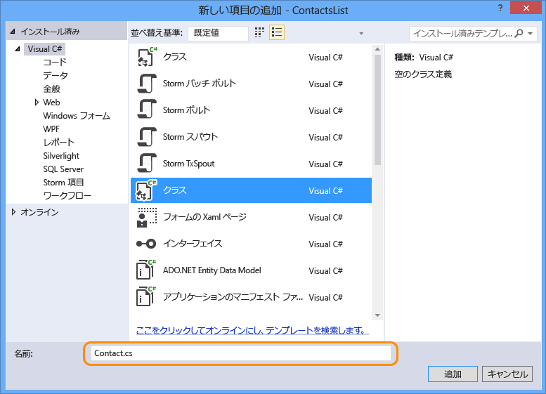
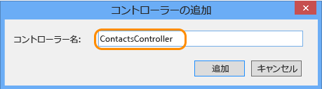

## Web API コードの追加

次の手順では、ハード コーディングされた連絡先リストを返す単純な HTTP Get メソッドのコードを追加します。

1. ソリューション エクスプローラーで **Models** フォルダーを右クリックし、**[追加]、[クラス]** の順にクリックします。 

	

2. 新しいファイルに *Contact.cs* という名前を付けます。

	

3. **[追加]** をクリックします。

4. *Contact.cs* ファイルが作成されたら、ファイルの内容全体を次のコードに置き換えます。

		namespace ContactsList.Models
		{
			public class Contact
			{
				public int Id { get; set; }
				public string Name { get; set; }
				public string EmailAddress { get; set; }
			}
		}

5. **[コントローラー]** フォルダーを右クリックしてから、**[追加]、[コントローラー]** の順にクリックします。

	

6. **[スキャフォールディングの追加]** ダイアログで、**[Web API 2 コントローラー - 空]** を選択し、**[追加]** をクリックします。

	

7. コントローラーに **ContactsController** という名前を付け、**[追加]** をクリックします。

	

8. ContactsController.cs ファイルが作成されたら、ファイルの内容全体を次のコードに置き換えます。

		using ContactsList.Models;
		using System;
		using System.Collections.Generic;
		using System.Linq;
		using System.Net;
		using System.Net.Http;
		using System.Threading.Tasks;
		using System.Web.Http;
		
		namespace ContactsList.Controllers
		{
		    public class ContactsController : ApiController
		    {
		        [HttpGet]
		        public IEnumerable<Contact> Get()
		        {
		            return new Contact[]{
						new Contact { Id = 1, EmailAddress = "barney@contoso.com", Name = "Barney Poland"},
						new Contact { Id = 2, EmailAddress = "lacy@contoso.com", Name = "Lacy Barrera"},
	                	new Contact { Id = 3, EmailAddress = "lora@microsoft.com", Name = "Lora Riggs"}
		            };
		        }
		    }
		}

## Swagger UI の有効化

既定では、API アプリ プロジェクトは有効で、[Swagger](http://swagger.io/ "公式の Swagger 情報") メタデータが自動生成されます。**[API アプリ SDK の追加]** メニュー項目を使用して Web API プロジェクトを変換した場合は、API テスト ページも既定で有効になります。

ただし、Azure API アプリの新しいプロジェクト テンプレートを使った場合は、API テスト ページが無効になります。API アプリ プロジェクト テンプレートを使用して API アプリ プロジェクトを作成した場合は、次の手順を実行してテスト ページを有効にします。

**注:** API アプリが*パブリックな匿名*としてデプロイされ、Swagger UI が有効な場合、すべてのユーザーが Swagger UI を使用して API を検出して呼び出すことができます。

1. *App\_Start/SwaggerConfig.cs* ファイルを開き、**EnableSwaggerUI** を探します。

	

2. 次のコード行をコメント解除します。

	        })
	    .EnableSwaggerUi(c =>
	        {

3. 完了すると、ファイルの内容は次のようになります。

	

## Web API のテスト

API のテスト ページを表示するには、次の手順に従います。

1. アプリをローカルで実行します (Ctrl + F5 キー)。

	ブラウザーが開き、HTTP 403 エラーが表示されます。これは、ベース URL がこのプロジェクトに有効な Web ページの URL でも API メソッドの URL でもないためです。
 
3.  ベース URL の末尾に `/swagger` を追加して Swagger ページに移動します。

	

2. **[Contacts]、[Get]、[Try it out]** の順にクリックすると、API が機能しており、予期される結果を返すことを確認できます。

	

3. Visual Studio で、**[デバッグ]、[デバッグの停止]** の順にクリックします。

<!---HONumber=August15_HO8-->