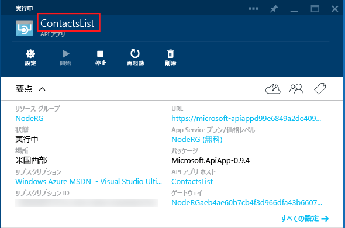
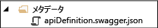

## API アプリのメタデータ

このセクションでは、カスタマイズ可能な API アプリのメタデータに関する追加情報を提供します。

*apiapp.json* ファイル内のほとんどのプロパティと、*Metadata* フォルダー内のファイルは、Azure Marketplace で API アプリ パッケージがどのように表示されるかに影響します。以降のセクションでは、Azure サブスクリプションの API アプリにコードをデプロイしたときに、どのプロパティとファイルが API アプリに影響するかについて説明します。

### API アプリ ID 

`id` プロパティを使用して、API アプリの名前を決定します。次に例を示します。

		"id": "ContactsList",

### 名前空間

`namespace` プロパティには、Azure Active Directory テナントのドメインを設定します。ドメインを確認するには、ブラウザーで [Azure クラシック ポータル](https://manage.windowsazure.com/)を開き、**[Active Directory]** を参照して、**[ドメイン]** タブを選択します。次に例を示します。

		"namespace": "contoso.onmicrosoft.com",

### 動的 Swagger API の定義

動的 [Swagger](http://swagger.io/) API の定義に URL エンドポイントを指定するには、GET 要求で Swagger 2.0 API の定義を返す API アプリによって公開された API の相対 URL を `endpoints.apiDefinition` プロパティに格納します。次に例を示します。

		"endpoints": {
		    "apiDefinition": "/swagger/docs/v1"
		}

> **注:** Swashbuckle を使用して Swagger API の定義を生成している場合は、Web API コントローラーでの HTTP メソッドのオーバーロードによって、操作 ID の重複が発生します。詳細については、「[Swashbuckle で生成された操作 ID のカスタマイズ](app-service-api-dotnet-swashbuckle-customize.md)」を参照してください。
  
### 静的 Swagger API の定義

静的 [Swagger](http://swagger.io/) 2.0 API の定義ファイルを指定するには、*Metadata* フォルダーにファイルを保存し、そのファイルに *apiDefinition.swagger.json* という名前を付けます。

*apiapp.json* ファイルから `endpoints.apiDefinition` を除外するか、その値を null に設定します。`endpoints.apiDefinition` URL と *apiDefinition.swagger.json* ファイルの両方を含めた場合は、URL が優先され、ファイルは無視されます。
 

<!---HONumber=58-->