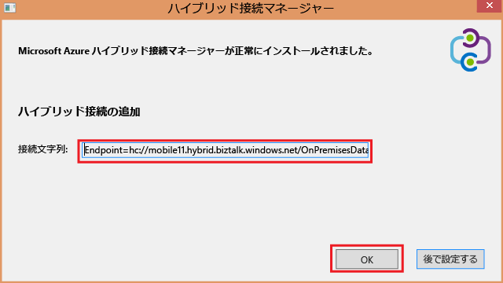
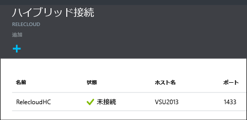

1. **[ハイブリッド接続]** ブレードで、作成したハイブリッド接続をクリックし、**[リスナーのセットアップ]** をクリックします。
   
    ![[リスナーのセットアップ] をクリック](./media/app-service-hybrid-connections-manager-install/D04ClickListenerSetup.png)
2. **[ハイブリッド接続のプロパティ]** ブレードが開きます。 **[オンプレミス ハイブリッド接続マネージャー]** で、**[手動でダウンロードおよび構成]** をクリックし、ダウンロードした HybridConnectionManager.msi パッケージを保存して、ゲートウェイ接続文字列をコピーします。
   
    ![[インストールするにはここをクリックします]](./media/app-service-hybrid-connections-manager-install/D05ClickToInstallHCM.png)
3. 管理者のコマンド プロンプトから、次のコマンドを入力してインストーラーを起動します。
   
        start HybridConnectionManager.msi
4. インストーラーの実行後、**[後で]** をクリックし、%ProgramFiles%\Microsoft\HybridConnectionManager フォルダーに移動します。HCMConfigWizard.exe を実行し、**[ユーザー アカウント制御]** ダイアログで **[はい]** をクリックします。
5. 先ほどコピーしたハイブリッド接続文字列を貼り付け、 **[OK]**をクリックします。 
   
    
6. インストールが完了したら、 **[閉じる]**をクリックします。
   
    ![[閉じる] をクリックしてください](./media/app-service-hybrid-connections-manager-install/D09HCMInstallComplete.png)
   
    **[ハイブリッド接続]** ブレードには、**[状態]** 列に **[接続済み]** と表示されています。 
   
    

<!--HONumber=Nov16_HO3-->

