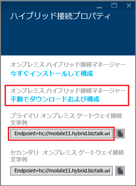

1. **[ハイブリッド接続]** ブレードで、作成したハイブリッド接続をクリックし、**[リスナーのセットアップ]** をクリックします。
	
	![[リスナーのセットアップ] をクリックしてください](./media/app-service-hybrid-connections-manager-install/D04ClickListenerSetup.png)
	
4. **[ハイブリッド接続のプロパティ]** ブレードが開きます。**[オンプレミスのハイブリッド接続マネージャー]** で、**[手動でダウンロードおよび構成]** をクリックし、ダウンロードした HybridConnectionManager.msi パッケージを保存して、ゲートウェイ接続文字列をコピーします。
	
	
	
5. 管理者のコマンド プロンプトから、次のコマンドを入力してインストーラーを起動します。

		start HybridConnectionManager.msi
 
7. インストーラーの実行後、**[後で]** をクリックし、%ProgramFiles%\\Microsoft\\HybridConnectionManager フォルダーに移動して、HCMConfigWizard.exe を実行し、**[ユーザー アカウント制御]** ダイアログ ボックスで **[はい]** をクリックします。
		
7. 先ほどコピーしたハイブリッド接続文字列を貼り付け、**[OK]** をクリックします。
	
	
	
8. インストールが完了したら、**[閉じる]** をクリックします。
	
	![[閉じる] をクリックしてください](./media/app-service-hybrid-connections-manager-install/D09HCMInstallComplete.png)
	
	**[ハイブリッド接続]** ブレードで、**[状態]** 列に **[接続]** と表示されています。
	
	

<!---HONumber=AcomDC_1125_2015-->