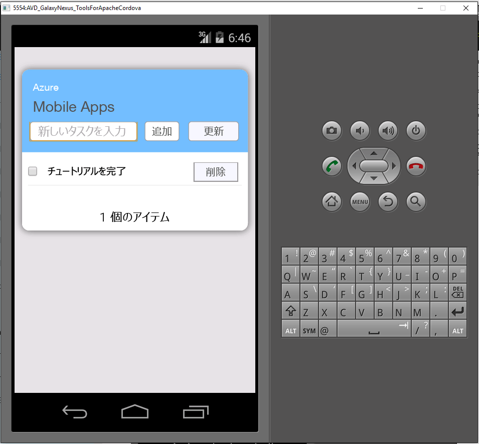

1. [Azure Portal] にアクセスします。
2. **[すべて参照]** > **[Mobile Apps]** > 作成したバックエンドの順にクリックします。
3. モバイル アプリの設定で、**[クイックスタート]**  >  **[Cordova]** の順にクリックします。
4. **[クライアント アプリケーションを構成]** で **[新しいアプリの作成]** を選択してから、**[ダウンロード]** をクリックします。
2. ハード ドライブのディレクトリにダウンロードした ZIP ファイルを展開します。ソリューション ファイル (.sln) に移動し、Visual Studio を使ってファイルを開きます。
3. Visual Studio で、開始用の矢印の横にあるドロップダウン リストからソリューション プラットフォーム (Android、iOS、または Windows) を選択します。 緑色の矢印のドロップダウン リストをクリックして、特定のデプロイ デバイスまたはエミュレーターを選択します。 既定の Android プラットフォームと Ripple エミュレーターを使用できます。 高度なチュートリアル (プッシュ通知など) では、サポートされているデバイスまたはエミュレーターを選択する必要があります。
4. F5 キーを押すか、緑色の矢印をクリックして、Cordova アプリをビルドして実行します。 ネットワークへのアクセスを要求するエミュレーターのセキュリティ ダイアログが表示された場合は、承認します。
5. デバイスまたはエミュレーターでアプリが起動したら、**[Enter new text (新しいテキストを入力)]** に意味のあるテキスト (「"*チュートリアルの完了*"」など) を入力し、**[追加]** をクリックします。

バックエンドは要求から取得したデータを SQL Database の TodoItem テーブルに挿入し、新しく格納されたアイテムに関する情報をモバイル アプリに返します。 モバイル アプリでは、このデータが一覧に表示されます。

他のプラットフォームを追加する際は、手順 3. ～ 5. を繰り返します。

[Azure Portal]: https://portal.azure.com/

<!--HONumber=Dec16_HO1-->

