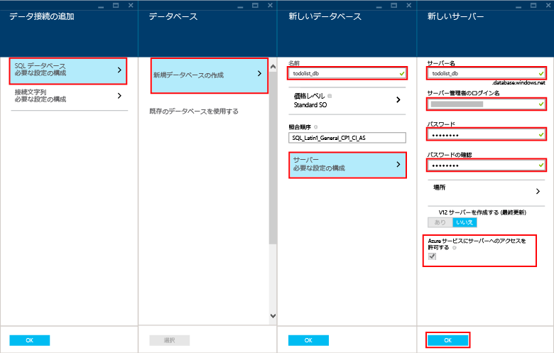

新しいモバイル アプリを作成するには次の手順に従います。

1. [Azure ポータル]にログインします。ウィンドウの左下の**[+ 新規]**をクリックします。**[Mobile App] **項目が表示されるまでスクロールします。

    

    これは **[新しいモバイル アプリ]** ブレードの表示です。

2. Mobile App の名前を入力します。小文字の a ～ z を使用し、8 文字以上にする必要があります。

7. リージョンを選択します。このチュートリアルでは、**[米国中南部]** を使用します。

    > [AZURE.NOTE]このチュートリアルの一環として、SQL Database インスタンスとサーバーを新規作成します。この新しいデータベースは、その他の SQL Database インスタンスと同様に再利用したり管理したりできます。新しいモバイル アプリのバックエンドと同じリージョンにデータベースを既に所有している場合は、**[既存のデータベースを使用する]** を選択し、そのデータベースを選択できます。別のリージョンにあるデータベースを使用することは、帯域幅コストと待機時間が増加するため、お勧めしません。

3. サブスクリプションを選択します。

4. モバイル アプリと同じ名前で新しいリソース グループを作成します。

5. **[パッケージ設定]** で、**[ユーザー データベース]** を選択します。既存のデータベースを選択することも、新しいデータベースを作成することもできます。新しいデータベースを作成する場合は、新しい**データベース**の名前を入力し、新しい**サーバー**を作成し、そのサーバーの名前を入力し、**ログイン名** (新しい SQL Database サーバーの管理者ログイン名) を選択し、パスワードを入力して確認し、[OK] ボタンをクリックしてプロセスを完了します。既存のデータベースを選択する場合は、**サーバー管理者パスワード**を入力する必要があります。

    

6. モバイル アプリと同じ名前で新しい Web ホスティング プランを作成します。

    > [AZURE.NOTE]Web ホスティング プラン名は、コピーして貼り付けるのではなくタイピングしてください。このフィールドには名前の検証が組み込まれているため、名前をタイピングしないとエラーになります。Web サイトと完全に同じ名前にする必要はありません (ただし、同じ規則に従う必要があります)。

8. 価格レベルを選択します。このチュートリアルでは、**[標準 1]** を使用します。

    新しいモバイル アプリの設定ページは次のようになります。

    

9. ブレードの下部にある **[作成]** ボタンをクリックすると、通知ウィンドウにデプロイが開始されたことが表示されます。

これで、モバイル アプリで使用できる新しいモバイル アプリのバックエンドが作成されました。

> [AZURE.NOTE]モバイル アプリが作成されたら、ポータルで作成したばかりの SQL サーバーに移動します (Azure SQL データベースではなく必ずサーバーを選択してください)。そこから、設定部分をクリックし、ファイアウォール部分を展開し、[Azure サービスへのアクセスを許可する] を変更します。これを行わなかった場合、アプリケーションは機能しません。

<!-- URLs. -->
[Azure ポータル]: https://portal.azure.com/

<!---HONumber=July15_HO3-->