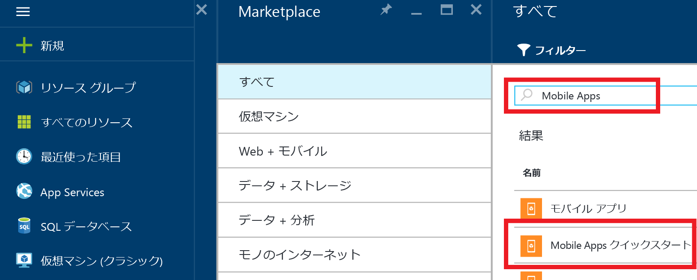

1. [Azure ポータル]にログインします。

2. **[+新規]** をクリックして、_[Marketplace を検索]_ に「**Mobile Apps**」と入力します。**[Mobile Apps Quickstart (Mobile Apps のクイックスタート)]** を選択して、**[作成]** をクリックします。

	

3. **[リソース グループ]** で、既存のリソース グループを選択するか、新しく作成します (アプリと同じ名前を使用)。
 
4. **[作成]** をクリックします。サービスが正常にデプロイされるまで数分待ってから次の手順に進んでください。

<!-- URLs. -->
[Azure ポータル]: https://portal.azure.com/

<!---------HONumber=AcomDC_0803_2016-->