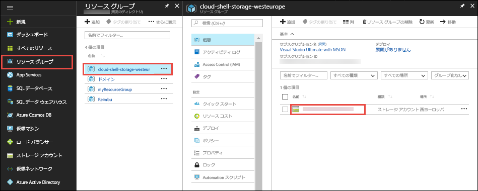

[Azure Portal](https://portal.azure.com) で、**[リソース グループ]** > **cloud-shell-storage-\<your_region>** > **\<storage_account_name>** をクリックします。



ストレージ アカウントの **[概要]** ページで、**[ファイル]**を選択します。

自動生成されたファイル共有を選択し、**[アップロード]** を選択します。 このファイル共有は、`clouddrive` として Cloud Shell にマウントされます。

![[アップロード] ボタンを検索する](../articles/app-service/media/app-service-deploy-zip/upload-select-button.png)

ファイル セレクターをクリックし、お使いの ZIP ファイルを選択して、**[アップロード]** をクリックします。 

Cloud Shell で、`ls` を使用して、既定の `clouddrive` 共有にアップロードされた ZIP ファイルが表示されることを確認します。

```azurecli-interactive
ls clouddrive
```
