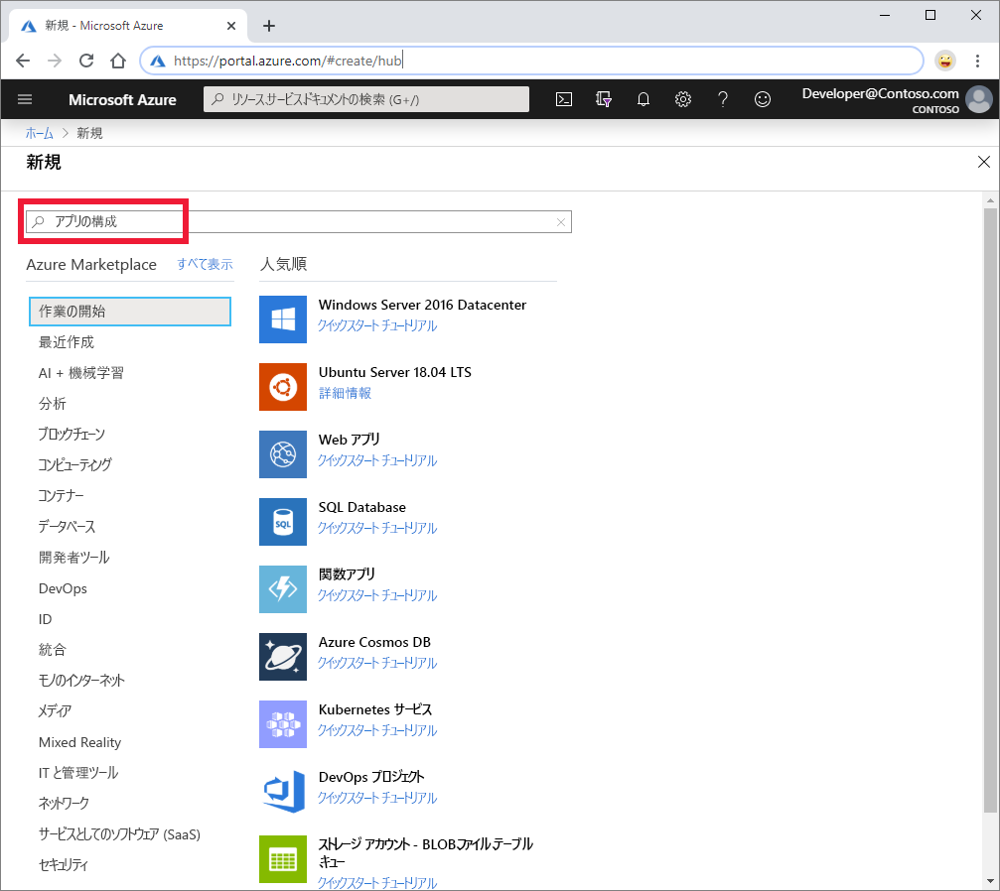
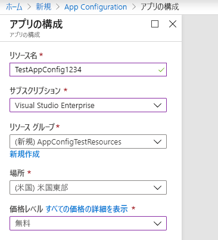

1. 新しい App Configuration ストアを作成するには、[Azure portal](https://portal.azure.com) にサインインします。 ホーム ページの左上にある **[+ リソースの作成]** を選択します。 **[Marketplace を検索]** ボックスに「**App Configuration**」と入力し、Enter キーを押します。

    

1. 検索結果の **[アプリ構成]** を選択し、 **[作成]** を選択します。

    ![[作成] を選択します](media/azure-app-configuration-create/azure-portal-app-configuration-create.png)

1. **[アプリ構成]**  >  **[作成]** ウィンドウで、次の設定を入力します。

    | 設定 | 推奨値 | 説明 |
    |---|---|---|
    | **リソース名** | グローバルに一意の名前 | App Configuration ストア リソースに使用する一意のリソース名を入力します。 名前は 5 から 50 文字の文字列で、数字、英字、`-` 文字のみを使用する必要があります。 名前の先頭または末尾を `-` 文字にすることはできません。  |
    | **サブスクリプション** | 該当するサブスクリプション | App Configuration のテストに使用する Azure サブスクリプションを選択します。 アカウントにサブスクリプションが 1 つしかない場合は自動的に選択されるため、 **[サブスクリプション]** の一覧は表示されません。 |
    | **リソース グループ** | *AppConfigTestResources* | App Configuration ストア リソースのリソース グループを選択または作成します。 このグループで複数のリソースをまとめておくと、そのリソース グループを削除することで複数のリソースを同時に削除できるため、便利です。 詳細については、[リソース グループを使用した Azure リソースの管理](/azure/azure-resource-manager/resource-group-overview)に関するページを参照してください。 |
    | **場所** | *米国中部* | **[場所]** を使用して、アプリ構成ストアがホストされている地理的位置を指定します。 最高のパフォーマンスを得るには、アプリケーションの他のコンポーネントと同じリージョンにリソースを作成します。 |
    | **価格レベル** | *Free* | 目的の価格レベルを選択します。 詳細については、[App Configuration の価格のページ](https://azure.microsoft.com/pricing/details/app-configuration/)を参照してください。

    

1. **作成** を選択します。 デプロイには数分かかることがあります。

1. デプロイが完了したら、 **[設定]**  >  **[アクセス キー]** を選択します。 接続文字列の読み取り専用の主キーをメモします。 この接続文字列は、後で、作成した App Configuration ストアと通信するようにアプリケーションを構成する際に使用します。
