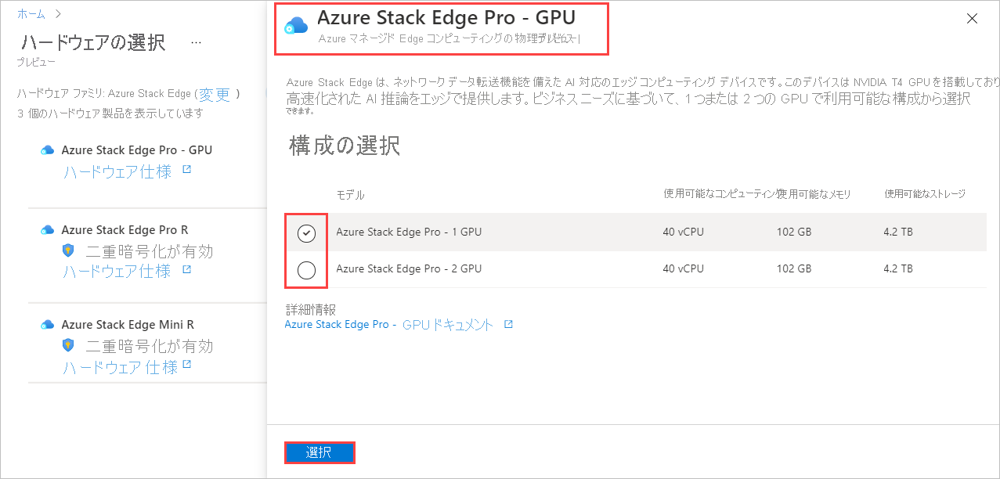

Azure Edge Hardware Center で注文を行うには、次の手順を実行します。

1. Microsoft Azure 資格情報を使用し、Azure portal にサインインします。URL は [https://portal.azure.com](https://portal.azure.com) です。

2. **[+ リソースの作成]** を選択します。 **Azure Edge Hardware Center** を検索して選択します。 Azure Edge Hardware Center で、 **[作成]** を選択します。

    ![Azure Edge Hardware Center のホーム ページのスクリーンショット。 [作成] ボタンが強調表示されています。](media/azure-edge-hardware-center-new-order/edge-hardware-center-new-resource-01.png)

3. サブスクリプションを選択し、 **[次へ]** を選択します。

    ![Azure Edge Hardware Center の注文での [サブスクリプションを選択する] オプションのスクリーンショット。 [サブスクリプション] オプションと [次へ] ボタンが強調表示されています。](media/azure-edge-hardware-center-new-order/edge-hardware-center-new-resource-02.png)

4. 注文を開始するには、注文する製品ファミリ (たとえば、**Azure Stack Edge**) の横にある **[注文]** を選択します。 製品ファミリが表示されない場合は、別のサブスクリプションを使用する必要があると考えられます。 **[Try selecting a different subscription]\(別のサブスクリプションを選択してみる\)** を選択してください。 

    ![Azure Edge Hardware Center での注文の製品ファミリを選択する場合のスクリーンショット。 製品ファミリの横の [注文] ボタンが強調表示されています。](media/azure-edge-hardware-center-new-order/edge-hardware-center-new-resource-03.png) 

5. 注文の配送先を選択します。

    ![Azure Edge Hardware Center の注文の配送先を選択する場合のスクリーンショット。 配送先のオプションと [次へ] ボタンが強調表示されています。](media/azure-edge-hardware-center-new-order/edge-hardware-center-new-resource-04.png)

6. **[Select Hardware]\(ハードウェアを選択する\)** ページで、 **[選択]** ボタンを使用して注文するハードウェア製品を選択します。 たとえば、 **[Azure Stack Edge Pro - GPU]** を選択します。 

    ![Azure Edge Hardware Center の注文でハードウェア製品を選択する場合のスクリーンショット。 製品の [選択] ボタンが強調表示されています。](media/azure-edge-hardware-center-new-order/edge-hardware-center-new-resource-05.png)

    ハードウェア製品を選択したら、注文するデバイス構成を選択します。 Azure Edge Hardware Center (プレビュー) では、次のハードウェア製品とデバイス構成を選択できます。

    |ハードウェア製品              |構成                                                                                              |
    |------------------------------|------------------------------------------------------------------------------------------------------------|
    |Azure Stack Edge Pro - GPU    |<ul><li>Azure Stack Edge Pro - 1 GPU</li><li>Azure Stack Edge Pro - 2 GPU</li><ul>                          |
    |Azure Stack Edge Pro R        |<ul><li>Azure Stack Edge Pro R - 単一ノード</li><li>Azure Stack Edge Pro R - UPS 付き単一ノード</li></ul>|
    |Azure Stack Edge Mini R       |構成は 1 つであり、自動的に選択されます。                 |

7. デバイス構成を選択し、 **[選択]** を選択します。 次の画面は、Azure Stack Edge Pro - GPU デバイスで使用できる構成を示しています。

    Azure Stack Edge Mini R デバイスを注文する場合、すべてが同じ構成になるのでこの画面は表示されません。 

    

    **[注文を作成します]** ウィザードが開きます。

8.  **[基本情報]** タブで、**注文の名前**、**リソース グループ**、**リージョン** を指定します。 次に、 **[次へ: 出荷および数量 >]** を選択します。

    ![Azure Edge Hardware Center の注文の注文名、リソース グループ、リージョンを入力するための [基本情報] タブのスクリーンショット](media/azure-edge-hardware-center-new-order/edge-hardware-center-new-resource-07.png)
  
    次に、デバイスを送付する配送先住所を追加し、各住所に送付するデバイスの台数を指定します。 1 回の注文で最大 20 ユニット (デバイス) を注文できます。

9. **[出荷および数量]** タブに、デバイスを送付する各配送先住所を追加します。 

    - 新しい配送先住所を追加するには、 **[新しい住所を追加]** を選択します。 

       **[New address]\(新しい住所\)** 画面の必須の **[住所のエイリアス]** フィールドで住所が識別され、後で使用できるようになっています。 住所のフィールドへの記入が完了したら、 **[追加]** を選択します。 次に、 **[住所の選択]** を使用して住所を注文に追加します。

       ![Azure Edge Hardware Center の注文の [New address]\(新しい住所\) 画面のスクリーンショット。 [住所のエイリアス] オプションと [追加] ボタンが強調表示されています。](media/azure-edge-hardware-center-new-order/edge-hardware-center-new-resource-08.png)

    - 前の注文の配送先住所を使用する場合、または追加したばかりの住所を使用する場合は、 **[住所の選択]** を選択します。 次に、 **[住所の選択]** 画面で 1 つ以上の住所を選択し、 **[選択]** を選択します。

       ![Azure Edge Hardware Center の注文の [住所の選択] 画面のスクリーンショット。 [住所の選択] オプション。選択された住所が 2 つあり、[選択] ボタンが強調表示されています。](media/azure-edge-hardware-center-new-order/edge-hardware-center-new-resource-09.png)

    **[出荷および数量]** タブには、配送先住所ごとに別々の項目が含まれるようになっています。

    各注文項目名には、名前のプレフィックス (注文名の後に住所のエイリアスが続く) と、その住所に送付される各デバイスの項目番号が含まれます。

    ![2 つの住所が記載された、Azure Edge Hardware Center の注文の [出荷および数量] タブの図。 注文項目名の各部分が識別されています。](media/azure-edge-hardware-center-new-order/edge-hardware-center-new-resource-10.png)

10. **[出荷および数量]** タブで、住所ごとに出荷するデバイスの **数量** を入力します。

    複数の数量を入力した場合、注文項目名の後に **[+n more]\(さらに n 個の項目\)** ラベルが表示されます。

     ![1 つの住所に複数の数量が指定された [出荷および数量] タブを示すスクリーンショット](media/azure-edge-hardware-center-new-order/edge-hardware-center-new-resource-11.png)

11. 注文項目の名前を変更する場合は、注文項目名を選択してクリックし、 **[Rename order item]\(注文項目の名前を変更する\)** ペインを開きます。 1 つの住所に複数の項目を出荷する場合は、 **[+n more]\(さらに n 個の項目\)** を選択します。

    次の 2 種類の名前変更を行うことができます。
 
    * すべての注文項目に異なる名前のプレフィックスを使用するには、次の画面に示すように、 **[Name prefix]\(名前のプレフィックス\)** を編集し、 **[適用]** を選択します。

    * 各注文項目の名前を個別に編集することもできます。 

    終了したら、 **[完了]** を選択します。

    

    **[次へ: 通知 >]** を選択して続行します。

12. 注文の進行に応じて状態通知を受け取るようにする場合は、 **[通知]** タブに各受信者のメール アドレスを入力します。 

    メール アドレスを追加するには、アドレスを入力し、 **[追加]** を選択します。 最大 20 件のメール アドレスを追加することができます。

    ![Azure Edge Hardware Center の注文の [通知] タブのスクリーンショット。 [通知] タブ、[追加] ボタン、[確認と作成] ボタンが強調表示されています。](media/azure-edge-hardware-center-new-order/edge-hardware-center-new-resource-13.png)

    終了したら、 **[確認と作成]** を選択して続行します。

13. **[確認と作成]** タブで次の手順を実行します。

    1. 注文を確認します。 この画面を開くと、注文が自動的に検証されます。 **[検証が失敗しました]** バナーが表示されたら、注文を作成する前に問題を修正する必要があります。
    
    1. **[プライバシー条項]** を確認し、チェック ボックスをオンにして同意します。
 
    1. **［作成］** を選択します

    ![Azure Edge Hardware Center の注文の [確認と作成] タブのスクリーンショット](media/azure-edge-hardware-center-new-order/edge-hardware-center-new-resource-14.png)

    デプロイ中、注文がポータルで開き、各注文項目の状態が表示されます。 デプロイの完了後、 **[デプロイの詳細]** の横の下矢印キーをクリックして個々の項目の状態を確認することが必要になる場合があります。

    ![Azure Edge Hardware Center の注文をデプロイしているときの [デプロイの詳細] を示すスクリーンショット。 リソースの詳細が強調表示されています。](media/azure-edge-hardware-center-new-order/edge-hardware-center-new-resource-15.png)

14. 下に示す注文項目の詳細を表示するには、[デプロイの詳細] の **[リソース]** 列の項目を選択します。

    

15. デバイスが出荷されたら ( **[Shipped]\(出荷済み\)** タグが緑色になっていたら)、項目の詳細に **[Configure hardware]\(ハードウェアの構成\)** オプションが追加されます。 このオプションを選択して、Azure Stack Edge でデバイスの管理リソースを作成します。    

    ![Azure Edge Hardware Center から出荷された注文項目の [Configure hardware]\(ハードウェアの構成\) オプションを示すスクリーンショット。](media/azure-edge-hardware-center-new-order/edge-hardware-center-new-resource-17.png)<!--Requested from Anam: Screenshot of an Azure Edge Hardware Center resource with Shipped status, with the Configure hardware option displayed. Graphical display of tags.-->

    サブスクリプション、リソース グループ、デプロイの各領域は注文から入力されますが、これらは変更できます。

    ![Azure Edge Hardware Center の注文で出荷された注文項目の [管理リソースの作成] 画面のスクリーンショット。](media/azure-edge-hardware-center-new-order/edge-hardware-center-new-resource-18.png)

    デバイスをアクティブにすると、項目から管理リソースを開き、管理リソースから注文項目を開くことができます。<!--Detailed procedure to be provided in an article on managing Hardware Center orders.-->
