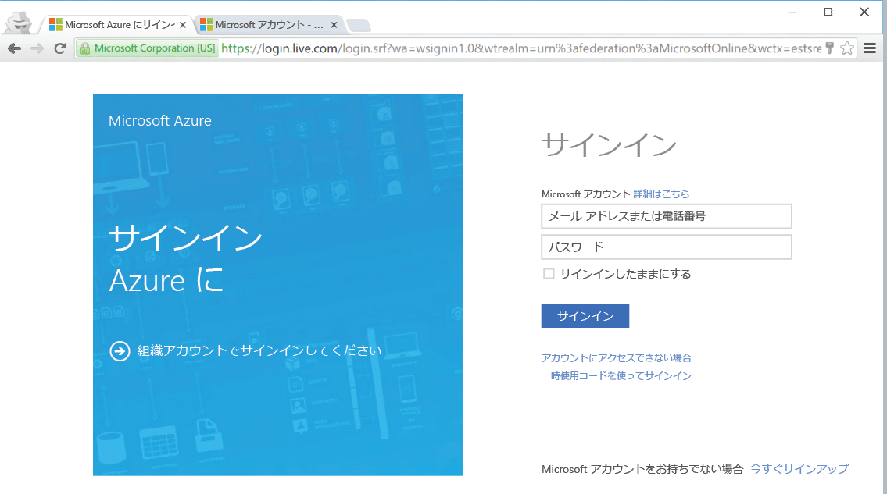

<!--
includes/azure-include-getting-started-v12portal-gettings-an-account.md

Latest Freshness check:  2016-04-11 , carlrab.

As of circa 2016-04-11, the following topics might include this include:
articles/sql-database/sql-database-get-started-tutorial.md

-->
## サブスクリプションでの Azure Portal への接続

Azure Portal に接続するには、サブスクリプションが必要です。

### 新しいアカウントを取得する

Azure アカウントがまだない場合は、次のいずれかの方法でアカウントを入手できます。

- [無料アカウント](https://azure.microsoft.com/get-started/)を取得する。
- [MSDN サブスクリプション](https://azure.microsoft.com/pricing/member-offers/msdn-benefits/)を使用する。

### 既存のアカウントを使用してサインインする

[既存のサブスクリプション](https://account.windowsazure.com/Home/Index)を使用して、次の手順に従って Azure Portal に接続します。

1. 任意のブラウザーを開き、[Azure ポータル](https://portal.azure.com/)に接続します。

1. [Azure ポータル](https://portal.azure.com/)にサインインします。

1. **[サインイン]** ページが表示されたら、サブスクリプションの資格情報を入力します。

   

<!---HONumber=AcomDC_0912_2016-->