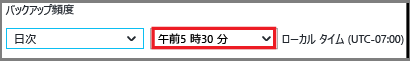
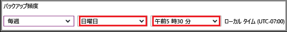

## バックアップ ポリシーの定義
バックアップ ポリシーは、データのスナップショットをいつ取得し、それらのスナップショットをいつまで保持するかのマトリックスを定義します。 VM をバックアップするためのポリシーを定義するときに、バックアップ ジョブを *1 日に 1 回*トリガーできます。 新しいポリシーを作成すると、コンテナーに適用されます。 バックアップ ポリシーのインターフェイスは、次のようになります。

ポリシーを作成するには、次の手順に従います。

1. **[ポリシー名]** に名前を入力します。
2. データのスナップショットは、毎日または毎週の間隔で取得できます。 **[バックアップの頻度]** ボックスを使用して、データのスナップショットを毎日取得するか毎週取得するかを選択します。

   * 間隔として毎日を選択する場合は、強調表示されているコントロールを使用して、スナップショットの時刻を選択します。 時刻を変更するには、時刻の選択を解除し、新しい時刻を選択します。

       
   * 間隔として毎週を選択する場合は、強調表示されているコントロールを使用して、スナップショットを取得する曜日と時刻を選択します。 曜日のメニューでは、1 つ以上の曜日を選択します。 時刻のメニューでは、1 つの時刻を選択します。 時刻を変更するには、時刻の選択を解除し、新しい時刻を選択します。

     
3. 既定では、すべての **[リテンション期間]** オプションが選択されています。 使用しない保持期間のチェック ボックスをオフにします。 次に、使用する間隔を指定します。

    月および年単位の保持期間では、週単位または日単位の増分に基づいてスナップショットを指定できます。

   > [!NOTE]
   >
  - VM を保護する場合、バックアップ ジョブは 1 日に 1 回実行されます。 バックアップが実行される時刻は、どの保持期間でも同じです。
  - 復旧ポイントは、バックアップ ジョブがスケジュールされた日時に関係なく、バックアップ スナップショットが完了した日時に生成されます。
    - 例: バックアップ頻度が午後 11:30 にスケジュールされていて、何らかの問題が発生したためにスナップショットが午前 12:01 に完了した場合、復旧ポイントは翌日の午前 12:01 に作成されます。
  - 毎月のバックアップのケースで、毎月の初日にバックアップの実行が設定されていて、何らかの問題が発生したために翌日にスナップショットが完了した場合、毎月のバックアップ用に作成された復旧ポイントには翌日のタグが付けられます (つまり その月の 2 日)。
   >
   >

4. ポリシーのすべてのオプションを設定したら、ブレードの上部にある **[保存]** をクリックします。

    すぐに、新しいポリシーがコンテナーに適用されます。
