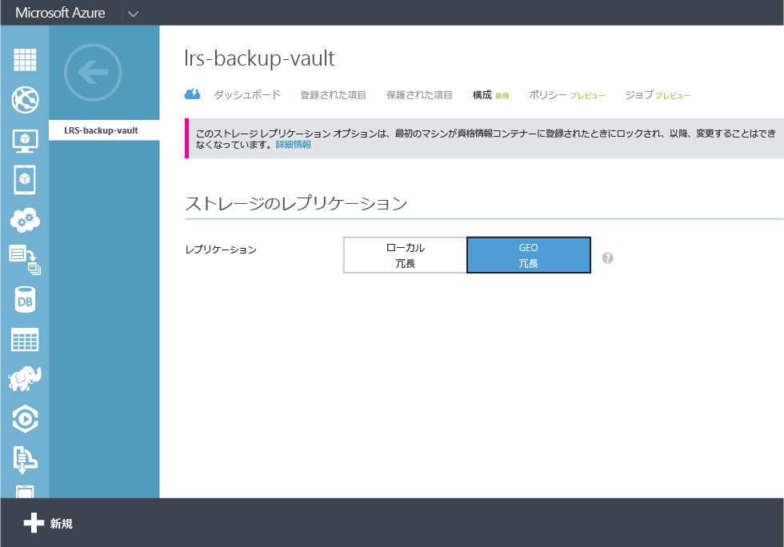
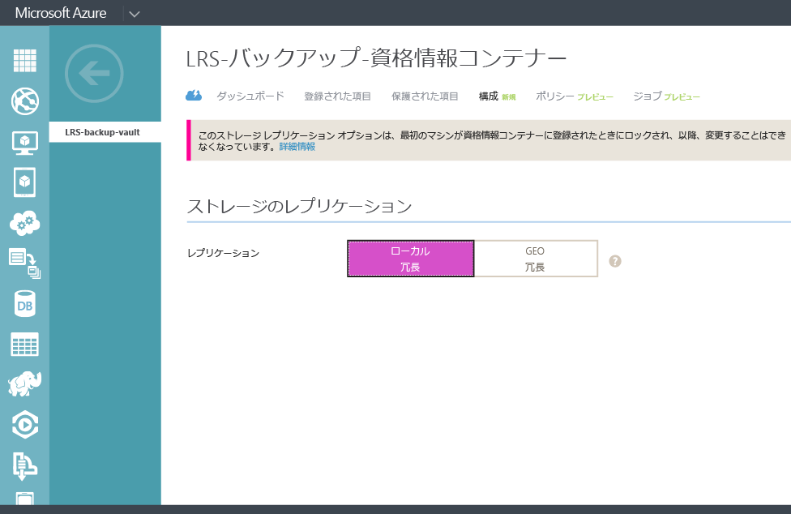

## バックアップ資格情報コンテナーの作成
ファイルとデータを Windows Server または Data Protection Manager (DPM) から Azure にバックアップしたり、IaaS VM を Azure にバックアップしたりする場合には、データを保存する地理的リージョンにバックアップ資格情報コンテナーを作成する必要があります。

次の手順は、バックアップの格納に使用する資格情報コンテナーの作成に使用します。

1.  [管理ポータル](https://manage.windowsazure.com/)
2. **[新規]** > **[Data Services]** > **[Recovery Services]** > **[バックアップ コンテナー]** の順にクリックし、**[簡易作成]** を選択します。
   
    ![[コンテナーの作成]](./media/backup-create-vault/createvault1.png)
3. **[名前]** パラメーターについては、バックアップ資格情報コンテナーを識別する表示名を入力します。 これは、サブスクリプションごとに一意である必要があります。
4. **[リージョン]** パラメーターについては、バックアップ資格情報コンテナーの地理的リージョンを選択します。 この選択により、バックアップ データの送付先となる地理的リージョンが決まります。 自分の場所から近い地理的リージョンを選択することによって、Azure にバックアップする際のネットワーク待機時間を削減できます。
5. **[資格情報コンテナーの作成]** をクリックして、ワークフローを完了します。 バックアップ資格情報コンテナーが作成されるまで時間がかかることがあります。 状態を確認するには、ポータルの下部にある通知を監視します。
   
    
6. バックアップ資格情報コンテナーが作成された後、資格情報コンテナーが正常に作成されたことを示すメッセージが表示されます。 この資格情報コンテナーはまた、Recovery Services 用のリソースで **Active**としてリストされます。
   
    

### Azure Backup - ストレージ冗長オプション
> [!IMPORTANT]
> ストレージ冗長オプションを識別する最適なタイミングは、資格情報コンテナーの作成直後で、いずれかのコンピューターが資格情報コンテナーに登録される前です。 項目が資格情報コンテナーに登録されたら、ストレージ冗長オプションはロックされ、変更できなくなります。
> 
> 

ビジネス ニーズによって、Azure Backup のバックエンド ストレージのストレージ冗長性が決まります。 プライマリ バックアップ ストレージ エンドポイントとして Azure を使用している場合 (たとえば、Windows Server から Azure にバックアップする場合)、geo 冗長ストレージ オプション (既定値) の選択を検討する必要があります。 これは、バックアップ資格情報コンテナーの **[構成]** オプションの下に表示されます。

#### geo 冗長ストレージ (GRS)
GRS では、データのコピーが 6 つ保持されます。 GRS を使用すると、データがプライマリ リージョン内で 3 回複製され、プライマリ リージョンから数百マイル離れたセカンダリ リージョンでも 3 回複製されます。そのため、最も優れたレベルの持続性が実現されます。 プライマリ リージョンで障害が発生した場合は、Azure Backup は GRS にデータを格納することによって、2 つの別個のリージョンでデータが持続するようにします。

#### ローカル冗長ストレージ (LRS)
ローカル冗長ストレージ (LRS) では、データのコピーが 3 つ保持されます。 LRS は、1 つのリージョンの 1 つの施設内で 3 回複製されます。 LRS では、データは通常のハードウェア障害から保護されますが、Azure 施設全体の障害からは保護されません。

第 3 のバックアップ ストレージ エンドポイントとして Azure を使用している場合 (たとえば、SCDPM を使用してオンプレミスのローカルのバックアップ コピーを取ったり、Azure を使用して長期保存したりする場合)、バックアップ資格情報コンテナーの **[構成]** オプションから、ローカル冗長ストレージの選択を検討する必要があります。 これにより、Azure でデータを格納するためのコストは削減されますが、データの持続性レベルは低くなります。これは、第 3 のコピーとしてなら許容される可能性があります。

<!--HONumber=Nov16_HO3-->

