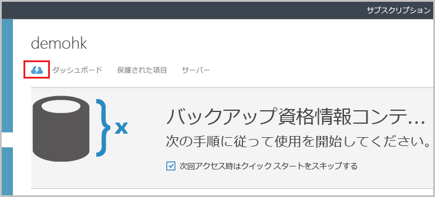
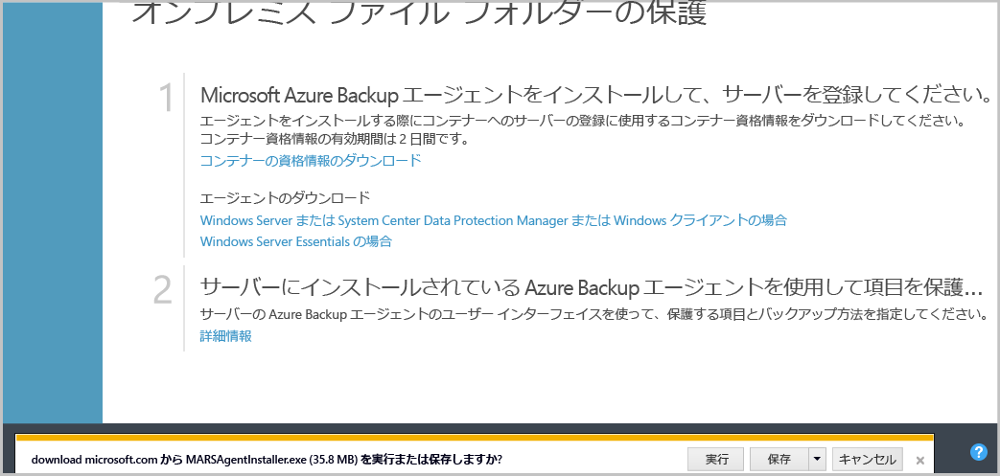
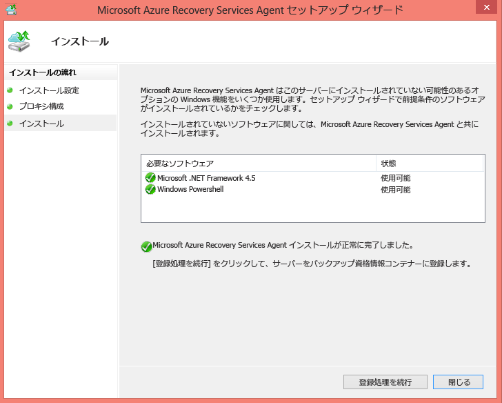
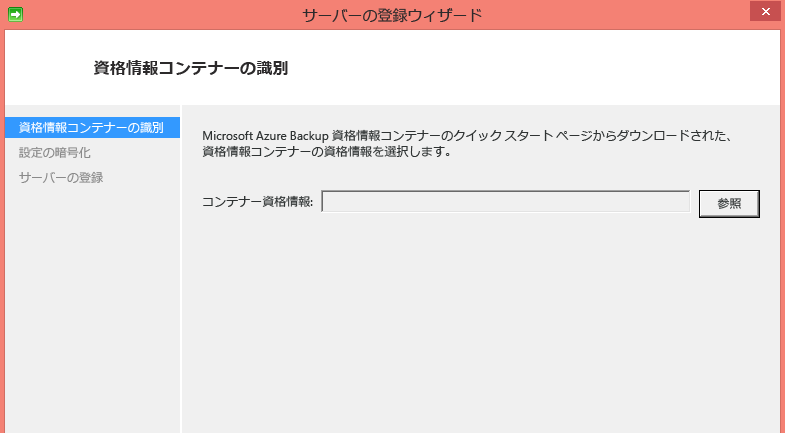
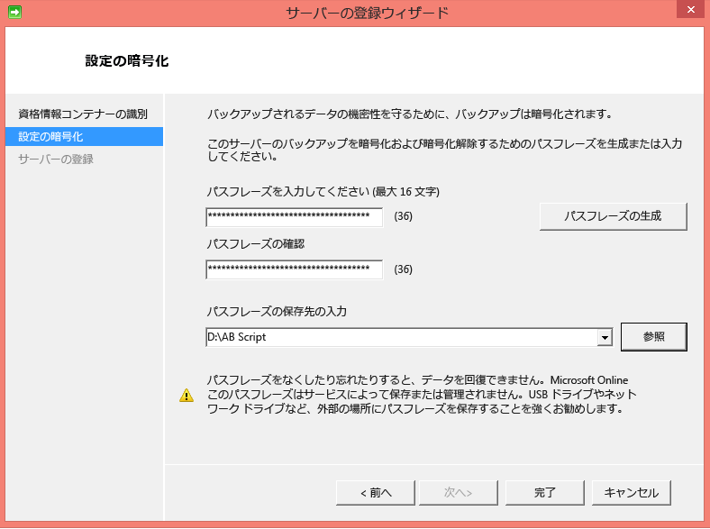
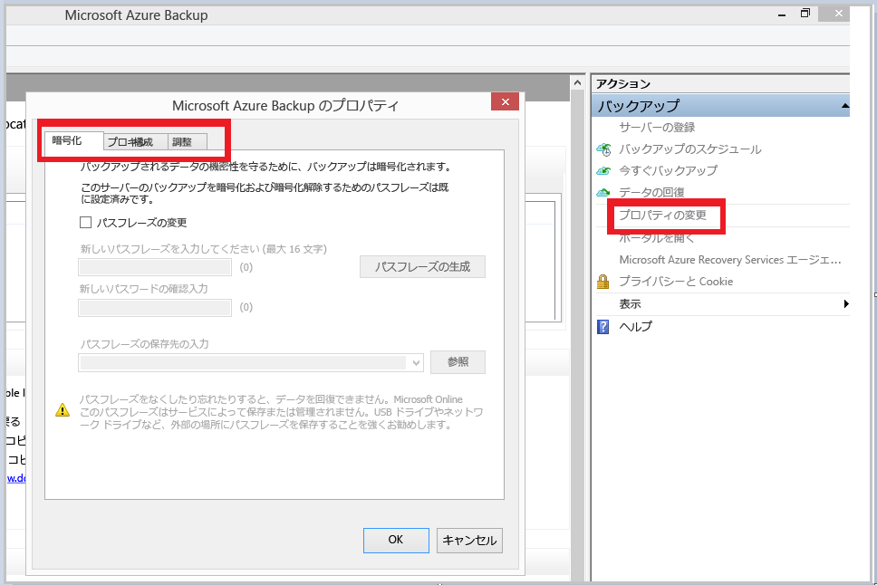
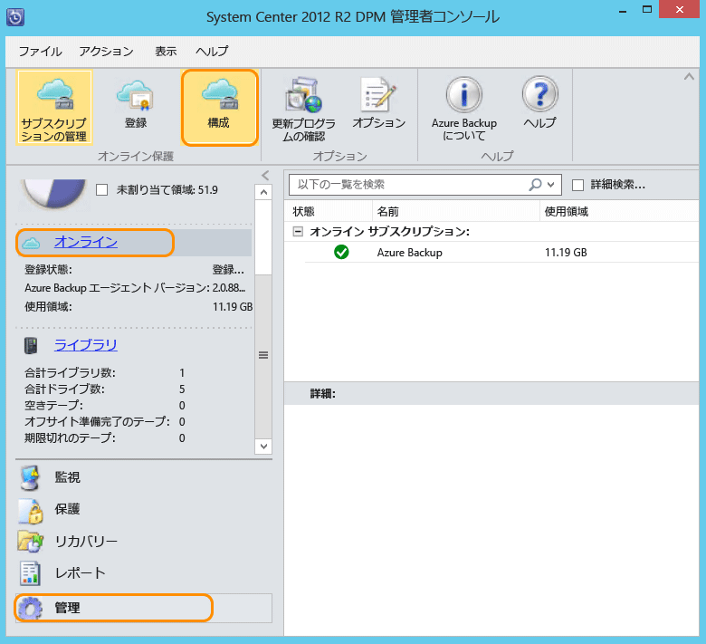

## Azure Backup エージェントのダウンロード、インストール、および登録
Azure Backup コンテナーを作成したら、エージェントを各 Windows コンピューター (Windows Server、Windows クライアント、System Center Data Protection Manager サーバー、Azure Backup サーバー コンピューター) にインストールする必要があります。このエージェントにより、データやアプリケーションを Azure にバックアップできるようになります。

1.  [管理ポータル](https://manage.windowsazure.com/)
2. **[Recovery Services]**をクリックし、サーバーに登録するバックアップ資格情報コンテナーを選択します。 バックアップ資格情報コンテナーの [クイック スタート] ページが表示されます。
   
    
3. [クイック スタート] ページで、**[エージェントのダウンロード]** の **[For Windows Server or System Center Data Protection Manager or Windows client (Windows Server、System Center Data Protection Manager、Windows クライアント向け)]** オプションをクリックします。 **[保存]** をクリックして、ローカル コンピューターにコピーします。
   
    
4. エージェントがインストールされたら、MARSAgentInstaller.exe をダブルクリックして Azure Backup エージェントのインストールを起動します。 エージェントに必要なインストール フォルダーとスクラッチ フォルダーを選択します。 指定されたキャッシュの場所には、バックアップ データの 5% 以上の空き領域が必要です。
5. プロキシ サーバーを使用してインターネットに接続する場合、 **[プロキシ構成]** 画面で、プロキシ サーバーの詳細を入力します。 認証済みのプロキシを使用する場合は、この画面でユーザー名とパスワードの詳細を入力します。
6. Azure Backup エージェントは、.NET Framework 4.5 と Windows PowerShell を (まだ使用可能でない場合は) インストールして、インストールを完了します。
7. エージェントがインストールされたら、 **[登録に進む]** ボタンをクリックして、ワークフローを続行します。
   
   
8. [資格情報コンテナーの資格情報] 画面で、以前にダウンロードされた資格情報コンテナーの資格情報ファイルを参照して選択します。
   
    
   
    資格情報コンテナーの資格情報ファイルは (ポータルからダウンロード後) 48 時間のみ有効です。 この画面で何らかのエラー (例: "指定されたコンテナーの資格情報ファイルは期限切れです。") が発生した場合は、Azure ポータルにログインし、資格情報コンテナーの資格情報ファイルを再度ダウンロードします。
   
    セットアップ アプリケーションがアクセスできる場所に、資格情報コンテナーの資格情報ファイルがあることを確認します。 アクセス関連のエラーが発生した場合は、資格情報コンテナーの資格情報ファイルをこのコンピューターの一時的な場所にコピーし、操作をやり直してください。
   
    資格情報コンテナーの資格情報が無効であるというエラー (例: "無効なコンテナーの資格情報が指定されました。ファイルが破損しているか、最新の資格情報が回復サービスと関連付けられていません。") が発生した場合、ファイルが破損しているか、最新の資格情報が回復サービスと関連付けられていません。 ポータルから新しい資格情報コンテナーの資格情報ファイルをダウンロードしてから操作をやり直してください。 このエラーは通常、ユーザーが Azure ポータルで **[資格情報コンテナー資格情報のダウンロード]** オプションを連続でクリックした場合に発生します。 この場合、2 番目の資格情報コンテナーの資格情報ファイルだけが有効です。
9. **[暗号化の設定]** 画面で、パスフレーズを生成するか、パスフレーズ (最小 16 文字) を指定することができます。 必ず安全な場所にパスフレーズを保存してください。
   
    
   
   > [!WARNING]
   > パスフレーズを紛失または忘れてしまった場合、Microsoft はバックアップ データの回復を支援することはできません。 エンド ユーザーは暗号化パスフレーズを所有していますが、Microsoft はエンド ユーザーが使用するパスフレーズを確認できません。 回復操作中に必要になる場合もあるため、ファイルは安全な場所に保存してください。
   > 
   > 
10. **[完了]** ボタンをクリックすると、コンピューターは資格情報コンテナーに正常に登録され、Microsoft Azure へのバックアップを開始できるようになります。
11. Microsoft Azure Backup をスタンドアロンで使用する場合は、Azure Backup mmc スナップインの **[プロパティの変更]** オプションをクリックすることによって、登録ワークフロー時に指定した設定を変更できます。
    
    
    
    別の方法として、Data Protection Manager を使用している場合は、**[管理]** タブで **[オンライン]** を選択して **[構成]** オプションをクリックすることにより、登録ワークフロー時に指定した設定を変更できます。
    
    

<!--HONumber=Nov16_HO3-->

