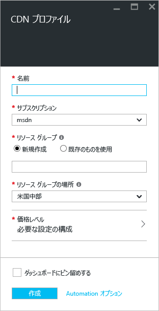
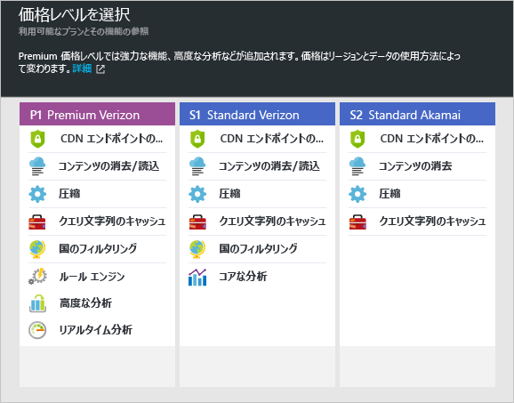

**新しい CDN プロファイルを作成するには**

1. [Azure Portal](https://portal.azure.com) の左上隅にある **[リソースの作成]** を選択します。
    
2. **[新規]** ブレードで、**[Web + モバイル]**、**[CDN]** の順に選択します。
   
    **CDN プロファイル** ブレードが表示されます。
   
    
3. **[名前]** には、CDN プロファイルのための一意の名前を入力します。
    
4. **[サブスクリプション]** では、この CDN プロファイルで使用するサブスクリプションを選択します。
   
5. **[リソース グループ]** では、リソース グループを選択または作成します。 リソース グループについて詳しくは、「[Azure Resource Manager の概要](../articles/azure-resource-manager/resource-group-overview.md#resource-groups)」をご覧ください。
    
6. **[リソース グループの場所]** では、CDN プロファイル情報を格納する Azure の場所を選択します。 この場所は、CDN エンドポイントの場所には影響しません。
    
7. **[価格レベル]** ではレベルを選択します。 各価格レベルで使用できる機能の比較については、「[Azure CDN の機能](../articles/cdn/cdn-overview.md#azure-cdn-features)」を参照してください。
   
    

8. 必要に応じて、プロファイルの作成と同時にエンドポイントを作成するためのオプションを表示するには、**[今すぐ新しい CDN エンドポイントを作成する]** を選択します。 詳細については、「[新しい CDN エンドポイントを作成する](../articles/cdn/cdn-create-new-endpoint.md#create-a-new-cdn-endpoint)」を参照してください。
   
9. プロファイルを作成後にダッシュボードに保存して見つけやすくするには、**[ダッシュボードにピン留め]** を選択します。
    
10. **[作成]** を選択してプロファイルを作成します。 

