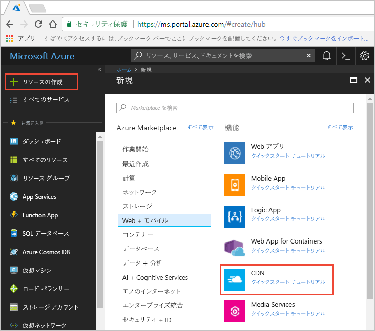
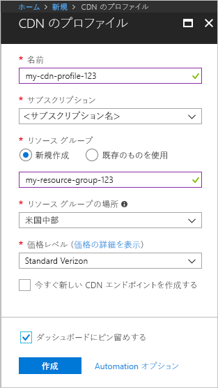

## 新しい CDN プロファイルを作成する

CDN プロファイルは、CDN エンドポイントのコンテナーであり、価格レベルを指定します。

1. Azure portal の左上にある **[リソースの作成]** を選択します。 **[新規]** ウィンドウが表示されます。
   
1. **[CDN]** を見つけて選択し、 **[作成]** を選択します。
   
    

    **[CDN のプロファイル]** ウィンドウが表示されます。

1. 次の値を入力します。
   
    | 設定  | 値 |
    | -------- | ----- |
    | **名前** | プロファイル名として「*cdn-profile-123*」と入力します。 この名前はグローバルに一意でなければなりません。この名前が既に使用されている場合は、別の名前を入力してください。 |
    | **サブスクリプション** | ドロップダウン リストから Azure サブスクリプションを選択します。 |
    | **リソース グループ** | **[新規作成]** を選択してリソース グループ名に「*CDNQuickstart-rg*」と入力します。または、そのグループが既にある場合は、 **[Use existing]\(既存のものを使用\)** を選択して *[CDNQuickstart-rg]* を選択します。 | 
    | **リソース グループの場所** | ドロップダウン リストから最寄りの場所を選択します。 |
    | **価格レベル** | ドロップダウン リストから **[Standard Akamai]** オプションを選択します。 (Akamai レベルのデプロイ時間は約 1 分です。 Microsoft レベルは約 10 分、Verizon レベルは約 90 分かかります。) |
    | **今すぐ新しい CDN エンドポイントを作成する** | オフのままにします。 |  
   
    

1. **[作成]** を選択してプロファイルを作成します。

