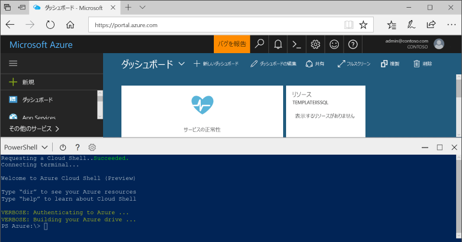

## Azure Cloud Shell を起動する

Azure Cloud Shell は、Azure Portal 内で直接実行できる無料のシェルです。 一般的な Azure ツールが事前にインストールされており、アカウントで使用できるように構成されています。 [Azure Portal](https://portal.azure.com) の右上のメニューの **[Cloud Shell]** ボタンをクリックします。

このボタンによって対話型のシェルが起動されます。このトピックのすべての手順はこれを使用して実行できます。

