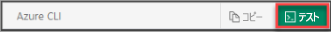

## Azure Cloud Shell を開く

Azure Cloud Shell は無料のインタラクティブ シェルです。この記事の手順は、Azure Cloud Shell を使って実行することができます。 Cloud Shell には一般的な Azure ツールが事前にインストールされており、アカウントで使用できるように構成されています。 **[コピー]** ボタンを選択してコードをコピーし、Cloud Shell に貼り付けて Enter キーを押すだけで、コードを実行することができます。 Cloud Shell を開く方法は、いくつかあります。次のいずれかの方法で、Cloud Shell を開いてください。

|  |   |
|-----------------------------------------------|---|
| コード ブロックの右上隅にある **[使ってみる]** を選択します。 |  |
| ブラウザーで Cloud Shell を開きます。 |  |
| [Azure Portal](https://portal.azure.com) の右上隅にあるメニューの **[Cloud Shell]** ボタンを選択します。 |     |
|  |  |

