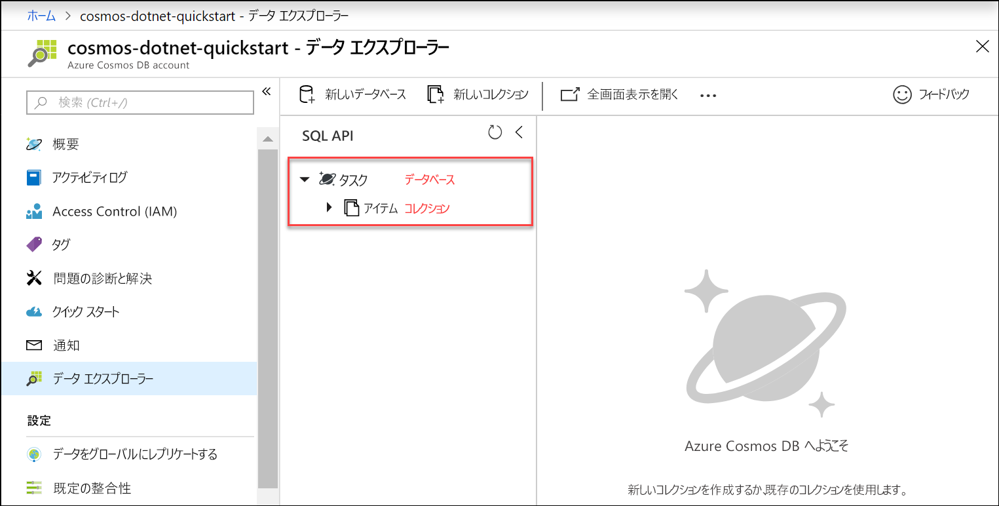

Azure Portal でデータ エクスプローラー ツールを使用してデータベースとコレクションを作成できるようになりました。 

1. **[データ エクスプローラー]** > **[新しいコレクション]** をクリックします。 
    
    **[コレクションの追加]** 領域が右端に表示されます。表示するには、右にスクロールする必要がある場合があります。

    ![Azure Portal の [データ エクスプローラー] の [コレクションの追加] ブレード](./media/cosmos-db-create-collection/azure-cosmos-db-new-collection-preview.png)

2. **[コレクションの追加]** ページで、新しいコレクションの設定を入力します。

    設定|推奨値|説明
    ---|---|---
    データベース ID|*タスク*|新しいデータベースの名前として*タスク*を入力します。 データベース名は 1 文字以上 255 文字以内にする必要があります。/、\\、#、? は使えず、末尾にスペースを入れることもできません。
    コレクション ID|*アイテム*|新しいコレクションの名前として*項目*を入力します。 コレクション ID には、データベース名と同じ文字要件があります。
    データベースのスループットのプロビジョニング|空白|Azure Cosmos DB では、データベース レベル (データベース内のすべてのコレクションは同じスループットを共有します) またはコレクション レベルでスループットをプロビジョニングできます。 この特定のコレクションに対してコレクション レベルのスループットをプロビジョニングするには、空白のままにします。
    ストレージの容量|*無制限*|ストレージの容量には、**[無制限]** を選択します。 
    パーティション キー|*/category*|パーティション キーとして、「/category」を入力します。 パーティション キーを設定すると、Azure Cosmos DB によって、アプリケーションのストレージとスループットのニーズを満たすようにコレクションをスケーリングできます。 一般に、パーティション キーとして適切な選択肢は、幅広い個別の値があり、ワークロード全体にストレージと要求のボリュームを均等に分散するものです。 [パーティション分割の詳細情報を表示](../articles/cosmos-db/partitioning-overview.md)
    スループット|*400 RU/秒*|スループットを 400 要求ユニット (RU/秒) に変更します。 待ち時間を短縮する場合、後でスループットをスケールアップできます。 
    
    上記の設定に加え、必要に応じて、このコレクション用に**一意なキー**を追加できます。 この例では、このフィールドを空のままにしましょう。 一意なキーを使用すると、開発者はデータベースにデータ整合性のレイヤーを追加できます。 コレクションの作成中に一意キー ポリシーを作成すると、パーティション キーごとに 1 つ以上の値の一意性が保証されます。 詳細については、記事「[Azure Cosmos DB における一意なキー](../articles/cosmos-db/unique-keys.md)」を参照してください。
    
    Click **OK**.

    新しいデータベースとコレクションがデータ エクスプローラーに表示されます。

    